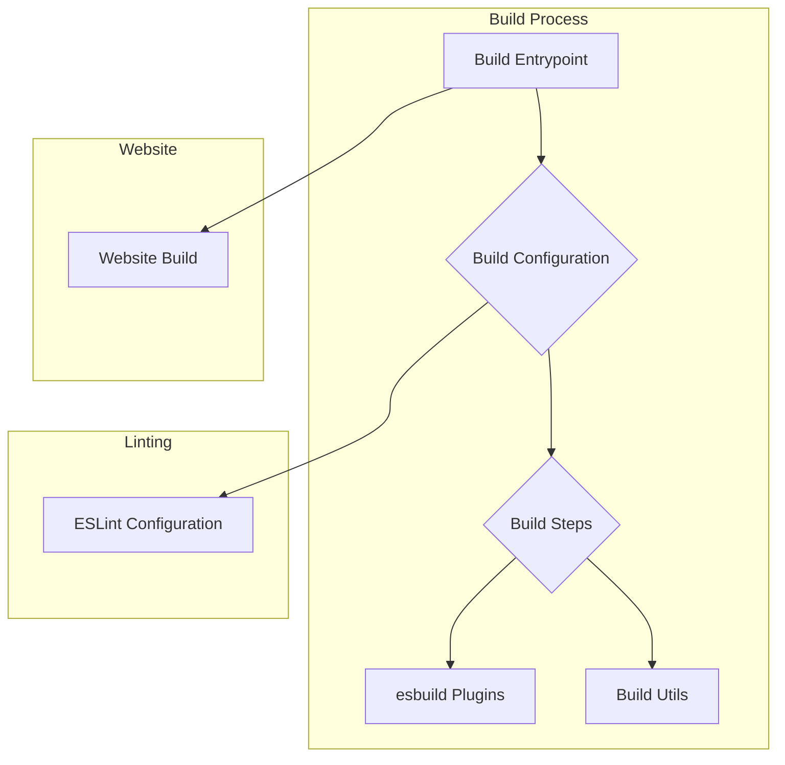

# Prettier Build System

This document provides a comprehensive overview of the Prettier build system. The build system is responsible for packaging the Prettier library, its plugins, and the official website.

## Architecture

The Prettier build system is a modular system composed of several interconnected components. The following diagram illustrates the high-level architecture:

### Core Components

- **Build System (`scripts/build`):** The build system is responsible for packaging the Prettier library and its plugins. For more details, see the [Build System documentation](build.md).
- **ESLint Configuration (`eslint.config.js`):** The configuration file for ESLint, which is used to lint the Prettier codebase.
- **Website (`website` and `scripts/build-website.js`):** The Prettier website and its build process. For more details, see the [Website documentation](website.md).

