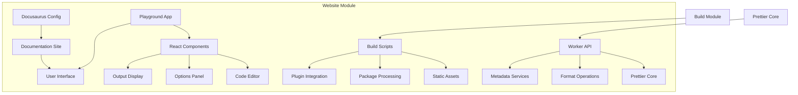
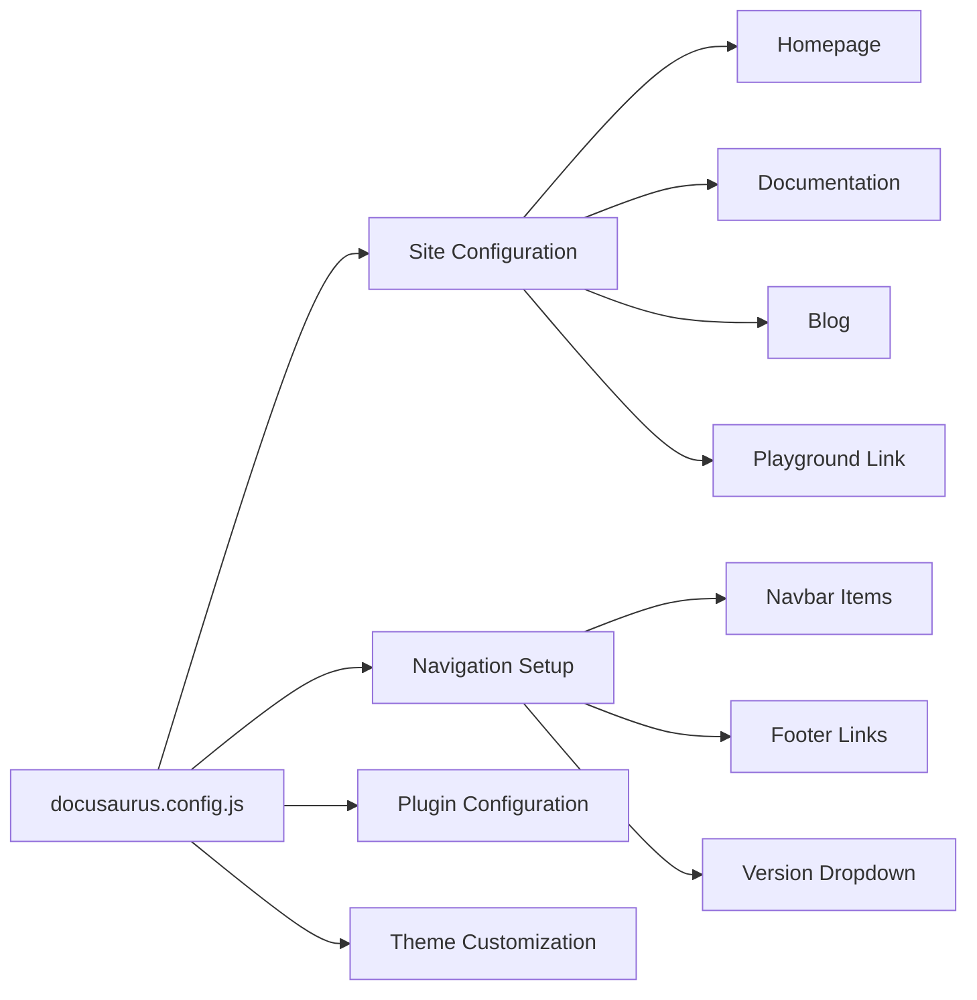
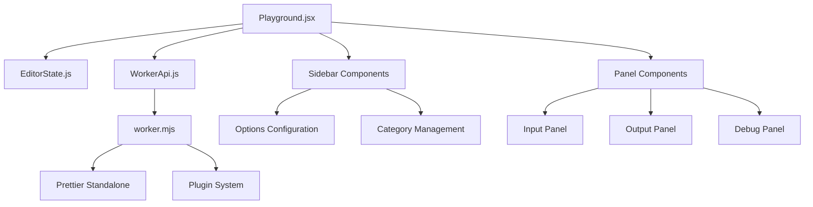
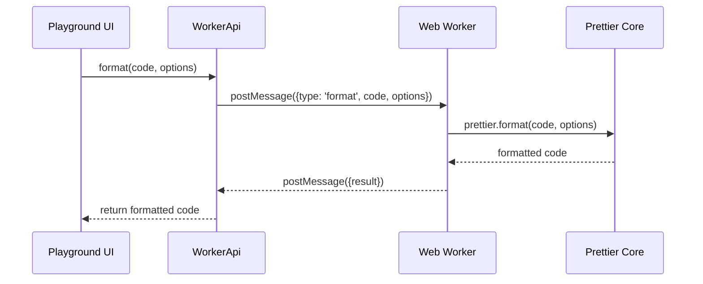
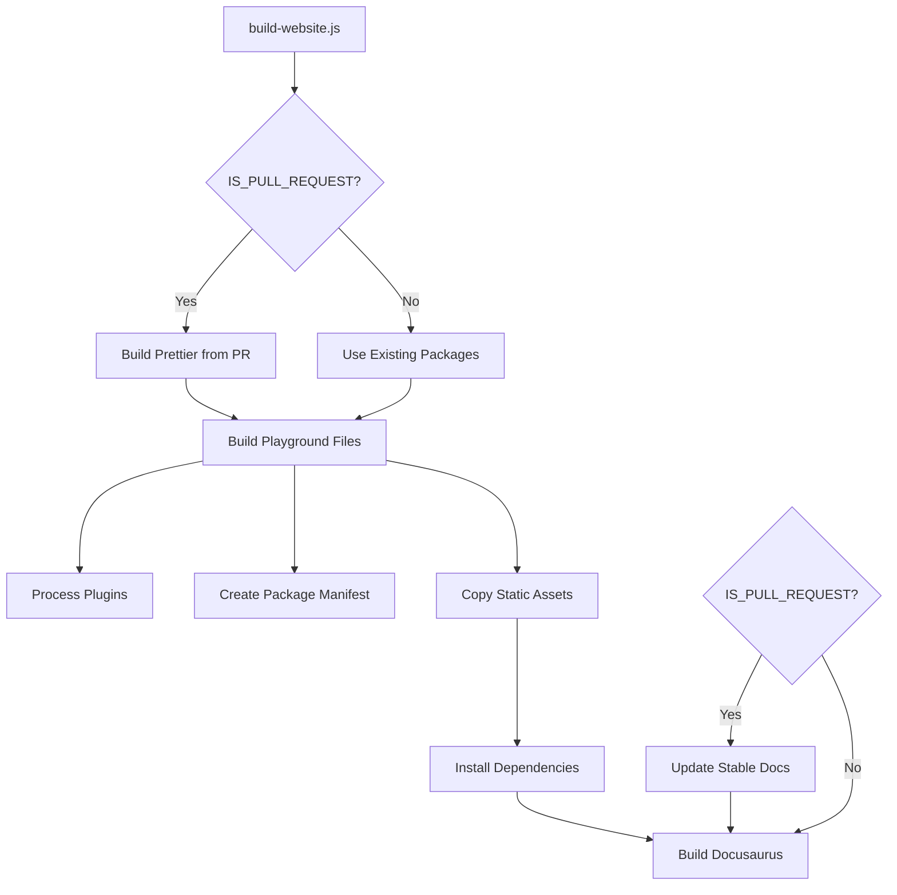
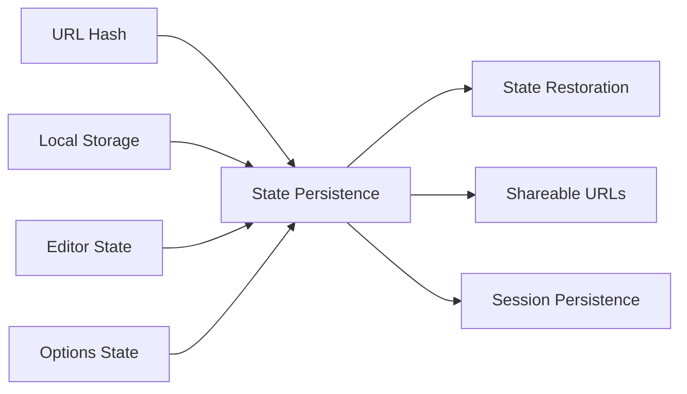
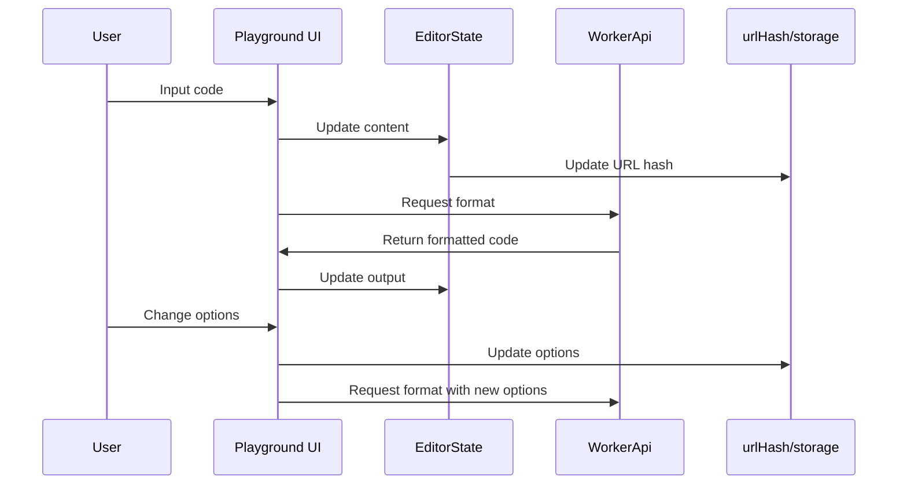
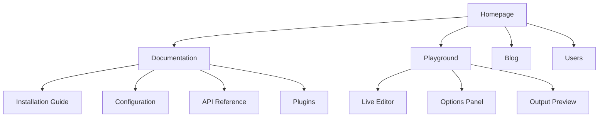
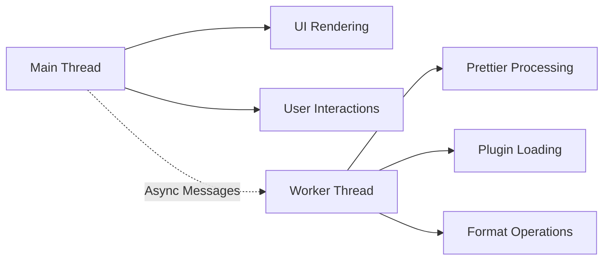

# Website Module Documentation

## Introduction

The website module is the comprehensive web presence for Prettier, providing documentation, interactive playground, and community resources. Built on Docusaurus, it serves as the primary interface for users to learn about Prettier, experiment with formatting options, and access documentation.

## Architecture Overview

The website module consists of several key architectural layers:

1. **Documentation Site** (Docusaurus-based)
2. **Interactive Playground** (React-based web application)
3. **Build System** (Custom build scripts)
4. **Static Assets** (Worker scripts, plugins, images)

## Core Components

### Documentation Site (Docusaurus)

The main documentation site is powered by Docusaurus and configured through `docusaurus.config.js`:

- **Multi-version documentation** with stable and current versions
- **Blog system** for release announcements and updates
- **Search integration** via Algolia
- **Responsive design** with dark/light mode support
- **Custom styling** and branding

### Interactive Playground

The playground is a sophisticated React application that provides real-time code formatting:

#### Main Application Structure

#### Key Components

- **Playground.jsx**: Main application component managing state and UI
- **WorkerApi.js**: Communication layer with web worker for formatting operations
- **EditorState.js**: State management for code editors
- **Sidebar Components**: Configuration panels for formatting options
- **Panel Components**: Display panels for input, output, and debug information

#### Worker Integration

The playground uses a web worker (`static/worker.mjs`) to handle formatting operations:

### Build System

The website build process is handled by `scripts/build-website.js`:

#### Build Process Details

1. **Prettier Build** (PR only): Builds Prettier from source for pull request testing
2. **Playground Preparation**: Processes plugins and creates package manifests
3. **Dependency Installation**: Installs website dependencies
4. **Documentation Sync**: Updates versioned documentation for PRs
5. **Site Generation**: Builds the final Docusaurus site

## Data Management

### Configuration Data

The website uses YAML files for structured data:

- **users.yml**: User showcase data
- **editors.yml**: Editor integration information  
- **languages.yml**: Supported language information

### State Management

The playground implements several state management patterns:

## Component Interactions

### Playground Flow

### Documentation Navigation

## Integration Points

### Build Module Integration

The website module depends on the [build module](build.md) for:

- **Package building** for pull request testing
- **Plugin processing** and manifest generation
- **Asset optimization** and minification

### Prettier Core Integration

The playground integrates with Prettier core through:

- **Standalone build** for browser usage
- **Plugin system** for language support
- **Worker isolation** for performance

## Performance Considerations

### Web Worker Architecture

The playground uses web workers to prevent UI blocking during formatting operations:

### Asset Optimization

- **Code splitting** for playground components
- **Lazy loading** for non-critical resources
- **Minification** of JavaScript and CSS
- **Static asset caching** strategies

## Deployment and Hosting

### Static Site Generation

The website generates static assets that can be deployed to various hosting platforms:

- **Netlify integration** with deployment badges
- **GitHub Pages** support through Docusaurus
- **CDN optimization** for global performance

### Environment Configuration

The website supports different environments:

- **Development**: Local development server with hot reload
- **Production**: Optimized build with analytics and error tracking
- **Pull Request**: Preview builds with PR-specific Prettier versions

## User Experience Features

### Interactive Elements

- **Real-time formatting** with configurable options
- **Shareable URLs** with encoded state
- **Copy to clipboard** functionality
- **Issue reporting** integration

### Accessibility

- **Keyboard navigation** support
- **Screen reader** compatibility
- **High contrast** mode support
- **Responsive design** for mobile devices

## Maintenance and Updates

### Documentation Updates

- **Automated sync** for versioned documentation
- **Pull request integration** for testing changes
- **Multi-version support** for stable and development versions

### Plugin Management

- **Dynamic plugin loading** in playground
- **Plugin discovery** and integration
- **Version compatibility** handling

## Security Considerations

- **Content Security Policy** implementation
- **Input sanitization** for user content
- **Worker isolation** for code execution
- **Dependency scanning** for vulnerabilities

## Monitoring and Analytics

- **Google Analytics** integration
- **Error tracking** and reporting
- **Performance monitoring** for playground operations
- **User interaction** analytics

This comprehensive documentation provides a complete overview of the website module's architecture, functionality, and integration points within the Prettier ecosystem.