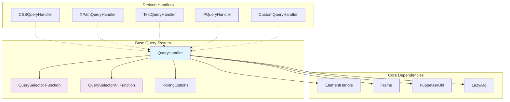
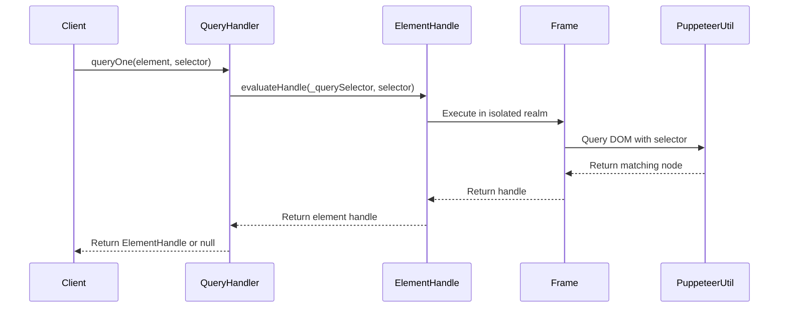
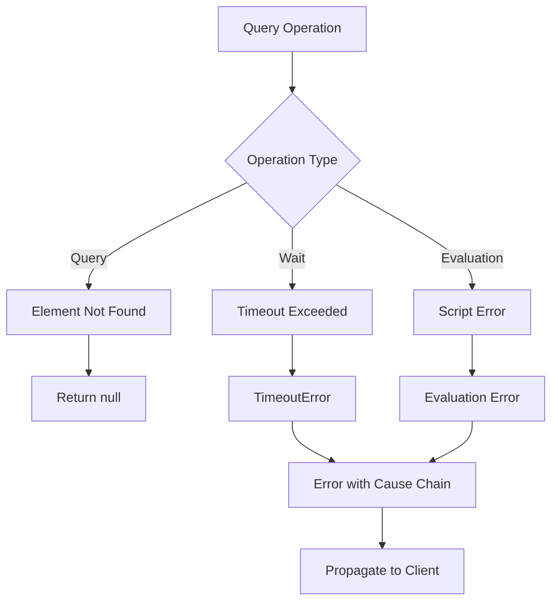

# Base Query System Module

## Overview

The base_query_system module provides the foundational query handling infrastructure for Puppeteer's element selection and DOM manipulation capabilities. It serves as the abstract base class and core implementation for all query operations, defining the standard interface and behavior for element selection across different query handler implementations.

This module is central to Puppeteer's ability to interact with web page elements, providing a unified abstraction layer that supports various selector types (CSS, XPath, text-based, and custom selectors) while maintaining consistent behavior for element querying, waiting, and visibility checking.

## Architecture Overview



## Core Components

### QueryHandler Class

The `QueryHandler` class serves as the abstract base class for all query operations in Puppeteer. It provides the fundamental interface and implementation patterns that all specific query handlers must follow.

#### Key Features

- **Dual Query Interface**: Supports both single element (`querySelector`) and multiple element (`querySelectorAll`) queries
- **Automatic Fallback**: Provides automatic implementation of one query method based on the other
- **Asynchronous Operations**: Full support for async/await patterns and iterables
- **Element Waiting**: Built-in waiting mechanisms with polling and timeout support
- **Visibility Checking**: Integrated visibility validation for elements

#### Core Methods

```typescript
// Static query methods
static async queryOne(element: ElementHandle<Node>, selector: string): Promise<ElementHandle<Node> | null>
static async *queryAll(element: ElementHandle<Node>, selector: string): AwaitableIterable<ElementHandle<Node>>
static async waitFor(elementOrFrame: ElementHandle<Node> | Frame, selector: string, options: WaitForSelectorOptions): Promise<ElementHandle<Node> | null>
```

### Query Function Types

#### QuerySelector
```typescript
type QuerySelector = (
  node: Node,
  selector: string,
  PuppeteerUtil: PuppeteerUtil,
) => Awaitable<Node | null>
```

Single element query function that returns the first matching element or null.

#### QuerySelectorAll
```typescript
type QuerySelectorAll = (
  node: Node,
  selector: string,
  PuppeteerUtil: PuppeteerUtil,
) => AwaitableIterable<Node>
```

Multiple element query function that returns an iterable of all matching elements.

### PollingOptions

```typescript
enum PollingOptions {
  RAF = 'raf',      // RequestAnimationFrame-based polling
  MUTATION = 'mutation'  // MutationObserver-based polling
}
```

Defines polling strategies for element waiting operations.

## Component Interactions



## Data Flow Architecture

```mermaid
flowchart TD
    subgraph "Query Execution Flow"
        A[Query Request] --> B{Query Type}
        B -->|Single| C[querySelector]
        B -->|Multiple| D[querySelectorAll]
        
        C --> E[Element Evaluation]
        D --> E
        
        E --> F[Isolated Realm Execution]
        F --> G[PuppeteerUtil Query]
        G --> H[DOM Traversal]
        H --> I[Result Collection]
        I --> J[Handle Creation]
        J --> K[Return to Main Realm]
    end
    
    subgraph "Waiting Flow"
        L[waitFor Request] --> M[Setup Polling]
        M --> N{Polling Type}
        N -->|RAF| O[RequestAnimationFrame]
        N -->|Mutation| P[MutationObserver]
        
        O --> Q[Visibility Check]
        P --> Q
        Q --> R{Element Found & Visible?}
        R -->|Yes| S[Return Element]
        R -->|No| T{Timeout?}
        T -->|No| M
        T -->|Yes| U[Throw TimeoutError]
    end
```



## Integration with Other Modules

### Core API Integration
- **ElementHandle**: Primary interface for element manipulation and querying
- **Frame**: Provides execution context and realm management
- **Page**: High-level interface that delegates to query handlers

### Built-in Handlers Integration
The base query system is extended by specialized handlers:
- **[CSS Query Handler](built_in_handlers.md#css-query-handler)**: Standard CSS selector support
- **[XPath Query Handler](built_in_handlers.md#xpath-query-handler)**: XPath expression evaluation
- **[Text Query Handler](built_in_handlers.md#text-query-handler)**: Text content-based selection
- **[P Query Handler](built_in_handlers.md#p-query-handler)**: Puppeteer-specific selector syntax

### Custom Query System Integration
- **[Custom Query Handler](custom_query_system.md)**: Framework for user-defined query logic

## Error Handling



### Error Types
- **TimeoutError**: Thrown when waiting operations exceed specified timeout
- **Evaluation Errors**: Propagated from script execution in browser context
- **Null Returns**: Graceful handling of non-existent elements

## Performance Considerations

### Polling Strategies
- **RAF Polling**: Optimal for visibility-dependent queries, synchronized with browser rendering
- **Mutation Polling**: Efficient for DOM structure changes, uses native MutationObserver

### Resource Management
- **Handle Disposal**: Automatic cleanup using `using` declarations
- **Realm Transfer**: Efficient element handle migration between isolated and main realms
- **Lazy Evaluation**: PuppeteerUtil injection only when needed

## Usage Patterns

### Basic Element Query
```typescript
// Single element selection
const element = await QueryHandler.queryOne(parentElement, 'button.submit');

// Multiple element selection
for await (const element of QueryHandler.queryAll(parentElement, '.item')) {
  // Process each element
}
```

### Element Waiting with Options
```typescript
// Wait for visible element
const element = await QueryHandler.waitFor(frame, '.loading', {
  visible: true,
  timeout: 5000,
  polling: PollingOptions.RAF
});

// Wait for hidden element
const element = await QueryHandler.waitFor(frame, '.modal', {
  hidden: true,
  timeout: 3000
});
```

## Extension Points

### Custom Query Handler Implementation
```typescript
class CustomQueryHandler extends QueryHandler {
  static querySelector = (node: Node, selector: string, PuppeteerUtil: PuppeteerUtil) => {
    // Custom query logic implementation
    return customQueryLogic(node, selector);
  };
}
```

### Function Interpolation
The module supports dynamic function creation through interpolation, allowing derived handlers to inject custom logic while maintaining the base structure.

## Dependencies

### Internal Dependencies
- **ElementHandle**: Element manipulation interface
- **Frame**: Execution context management
- **PuppeteerUtil**: Browser-side utility functions
- **LazyArg**: Deferred argument evaluation
- **HandleIterator**: Async iteration utilities

### External Dependencies
- **Function Utilities**: String interpolation and function serialization
- **Error Utilities**: Error type checking and handling
- **Timeout Management**: Configurable timeout behavior

## Related Documentation

- **[Built-in Handlers](built_in_handlers.md)**: Concrete implementations of query handlers
- **[Custom Query System](custom_query_system.md)**: Framework for custom query logic
- **[Core API](core_api.md)**: High-level browser automation interfaces
- **[Locators](locators.md)**: Modern element selection API built on query handlers

---

*This module serves as the foundation for all element selection operations in Puppeteer, providing a consistent and extensible interface for DOM querying across different selector types and execution contexts.*