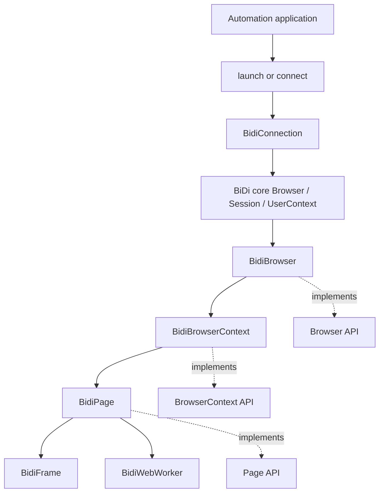
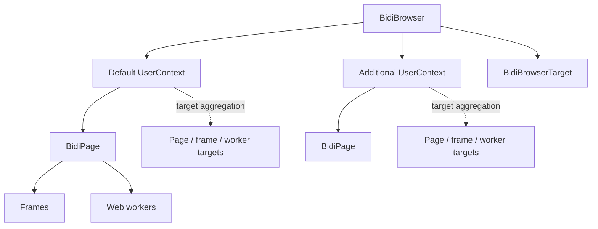
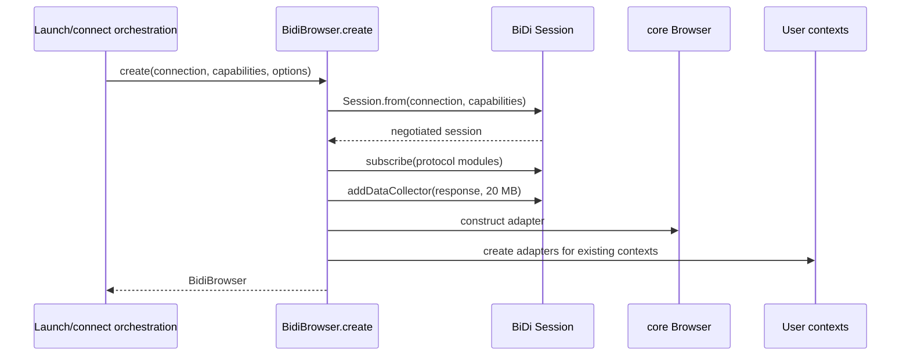
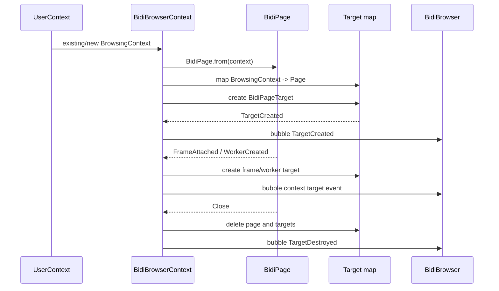
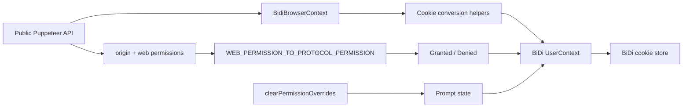
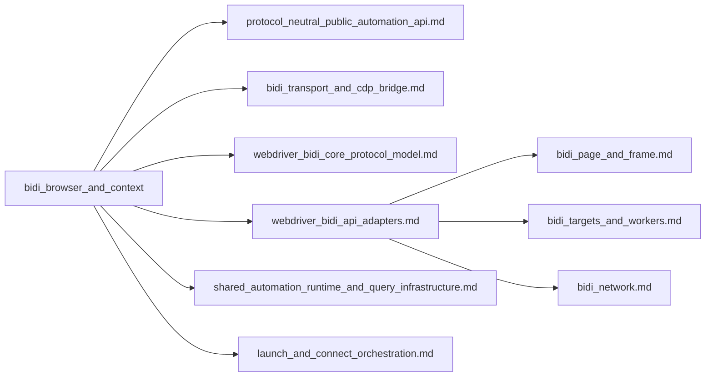

# BiDi Browser and Context

## Introduction

The `bidi_browser_and_context` module adapts the WebDriver BiDi browser and user-context model to Puppeteer’s protocol-neutral `Browser` and `BrowserContext` APIs. It is the ownership and lifecycle layer for a BiDi session: `BidiBrowser` represents the remote browser session, while `BidiBrowserContext` represents one BiDi user context and owns the pages, frames, and workers created within it.

The module does not implement page actions, JavaScript handles, network objects, or the BiDi wire protocol itself. Those responsibilities are delegated to the [WebDriver BiDi API adapters](webdriver_bidi_api_adapters.md), [WebDriver BiDi core protocol model](webdriver_bidi_core_protocol_model.md), and [BiDi transport and CDP bridge](bidi_transport_and_cdp_bridge.md). The public ownership contracts are documented in [Browser and context API](browser_and_context_api.md).

## Position in the system



`BidiBrowser` is constructed only after a BiDi session has been established and capabilities have been negotiated. It wraps the core browser object supplied by `chromium-bidi`, then exposes Puppeteer-compatible lifecycle, context, target, cookie, permission, and diagnostic operations.

## Architecture

### Ownership hierarchy



The mapping between protocol objects and Puppeteer objects is maintained as follows:

| BiDi object | Puppeteer adapter | Ownership and identity |
| --- | --- | --- |
| `core/Browser` | `BidiBrowser` | One adapter per browser session. |
| `core/UserContext` | `BidiBrowserContext` | Stored in `BidiBrowser.#browserContexts`, keyed by the protocol object. |
| `core/BrowsingContext` | `BidiPage` | Stored in `BidiBrowserContext.#pages`, keyed by browsing-context object. |
| `BidiPage` | `BidiPageTarget` | One page target per page. |
| `BidiFrame` | `BidiFrameTarget` | Created when a frame-attached event is observed. |
| `BidiWebWorker` | `BidiWorkerTarget` | Created when a worker-created event is observed. |

Weak maps are used for browser-context and page identity so protocol objects can be mapped without making the adapter layer the sole owner of their lifetime. The target map is strong while a page is active because it must enumerate current targets and remove them deterministically on lifecycle events.

### Browser and context responsibilities

`BidiBrowser` owns browser-wide concerns:

- Negotiating the BiDi session and subscriptions in `create()`.
- Holding the connection, optional child process, optional CDP connection, and close callback.
- Creating and enumerating user contexts.
- Aggregating context target events and targets.
- Reporting browser identity, connection state, endpoint, process, and diagnostics.
- Closing or disconnecting the protocol session.

`BidiBrowserContext` owns context-scoped concerns:

- Mapping one BiDi `UserContext` to pages and targets.
- Creating tabs and applying the configured default viewport.
- Closing non-default contexts.
- Reading and writing context cookies.
- Applying and clearing origin permission overrides.
- Translating page, frame, and worker lifecycle events into context target events.

## `BidiBrowser` lifecycle

### Construction and session initialization

`BidiBrowser.create()` performs the protocol-facing initialization before returning the adapter:

1. Calls `Session.from()` with `firstMatch` and `alwaysMatch` capabilities.
2. Forces Puppeteer-owned capability values to take precedence, including `acceptInsecureCerts`, `unhandledPromptBehavior`, `webSocketUrl`, and the Chromium-specific prerendering flag.
3. Subscribes to the `browsingContext`, `network`, `log`, `script`, and `input` modules.
4. Adds CDP event subscriptions for non-Firefox browsers when those events support features such as coverage, tracing, or screencasting.
5. Removes network subscriptions when `networkEnabled` is false.
6. Attempts to add a response data collector with a 20 MB encoded-data limit. Unsupported collector commands are logged and ignored; other errors are propagated.
7. Creates the `BidiBrowser`, initializes existing user contexts, and installs disconnection/process-exit handlers.



### Browser-level operations

| Member | Behavior |
| --- | --- |
| `connection` | Returns the underlying `BidiConnection` from the core session. |
| `wsEndpoint()` | Returns `connection.url`. |
| `connected` | Is true while the core browser is not disconnected. |
| `cdpSupported` / `cdpConnection` | Indicate and expose an optional CDP connection, typically for BiDi-over-CDP scenarios. |
| `process()` | Returns the launched `ChildProcess`, or `null` for an externally managed browser. |
| `version()` | Returns `browserName/browserVersion` from negotiated capabilities. |
| `userAgent()` | Returns the capability-reported user agent. |
| `debugInfo` | Exposes pending protocol errors from the connection. |
| `isNetworkEnabled()` | Returns the network subscription setting captured at construction. |
| `newPage()` | Delegates to the default browser context. |
| `target()` | Returns the browser-level `BidiBrowserTarget`. |

`browserContexts()` converts all core user contexts through the adapter map. `defaultBrowserContext()` resolves the core default user context. `targets()` returns the browser target followed by targets from every active context.

### Close, disconnect, and unexpected exit

`close()` requests a core-browser close, invokes the optional close callback, and always disposes the connection. Errors are debug-logged and do not escape. `disconnect()` ends the BiDi session without explicitly closing the browser, then disposes the connection.

If the launched child process emits `close`, initialization disposes the core browser with a process-exit reason and disposes the BiDi connection. If the core session emits `disconnected`, the adapter emits Puppeteer’s `disconnected` event and removes trusted listeners.

```mermaid
flowchart TD
    Action{Browser action} --> Close[close()]
    Action --> Disconnect[disconnect()]
    Action --> Exit[Child process closes]
    Close --> CoreClose[core Browser.close()]
    CoreClose --> Callback[optional closeCallback]
    Callback --> Dispose[connection.dispose()]
    Disconnect --> End[session.end()]
    End --> Dispose
    Exit --> CoreDispose[core Browser.dispose(process exited)]
    CoreDispose --> Dispose
    Dispose --> Done[BiDi adapter disconnected]
```

## `BidiBrowserContext` lifecycle

### Context initialization and page tracking

`BidiBrowserContext.from()` constructs and initializes an adapter. Existing `BrowsingContext` objects are immediately converted to pages. Later `browsingcontext` events create pages as they appear. When a new context has an `originalOpener`, the adapter emits a popup event on the opener page after creating the popup page.

Each page receives a `BidiPageTarget` immediately. Frame and worker targets are created lazily from page events. Page close removes the page mapping and emits target destruction for the page target.



### Context operations

| Member | Behavior |
| --- | --- |
| `id` | Returns the BiDi user-context ID, except the default context, which returns `undefined`. |
| `browser()` | Returns the owning `BidiBrowser`. |
| `pages()` | Returns pages for all browsing contexts in this user context. |
| `targets()` | Returns page, frame, and worker targets currently tracked by the context. |
| `newPage()` | Creates a BiDi tab, waits for its page adapter, and applies the default viewport when configured. Viewport failures are ignored for browsers such as Firefox that do not support the operation. |
| `close()` | Removes the user context and clears target state. Closing the default context throws an assertion error. |
| `cookies()` | Reads BiDi cookies and converts them to Puppeteer cookie objects. |
| `setCookie()` | Converts Puppeteer cookie data, including expiry, same-site, partition-key, and selected Chrome-specific fields, then calls BiDi `setCookie`. |
| `overridePermissions()` | Maps web permissions to BiDi permissions and sets every known permission to granted or denied. |
| `clearPermissionOverrides()` | Restores recorded overrides to the prompt state and clears the local override list. |

### Target event propagation

The context translates page events into `BrowserContextEvent` values:

| Page event | Context result |
| --- | --- |
| `FrameAttached` | Create and emit a `BidiFrameTarget` as `TargetCreated`. |
| `FrameNavigated` | Emit `TargetChanged` for the frame, or for the page target when the frame is the page’s root frame. |
| `FrameDetached` | Remove and emit destruction of the corresponding frame target. |
| `WorkerCreated` | Create and emit a `BidiWorkerTarget` as `TargetCreated`. |
| `WorkerDestroyed` | Remove and emit destruction of the worker target. |
| `Close` | Remove page state and emit destruction of the `BidiPageTarget`. |

The browser subscribes to context `TargetCreated`, `TargetChanged`, and `TargetDestroyed` events and re-emits them as browser-wide events. This preserves the public event model while keeping context ownership local.

## Cookies and permissions



Permission overrides are tracked locally as origin/permission pairs because clearing requires replaying each override with `Prompt`. Unsupported denial operations are debug-logged per permission, while failures for granted permissions propagate through `Promise.all`.

Cookie conversion is intentionally delegated to helpers shared with `BidiPage`: the context handles the user-context scope, while conversion details remain in the page adapter module. This avoids duplicating protocol-specific cookie shape rules.

## Dependencies and related modules



Key source dependencies:

- `../api/Browser.js` and `../api/BrowserContext.js` provide the abstract contracts, events, cookie types, and permission names.
- `./Connection.js` provides the BiDi connection used for commands, events, endpoint reporting, pending-error diagnostics, and disposal.
- `./core/Browser.js`, `./core/Session.js`, `./core/UserContext.js`, and `./core/BrowsingContext.js` model the protocol-side browser, session, user-context, and page lifecycles.
- `./Page.js` supplies `BidiPage` and cookie conversion helpers.
- `./Target.js` supplies browser, page, frame, and worker target adapters.
- Shared event, debug, assertion, and bubbling utilities provide lifecycle propagation and cleanup behavior.

For the public contract and shared lifecycle semantics, see [Browser and context API](browser_and_context_api.md). For message transport and BiDi-over-CDP translation, see [Protocol transport and session infrastructure](protocol_transport_and_session_infrastructure.md) and [BiDi transport and CDP bridge](bidi_transport_and_cdp_bridge.md). Page/frame behavior, handles, network, input, and targets should be documented by their respective BiDi adapter modules rather than repeated here.

## Operational considerations

- Network support is selected before construction. Disabling it changes subscriptions and prevents the response data collector from being used for network-backed features.
- CDP support is optional. Consumers must check `cdpSupported` before requesting `cdpConnection`.
- The default context is represented by the BiDi default user context but intentionally exposes no public `id` and cannot be closed.
- Context and target state is event-driven. A page or worker target should be considered invalid after its corresponding destruction event.
- `close()` and `disconnect()` both dispose the connection in a `finally` path; callers should not reuse the adapter after either operation.
- Some BiDi implementations do not support viewport changes or data collectors. These capability differences are handled at the adapter boundary with selective fallback or debug logging.

## Source references

| Component | Source |
| --- | --- |
| Browser adapter | `packages/puppeteer-core/src/bidi/Browser.ts` |
| Context adapter | `packages/puppeteer-core/src/bidi/BrowserContext.ts` |
| BiDi connection | `packages/puppeteer-core/src/bidi/Connection.ts` |
| BiDi page and cookie conversion | `packages/puppeteer-core/src/bidi/Page.ts` |
| BiDi target adapters | `packages/puppeteer-core/src/bidi/Target.ts` |
| BiDi protocol browser/session model | `packages/puppeteer-core/src/bidi/core/` |
