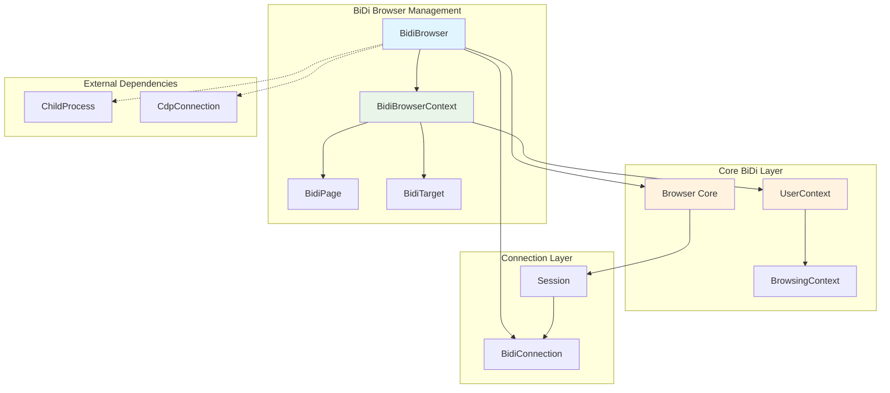
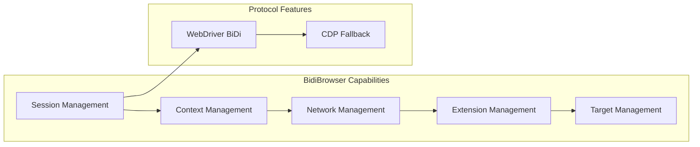
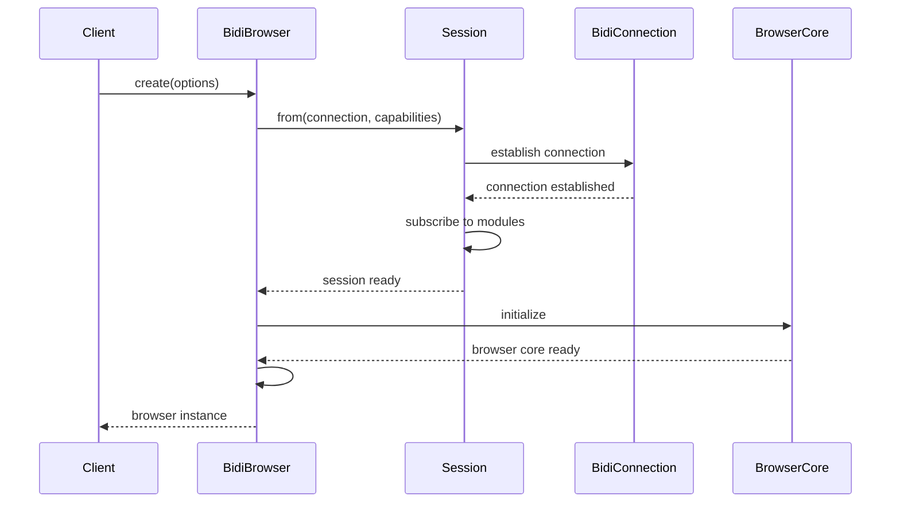
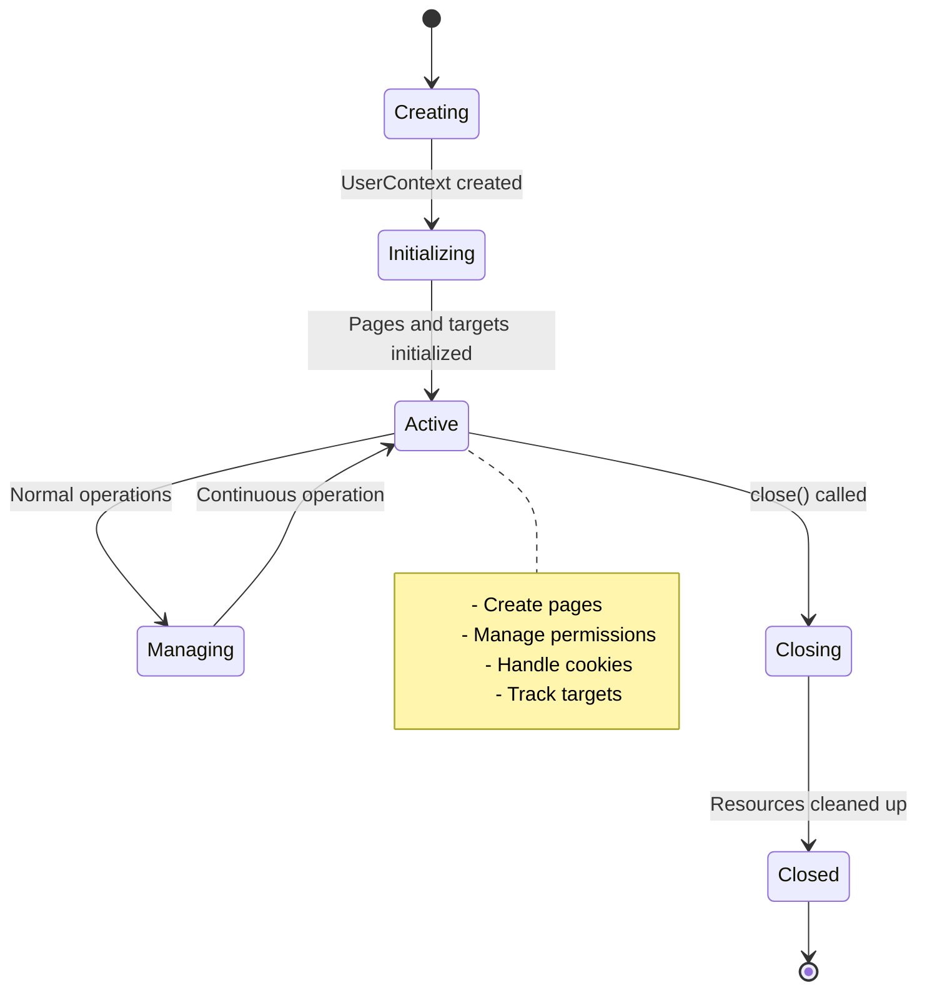
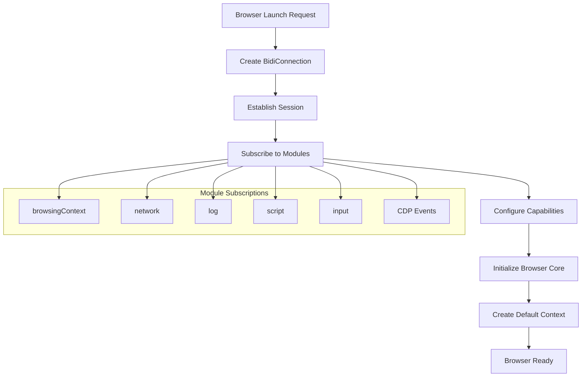
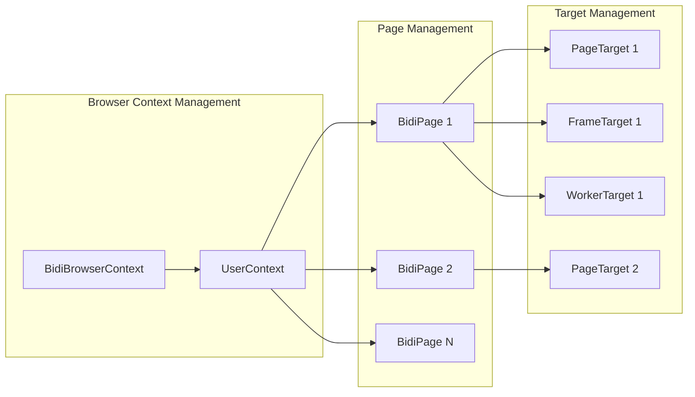
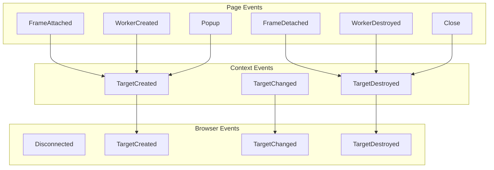
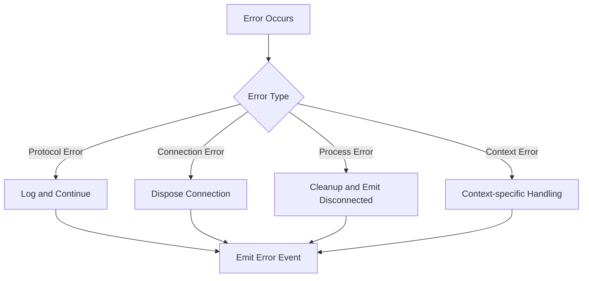

# BiDi Browser Management Module

## Overview

The BiDi Browser Management module provides the core browser and browser context management functionality for Puppeteer's WebDriver BiDi implementation. This module serves as the primary interface for creating, managing, and controlling browser instances and their contexts using the WebDriver BiDi protocol, offering an alternative to the Chrome DevTools Protocol (CDP) implementation.

The module consists of two main components:
- **BidiBrowser**: The main browser instance that manages the overall browser lifecycle and capabilities
- **BidiBrowserContext**: Individual browser contexts that provide isolated environments for web pages

## Architecture Overview



## Component Details

### BidiBrowser

The `BidiBrowser` class extends the base `Browser` class and provides WebDriver BiDi-specific browser management functionality.

#### Key Features

- **Protocol Support**: Implements WebDriver BiDi protocol with optional CDP fallback
- **Session Management**: Manages BiDi sessions with capability negotiation
- **Context Management**: Creates and manages multiple browser contexts
- **Network Control**: Configurable network interception and monitoring
- **Extension Support**: Install and uninstall browser extensions
- **Target Management**: Tracks and manages browser targets

#### Core Capabilities



#### Initialization Process



### BidiBrowserContext

The `BidiBrowserContext` class extends the base `BrowserContext` class and provides isolated browsing environments within a BiDi browser instance.

#### Key Features

- **Isolation**: Provides isolated browsing environments with separate cookies, storage, and permissions
- **Page Management**: Creates and manages pages within the context
- **Permission Control**: Override and manage web permissions
- **Cookie Management**: Set, get, and manage cookies for the context
- **Target Tracking**: Monitors page, frame, and worker targets

#### Context Lifecycle



## Data Flow

### Browser Creation Flow



### Context and Page Management



## Integration Points

### Core API Integration

The module integrates with the [core_api](core_api.md) module by implementing the abstract `Browser` and `BrowserContext` classes, providing BiDi-specific implementations of core browser functionality.

### BiDi Implementation Integration

This module is part of the broader [bidi_implementation](bidi_implementation.md) ecosystem and works closely with:
- [bidi_connection_layer](bidi_connection_layer.md) for protocol communication
- [bidi_page_interaction](bidi_page_interaction.md) for page-level operations
- [bidi_element_handling](bidi_element_handling.md) for DOM manipulation

### Core BiDi Layer Integration

The module depends on the [bidi_core](bidi_core.md) module for low-level BiDi protocol handling and session management.

## Configuration and Options

### BidiBrowserOptions

```typescript
interface BidiBrowserOptions {
  process?: ChildProcess;           // Browser process reference
  closeCallback?: BrowserCloseCallback;  // Cleanup callback
  connection: BidiConnection;       // BiDi protocol connection
  cdpConnection?: CdpConnection;    // Optional CDP fallback
  defaultViewport: Viewport | null; // Default viewport settings
  acceptInsecureCerts?: boolean;    // Security settings
  capabilities?: SupportedWebDriverCapabilities; // WebDriver capabilities
  networkEnabled: boolean;          // Network interception control
}
```

### BidiBrowserContextOptions

```typescript
interface BidiBrowserContextOptions {
  defaultViewport: Viewport | null; // Default viewport for new pages
}
```

## Event System

### Browser Events



## Error Handling

The module implements comprehensive error handling for:

- **Protocol Errors**: BiDi protocol communication failures
- **Connection Errors**: Network and transport layer issues
- **Browser Process Errors**: Browser crash or unexpected termination
- **Context Errors**: Context creation and management failures

### Error Propagation



## Performance Considerations

### Resource Management

- **Weak References**: Uses WeakMap for page and context tracking to prevent memory leaks
- **Event Cleanup**: Proper event listener cleanup on context/browser closure
- **Connection Pooling**: Efficient connection reuse for multiple contexts

### Optimization Features

- **Lazy Loading**: Contexts and pages created on-demand
- **Selective Subscriptions**: Only subscribe to needed BiDi modules
- **Network Control**: Optional network interception to reduce overhead

## Usage Examples

### Basic Browser Creation

```typescript
const browser = await BidiBrowser.create({
  connection: bidiConnection,
  defaultViewport: { width: 1280, height: 720 },
  networkEnabled: true,
  acceptInsecureCerts: false
});
```

### Context Management

```typescript
// Create new context
const context = await browser.createBrowserContext({
  viewport: { width: 1920, height: 1080 }
});

// Create page in context
const page = await context.newPage();

// Manage permissions
await context.overridePermissions('https://example.com', ['geolocation']);

// Manage cookies
await context.setCookie({
  name: 'session',
  value: 'abc123',
  domain: 'example.com'
});
```

## Security Features

### Permission Management

The module provides fine-grained permission control:
- Override web permissions per origin
- Grant or deny specific capabilities
- Clear permission overrides

### Cookie Security

- Secure cookie handling with SameSite support
- HttpOnly and Secure flag management
- Partition key support for enhanced privacy

### Certificate Handling

- Configurable insecure certificate acceptance
- Security-first defaults with opt-in relaxation

## Future Considerations

### Protocol Evolution

The module is designed to adapt to WebDriver BiDi specification changes:
- Modular subscription system for new capabilities
- Extensible capability negotiation
- Forward-compatible error handling

### Performance Enhancements

- Connection multiplexing improvements
- Enhanced resource cleanup
- Optimized event propagation

This module serves as the foundation for BiDi-based browser automation, providing a robust and feature-rich alternative to CDP-based implementations while maintaining compatibility with Puppeteer's existing API surface.