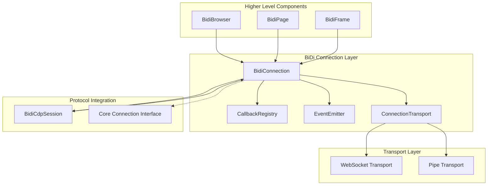
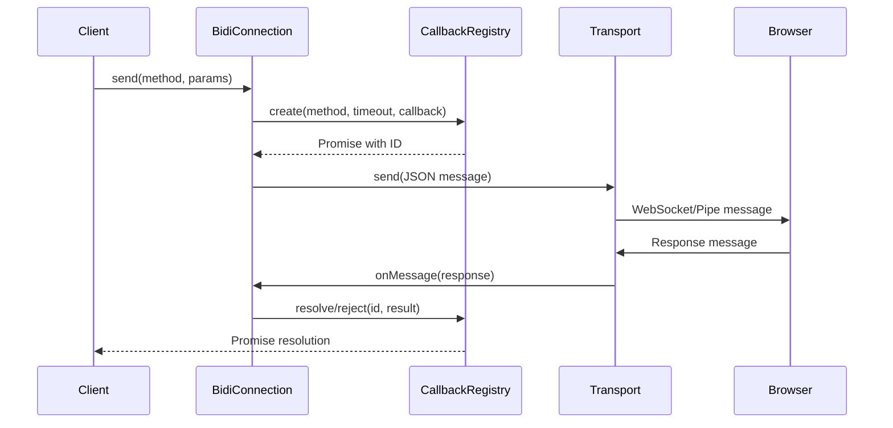
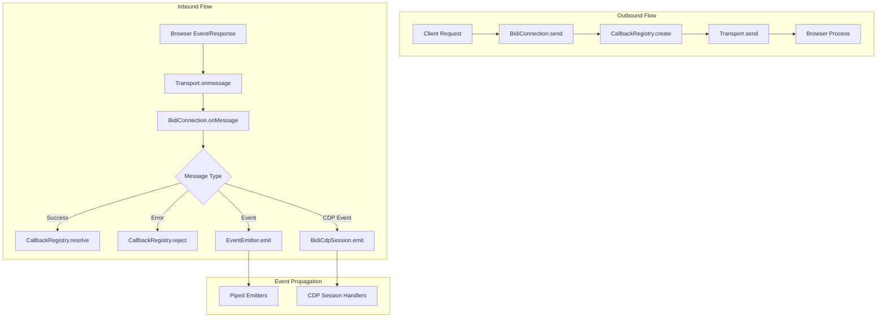
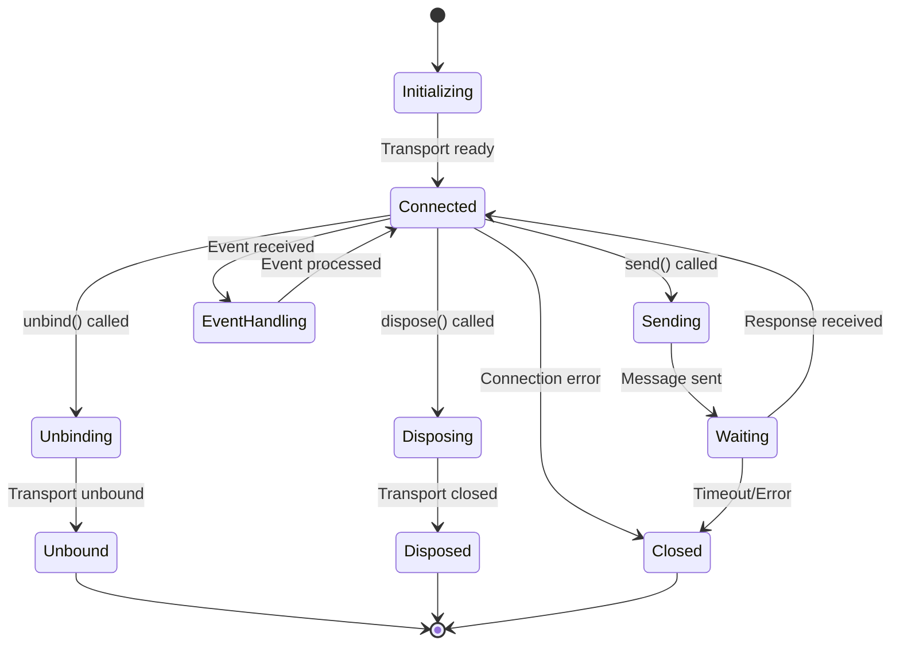
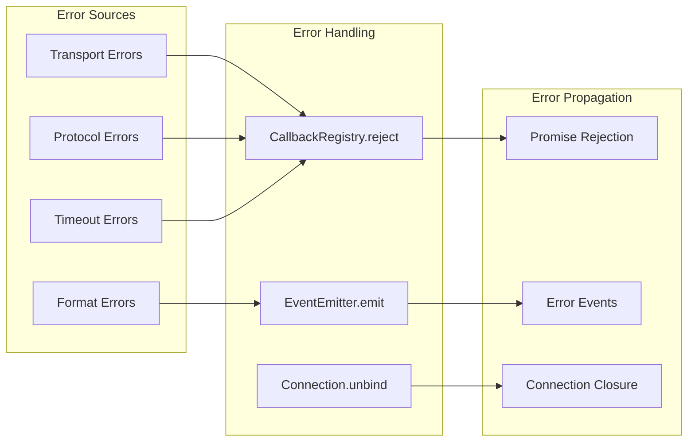

# BiDi Connection Layer

The BiDi Connection Layer module provides the core communication infrastructure for WebDriver BiDi protocol interactions in Puppeteer. This module implements the low-level connection management, message routing, and protocol handling that enables Puppeteer to communicate with browsers using the WebDriver BiDi standard.

## Overview

The BiDi Connection Layer serves as the foundational communication bridge between Puppeteer's high-level APIs and browser instances supporting the WebDriver BiDi protocol. It handles protocol message serialization/deserialization, callback management, event routing, and connection lifecycle management while providing seamless integration with Chrome DevTools Protocol (CDP) for hybrid protocol scenarios.

## Architecture



## Core Components

### BidiConnection

The `BidiConnection` class is the central component that manages WebDriver BiDi protocol communication:

**Key Responsibilities:**
- Protocol message handling and routing
- Command execution with timeout management
- Event emission and propagation
- Connection lifecycle management
- CDP integration for hybrid scenarios

**Core Features:**
- **Message Processing**: Handles BiDi protocol messages including commands, responses, and events
- **Callback Management**: Manages pending requests using a callback registry system
- **Event Routing**: Routes protocol events to appropriate handlers and emitters
- **Transport Abstraction**: Works with various transport mechanisms (WebSocket, Pipe)
- **Error Handling**: Provides comprehensive error handling for protocol and connection issues



### Protocol Command Interface

The connection supports both standard BiDi commands and Google-specific CDP extensions:

**Standard BiDi Commands:**
- Session management
- Browsing context operations
- Script execution
- Network interception

**CDP Extensions:**
- `goog:cdp.sendCommand`: Execute CDP commands through BiDi
- `goog:cdp.getSession`: Retrieve CDP session information
- `goog:cdp.resolveRealm`: Resolve execution contexts

## Dependencies

### Core Dependencies

- **[common_utilities](common_utilities.md)**: Provides `EventEmitter`, `CallbackRegistry`, and `ConnectionTransport` interfaces
- **[transport_layer](transport_layer.md)**: Supplies WebSocket and Pipe transport implementations
- **[bidi_core](bidi_core.md)**: Defines core BiDi protocol interfaces and types

### Integration Points

- **[cdp_implementation](cdp_implementation.md)**: Integrates with CDP sessions for hybrid protocol support
- **[bidi_browser_management](bidi_browser_management.md)**: Provides connection to browser and context management
- **[bidi_page_interaction](bidi_page_interaction.md)**: Supplies page and frame components that use the connection

## Data Flow



## Connection Lifecycle



## Message Processing

### Command Execution

The connection handles command execution through a sophisticated callback system:

1. **Request Creation**: Commands are assigned unique IDs and registered in the callback registry
2. **Transport**: Messages are serialized to JSON and sent via the transport layer
3. **Response Handling**: Incoming responses are matched to pending callbacks by ID
4. **Result Processing**: Successful responses resolve promises, errors reject them

### Event Handling

Events are processed differently based on their type:

- **BiDi Events**: Routed to registered event listeners via the EventEmitter system
- **CDP Events**: Forwarded to appropriate BidiCdpSession instances
- **Protocol Errors**: Handled as callback rejections or general error events

## Error Handling

The connection layer provides comprehensive error handling:

**Connection Errors:**
- Transport failures
- Protocol format errors
- Timeout handling
- Connection closure scenarios

**Protocol Errors:**
- BiDi error responses
- CDP command failures
- Invalid message formats
- Session management errors



## Integration Patterns

### CDP Integration

The BiDi connection seamlessly integrates with CDP through specialized commands:

```typescript
// Execute CDP command through BiDi
const result = await connection.send('goog:cdp.sendCommand', {
  method: 'Runtime.evaluate',
  params: { expression: 'document.title' },
  session: sessionId
});
```

### Event Piping

The connection supports event piping to multiple emitters:

```typescript
// Pipe events to browser-level emitter
connection.pipeTo(browserEmitter);

// Events are automatically forwarded to all piped emitters
connection.emit('browsingContext.created', contextInfo);
```

## Performance Considerations

### Connection Optimization

- **Callback Registry**: Efficient ID-based callback management
- **Event Routing**: Direct event forwarding without unnecessary processing
- **Transport Abstraction**: Pluggable transport layer for optimal performance
- **Memory Management**: Automatic cleanup of completed callbacks and closed connections

### Protocol Efficiency

- **Message Batching**: Support for efficient message queuing
- **Timeout Management**: Configurable timeouts prevent resource leaks
- **Error Recovery**: Graceful handling of connection interruptions
- **Session Reuse**: Efficient CDP session management for hybrid scenarios

## Usage Examples

### Basic Command Execution

```typescript
const connection = new BidiConnection(url, transport);

// Execute BiDi command
const result = await connection.send('browsingContext.create', {
  type: 'tab'
});

// Handle events
connection.on('browsingContext.created', (event) => {
  console.log('New context created:', event.context);
});
```

### CDP Integration

```typescript
// Get CDP session for context
const session = await connection.send('goog:cdp.getSession', {
  context: contextId
});

// Execute CDP command
const result = await connection.send('goog:cdp.sendCommand', {
  method: 'Page.navigate',
  params: { url: 'https://example.com' },
  session: session.result.session
});
```

## Related Modules

- **[bidi_core](bidi_core.md)**: Core BiDi protocol definitions and interfaces
- **[bidi_browser_management](bidi_browser_management.md)**: Browser and context management using BiDi connections
- **[bidi_page_interaction](bidi_page_interaction.md)**: Page and frame operations through BiDi protocol
- **[transport_layer](transport_layer.md)**: Underlying transport mechanisms for protocol communication
- **[cdp_implementation](cdp_implementation.md)**: CDP protocol implementation for hybrid scenarios
- **[common_utilities](common_utilities.md)**: Shared utilities for event handling and callback management