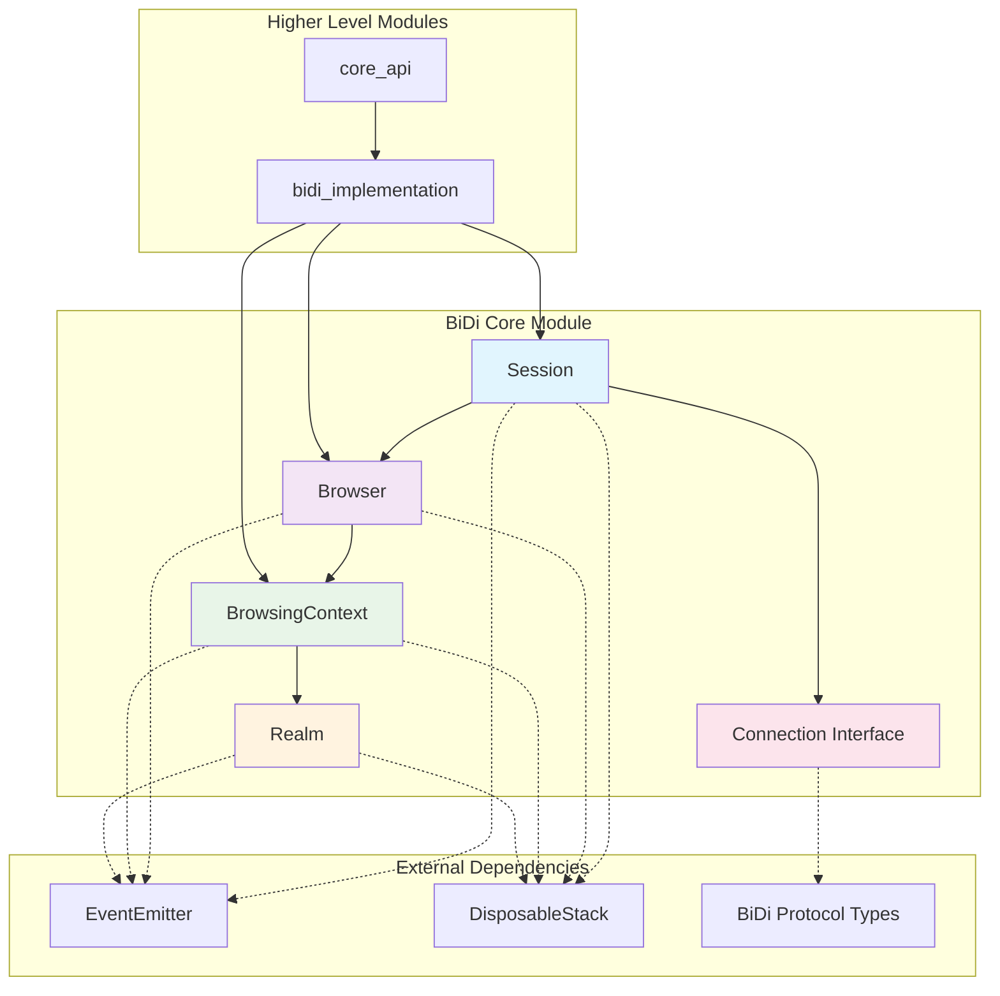
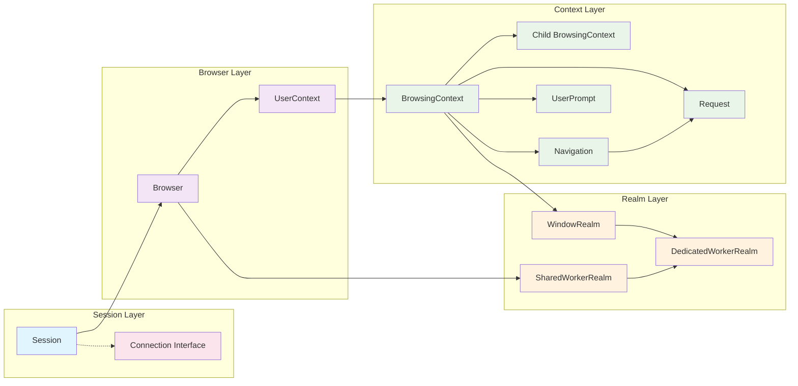
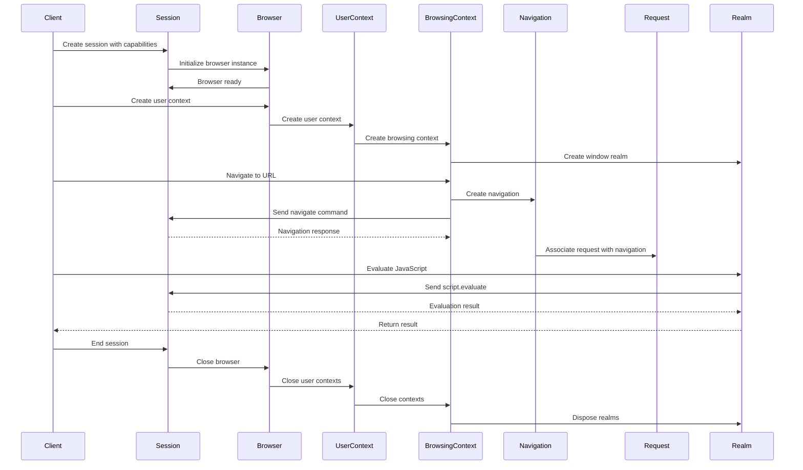

# BiDi Core Module Documentation

## Overview

The `bidi_core` module is a foundational component of Puppeteer's WebDriver BiDi (Bidirectional) protocol implementation. It provides the core abstractions and communication layer for browser automation using the modern BiDi standard, which enables bidirectional communication between the automation client and browser instances.

## Purpose

The BiDi Core module serves as the fundamental building blocks for:
- **Session Management**: Establishing and maintaining BiDi protocol sessions
- **Browser Control**: Core browser instance management and lifecycle
- **Context Management**: Browsing context creation, navigation, and interaction
- **Realm Management**: JavaScript execution context handling
- **Protocol Communication**: Low-level BiDi protocol message handling

## Architecture Overview

## Core Components

### 1. Session (`packages.puppeteer-core.src.bidi.core.Session.Session`)
The Session component manages the BiDi protocol session lifecycle and serves as the primary communication gateway.

**Key Responsibilities:**
- Establishing BiDi protocol sessions with specified capabilities
- Managing session lifecycle (creation, disposal, termination)
- Providing protocol command sending interface
- Event subscription and management
- Browser instance creation and management

**Key Features:**
- Session capability negotiation
- Event-driven architecture with proper disposal patterns
- Protocol command routing
- Browser lifecycle management

### 2. Browser (`packages.puppeteer-core.src.bidi.core.Browser.Browser`)
The Browser component represents a browser instance and manages browser-level operations.

**Key Responsibilities:**
- Browser instance lifecycle management
- User context creation and management
- Preload script management
- Extension installation/uninstallation
- Network intercept management
- Shared worker realm tracking

**Key Features:**
- Multiple user context support
- Script preloading capabilities
- Extension management
- Event emission for browser-level events
- Proper resource disposal

### 3. BrowsingContext (`packages.puppeteer-core.src.bidi.core.BrowsingContext.BrowsingContext`)
The BrowsingContext component represents individual browsing contexts (tabs, frames, windows).

**Key Responsibilities:**
- Navigation and page lifecycle management
- Screenshot and printing capabilities
- Input handling and user interaction
- Cookie and storage management
- Viewport and emulation control
- Child context management

**Key Features:**
- Navigation control (navigate, reload, history traversal)
- Screenshot and PDF generation
- Input simulation (actions, file uploads)
- Cookie and storage operations
- Emulation capabilities (geolocation, timezone, JavaScript)
- Hierarchical context management

### 4. Realm (`packages.puppeteer-core.src.bidi.core.Realm.Realm`)
The Realm component manages JavaScript execution contexts within browsing contexts.

**Key Responsibilities:**
- JavaScript code execution
- Object handle management
- Worker realm management
- Execution context resolution

**Key Features:**
- Script evaluation and function calling
- Handle ownership management
- Worker realm creation and tracking
- CDP execution context integration

**Realm Types:**
- **WindowRealm**: Main window execution context
- **DedicatedWorkerRealm**: Dedicated worker execution context
- **SharedWorkerRealm**: Shared worker execution context

### 5. Connection Interface (`packages.puppeteer-core.src.bidi.core.Connection.Connection`)
The Connection interface defines the contract for BiDi protocol communication.

**Key Responsibilities:**
- Protocol command type definitions
- Event type definitions
- Communication interface specification

**Key Features:**
- Comprehensive command type mapping
- Event type system
- Type-safe protocol communication

## Supporting Components

### UserContext
Manages user contexts (browser profiles) within a browser instance. Provides isolation between different browsing sessions and manages top-level browsing contexts.

**Key Features:**
- Browsing context creation and management
- Cookie and storage operations at user context level
- Permission management
- User context lifecycle management

### Navigation
Handles navigation events and lifecycle within browsing contexts. Tracks navigation states and associated network requests.

**Key Features:**
- Navigation event tracking
- Request association with navigation
- Navigation state management (fragment, failed, aborted)
- Navigation timing information

### Request
Represents network requests within browsing contexts and provides request/response handling capabilities.

**Key Features:**
- Request lifecycle management
- Response data access
- Request interception and modification
- Authentication handling
- Redirect tracking

### UserPrompt
Manages browser user prompts (alerts, confirms, prompts) and provides programmatic handling capabilities.

**Key Features:**
- Prompt detection and handling
- Automatic and manual prompt responses
- Prompt result tracking
- Event-driven prompt management

## Component Relationships

## Data Flow

## BiDi Protocol Compliance

The bidi_core module implements the [WebDriver BiDi specification](https://w3c.github.io/webdriver-bidi/), providing:

- **Session Management**: Implements BiDi session lifecycle as per specification
- **Command/Event Model**: Follows BiDi's bidirectional communication pattern
- **Context Hierarchy**: Maintains proper browsing context relationships
- **Realm Management**: Handles JavaScript execution contexts according to BiDi standards
- **Type Safety**: Uses official BiDi protocol type definitions from chromium-bidi

The implementation ensures compatibility with BiDi-compliant browsers while providing a robust foundation for browser automation.

## Integration with Other Modules

The bidi_core module serves as the foundation for several other modules:

- **[bidi_implementation](bidi_implementation.md)**: Provides higher-level BiDi implementations that build upon these core components
- **[core_api](core_api.md)**: Exposes unified API interfaces that abstract over both CDP and BiDi implementations
- **[common_utilities](common_utilities.md)**: Utilizes shared utilities like EventEmitter and configuration management
- **[transport_layer](transport_layer.md)**: Relies on transport implementations for actual protocol communication

## Key Design Patterns

### 1. Event-Driven Architecture
All core components extend EventEmitter and emit relevant lifecycle and operational events:
- Session: `ended` events
- Browser: `closed`, `disconnected`, `sharedworker` events
- BrowsingContext: `closed`, `navigation`, `request`, `log` events
- Realm: `updated`, `destroyed`, `worker` events

### 2. Disposable Pattern
Components implement proper resource disposal using DisposableStack:
- Automatic cleanup of event listeners
- Cascading disposal of child components
- Prevention of operations on disposed objects

### 3. Decorator-Based Error Handling
Uses decorators for consistent error handling:
- `@throwIfDisposed`: Prevents operations on disposed objects
- `@inertIfDisposed`: Makes operations no-op on disposed objects

### 4. Type-Safe Protocol Communication
Strong typing for BiDi protocol commands and events ensures compile-time safety and better developer experience.

## Error Handling

The module implements comprehensive error handling:
- **Disposal Checks**: All operations check if components are disposed
- **Reason Tracking**: Disposal reasons are tracked and propagated
- **Cascading Cleanup**: Parent disposal triggers child cleanup
- **Event-Based Notifications**: Components emit events when disposed or closed

## Performance Considerations

- **Lazy Initialization**: Components are initialized only when needed
- **Event Listener Management**: Proper cleanup prevents memory leaks
- **Resource Pooling**: Reuses connections and contexts where possible
- **Efficient Event Handling**: Uses weak references and proper disposal patterns

## Future Extensibility

The modular design allows for:
- Additional realm types for new worker types
- Extended browser capabilities as BiDi protocol evolves
- Custom event handling and interception
- Protocol version compatibility layers

This core module provides the essential building blocks for Puppeteer's BiDi implementation, ensuring robust, type-safe, and efficient browser automation capabilities.