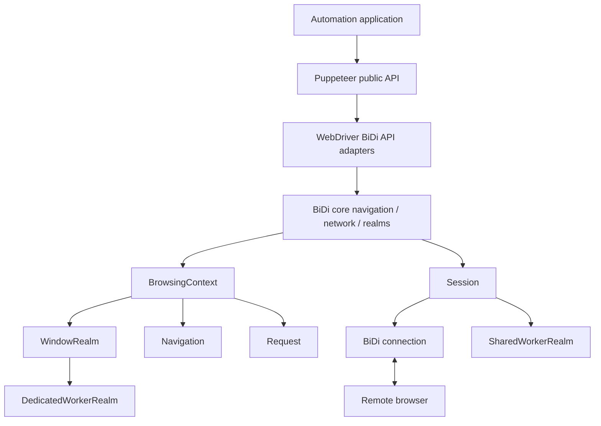
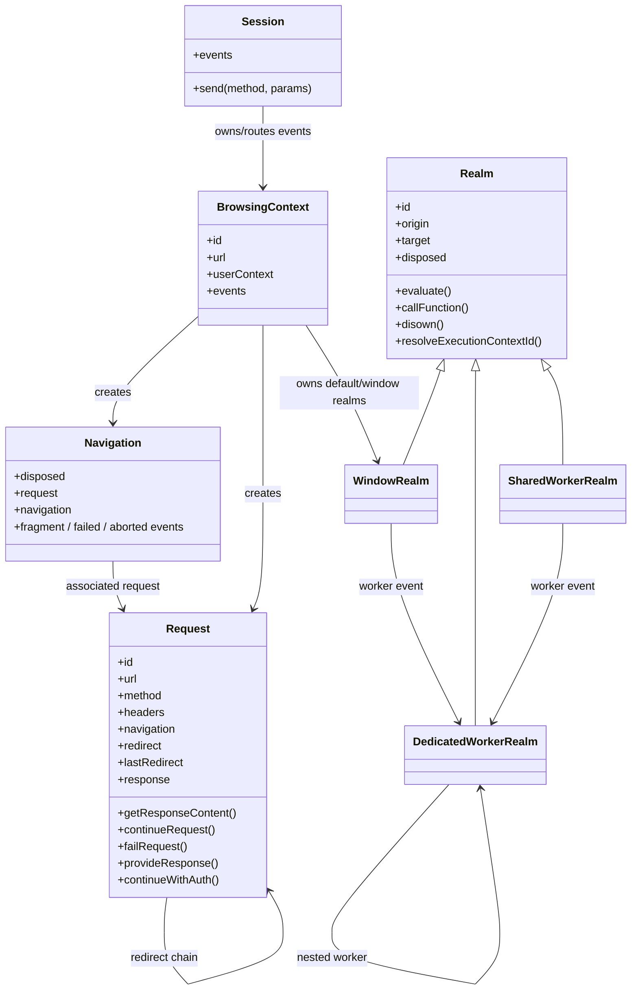
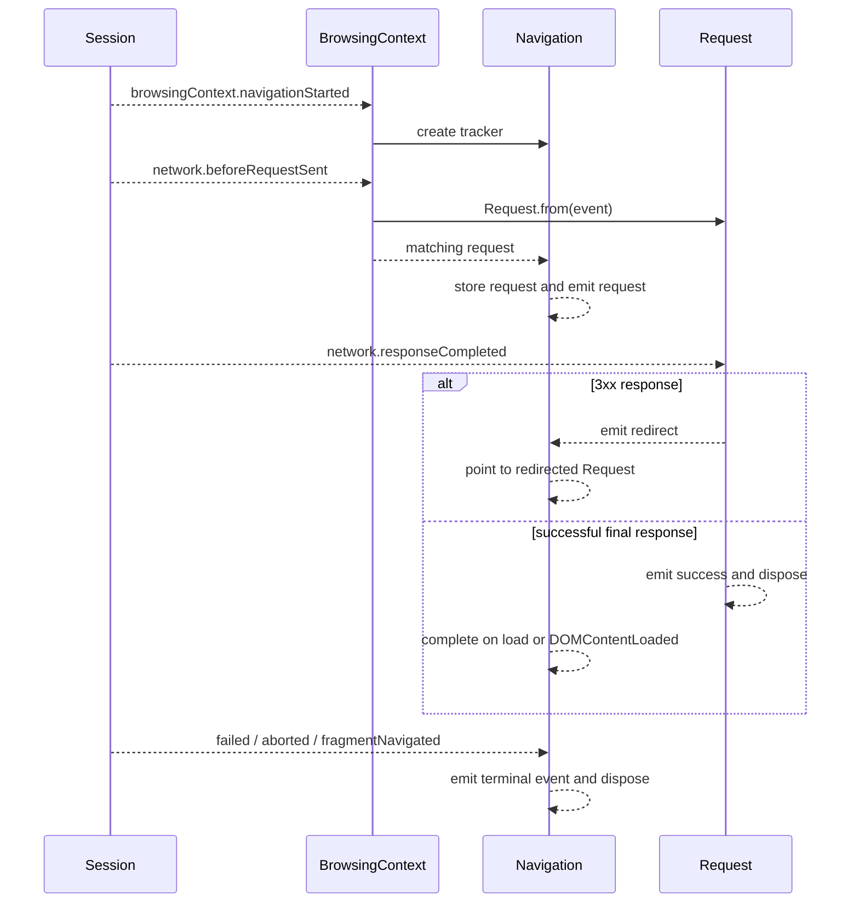
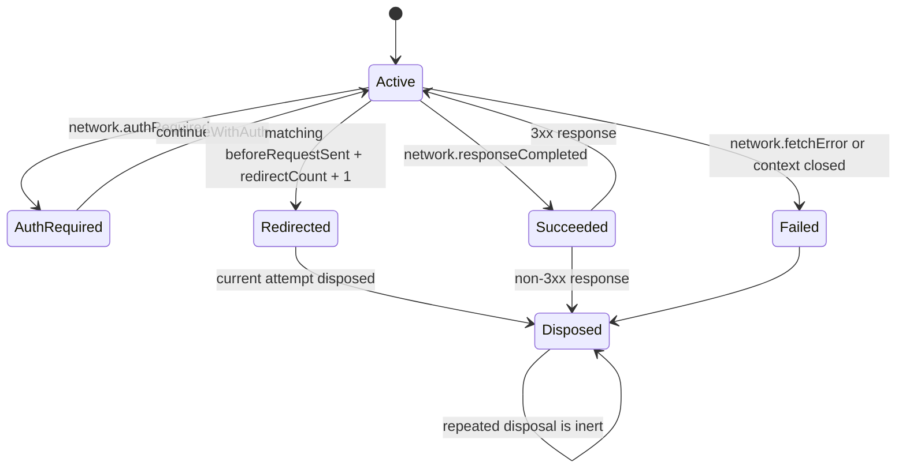
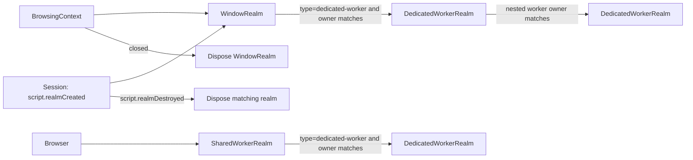
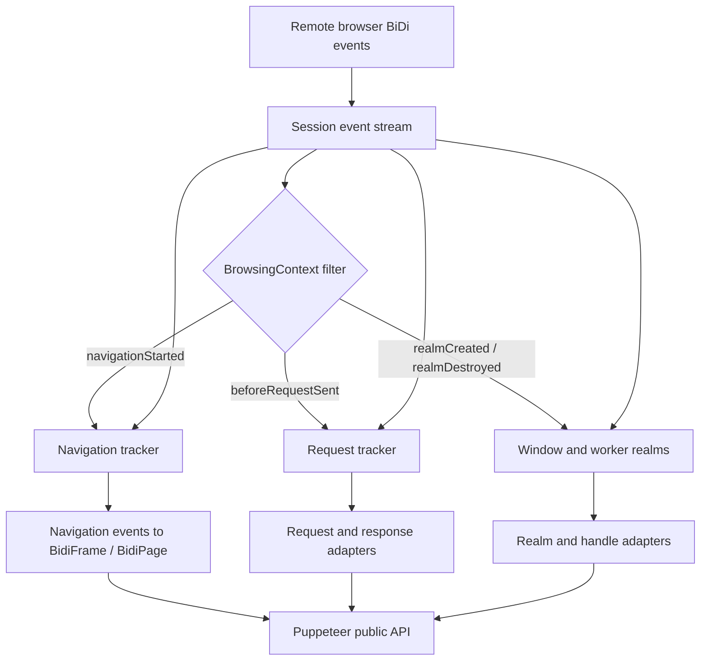

# WebDriver BiDi Core Navigation, Network, and Realms

## Introduction

`bidi_core_navigation_network_and_realms` contains the internal BiDi objects that represent three kinds of browser activity:

- `Navigation` correlates navigation lifecycle events with the request that initiated the navigation.
- `Request` represents one network request, including redirects, authentication, interception, response metadata, and response content.
- `Realm` and its subclasses represent script-execution targets for windows and workers.

These objects are created and fed by the BiDi core session/context model. They are not the public Puppeteer API; the protocol-neutral and BiDi-specific adapters wrap them for applications. See [BiDi core session and context model](bidi_core_session_and_context_model.md), [BiDi network](bidi_network.md), [BiDi page and frame](bidi_page_and_frame.md), and [BiDi script and handles](bidi_script_and_handles.md) for those surrounding layers.

## Position in the system

`Session` is the protocol command/event boundary. `BrowsingContext` filters context-scoped events and creates `Navigation`, `Request`, and window-realm objects. The objects retain their owner and derive the same session through the ownership chain, so commands remain scoped to the correct context or realm.

## Components and responsibilities

| Component | Represents | Main responsibilities |
| --- | --- | --- |
| `Navigation` | A context navigation transaction | Correlates navigation IDs, tracks the associated request, follows redirects, emits fragment/failure/abort events, and disposes at a terminal lifecycle event. |
| `Request` | One request attempt | Exposes request metadata, follows redirect chains, handles authentication, continues/fails/provides responses, retrieves response bodies, and emits request outcomes. |
| `Realm` | A script execution environment | Sends `script.evaluate` and `script.callFunction`, disowns remote handles, resolves a CDP execution context when available, and enforces disposal. |
| `WindowRealm` | A window realm in a browsing context | Tracks realm recreation, sandbox identity, and dedicated workers owned by the window. |
| `DedicatedWorkerRealm` | A dedicated worker realm | Tracks its owning realm(s), nested dedicated workers, and `script.realmDestroyed`. |
| `SharedWorkerRealm` | A browser-level shared worker realm | Uses the browser session directly and tracks dedicated workers created by the shared worker. |

## Architecture and relationships

The classes share the common runtime infrastructure documented in [runtime lifecycle and scheduling](runtime_lifecycle_and_scheduling.md): typed `EventEmitter` instances route events, `DisposableStack` owns listeners, and disposal decorators make repeated cleanup safe or reject commands after destruction.

## Navigation tracking

`Navigation.from(context)` creates a tracker and immediately subscribes to the context and its session. It maintains three pieces of derived state:

- `request`: the current `Request` associated with the navigation, if a matching request has arrived.
- `navigation`: a nested navigation tracker created when a matching `browsingContext.navigationStarted` event is observed.
- an internal navigation ID used by `#matches()` to correlate events that may carry `null` or implementation-specific identifiers.

The tracker filters every event by browsing-context ID. A request is accepted only when its `navigation` value matches the tracked navigation. When a redirect is emitted by the request, `Navigation.request` is advanced to the redirected request.

Terminal behavior is event-specific:

| Event | Behavior |
| --- | --- |
| `browsingContext.domContentLoaded` / `load` | Matching navigation is considered complete and the tracker is disposed. |
| `browsingContext.fragmentNavigated` | Emits `fragment` with URL and timestamp, then disposes. |
| `browsingContext.navigationFailed` | Emits `failed`, then disposes. |
| `browsingContext.navigationAborted` | Emits `aborted`, then disposes. |
| Browsing-context `closed` | Emits `failed` using the current context URL, then disposes. |

## Request lifecycle and network operations

`Request.from(browsingContext, beforeRequestSentEvent)` snapshots the initial BiDi request event and then listens for later events matching both the context and request identifier. Redirect count prevents events for a different redirect attempt from being attached to the current object.

### Metadata

The request exposes protocol data without copying it unnecessarily:

- `id`, `url`, `method`, `headers`, and `initiator` come from the `beforeRequestSent` event.
- `navigation` identifies the navigation that caused the request, when present.
- `isBlocked` reports whether the browser paused the request.
- `resourceType`, `postData`, and `hasPostData` read Chromium-specific BiDi extensions when supplied.
- `response` is populated by `network.responseCompleted`.
- `timing()` returns the request timing data after completion has updated the original event.
- `redirect` points to the next request attempt; `lastRedirect` walks to the end of the chain.

### Event handling

The command methods map directly to BiDi network commands:

| Method | BiDi command | Purpose |
| --- | --- | --- |
| `continueRequest()` | `network.continueRequest` | Changes URL, method, headers, cookies, or body and resumes a paused request. |
| `failRequest()` | `network.failRequest` | Aborts the request. |
| `provideResponse()` | `network.provideResponse` | Supplies a synthetic status, headers, reason, and body. |
| `continueWithAuth()` | `network.continueWithAuth` | Provides credentials or selects an authentication action. |
| `getResponseContent()` | `network.getData` | Retrieves response bytes and decodes base64 data when required. |

Response content is lazy and memoized: concurrent or repeated calls share `#responseContentPromise`. A missing resource identifier is translated into a more actionable `ProtocolError`, commonly seen for preflight requests.

The public wrapper translates this internal object into Puppeteer request/response events and methods; see [BiDi network](bidi_network.md) and the shared [network API](network_api.md).

## Realms and script execution

`Realm` is the common execution abstraction for windows and workers. Every command supplies `target: {realm: id}` unless overridden by a subclass. `WindowRealm` instead targets `{context, sandbox}` because a window realm can be recreated while the browsing context remains alive.

### Common realm operations

- `evaluate(expression, awaitPromise, options)` sends `script.evaluate`.
- `callFunction(functionDeclaration, awaitPromise, options)` sends `script.callFunction`.
- `disown(handles)` sends `script.disown` for remote object cleanup.
- `resolveExecutionContextId()` lazily calls the Chromium extension `goog:cdp.resolveRealm`, enabling CDP-backed integrations to map a BiDi realm to an execution context.
- `disposed` reports whether a destruction reason has been recorded.
- `destroyed` is emitted exactly as the realm enters disposal, with a reason suitable for diagnostics.

All script commands are guarded by `throwIfDisposed`; use after disposal fails with the stored reason. Disposal also releases all event listeners and nested disposable resources.

### Realm creation and ownership

`WindowRealm` listens for a matching `script.realmCreated` event. When the browser recreates the realm, it updates its ID and origin, clears the cached CDP execution-context ID, and emits `updated`. This is important because a window’s execution realm can change across navigation.

Dedicated and shared workers are discovered through `script.realmCreated` events whose `owners` list contains the owner realm ID. Each worker is stored locally, emits `worker` from its owner, and is removed from that map when its `destroyed` event fires. Dedicated workers use an owner’s session; shared workers use the browser session directly.

## Cross-component data flow

This module is therefore a protocol-model layer, not a transport layer. Transport creation, message correlation, and WebSocket/pipe behavior belong to [protocol transport and session infrastructure](protocol_transport_and_session_infrastructure.md) and [BiDi transport and CDP bridge](bidi_transport_and_cdp_bridge.md). Browser/context ownership and event normalization belong to [BiDi core session and context model](bidi_core_session_and_context_model.md).

## Lifecycle and maintenance guidance

- Always filter session events by context and, where applicable, request ID, navigation ID, redirect count, realm ID, or worker owner. These events share one session-wide stream.
- Treat `Navigation`, individual redirect `Request` objects, and realms as disposable event-backed state rather than durable records.
- Preserve redirect links before disposing the current request; `Navigation` advances its current request when a redirect occurs.
- Do not issue script commands after `disposed` becomes true. The realm decorators intentionally surface the destruction reason.
- If realm creation or network event shapes change, update the corresponding `chromium-bidi` protocol types and all correlation predicates together.
- Keep public behavior changes in the adapter modules unless the BiDi protocol model itself needs new state or commands.

## Related documentation

- [BiDi core session and context model](bidi_core_session_and_context_model.md)
- [BiDi network](bidi_network.md)
- [BiDi page and frame](bidi_page_and_frame.md)
- [BiDi script and handles](bidi_script_and_handles.md)
- [BiDi targets and workers](bidi_targets_and_workers.md)
- [Protocol-neutral public automation API](protocol_neutral_public_automation_api.md)
- [Runtime lifecycle and scheduling](runtime_lifecycle_and_scheduling.md)
- [Protocol transport and session infrastructure](protocol_transport_and_session_infrastructure.md)
