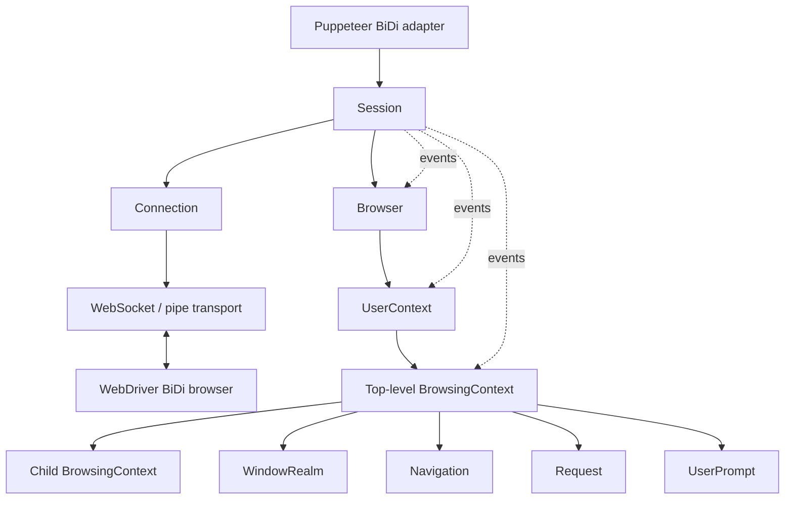
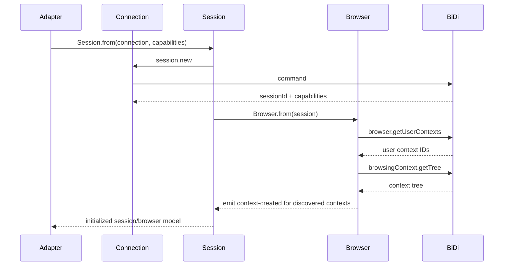
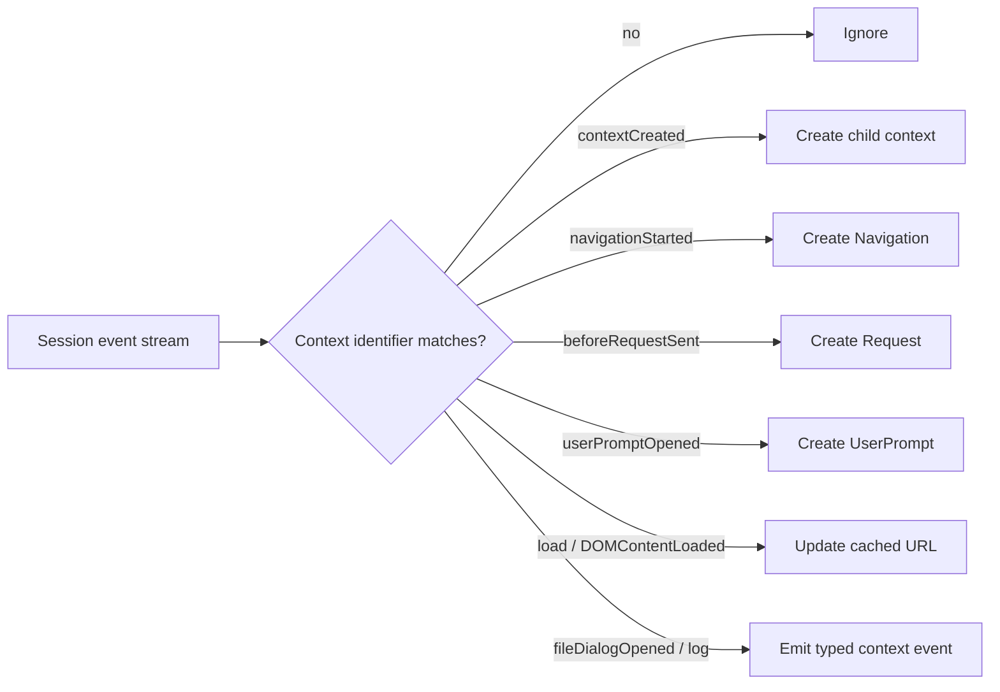
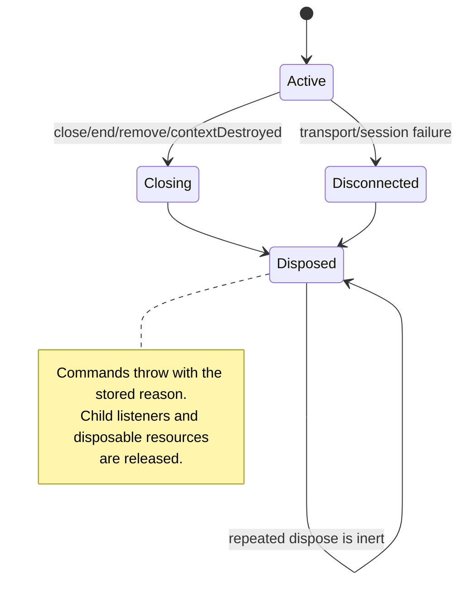
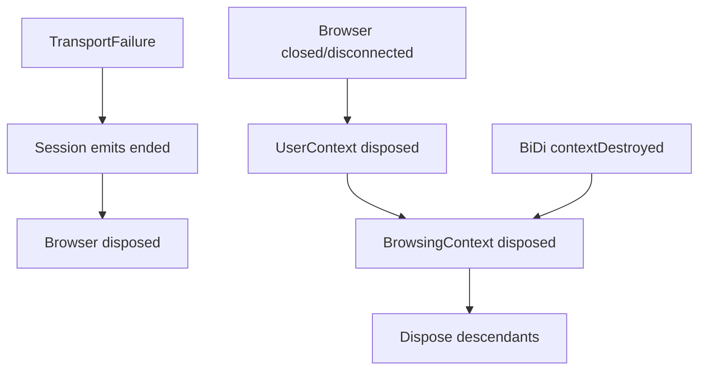
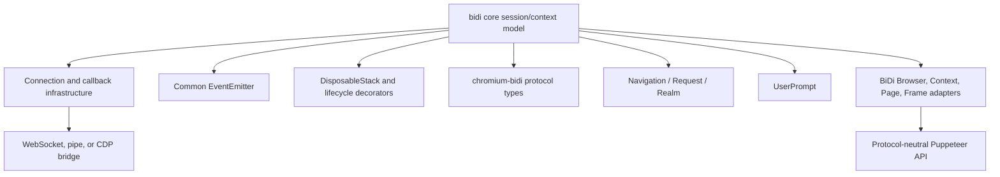
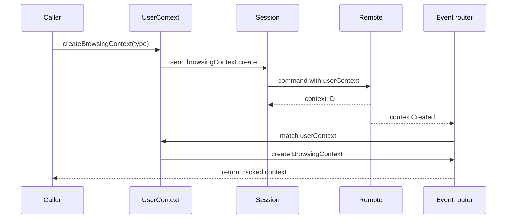
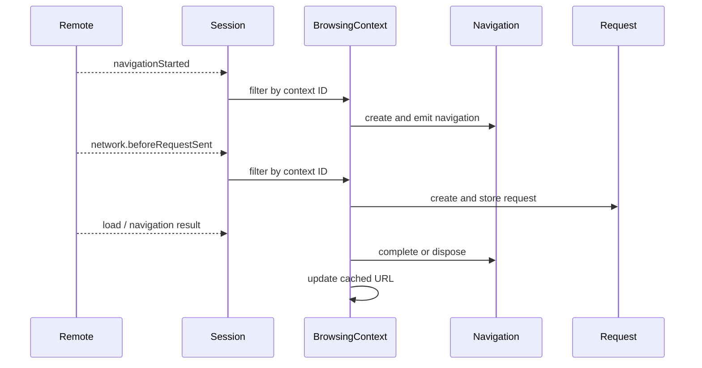

# WebDriver BiDi Core Session and Context Model

## Introduction

`bidi_core_session_and_context_model` is Puppeteer’s internal object model for a WebDriver BiDi connection after a session has been created. It turns protocol responses and events into a managed hierarchy:

`Session → Browser → UserContext → BrowsingContext → Realm`

The model owns lifecycle state, event routing, protocol command scoping, cookie partitions, navigation/request tracking, and user-prompt handling. Higher-level BiDi adapters expose these objects through Puppeteer’s protocol-neutral API; transport details are documented in [protocol transport and session infrastructure](protocol_transport_and_session_infrastructure.md), and the public-facing BiDi adapters in [WebDriver BiDi API adapters](webdriver_bidi_api_adapters.md).

## Scope and responsibilities

The module contains four primary classes:

| Component | Responsibility | Main protocol scope |
| --- | --- | --- |
| `Session` | Creates and owns the BiDi session, forwards commands, subscribes to events, and ends the session. | `session.*` |
| `Browser` | Represents the remote browser, synchronizes user contexts and existing browsing contexts, and manages browser-wide scripts/extensions. | `browser.*`, `script.*`, `webExtension.*` |
| `UserContext` | Represents an isolated browser profile/storage partition and tracks its top-level browsing contexts. | `browser.*`, `storage.*`, `permissions.*` |
| `BrowsingContext` | Represents a tab/window/frame tree node and routes context-scoped navigation, network, lifecycle, input, emulation, cookie, and prompt events. | `browsingContext.*`, `network.*`, `input.*`, `emulation.*`, `storage.*` |

Related navigation and network objects are described in [BiDi network](bidi_network.md), while execution realms and prompt-facing adapters are covered by [BiDi script and handles](bidi_script_and_handles.md) and [BiDi page and frame](bidi_page_and_frame.md).

## Architecture

The classes are deliberately layered. Child objects retain references to their owning object and derive the session through that ownership chain. This keeps protocol identifiers local to the object that owns them while allowing all commands to use the same `Session.send` path.

## Initialization and synchronization

`Session.from(connection, capabilities)` performs `session.new`, stores the returned session information, and initializes a `Browser`. Browser initialization then:

1. Listens for `session.ended` so session failure disposes the browser.
2. Listens for shared-worker realm creation.
3. Calls `browser.getUserContexts` and creates a `UserContext` for every returned identifier.
4. Calls `browsingContext.getTree` and synthesizes missing `browsingContext.contextCreated` events so existing contexts enter the same event-driven creation path as later contexts.

The temporary event listener around `getTree` records contexts created concurrently with the query. This closes the race between initial discovery and live event processing.

## Component behavior

### `Session`

`Session` is the command and event boundary for the core model.

- `id`, `capabilities`, `ended`, and `disposed` expose the session state returned by `session.new`.
- `send(method, params)` delegates to the underlying `Connection` and is guarded by `throwIfDisposed`.
- `subscribe(events, contexts)` sends `session.subscribe` with optional context IDs.
- `addIntercepts(events, contexts)` currently uses the same `session.subscribe` command path as `subscribe`; callers should treat it as the session-level event registration entry point until protocol-specific interception behavior is separated.
- `end()` sends `session.end` and disposes the object in a `finally` block, so local state is closed even when the remote command fails.
- Disposal emits `ended`, disposes the owned browser, and prevents further commands.

The `connection` accessor is decorated to bubble events, allowing protocol events received by the transport to be observed through the session.

### `Browser`

`Browser` is the root of the BiDi object hierarchy below the session.

- `userContexts` exposes tracked contexts; `defaultUserContext` resolves the required `default` context.
- `addPreloadScript` and `removePreloadScript` manage browser-level preload scripts. Context objects are converted from `BrowsingContext` instances to protocol IDs.
- `createUserContext` maps Puppeteer proxy options to BiDi’s manual proxy configuration and registers the returned context.
- `installExtension` and `uninstallExtension` delegate to the WebExtension commands.
- `closed` distinguishes an explicit browser close from a disconnect; `disconnected` and `disposed` indicate that the browser can no longer accept commands.
- `sharedworker` is emitted when `script.realmCreated` reports a shared-worker realm.

Browser disposal emits `closed` when the browser was explicitly closed and always emits `disconnected`. This distinction propagates to user contexts and then to browsing contexts.

### `UserContext`

`UserContext` models an isolated browsing/storage profile. It stores only top-level browsing contexts; child frames remain owned by their parent context.

- It listens for top-level `browsingContext.contextCreated` events matching its user-context ID.
- `browsingContexts` returns the live top-level context collection.
- `createBrowsingContext(type, options)` sends `browsingContext.create`, translates a reference context object to its ID, and waits for the corresponding creation event to populate the map.
- `remove()` sends `browser.removeUserContext` and disposes locally regardless of command outcome.
- `getCookies` and `setCookie` use a `storageKey` partition containing the user-context ID and optional source origin.
- `setPermissions` scopes permission state to the user context.

The default context is represented by the literal ID `default`. A user context emits `browsingcontext` for newly discovered top-level contexts and `closed` during disposal.

### `BrowsingContext`

`BrowsingContext` is the most active object in the model. It represents a tab, window, or frame and maintains a parent/children tree.

State and relationships:

- `id`, `url`, `parent`, `top`, `children`, and `userContext` describe ownership and navigation state.
- `defaultRealm` is created immediately; additional window realms are exposed through `realms`.
- `isJavaScriptEnabled` reads the local emulation cache, while `setJavaScriptEnabled` updates the remote state and then the cache.
- Disposal recursively disposes child contexts and emits `closed`.

Command groups:

- Navigation and lifecycle: `navigate`, `reload`, `traverseHistory`, `close`, `activate`, `print`, `captureScreenshot`.
- Context configuration: `setViewport`, `setCacheBehavior`, `setGeolocationOverride`, `setTimezoneOverride`, `setJavaScriptEnabled`.
- Input and files: `performActions`, `releaseActions`, `setFiles`.
- Scripts and network: `addPreloadScript`, `removePreloadScript`, `addIntercept`, `addInterception`, `subscribe`.
- Storage and DOM lookup: `getCookies`, `setCookie`, `deleteCookie`, `locateNodes`.
- Prompts: `handleUserPrompt`.

Context-scoped calls consistently inject `context: this.id` or `contexts: [this.id]`. Cookie operations use the `context` partition, unlike user-context cookie operations, which use `storageKey`.

## Event routing and derived objects

`BrowsingContext` filters session-wide events by context ID and creates derived objects when needed:

| Incoming event | Result |
| --- | --- |
| `contextCreated` | Creates a child context or top-level context through `UserContext`. |
| `contextDestroyed` | Disposes the matching context. |
| `navigationStarted` | Creates a `Navigation`, clears disposed requests, and emits `navigation`. |
| `fragmentNavigated` | `Session` emits a synthetic `navigationStarted` first to normalize implementation differences. |
| `historyUpdated`, `domContentLoaded`, `load` | Updates the cached URL and emits lifecycle events. |
| `network.beforeRequestSent` | Creates a `Request`; repeated request IDs are treated as redirects/auth events. |
| `input.fileDialogOpened` | Emits `filedialogopened` for the matching context. |
| `browsingContext.userPromptOpened` | Creates and emits a `UserPrompt`. |
| `log.entryAdded` | Emits context-owned log entries. |
| realm/worker events | Exposes window and dedicated-worker realms through the context. |

Navigation and request objects are short-lived and are removed from their owner’s maps when disposed or completed. Realms similarly provide the execution boundary used by the higher-level page/frame and script adapters; see [BiDi page and frame](bidi_page_and_frame.md) and [BiDi script and handles](bidi_script_and_handles.md).

## Lifecycle and disposal

All four classes use `DisposableStack`, `disposeSymbol`, and lifecycle decorators:

- `@throwIfDisposed` rejects commands after disposal with the stored reason.
- `@inertIfDisposed` makes repeated disposal safe.
- Event-emitter wrappers are registered in a disposable stack and remove listeners when their owner closes.
- Close/disconnect propagation follows the ownership tree.

The important propagation paths are:

## Dependencies and integration points

The module does not create transports or browser processes. Launch and connection orchestration is documented in [launch and connect](launch_and_connect.md), while transport and CDP-bridge behavior is documented in [BiDi transport and CDP bridge](bidi_transport_and_cdp_bridge.md).

## Operational flows

### Creating a context and page tree

### Navigation and request tracking

## Design considerations and maintenance notes

- The model is event-first: asynchronous creation and destruction are represented by protocol events, not only command return values.
- Initial synchronization deliberately reuses live event handlers, reducing differences between objects discovered during startup and objects created later.
- Protocol commands are strongly typed through `chromium-bidi` command and event definitions, while internal helpers adapt Puppeteer objects into protocol IDs.
- Disposal reasons are part of the observable contract. New child objects should subscribe to owner closure and reject operations after disposal.
- `addIntercepts` in `Session` and `addInterception` in `BrowsingContext` currently call `session.subscribe`; verify intended semantics against the target BiDi implementation before changing them, because interception subscriptions may require separate protocol commands in future revisions.
- URL state is updated on history, DOM-content-loaded, and load events, but intentionally not at navigation start because navigation may still fail or be superseded.

## References

- [WebDriver BiDi API adapters](webdriver_bidi_api_adapters.md)
- [BiDi browser and context adapters](bidi_browser_and_context.md)
- [BiDi page and frame adapters](bidi_page_and_frame.md)
- [BiDi script and handles](bidi_script_and_handles.md)
- [BiDi network](bidi_network.md)
- [BiDi targets and workers](bidi_targets_and_workers.md)
- [Protocol transport and session infrastructure](protocol_transport_and_session_infrastructure.md)
- [BiDi transport and CDP bridge](bidi_transport_and_cdp_bridge.md)
- [Protocol-neutral public automation API](protocol_neutral_public_automation_api.md)
