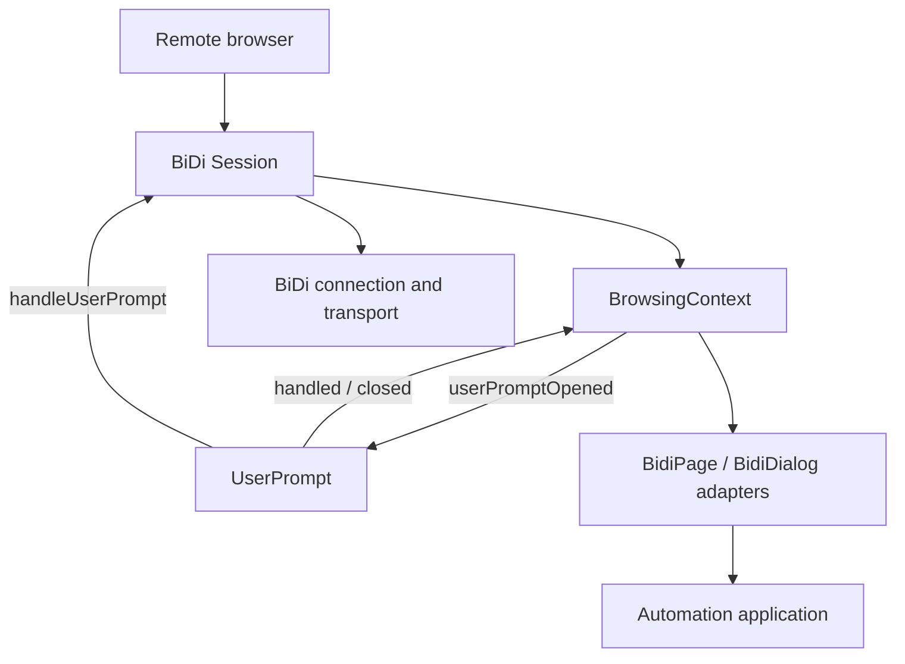
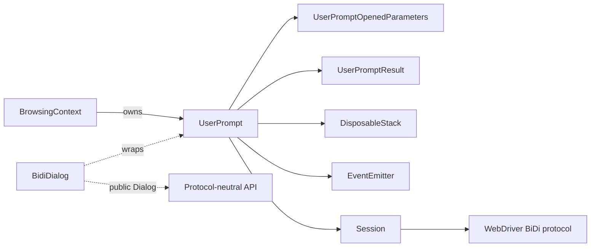
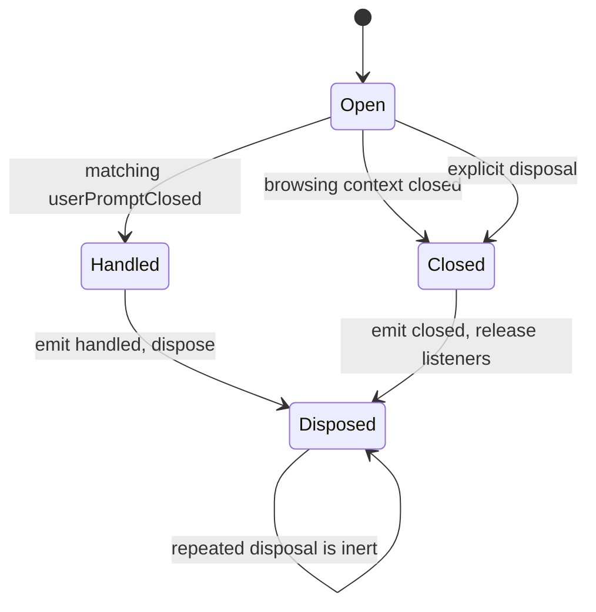
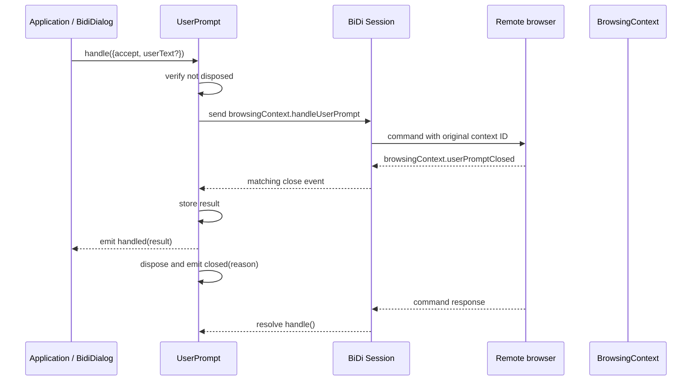
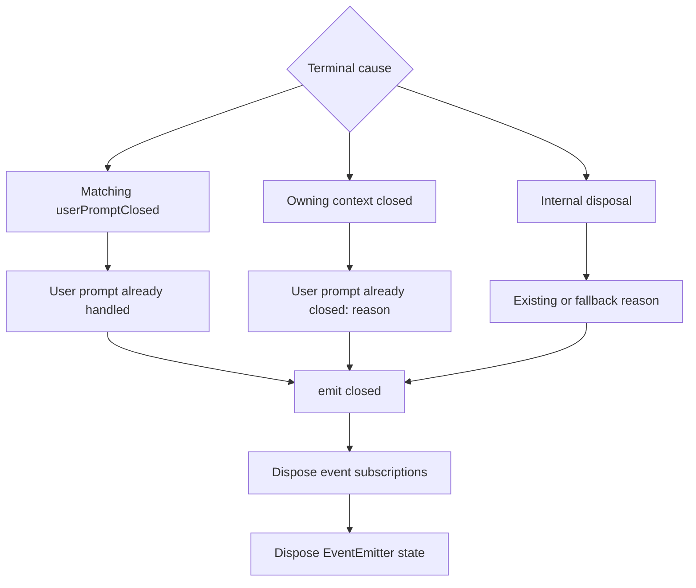

# WebDriver BiDi Core User Prompts

## Introduction

`bidi_core_user_prompts` is Puppeteer’s internal lifecycle object for a WebDriver BiDi user prompt (`alert`, `confirm`, or `prompt`). It is created from a `browsingContext.userPromptOpened` event, exposes prompt state and metadata, sends `browsingContext.handleUserPrompt` commands, and converts the corresponding close event into typed local events.

The module owns one prompt instance and its event subscriptions. Browsing-context discovery and event routing are documented in [BiDi Core Session and Context Model](bidi_core_session_and_context_model.md); the public `Dialog` adapter is documented in [BiDi Input and Dialog](bidi_input_and_dialog.md).

## Position in the system



`UserPrompt` is a core protocol model object rather than a public Puppeteer API. `BrowsingContext` constructs it when a prompt-opened event matches the context, while `BidiDialog` wraps it for application code. The object retains its originating `BrowsingContext`, so every command is scoped to the prompt’s context ID.

## Responsibilities and boundaries

| Concern | Owner |
| --- | --- |
| Represent one opened prompt and its BiDi metadata | `UserPrompt` |
| Send prompt-resolution commands | `UserPrompt.handle()` through the owning session |
| Detect prompt completion | `UserPrompt` listening for `browsingContext.userPromptClosed` |
| Detect context/session shutdown | `UserPrompt` listening for the owning context’s `closed` event |
| Discover prompts and emit context-level prompt events | `BrowsingContext` |
| Expose `accept()` / `dismiss()` and prompt properties publicly | `BidiDialog` |
| Deliver commands/events over WebSocket or pipe | [BiDi Transport and CDP Bridge](bidi_transport_and_cdp_bridge.md) |

The core object does not create browsing contexts, manage browser connections, or implement page-level dialog delivery. Those responsibilities remain in the linked modules.

## Architecture



### `UserPrompt.from()` and construction

`UserPrompt.from(browsingContext, info)` is the sole factory. It constructs the prompt and immediately calls the private initializer. The constructor stores:

- `browsingContext`: the owning context used for lifecycle and command routing.
- `info`: the complete `browsingContext.userPromptOpened` payload, including `context`, `type`, `message`, `defaultValue`, and `handler` as supplied by the protocol.
- `#reason`: the local disposal reason, initially unset.
- `#result`: the close-event payload, initially unset.

The factory pattern ensures that a returned prompt is already subscribed to lifecycle and completion events.

### Type projections

`HandleOptions` is the BiDi `handleUserPrompt` parameter type with `context` removed. Callers provide only command options such as acceptance and user text; `UserPrompt` injects the context automatically.

`UserPromptResult` is the BiDi `userPromptClosed` parameter type with `context` removed at the type level. The implementation currently stores and emits the received protocol payload, including the context field at runtime, while callers use the narrowed internal result type.

## Event and lifecycle model

During initialization, the prompt registers two disposable subscriptions:

1. A one-shot listener on the owning browsing context’s `closed` event. If the context disappears first, the prompt is disposed with `User prompt already closed: <reason>`.
2. A session listener for `browsingContext.userPromptClosed`. Events for other context IDs are ignored. A matching event stores the result, emits `handled`, and disposes the prompt.



`closed` and `disposed` are equivalent state queries: both return whether `#reason` has been set. Disposal is guarded by `@inertIfDisposed`, so a late context-close event or repeated cleanup cannot run the disposal sequence twice.

### State accessors

| Accessor | Meaning |
| --- | --- |
| `closed` | `true` after the prompt has been resolved, its context has closed, or it has otherwise been disposed. |
| `disposed` | Alias for `closed`, matching the common disposable-object contract. |
| `handled` | `true` when the opened-event handler was already `accept` or `dismiss`, or after a matching close result has been received. |
| `result` | The stored `UserPromptResult`, or `undefined` until the matching close event arrives. |

The `handled` check for `Accept` and `Dismiss` is based on the prompt’s initial `info.handler`. This supports prompts that the browser configured for automatic handling. For prompts requiring explicit handling, `handled` becomes true only after the close event is observed.

## Handling a prompt

`handle(options = {})` is the only command operation. It is protected by `@throwIfDisposed`; calling it after disposal rejects with the stored disposal reason.

The method sends:

```text
browsingContext.handleUserPrompt({ ...options, context: info.context })
```

The context from the original open event is always injected, and therefore cannot be accidentally redirected to another browsing context. The method awaits the protocol command and returns `#result`. The implementation relies on the protocol event ordering documented by the code: the `handled` event is expected to be processed before the command promise resolves, so `#result` is available when the method returns.



The public adapter maps `Dialog.accept(text?)` and `Dialog.dismiss()` onto this operation. See [BiDi Input and Dialog](bidi_input_and_dialog.md) for public dialog semantics and page event delivery.

## Data flow and event filtering

```mermaid
flowchart LR
    Open[context.userPromptOpened] --> Create[UserPrompt.from]
    Create --> Subscribe[Install context and session listeners]
    Subscribe --> Await[Await close or context shutdown]
    Await --> Filter{event context == prompt context?}
    Filter -->|no| Await
    Filter -->|yes| Store[Store result]
    Store --> EmitHandled[Emit handled]
    EmitHandled --> Dispose[Dispose prompt]
    Dispose --> EmitClosed[Emit closed with reason]
    API[accept / dismiss] --> Command[handle(options)]
    Command --> Send[Session.send(handleUserPrompt)]
    Send --> Browser[Remote browser]
```

The context-ID filter is important because the session event emitter is shared by all browsing contexts. A prompt processes only the close event whose `parameters.context` equals `browsingContext.id`; unrelated prompts remain untouched.

## Disposal and resource ownership

The private `DisposableStack` owns the event-emitter wrappers created during initialization. `UserPrompt[disposeSymbol]()` performs the following operations:

1. Supplies a fallback reason if none exists: the prompt was probably closed because its browsing context was destroyed.
2. Emits `closed` with the final reason.
3. Disposes the stack, removing context and session listeners.
4. Calls the base `EventEmitter` disposal implementation.

This ordering guarantees that observers receive a final `closed` notification while the prompt still has its own state, and that listeners are removed afterward. Since successful handling also disposes the prompt, `closed` is a general terminal-state event, not an indication that the user dismissed the prompt.



## Failure modes and implementation notes

- Calling `handle()` after the prompt has closed rejects through `@throwIfDisposed`.
- A context closing before prompt resolution causes local disposal; the remote prompt is no longer actionable through this object.
- A close event for another browsing context is ignored.
- `handle()` returns the cached result rather than the raw command response. Correctness depends on the BiDi close event being delivered before the command promise resolves, as assumed by the implementation.
- `handled` can be true immediately for prompts configured with automatic `accept` or `dismiss` handlers, even before `result` is populated.
- `closed` is emitted for both successful handling and abnormal/context-driven closure; consumers should inspect the accompanying reason and `result` rather than infer the outcome from `closed` alone.
- The class is marked `@internal`; applications should use the public `Dialog` abstraction rather than instantiate or depend on `UserPrompt` directly.

## Related documentation

- Core ownership, event routing, and context disposal: [BiDi Core Session and Context Model](bidi_core_session_and_context_model.md)
- Public prompt handling and `BidiDialog`: [BiDi Input and Dialog](bidi_input_and_dialog.md)
- Public dialog contract: [Input and Dialog API](input_and_dialog_api.md)
- BiDi page/frame event translation: [BiDi Page and Frame](bidi_page_and_frame.md)
- Command/event transport: [BiDi Transport and CDP Bridge](bidi_transport_and_cdp_bridge.md)
