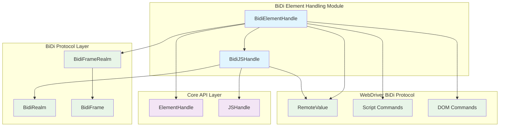
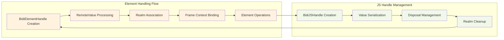
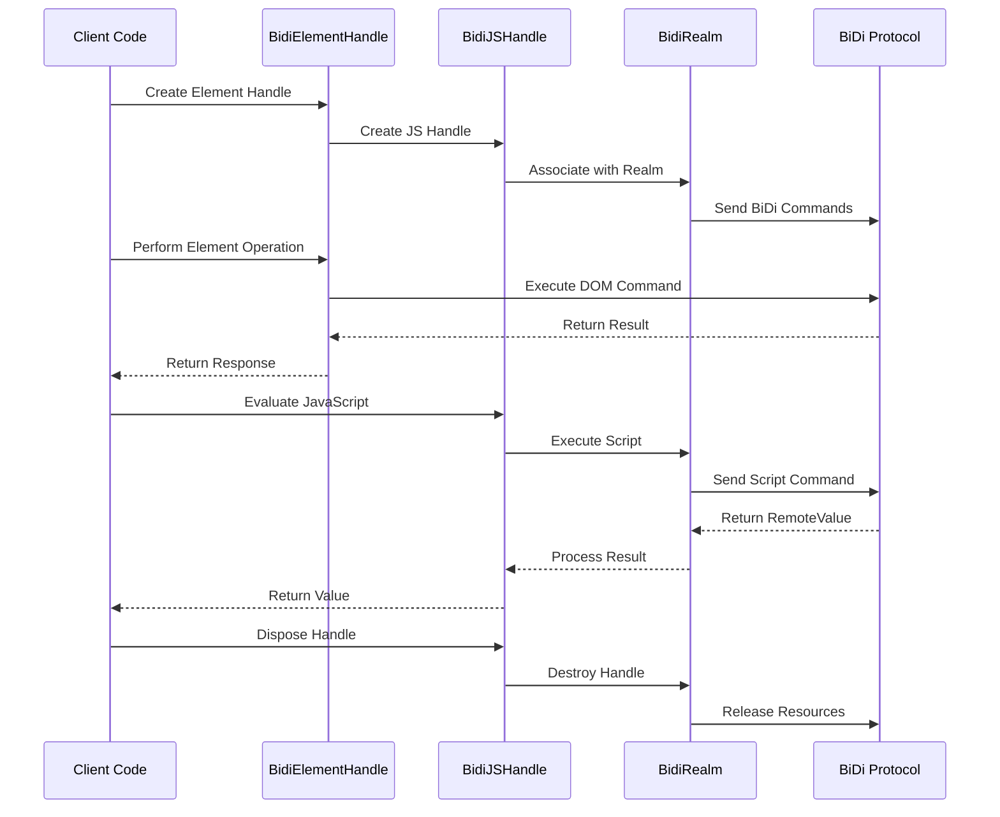

# BiDi Element Handling Module

## Overview

The BiDi Element Handling module provides WebDriver BiDi protocol implementations for DOM element manipulation and JavaScript object handling within the Puppeteer framework. This module serves as the BiDi-specific implementation layer for element interactions, offering an alternative to the Chrome DevTools Protocol (CDP) approach while maintaining API compatibility with Puppeteer's core element handling interfaces.

## Core Components

### BidiElementHandle
The `BidiElementHandle` class extends Puppeteer's base `ElementHandle` to provide BiDi-specific DOM element manipulation capabilities. It serves as the primary interface for interacting with DOM elements through the WebDriver BiDi protocol.

### BidiJSHandle
The `BidiJSHandle` class extends the base `JSHandle` to provide BiDi-specific JavaScript object handling, managing remote JavaScript values and their lifecycle within the BiDi protocol context.

## Architecture



## Component Relationships



## Key Features

### Element Manipulation
- **DOM Element Access**: Direct manipulation of DOM elements through WebDriver BiDi protocol
- **Content Frame Navigation**: Support for iframe and frame element content access
- **File Upload Handling**: Specialized support for file input elements
- **Accessibility Tree Querying**: Integration with accessibility APIs for element discovery

### JavaScript Object Management
- **Remote Value Handling**: Management of JavaScript objects across the protocol boundary
- **Primitive Value Support**: Efficient handling of primitive JavaScript types
- **Object Lifecycle Management**: Proper disposal and cleanup of remote references
- **Serialization Support**: JSON serialization of JavaScript values

### Protocol Integration
- **BiDi Protocol Compliance**: Full compliance with WebDriver BiDi specification
- **CDP Fallback Support**: Graceful fallback to CDP for unsupported operations
- **Error Handling**: Comprehensive error handling for unsupported operations

## Data Flow



## Integration Points

### Core API Integration
The module integrates with Puppeteer's [core_api](core_api.md) module by extending the base `ElementHandle` and `JSHandle` classes, ensuring API compatibility while providing BiDi-specific implementations.

### BiDi Implementation Layer
This module is part of the broader [bidi_implementation](bidi_implementation.md) ecosystem, working closely with:
- **BiDi Page Interaction**: Integration with [bidi_page_interaction](bidi_page_interaction.md) for page-level operations
- **BiDi Browser Management**: Coordination with [bidi_browser_management](bidi_browser_management.md) for browser context
- **BiDi Connection Layer**: Communication through [bidi_connection_layer](bidi_connection_layer.md)

### Protocol Layer
The module communicates with the [bidi_core](bidi_core.md) components for low-level protocol operations and realm management.

## Usage Patterns

### Element Handle Creation
```typescript
// Element handles are typically created through frame operations
const elementHandle = BidiElementHandle.from(remoteValue, realm);

// Access element properties
const frame = elementHandle.frame;
const remoteValue = elementHandle.remoteValue();
```

### JavaScript Object Handling
```typescript
// JS handles manage remote JavaScript objects
const jsHandle = BidiJSHandle.from(remoteValue, realm);

// Evaluate JavaScript expressions
const result = await jsHandle.evaluate(obj => obj.property);

// Proper disposal
await jsHandle.dispose();
```

### File Upload Operations
```typescript
// Upload files to input elements
await elementHandle.uploadFile('/path/to/file1.txt', '/path/to/file2.txt');
```

### Accessibility Integration
```typescript
// Query accessibility tree
for await (const element of elementHandle.queryAXTree('button', 'submit')) {
  // Process accessible elements
}
```

## Error Handling

The module implements comprehensive error handling for BiDi-specific scenarios:

- **UnsupportedOperation**: Thrown when operations require CDP support but BiDi is being used
- **Disposal Checks**: Automatic validation of handle disposal state
- **Protocol Errors**: Proper propagation of WebDriver BiDi protocol errors

## Performance Considerations

### Memory Management
- Automatic cleanup of remote object references
- Efficient primitive value handling
- Proper disposal patterns to prevent memory leaks

### Protocol Efficiency
- Minimal protocol round-trips for common operations
- Batch operations where possible
- Lazy evaluation of expensive properties

## Dependencies

The module depends on several key components:
- **WebDriver BiDi Protocol**: Core protocol implementation
- **Realm Management**: For execution context handling
- **Frame Management**: For DOM context association
- **Serialization**: For value conversion between JavaScript and protocol

## Future Considerations

- Enhanced accessibility API integration
- Performance optimizations for large DOM trees
- Extended file handling capabilities
- Improved error reporting and debugging support

This module represents a critical component in Puppeteer's WebDriver BiDi implementation, providing the foundation for all DOM element interactions while maintaining compatibility with existing Puppeteer APIs.