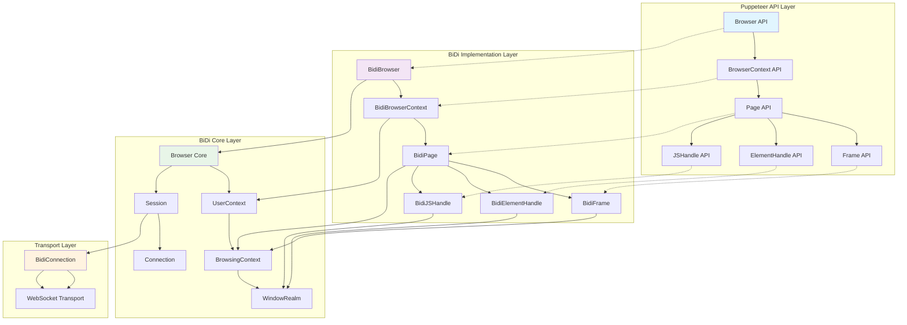
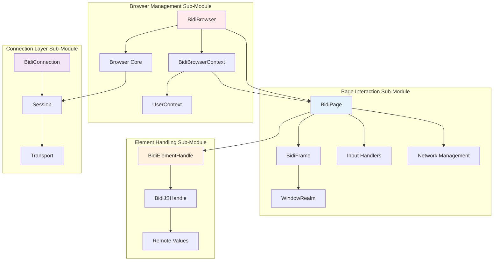
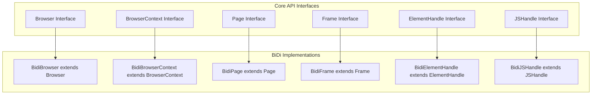
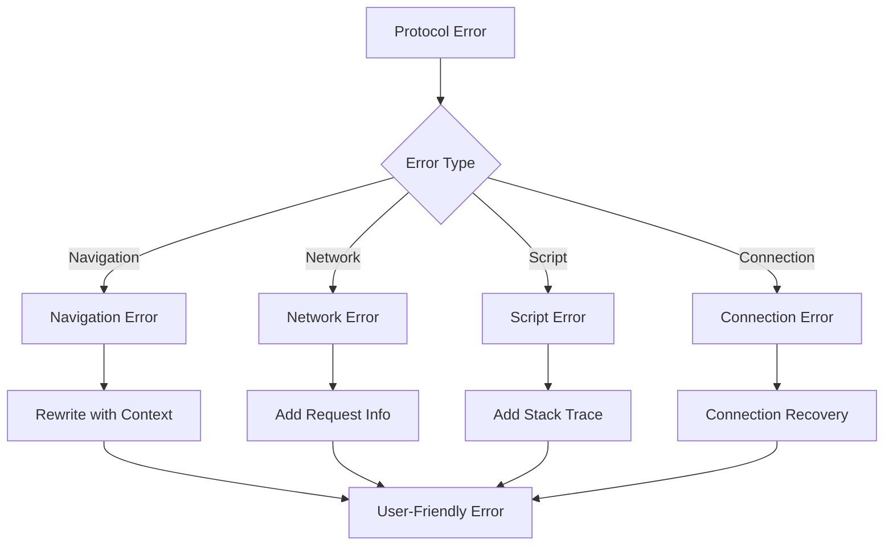
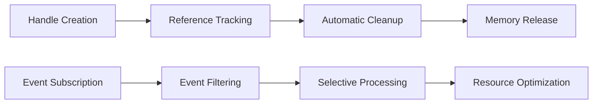

# BiDi Implementation Module

## Overview

The `bidi_implementation` module provides a comprehensive WebDriver BiDi protocol implementation for Puppeteer. This module serves as the primary interface layer that bridges Puppeteer's high-level API with the WebDriver BiDi protocol, enabling cross-browser automation through a standardized protocol.

## Purpose

The BiDi (Bidirectional) implementation module enables:

- **Cross-browser compatibility** through the WebDriver BiDi standard protocol
- **Modern browser automation** with support for advanced features like network interception, real-time events, and multi-context management
- **Protocol abstraction** that provides a consistent API regardless of the underlying browser implementation
- **Enhanced debugging capabilities** with bidirectional communication between the automation script and browser

## Architecture Overview

The BiDi implementation follows a layered architecture that maps Puppeteer's API concepts to WebDriver BiDi protocol primitives:



## Core Components

The BiDi implementation is organized into four main sub-modules, each handling specific aspects of the WebDriver BiDi protocol:

### Sub-Module Overview

| Sub-Module | Components | Purpose |
|------------|------------|---------|
| **[Browser Management](bidi_browser_management.md)** | BidiBrowser, BidiBrowserContext | High-level browser and context lifecycle management |
| **[Connection Layer](bidi_connection_layer.md)** | BidiConnection | Protocol communication and message handling |
| **[Element Handling](bidi_element_handling.md)** | BidiElementHandle, BidiJSHandle | DOM element and JavaScript object interaction |
| **[Page Interaction](bidi_page_interaction.md)** | BidiPage, BidiFrame | Page navigation, content manipulation, and frame management |

### Core Protocol Components

The BiDi implementation leverages several core components from the [bidi_core](bidi_core.md) module:

- **Browser Core**: Manages browser-level operations and user contexts
- **Session**: Handles protocol session lifecycle and command routing  
- **BrowsingContext**: Represents individual browsing contexts (tabs/frames)
- **WindowRealm**: Manages JavaScript execution environments
- **Connection Interface**: Defines the communication contract

## Component Relationships

The BiDi implementation follows a hierarchical structure where each sub-module builds upon lower-level components:



### Inter-Module Dependencies

- **Browser Management** → **Page Interaction**: Browser contexts create and manage pages
- **Page Interaction** → **Element Handling**: Pages contain and interact with elements
- **All Modules** → **Connection Layer**: All components use the connection for protocol communication
- **Browser Management** → **BiDi Core**: Leverages core browser and session management

## Key Features

### 1. Protocol Abstraction
- Seamless mapping between Puppeteer API and WebDriver BiDi protocol
- Automatic handling of protocol-specific data serialization/deserialization
- Error translation and enhanced error reporting

### 2. Event-Driven Architecture
- Real-time event propagation from browser to automation script
- Support for navigation, network, console, and user interaction events
- Efficient event filtering and routing

### 3. Multi-Context Support
- Isolated browsing contexts with independent cookies, permissions, and storage
- Cross-context communication and coordination
- Context lifecycle management

### 4. Advanced Network Features
- Request/response interception and modification
- Network condition emulation
- Cookie and authentication management
- Cache control

### 5. Modern Browser Capabilities
- Screenshot and PDF generation with advanced options
- Accessibility tree querying
- File upload handling
- Geolocation and timezone emulation

## Integration Points

### With Core API Module
The BiDi implementation extends and implements interfaces from the [core_api](core_api.md) module:



### With CDP Implementation
For browsers that support both protocols, the BiDi implementation can leverage CDP features:

- **Hybrid Mode**: Uses BiDi for standard operations and CDP for advanced features
- **Feature Detection**: Automatically detects available protocol capabilities
- **Graceful Fallback**: Falls back to BiDi-only mode when CDP is unavailable

### With Transport Layer
The implementation utilizes the [transport_layer](transport_layer.md) for communication:

- **WebSocket Transport**: Primary communication channel for BiDi protocol
- **Connection Management**: Handles connection lifecycle and reconnection
- **Message Routing**: Distributes protocol messages to appropriate handlers

## Error Handling

The BiDi implementation provides comprehensive error handling:



### Error Categories

1. **Protocol Errors**: Invalid commands or parameters
2. **Navigation Errors**: Failed page loads or timeouts
3. **Network Errors**: Request failures or interception issues
4. **Script Errors**: JavaScript execution failures
5. **Connection Errors**: WebSocket disconnections or timeouts

## Performance Considerations

### Optimization Strategies

1. **Event Filtering**: Only subscribe to necessary events to reduce overhead
2. **Handle Management**: Automatic cleanup of JavaScript object references
3. **Connection Pooling**: Efficient reuse of protocol connections
4. **Lazy Initialization**: Defer resource creation until needed

### Memory Management



## Usage Patterns

### Basic Browser Automation
Using the [Browser Management](bidi_browser_management.md) sub-module:

```typescript
// Create BiDi browser instance
const browser = await BidiBrowser.create(options);
const context = await browser.createBrowserContext();
const page = await context.newPage();

// Navigate and interact
await page.goto('https://example.com');
const element = await page.$('button');
await element.click();
```

### Advanced Network Interception
Leveraging [Page Interaction](bidi_page_interaction.md) capabilities:

```typescript
// Enable request interception
await page.setRequestInterception(true);

page.on('request', async request => {
  // Modify or block requests
  await request.continue({
    headers: {...request.headers(), 'Custom-Header': 'value'}
  });
});
```

### Element Manipulation
Using [Element Handling](bidi_element_handling.md) features:

```typescript
// Find and interact with elements
const element = await page.$('input[type="file"]');
await element.uploadFile('/path/to/file.txt');

// Query accessibility tree
const accessibleElements = page.queryAXTree('button', 'submit');
for await (const element of accessibleElements) {
  await element.click();
}
```

### Multi-Context Operations
Advanced [Browser Management](bidi_browser_management.md) scenarios:

```typescript
// Create isolated contexts
const context1 = await browser.createBrowserContext();
const context2 = await browser.createBrowserContext();

// Independent operations
const page1 = await context1.newPage();
const page2 = await context2.newPage();

// Different cookies, permissions, etc.
await context1.setCookie({name: 'session', value: 'user1'});
await context2.setCookie({name: 'session', value: 'user2'});
```

## Future Enhancements

### Planned Features

1. **Enhanced Debugging**: Improved protocol debugging and inspection tools
2. **Performance Metrics**: Built-in performance monitoring and reporting
3. **Advanced Emulation**: Extended device and network emulation capabilities
4. **Protocol Extensions**: Support for emerging WebDriver BiDi features

### Compatibility Roadmap

- **Firefox Support**: Full feature parity with Firefox WebDriver BiDi implementation
- **Safari Support**: Integration with Safari's WebDriver BiDi when available
- **Edge Support**: Enhanced compatibility with Microsoft Edge

## Related Documentation

### Sub-Module Documentation
- [Browser Management](bidi_browser_management.md) - Browser and context lifecycle management
- [Connection Layer](bidi_connection_layer.md) - Protocol communication infrastructure  
- [Element Handling](bidi_element_handling.md) - DOM element and JavaScript object interaction
- [Page Interaction](bidi_page_interaction.md) - Page navigation and content manipulation

### Related Modules
- [Core API Module](core_api.md) - Base interfaces and contracts
- [BiDi Core Module](bidi_core.md) - Core protocol implementation
- [CDP Implementation](cdp_implementation.md) - Chrome DevTools Protocol implementation
- [Transport Layer](transport_layer.md) - Communication infrastructure
- [Network Handling](network_handling.md) - Network-related functionality
- [Input and Interaction](input_and_interaction.md) - User input simulation

## Conclusion

The BiDi implementation module represents a modern, standards-based approach to browser automation. By implementing the WebDriver BiDi protocol, it provides a robust foundation for cross-browser automation while maintaining the familiar Puppeteer API. The modular architecture ensures maintainability and extensibility, while the comprehensive feature set supports both basic and advanced automation scenarios.