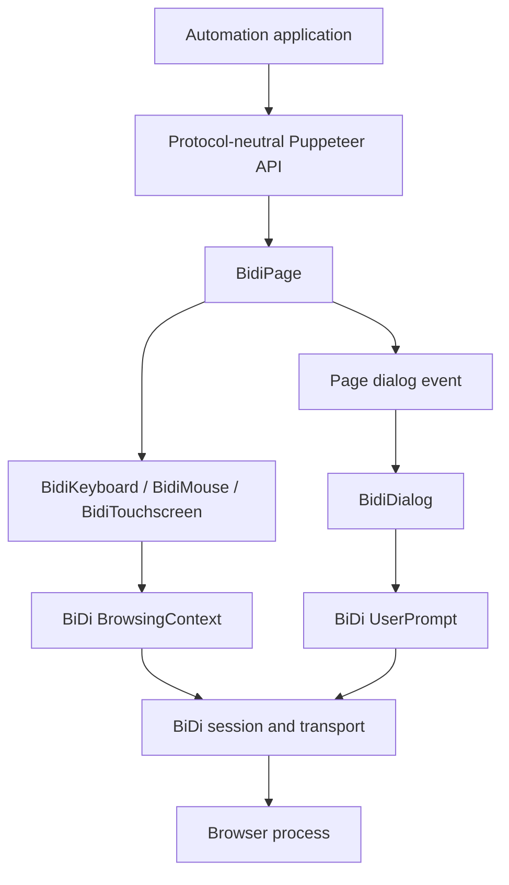
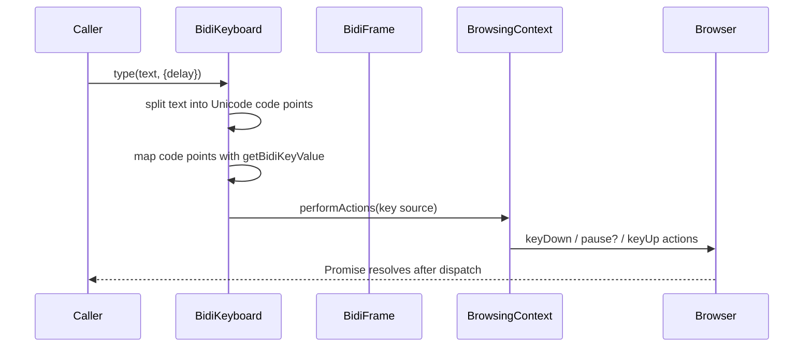
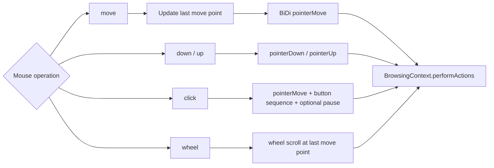
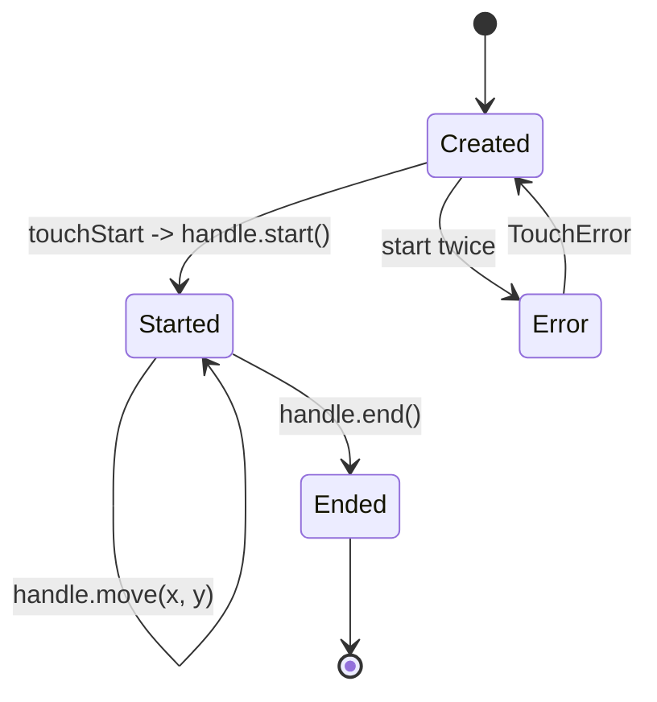
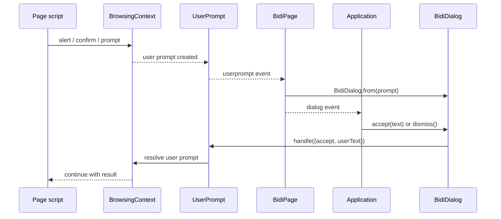
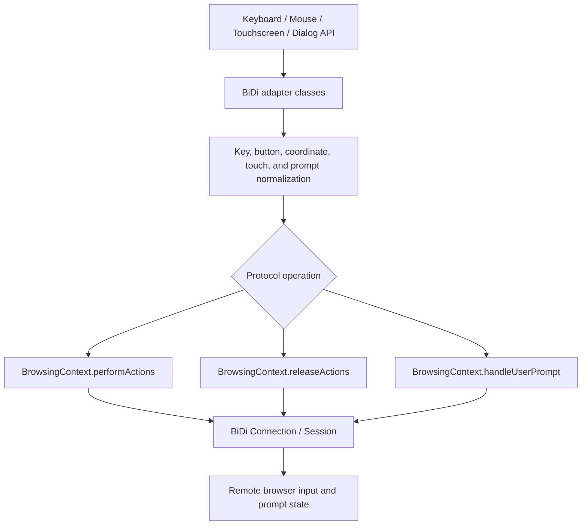
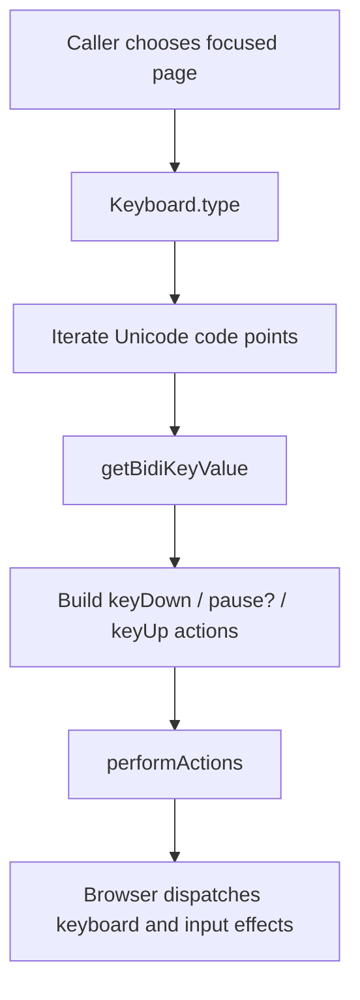

# BiDi Input and Dialog

## Introduction

The `bidi_input_and_dialog` module is Puppeteer’s WebDriver BiDi implementation for page input devices and JavaScript user prompts. It adapts the public `Keyboard`, `Mouse`, `Touchscreen`, `TouchHandle`, and `Dialog` contracts to BiDi `BrowsingContext.performActions`, `releaseActions`, and `handleUserPrompt` operations.

The module is intentionally narrow: page ownership and event aggregation belong to [BiDi Page and Frame](bidi_page_and_frame.md), the public behavior is defined by [Input and Dialog API](input_and_dialog_api.md), and protocol objects such as `BrowsingContext` and `UserPrompt` are consumed through the BiDi page/frame and transport layers.

## Position in the system



`BidiPage` constructs the input devices with a page reference. Each device resolves the page’s main frame and sends actions through its `browsingContext`. Dialog instances are created from BiDi user-prompt notifications and retain the originating `UserPrompt` until the application accepts or dismisses it.

## Architecture

```mermaid
graph LR
    Page[BidiPage] --> K[BidiKeyboard]
    Page --> M[BidiMouse]
    Page --> T[BidiTouchscreen]
    Page --> D[BidiDialog]
    K -. implements .-> Keyboard[Keyboard API]
    M -. implements .-> MouseAPI[Mouse API]
    T -. implements .-> Touchscreen API
    D -. implements .-> Dialog API
    K --> PA[performActions: key source]
    M --> PA2[performActions: pointer / wheel source]
    T --> PA3[performActions: touch pointer source]
    D --> HP[BrowsingContext.handleUserPrompt]
```

### Components

| Component | Responsibility |
| --- | --- |
| `BidiKeyboard` | Converts Puppeteer key names and text into BiDi key actions, then dispatches them through the main browsing context. |
| `BidiMouse` | Tracks the last pointer position and translates movement, buttons, clicks, and wheel scrolling into BiDi pointer or wheel sources. |
| `BidiTouchscreen` | Creates independent touch pointer sources and tracks active `BidiTouchHandle` instances. |
| `BidiTouchHandle` | Owns one touch contact from start through movement to pointer-up completion. |
| `BidiDialog` | Exposes prompt metadata through the public `Dialog` abstraction and delegates resolution to `UserPrompt.handle`. |

## Keyboard implementation

`BidiKeyboard` uses one stable BiDi key source, `__puppeteer_keyboard`. The private `getBidiKeyValue()` conversion performs three important translations:

- Newline and carriage return are normalized to `Enter`.
- A single Unicode code point is sent directly, avoiding UTF-16 surrogate splitting.
- Puppeteer names for editing keys, modifiers, function keys, numpad keys, and `KeyA`-style identifiers are mapped to WebDriver Unicode key values or printable characters.

Unknown multi-character key names throw an error rather than producing an invalid protocol action.



`down()` emits one `keyDown`; `up()` emits one `keyUp`; `press()` composes key-down and key-up with an optional pause. `type()` emits a down/up pair per code point, inserting a pause between them when requested. The current BiDi implementation does not use the protocol-neutral key options passed to `down()`.

`sendCharacter()` is different from physical key input. It validates that the argument contains at most one code point, obtains the focused frame, and evaluates `document.execCommand('insertText', false, char)` in that frame’s isolated realm. This preserves direct text insertion semantics without synthesizing modifier state.

## Mouse implementation

`BidiMouse` uses the stable pointer source `__puppeteer_mouse` and the wheel source `__puppeteer_wheel`. Coordinates are rounded to integer CSS-pixel positions before dispatch.



`move()` can interpolate a path using `steps`; the final action always targets the requested coordinate. `click()` supports button selection, click count, and an optional pause between the final down and up. `wheel()` uses the most recently moved-to point and defaults missing deltas to zero. `reset()` returns the tracked point to `(0, 0)` and calls `releaseActions()` to release protocol-held input state.

The drag methods (`drag`, `dragOver`, `dragEnter`, `drop`, and `dragAndDrop`) throw `UnsupportedOperation`. This is an explicit capability boundary: callers must not assume the BiDi adapter can reproduce the richer drag payload behavior available in other backends.

Mouse buttons map to BiDi numeric button codes: left `0`, middle `1`, right `2`, back `3`, and forward `4`.

## Touchscreen and touch handles

Each `touchStart()` allocates a unique internal source ID using the inherited touch ID generator. The ID is composed as `__puppeteer_finger_<id>`, and the source declares `pointerType: touch`.



Starting a touch sends a pointer move followed by pointer down, with touch geometry and pressure properties (`width`, `height`, `pressure`, and `altitudeAngle`). Moving sends a pointer move for the same source. Ending sends pointer up and removes the handle from `BidiTouchscreen.touches`.

`BidiTouchHandle` rejects a second `start()` with `TouchError('Touch has already started')`. The shared `Touchscreen` contract supplies higher-level `tap()`, `touchMove()`, and `touchEnd()` behavior; see [Input and Dialog API](input_and_dialog_api.md) for those lifecycle rules.

## Dialog handling

`BidiDialog.from(prompt)` wraps a core `UserPrompt`. Its constructor copies the prompt type, message, default value, and current handled state into the public `Dialog` base class.



`BidiDialog.handle()` passes `accept` and the optional text as `userText` to `UserPrompt.handle`. The public base class enforces the single-resolution rule; therefore a caller should inspect dialog metadata and resolve each dialog exactly once. Dialog event delivery and page-level listener behavior are documented in [BiDi Page](bidi_page_and_frame_page.md) and the protocol-neutral [Input and Dialog API](input_and_dialog_api.md).

## Data flow and protocol boundaries



The module does not directly manage transport connections, session callbacks, browsing-context discovery, or page lifecycle. Those concerns are delegated as follows:

- [BiDi Transport and CDP Bridge](bidi_transport_and_cdp_bridge.md) and [Protocol Transport and Sessions](protocol_transport_and_sessions.md) deliver commands and events.
- [BiDi Page and Frame](bidi_page_and_frame.md) supplies the main/focused frame and translates prompt events.
- [BiDi Browser and Context](bidi_browser_and_context.md) owns browser/user-context/page creation and lifetime.
- [BiDi Network](bidi_network.md) and [BiDi Script and Handles](bidi_script_and_handles.md) contain adjacent network and script/handle adapters.
- [CDP Input and Emulation](input_and_emulation.md) documents the parallel CDP implementation.

## Operational flows

### Keyboard text entry



### Multi-touch gesture

```mermaid
flowchart TD
    Start[touchStart(x, y)] --> Source[Create touch pointer source]
    Source --> Down[PointerMove + PointerDown]
    Down --> Handle[Return TouchHandle]
    Handle --> Move[TouchHandle.move]
    Move --> Handle
    Handle --> End[TouchHandle.end]
    End --> Up[PointerUp and remove handle]
```

### Prompt resolution

```mermaid
flowchart TD
    Prompt[BiDi userprompt event] --> Wrap[Create BidiDialog]
    Wrap --> Emit[Emit Page dialog event]
    Emit --> Inspect[Read type, message, defaultValue]
    Inspect --> Decision{Application decision}
    Decision --> Accept[accept(text?)]
    Decision --> Dismiss[dismiss()]
    Accept --> Handle[UserPrompt.handle accept=true]
    Dismiss --> Handle2[UserPrompt.handle accept=false]
    Handle --> Resume[Page script resumes]
    Handle2 --> Resume
```

## Failure modes and implementation notes

- Invalid key names fail during key conversion with `Unknown key`.
- `sendCharacter()` rejects strings containing more than one Unicode code point.
- Re-starting a touch fails with `TouchError`.
- Unsupported drag operations fail synchronously with `UnsupportedOperation`.
- Commands can reject when the page, browsing context, session, or transport has already been disposed; lifecycle ownership is outside this module.
- A dialog must be accepted or dismissed. Leaving it unresolved can keep the page’s JavaScript execution blocked.
- Internal source IDs, touch geometry defaults, and coordinate rounding are implementation details and should not be treated as public compatibility guarantees.

## Related documentation

- Public behavior and shared state rules: [Input and Dialog API](input_and_dialog_api.md)
- Page construction, input-device ownership, and dialog events: [BiDi Page](bidi_page_and_frame_page.md)
- Frame and focused-frame behavior: [BiDi Frame](bidi_page_and_frame_frame.md)
- Core-object integration and lifecycle: [BiDi Page and Frame](bidi_page_and_frame.md)
- BiDi command transport: [BiDi Transport and CDP Bridge](bidi_transport_and_cdp_bridge.md)
- Parallel CDP implementation: [CDP Backend Automation Implementation](cdp_backend_automation_implementation.md)
