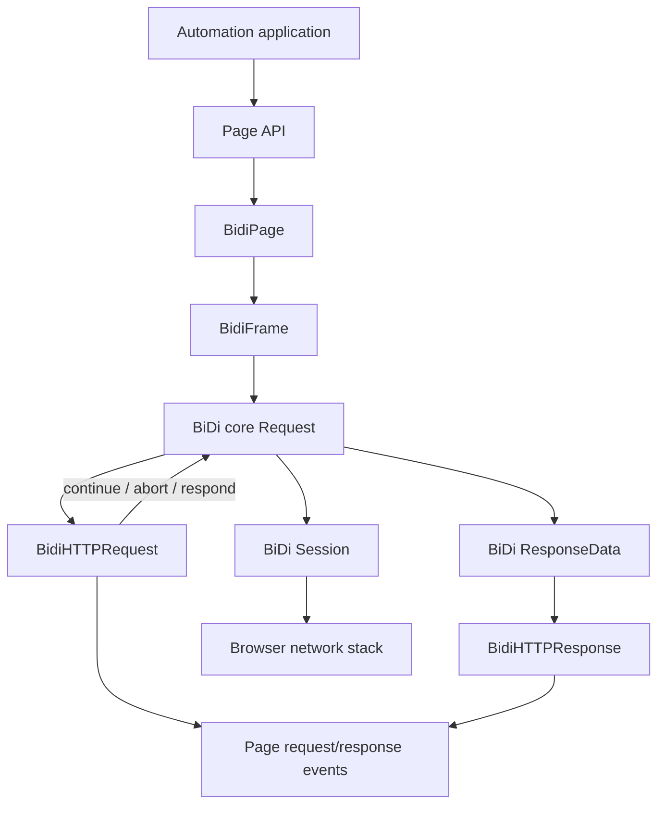
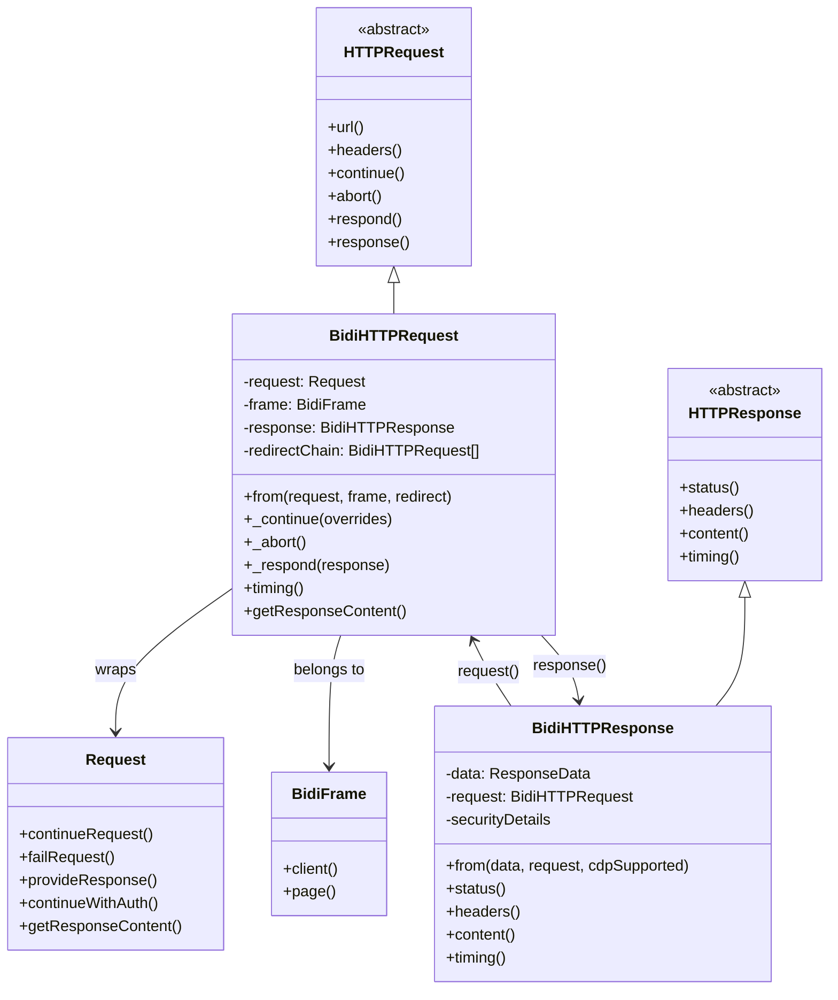
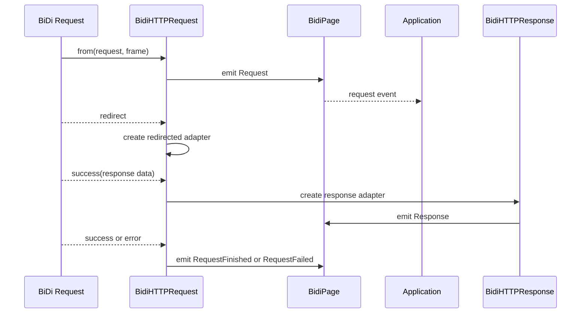
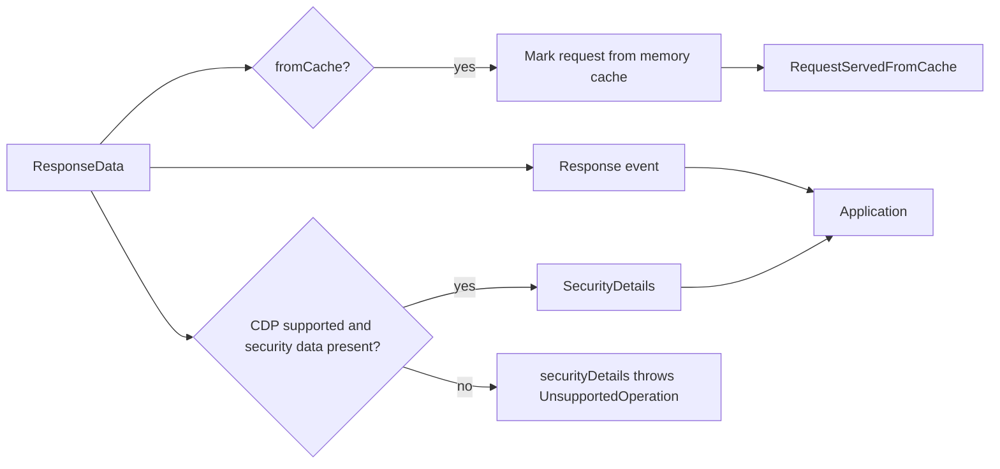
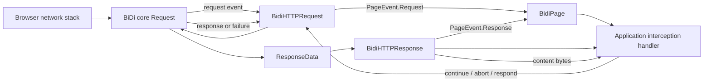
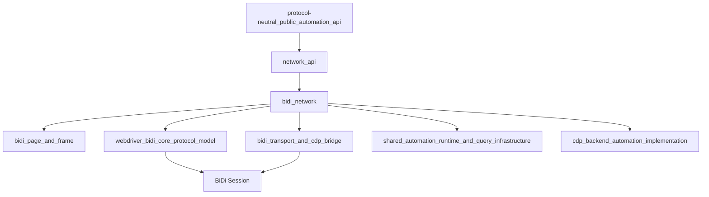

# BiDi Network

## Introduction

The `bidi_network` module adapts WebDriver BiDi network protocol objects to Puppeteer’s protocol-neutral `HTTPRequest` and `HTTPResponse` APIs. It is the network boundary for BiDi-backed pages: incoming BiDi `Request` and `ResponseData` objects become the objects exposed through page request/response events, while interception decisions are translated back into BiDi commands.

The module contains two tightly coupled adapters:

- `BidiHTTPRequest` represents an outgoing request, its headers and metadata, interception state, redirects, authentication, and eventual response.
- `BidiHTTPResponse` represents the successful response associated with a request, including status, headers, cache state, timing, security details, and body content.

The public contracts, event semantics, and general interception rules are defined in [Network API](network_api.md). BiDi page/frame lifecycle and event subscription are described in [BiDi Page and Frame](bidi_page_and_frame.md); this document focuses on the adapter-specific behavior.

## Position in the system



`BidiFrame` is the adapter’s page/frame context. It supplies the `CDPSession` escape hatch when CDP is supported, emits Puppeteer `PageEvent` notifications through its page, and owns the underlying BiDi request object. The underlying protocol session and optional BiDi-over-CDP bridge are described in [BiDi transport and CDP bridge](bidi_transport_and_cdp_bridge.md).

## Architecture



The `requests` `WeakMap` associates each core BiDi `Request` with its Puppeteer adapter. The map avoids duplicating adapters for the same protocol object and does not keep finished requests alive indefinitely. `BidiHTTPRequest.from()` constructs and initializes the adapter; `BidiHTTPResponse.from()` does the same for response data.

## `BidiHTTPRequest`

### Request metadata

The adapter delegates core request properties directly to the BiDi request where possible:

| Puppeteer method | BiDi source or behavior |
| --- | --- |
| `url()` | `Request.url` |
| `method()` | `Request.method` |
| `headers()` | BiDi headers normalized to lower case, then merged with page extra headers and user-agent headers |
| `resourceType()` | `Request.resourceType`, lower-cased; requires CDP support |
| `postData()` / `hasPostData()` | BiDi request payload metadata; requires CDP support |
| `isNavigationRequest()` | Whether `Request.navigation` is present |
| `initiator()` | BiDi initiator with a default type of `other` |
| `timing()` | `Request.timing()` |
| `frame()` | The owning `BidiFrame` |
| `client()` | The frame’s CDP session, including the BiDi CDP bridge when available |

`headers()` intentionally overlays page-level extra HTTP headers and user-agent headers. This keeps the request view consistent with Puppeteer’s page configuration. If either overlay is present, `continue()` also ensures the merged header set is sent to the browser.

`fetchPostData()` is currently unsupported and throws `UnsupportedOperation`. `resourceType()`, `postData()`, and `hasPostData()` likewise throw when the connected browser does not advertise CDP support, reflecting fields not uniformly exposed by the current BiDi implementation.

### Request lifecycle and event translation



Initialization subscribes to the core request before exposing it to the application. A successful response stores a `BidiHTTPResponse`, which is then available through `response()`. Redirects create a new adapter and append the preceding request to the redirect chain. The redirected request emits `requestfinished` or `requestfailed` after its own interception is finalized.

### Interception operations

The inherited `HTTPRequest` interception machinery selects one final action; `BidiHTTPRequest` implements the protocol-specific operations:

```mermaid
flowchart TD
    Event[BiDi request event] --> State{Interception enabled?}
    State -->|no| Browser[Browser continues normally]
    State -->|yes| Decision[HTTPRequest cooperative resolution]
    Decision --> Continue[continue(overrides)]
    Decision --> Abort[abort()] 
    Decision --> Respond[respond(response)]
    Continue --> Encode[Normalize headers and base64-encode body]
    Encode --> ContinueCmd[Request.continueRequest]
    Abort --> FailCmd[Request.failRequest]
    Respond --> ResponseBody[Convert body to base64 and add content length]
    ResponseBody --> ProvideCmd[Request.provideResponse]
    ContinueCmd --> Browser
    FailCmd --> Browser
    ProvideCmd --> Browser
```

- `_continue()` maps URL, method, POST data, and headers to `continueRequest`. POST bodies are base64 encoded and marked with BiDi’s `base64` body type.
- `_abort()` calls `failRequest()`.
- `_respond()` converts Puppeteer response bodies through `HTTPRequest.getResponse()`, adds a content type when supplied, derives `content-length` when absent, maps the status reason phrase from `STATUS_TEXTS`, and calls `provideResponse()`.

The adapter marks interception handled before sending a protocol command. If continuation or abortion fails, it restores the unhandled state so the inherited interception logic can report or retry appropriately. Response fulfillment preserves the handled state unless the protocol call rejects.

### Authentication

When BiDi emits an authentication challenge, `#handleAuthentication` reads page credentials from `BidiPage`. The first challenge is answered with `continueWithAuth({action: 'provideCredentials'})`; later challenges are cancelled to avoid repeatedly submitting credentials. If credentials are unavailable, the challenge is cancelled immediately.

## `BidiHTTPResponse`

### Response metadata and body access

`BidiHTTPResponse` stores the original `ResponseData` and its originating request. It exposes:

| Puppeteer method | Behavior |
| --- | --- |
| `url()` | Response URL from BiDi |
| `status()` / `statusText()` | BiDi status and reason phrase |
| `headers()` | String-valued response headers, normalized to lower case; binary headers are skipped |
| `request()` / `frame()` | Links back to the request and owning frame |
| `content()` | Retrieves response bytes through `Request.getResponseContent()` |
| `fromCache()` | Returns BiDi `ResponseData.fromCache` |
| `fromServiceWorker()` | Always returns `false` in this implementation |
| `remoteAddress()` | Returns the placeholder `{ip: '', port: -1}` |
| `securityDetails()` | Returns parsed security details only when CDP is supported |

`content()` returns a `Uint8Array`; inherited `buffer()`, `text()`, and `json()` behavior is documented in [Network API](network_api.md). Response headers with non-string BiDi values are currently ignored because binary-header conversion is not implemented.

### Cache, events, and security



During initialization, a cached response marks the originating request and emits `PageEvent.RequestServedFromCache`. Every response emits `PageEvent.Response`. Chromium-specific `goog:securityDetails` data is wrapped in the shared `SecurityDetails` class only when the browser supports CDP; otherwise `securityDetails()` fails explicitly rather than returning incomplete information.

### Timing conversion

BiDi timing is converted to Puppeteer’s CDP-shaped `Protocol.Network.ResourceTiming` result. Available BiDi values populate request, DNS, connection, TLS, send, and receive-header timestamps. Fields with no BiDi equivalent are represented by `-1`, and `timing()` returns the converted object rather than `null` for a live response.

```mermaid
flowchart TD
    RequestTiming[Request.timing()] --> Map[BiDi-to-CDP timing mapper]
    Map --> Available[requestTime, DNS, connect, TLS, send, response timestamps]
    Map --> Missing[Unsupported phases = -1]
    Available --> Timing[HTTPResponse.timing()]
    Missing --> Timing
```

## End-to-end data flow



The normal exchange is therefore bidirectional: protocol events flow upward as stable Puppeteer objects, while interception decisions flow downward as BiDi commands. The page adapter remains responsible for event fan-out; this module is responsible for object identity, field normalization, and protocol operation translation.

## Dependencies and integration points



- [Protocol-neutral public automation API](protocol_neutral_public_automation_api.md) defines the stable interfaces consumed by users.
- [Network API](network_api.md) owns shared interception resolution, body conversion, status helpers, and event semantics.
- [BiDi Page and Frame](bidi_page_and_frame.md) supplies frame ownership and page event emission.
- The BiDi core model supplies `Request`, `ResponseData`, timing, redirect, authentication, and interception commands.
- [BiDi transport and CDP bridge](bidi_transport_and_cdp_bridge.md) supplies the session used by optional CDP access and BiDi-over-CDP operation.
- [CDP backend automation implementation](cdp_backend_automation_implementation.md) is the corresponding backend and provides the comparison point for CDP-only metadata and network behavior.

## Operational considerations

1. Do not assume every request has a response. Failed requests expose `failure()` and emit request-failed events instead.
2. Redirects are separate request adapters. Use `redirectChain()` to inspect the preceding requests.
3. Header values are normalized to lower case. Page-level extra headers and user-agent headers are reflected in the adapter and may be resent during continuation.
4. Binary request/response bodies are represented with base64 at the BiDi command boundary, then exposed as bytes through the Puppeteer API.
5. CDP-dependent fields are capability-gated. Code intended to run against pure BiDi browsers should handle `UnsupportedOperation` for resource type, POST metadata, security details, and unsupported post-data retrieval.
6. Remote address and service-worker provenance are placeholders in the current implementation; callers should not treat them as authoritative on BiDi connections.

## Related documentation

- [Network API](network_api.md) — protocol-neutral request/response contracts and interception semantics.
- [BiDi Page and Frame](bidi_page_and_frame.md) — page/frame ownership and event translation.
- [BiDi Page](bidi_page_and_frame_page.md) — page-level request interception and network configuration.
- [BiDi Frame](bidi_page_and_frame_frame.md) — frame context associated with requests.
- [BiDi transport and CDP bridge](bidi_transport_and_cdp_bridge.md) — command transport and optional CDP sessions.
- [Protocol transport and sessions](protocol_transport_and_sessions.md) — lower-level session routing.
