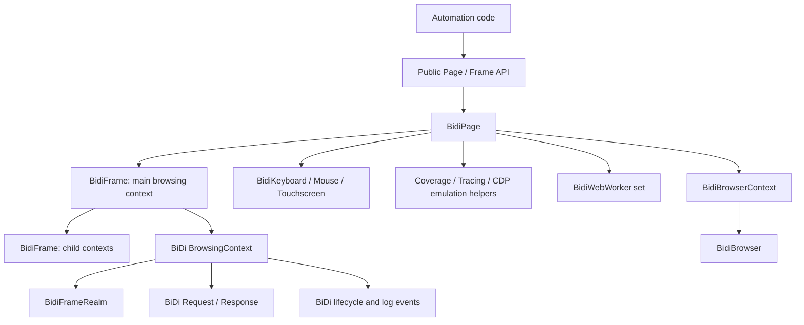
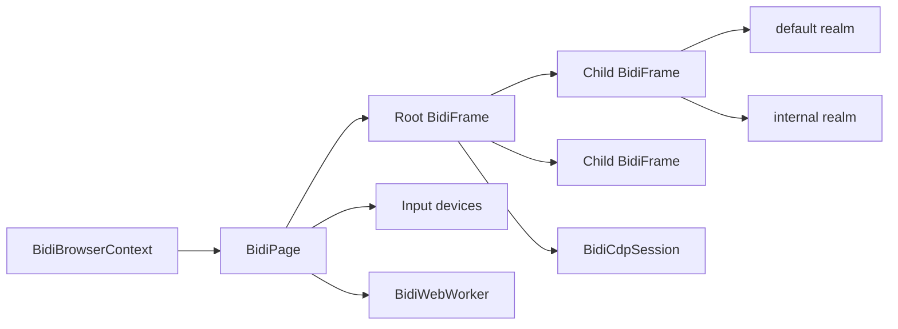
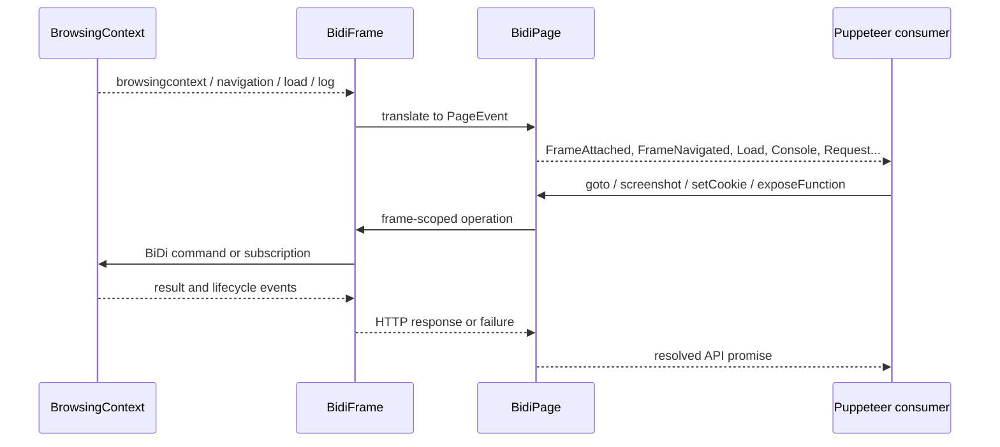

# BiDi Page and Frame

## Introduction

The `bidi_page_and_frame` module adapts WebDriver BiDi browsing contexts to Puppeteer’s protocol-neutral `Page` and `Frame` APIs. `BidiPage` is the page-level façade: it owns the main frame, input devices, page-scoped emulation, screenshots, PDFs, cookies, interception, workers, and public events. `BidiFrame` represents the main browsing context or a descendant iframe and coordinates navigation, load state, realms, exposed functions, file uploads, and frame-level protocol sessions.

The implementation sits between the BiDi adapter layer and the public automation API. It does not own browser or user-context lifecycle; that is handled by [BiDi Browser and Context](bidi_browser_and_context.md). It also delegates script handles and realms to [Handles, Realms and Locators](handles_realms_and_locators_api_realms_and_js_handles.md) when available, network objects to [Network API](network_api.md), and target/worker identity to [Targets and Workers API](targets_and_workers_api.md).

## Position in the system

`BidiPage.from()` creates the page adapter and its root `BidiFrame`. `BidiFrame.from()` recursively creates adapters for existing child browsing contexts and subscribes to events for future children. This gives Puppeteer a stable object graph while BiDi remains the source of truth for context state.

## Architecture and responsibilities

| Component | Responsibility | Detailed documentation |
| --- | --- | --- |
| `BidiPage` | Implements page-wide operations, translates protocol results, and aggregates page/frame/worker events. | [BiDi Page](bidi_page_and_frame_page.md) |
| `BidiFrame` | Implements frame identity, hierarchy, navigation, readiness waits, realms, bindings, and frame-scoped operations. | [BiDi Frame](bidi_page_and_frame_frame.md) |
| `BidiFrameRealm` | Provides default and internal execution realms used by evaluation and accessibility helpers. | [Handles, Realms and Locators](handles_realms_and_locators_api_realms_and_js_handles.md) |
| `BidiCdpSession` | Exposes a CDP-shaped session over a BiDi frame when the browser supports CDP. | [BiDi Transport and CDP Bridge](bidi_transport_and_cdp_bridge.md) |
| `BrowsingContext` | Sends BiDi commands and emits navigation, load, network, log, prompt, worker, and child-context events. | [Frame lifecycle](page_and_frame_lifecycle_frames.md) |
| `BidiWebWorker` | Adapts worker realms and lifecycle events. | [Targets and Workers API](targets_and_workers_api.md) |

## Page/frame object graph

Each frame stores its BiDi context ID as `_id`, keeps a parent pointer, and maintains a weak mapping from protocol child contexts to `BidiFrame` adapters. The page retains the root frame and a strong set of currently live workers. A closed browsing context removes its frame mapping and emits the corresponding Puppeteer detach/close events.

## Event and data flow

Important translations include:

- `navigation`, `historyUpdated`, `load`, and `DOMContentLoaded` become navigation and lifecycle waits/events.
- BiDi request success/error events become Puppeteer request-finished/request-failed events through `BidiHTTPRequest`.
- Console entries are converted into `ConsoleMessage` objects; JavaScript log entries become page errors.
- `userprompt` becomes a Puppeteer dialog.
- Worker realm creation/destruction becomes worker-created/worker-destroyed events.

## Operational boundaries

Most operations use native BiDi commands. A small compatibility layer uses CDP-shaped helpers when needed: CDP emulation, network throttling/offline mode, `Runtime.queryObjects`, tracing, coverage, and optional `createCDPSession`. Unsupported features fail explicitly with `UnsupportedOperation`, including several CDP-only page features, resize in the current BiDi implementation, device prompts, metrics, service-worker bypass, and drag interception.

Navigation waits combine the requested lifecycle events with network-idle state, redirects, abort/failure events, timeout, abort signals, and frame detachment. This is why `goto`, `reload`, history traversal, `setContent`, and `waitForNavigation` resolve consistently across both direct BiDi and BiDi-over-CDP browsers.

## Related modules

- [Protocol-neutral Page and Frame API](page_and_frame_api.md) defines the contracts implemented here.
- [BiDi Browser and Context](bidi_browser_and_context.md) creates pages and owns context-level lifecycle.
- [BiDi Transport and CDP Bridge](bidi_transport_and_cdp_bridge.md) supplies the session transport and optional CDP bridge.
- [Protocol transport and sessions](protocol_transport_and_sessions.md) supplies the session-level context for command and event delivery.

## Final cross-reference step

All generated module documents are cross-referenced above: [BiDi Page](bidi_page_and_frame_page.md) and [BiDi Frame](bidi_page_and_frame_frame.md) provide the detailed implementation split, while the related adapter, protocol, transport, script, network, and target documents cover delegated responsibilities.
