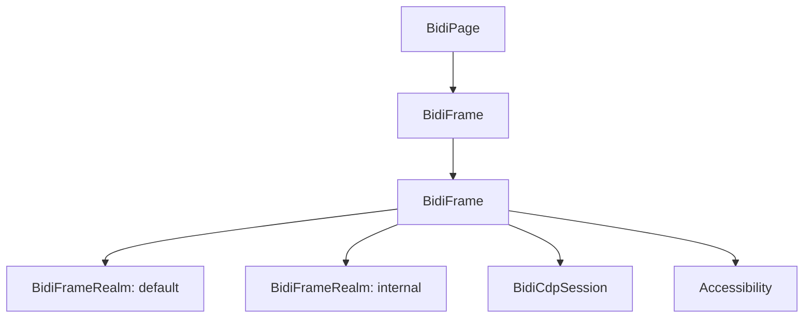
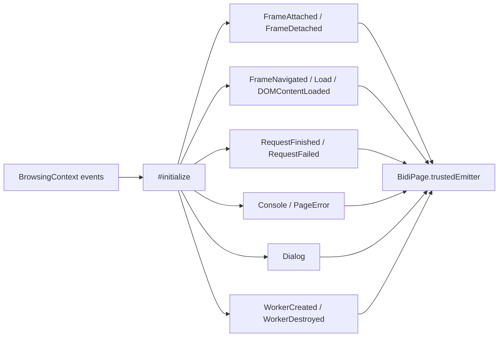
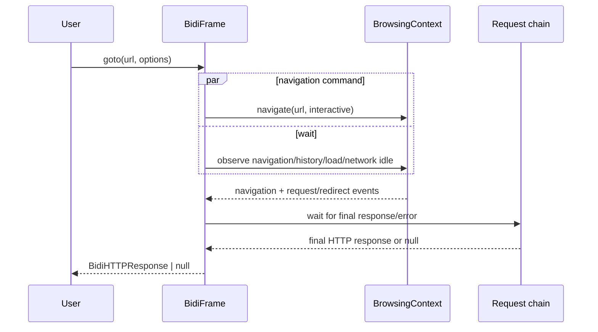

# BiDi Frame

Source: `packages/puppeteer-core/src/bidi/Frame.ts`

## Responsibility

`BidiFrame` adapts one BiDi `BrowsingContext` to Puppeteer’s `Frame` API. It models parent/child hierarchy, creates default and internal realms, turns protocol events into page events, and implements navigation, readiness, bindings, file upload, node lookup, and optional CDP sessions.

## Frame hierarchy and realms

The frame ID is the BiDi browsing-context ID. `parentFrame()` walks the adapter parent pointer, `childFrames()` maps live protocol children to adapters, and `detached` reflects `browsingContext.closed`. The default realm is used for page JavaScript; the internal realm is created with a Puppeteer-private sandbox name.

## Initialization and event translation

`#initialize()` adapts existing and newly attached child contexts. It listens for:

- child browsing contexts, producing `FrameAttached` and later `FrameDetached`;
- requests, wrapping them as `BidiHTTPRequest` and emitting finished/failed events;
- navigation fragments, load, and DOMContentLoaded, emitting navigation/lifecycle events;
- user prompts, producing `BidiDialog` objects;
- console and JavaScript log entries, producing `ConsoleMessage` or page errors;
- worker realms, producing `BidiWebWorker` objects and worker lifecycle events.

Console levels `group`, `groupCollapsed`, and `groupEnd` are mapped to Puppeteer’s start/end group event names. Console arguments become `BidiJSHandle` instances in the main realm; primitive remote values are deserialized for message text, while stack frames become `ConsoleMessageLocation` values.

## Navigation and readiness

`goto()` starts BiDi navigation at interactive readiness in parallel with `waitForNavigation()`. Known implementation-specific cancellation and HTTP failure messages are tolerated; other errors are rewritten with URL and timeout context.

`waitForNavigation()` combines:

1. navigation or history-updated events;
2. requested load/DOMContentLoaded events;
3. network-idle requirements (`networkidle0` or `networkidle2`);
4. redirect-chain request completion;
5. fragment, failed, aborted, timeout, abort-signal, and frame-detachment races.

This coordination ensures the returned response corresponds to the final request after redirects, while history-only changes correctly return `null`.

`setContent()` sets frame content, then waits for both the requested load state and network-idle state. All navigation-sensitive methods are guarded by `throwIfDetached`.

## Bindings and DOM operations

`exposeFunction()` creates an `ExposableFunction` and rejects duplicate names. `removeExposedFunction()` disposes the binding and rejects unknown names. `setFiles()` passes an element’s remote reference to BiDi’s file-setting command. `locateNodes()` uses a locator against an element remote reference and returns node remote values for handle conversion.

`createCDPSession()` creates a target-scoped `BidiCdpSession` only if the owning browser advertises CDP support. `waitForDevicePrompt()` is explicitly unsupported in this adapter.

## Failure and cleanup rules

Detached frames fail active navigation waits with `TargetCloseError` or a frame-detached error, depending on the wait path. Closed contexts close all CDP sessions associated with the frame and remove the frame adapter from its parent’s weak map. This prevents stale frame objects from receiving later protocol events.

## Related documentation

- Page-level coordination and public operations: [BiDi Page](bidi_page_and_frame_page.md).
- Frame contract and waits: [Protocol-neutral Page and Frame API](page_and_frame_api.md).
- Realms and handles: [Handles, Realms and Locators](handles_realms_and_locators_api_realms_and_js_handles.md).
- Network requests/responses: [Network API](network_api.md).
- Core browsing-context behavior: [Frame lifecycle](page_and_frame_lifecycle_frames.md).
- Session bridge: [BiDi Transport and CDP Bridge](bidi_transport_and_cdp_bridge.md).
