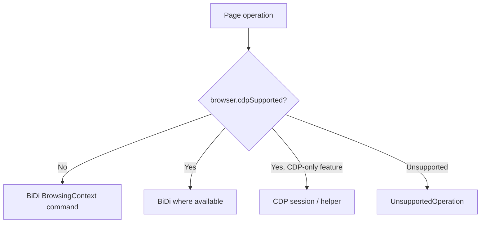

# BiDi Page

Source: `packages/puppeteer-core/src/bidi/Page.ts`

## Responsibility

`BidiPage` implements Puppeteer’s `Page` abstraction over one top-level BiDi `BrowsingContext`. It is the page-level coordinator: it constructs the root frame, exposes page helpers, translates page events, tracks workers, and selects native BiDi or CDP-backed implementations according to browser capabilities.

## Construction and ownership

```mermaid
flowchart TD
    C[BidiBrowserContext] --> P[BidiPage.from]
    P --> F[BidiFrame.from(root context)]
    P --> Input[BidiKeyboard / BidiMouse / BidiTouchscreen]
    P --> EM[EmulationManager]
    P --> Trace[Tracing]
    P --> Cov[Coverage]
    P --> Events[trustedEmitter]
    F --> Events
```

The page owns the root frame, viewport state, page-scoped timeout settings inherited from `Page`, input devices, tracing, coverage, a CDP emulation manager, file-chooser waiters, and a strong set of live `BidiWebWorker` objects. Closing the root browsing context emits `PageEvent.Close` and removes trusted listeners.

## Public operation groups

| Group | Implemented behavior |
| --- | --- |
| Lifecycle | `close`, `reload`, `goBack`, `goForward`, `isClosed`, and `bringToFront` delegate to browsing-context close, reload, history traversal, or activation. |
| Frames and workers | `mainFrame`, `frames`, `focusedFrame`, and `workers` expose the adapter graph maintained by `BidiFrame`. |
| Rendering | `_screenshot` uses BiDi screenshot capture and converts document clips to viewport clips when required; `pdf` waits for fonts and uses BiDi print; `createPDFStream` wraps the PDF bytes in a stream. |
| Script lifecycle | `evaluateOnNewDocument` adds a BiDi preload script; removal removes it; `exposeFunction` delegates to the root frame. |
| Cookies | `cookies`, `setCookie`, and `deleteCookie` convert between Puppeteer cookie shapes and BiDi cookies, including selected `goog:` properties and partition keys. |
| Input and emulation | Viewport, geolocation, JavaScript state, media, timezone, idle state, vision deficiency, and CPU emulation use BiDi or CDP helpers. |
| Network | Headers, user agent, authentication, request interception, cache, offline mode, and throttling are implemented with BiDi interception or CDP commands. |
| Compatibility | CDP sessions are available when supported; unsupported operations throw `UnsupportedOperation` rather than silently approximating behavior. |

## Capability-dependent routing



Examples: viewport updates use `BrowsingContext.setViewport` without CDP, but `EmulationManager` with CDP; offline mode and network throttling require CDP; `createCDPSession` requires a CDP connection; resize, metrics, service-worker bypass, and device prompts remain unsupported.

## Event aggregation

`BidiPage` exposes a bubbling `trustedEmitter`. `BidiFrame` emits frame, navigation, network, console, dialog, page-error, and worker events into it. The page subscribes to worker-created and worker-destroyed events to keep its worker set current. Consumers therefore observe one page-scoped event stream even though the underlying events originate from multiple browsing contexts.

## Screenshot and PDF behavior

Screenshots reject unsupported options (`omitBackground`, `optimizeForSpeed`, non-surface capture, and non-unit clip scale). A clip is interpreted in document coordinates for beyond-viewport capture and translated using `visualViewport.pageLeft/pageTop` for viewport capture. PDFs normalize Puppeteer options, wait for `document.fonts.ready`, call BiDi `print`, decode the returned data, and optionally write it to a path.

## Cookie conversion

Cookie reads fetch BiDi cookies and filter them against requested URL host/path rules. Writes validate blank/data URLs, derive domains from URLs where needed, convert SameSite and expiry values, and route partitioned cookies through the user context. Chromium-specific properties are preserved under the `goog:` prefix. Composite partition keys containing `hasCrossSiteAncestor` are rejected because BiDi does not support them yet.

## Related documentation

- Frame navigation and realm behavior: [BiDi Frame](bidi_page_and_frame_frame.md).
- Public contract: [Protocol-neutral Page and Frame API](page_and_frame_api.md).
- Browser/context ownership: [BiDi Browser and Context](bidi_browser_and_context.md).
- Network object translation: [Network API](network_api.md).
