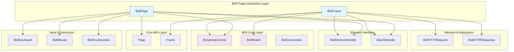
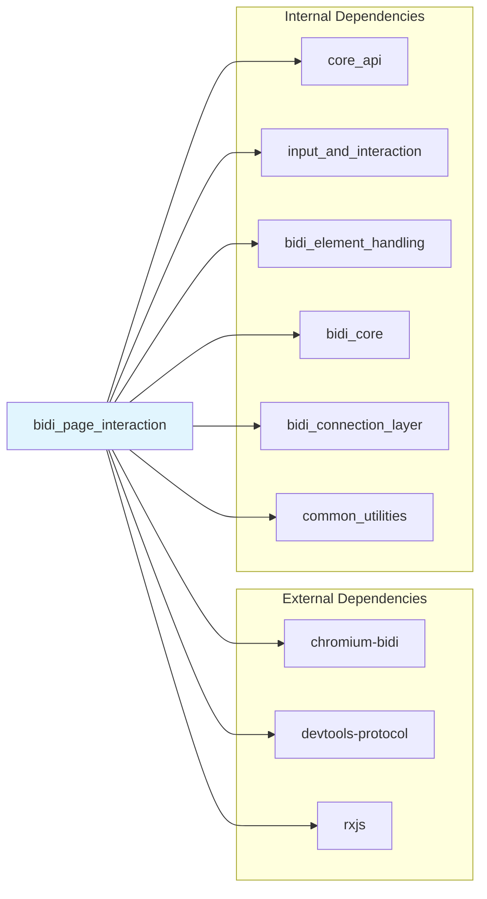
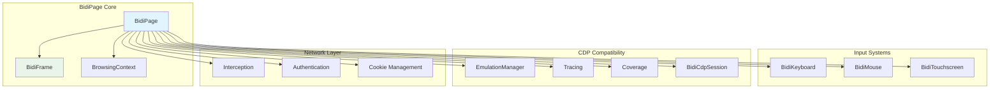
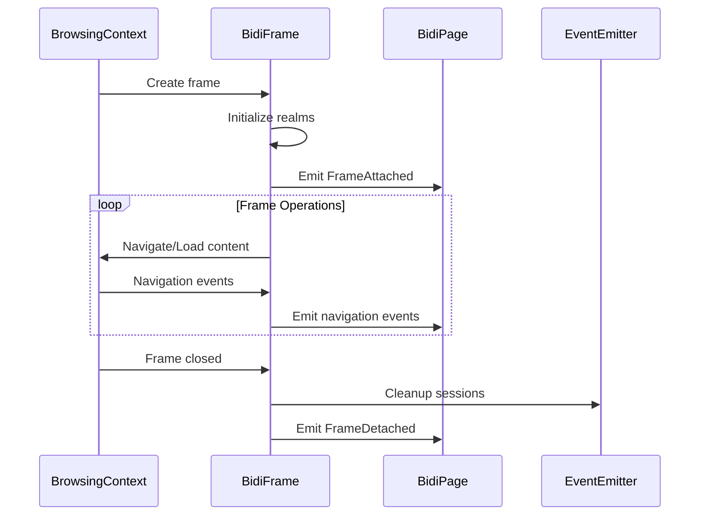
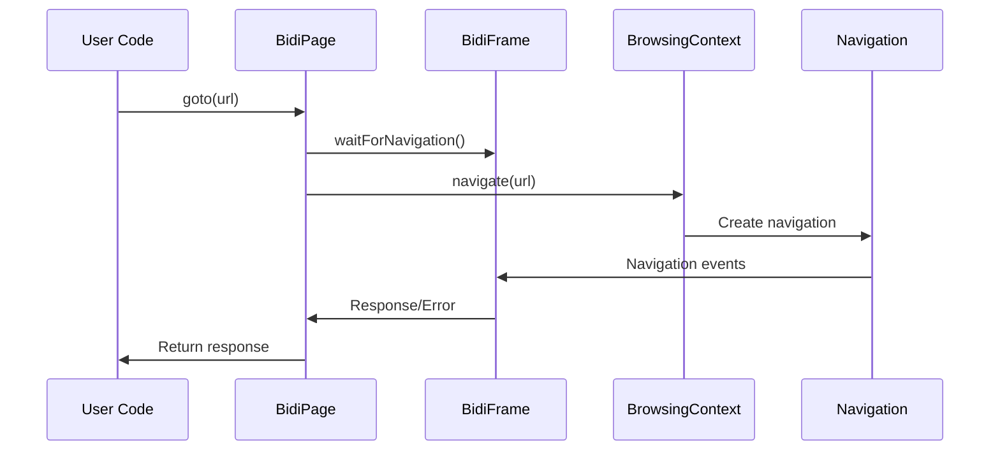
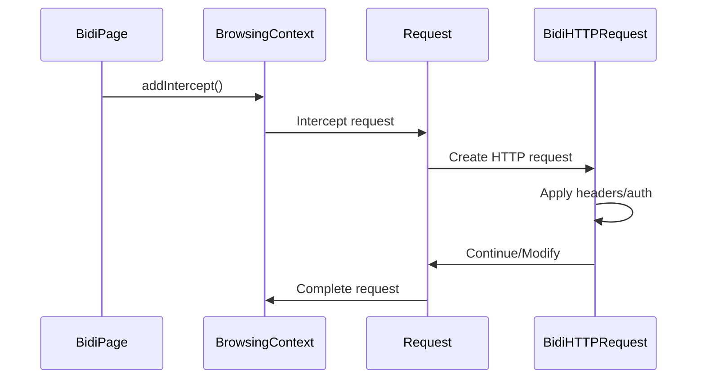
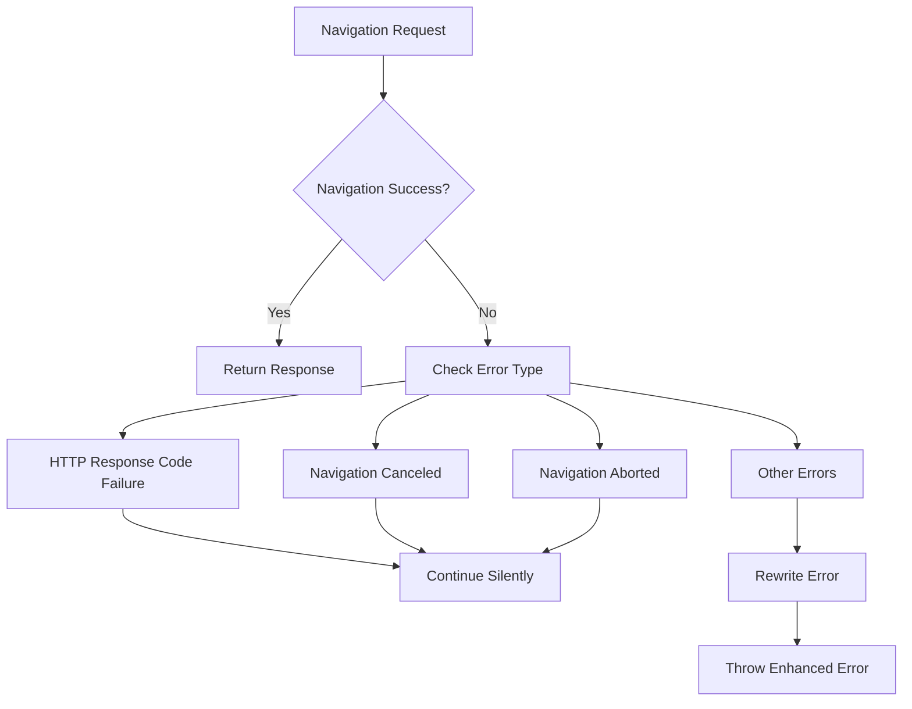
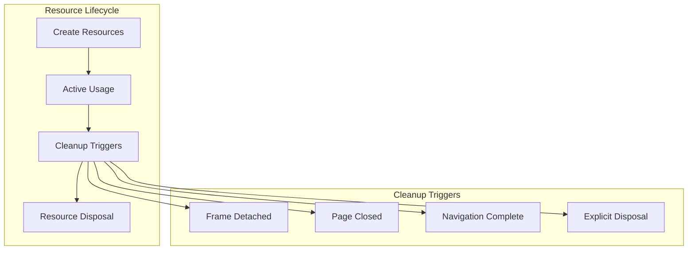

# BiDi Page Interaction Module

## Overview

The `bidi_page_interaction` module provides WebDriver BiDi-based implementations for page and frame interactions in Puppeteer. This module serves as the primary interface for browser automation tasks using the modern WebDriver BiDi protocol, offering enhanced cross-browser compatibility and standardized automation capabilities.

The module consists of two core components:
- **BidiPage**: High-level page automation interface implementing the WebDriver BiDi protocol
- **BidiFrame**: Frame-specific operations and navigation handling within BiDi contexts

## Architecture



## Component Dependencies



## Core Components

### BidiPage

The `BidiPage` class implements the abstract `Page` interface using WebDriver BiDi protocol, providing comprehensive browser page automation capabilities.

#### Key Features

- **Navigation Control**: URL navigation, page reloading, history traversal
- **Content Manipulation**: HTML content setting, script injection, function exposure
- **Input Simulation**: Keyboard, mouse, and touch interactions
- **Network Management**: Request/response interception, cookie handling, authentication
- **Media Emulation**: Device emulation, network conditions, geolocation
- **Document Generation**: PDF creation, screenshot capture
- **Worker Management**: Service worker and web worker handling

#### Architecture Integration



### BidiFrame

The `BidiFrame` class extends the abstract `Frame` interface, providing frame-specific operations within BiDi browsing contexts.

#### Key Features

- **Frame Hierarchy**: Parent-child frame relationships and navigation
- **Content Loading**: DOM content loading, network idle detection
- **Script Execution**: JavaScript evaluation in different realms
- **Event Handling**: Console messages, navigation events, worker lifecycle
- **Element Interaction**: Element location, file uploads, accessibility

#### Frame Lifecycle Management



## Data Flow Patterns

### Navigation Flow



### Request Interception Flow



## Integration Points

### Core API Integration

The module integrates with the [core_api](core_api.md) module by implementing abstract interfaces:

- Extends `Page` and `Frame` base classes
- Implements standard event emission patterns
- Provides consistent API surface across protocols

### Input and Interaction Integration

Leverages the [input_and_interaction](input_and_interaction.md) module for:

- Keyboard input simulation via `BidiKeyboard`
- Mouse interaction via `BidiMouse`
- Touch gesture support via `BidiTouchscreen`

### Element Handling Integration

Works with [bidi_element_handling](bidi_element_handling.md) for:

- Element location and manipulation
- JavaScript handle management
- DOM interaction capabilities

### BiDi Core Integration

Depends on [bidi_core](bidi_core.md) for:

- `BrowsingContext` management
- `Realm` execution contexts
- Protocol-level communication

## Error Handling

### Navigation Error Handling



### Common Error Scenarios

- **UnsupportedOperation**: Features not available in BiDi protocol
- **TargetCloseError**: Frame/page closed during operation
- **Navigation Errors**: Network failures, timeouts, redirects
- **Protocol Errors**: BiDi command failures, connection issues

## Performance Considerations

### Optimization Strategies

1. **Event Filtering**: Only process relevant events for current frame context
2. **Lazy Initialization**: Create child frames and workers on-demand
3. **Request Batching**: Combine multiple BiDi commands when possible
4. **Memory Management**: Proper cleanup of event listeners and sessions

### Resource Management



## Usage Examples

### Basic Page Navigation

```typescript
const page = await browser.newPage();
await page.goto('https://example.com');
await page.waitForLoadState('networkidle');
```

### Request Interception

```typescript
await page.setRequestInterception(true);
page.on('request', request => {
  if (request.url().includes('analytics')) {
    request.abort();
  } else {
    request.continue();
  }
});
```

### Frame Interaction

```typescript
const frame = page.mainFrame();
const childFrames = frame.childFrames();
await frame.evaluate(() => document.title);
```

## Future Enhancements

### Planned Features

1. **Enhanced BiDi Support**: Additional WebDriver BiDi capabilities as they become available
2. **Performance Optimization**: Improved event handling and resource management
3. **Cross-Browser Compatibility**: Enhanced support for Firefox and other BiDi-compliant browsers
4. **Advanced Debugging**: Better error reporting and debugging capabilities

### Migration Path

For users transitioning from CDP-based implementations:

1. **API Compatibility**: Most existing APIs remain unchanged
2. **Feature Parity**: BiDi implementations provide equivalent functionality
3. **Gradual Migration**: Can run both CDP and BiDi implementations side-by-side
4. **Enhanced Capabilities**: BiDi offers improved cross-browser support

## Related Documentation

- [Core API](core_api.md) - Base interfaces and event patterns
- [Input and Interaction](input_and_interaction.md) - User input simulation
- [BiDi Element Handling](bidi_element_handling.md) - Element manipulation
- [BiDi Core](bidi_core.md) - Protocol-level BiDi implementation
- [BiDi Connection Layer](bidi_connection_layer.md) - WebDriver BiDi communication
- [Network Handling](network_handling.md) - HTTP request/response management