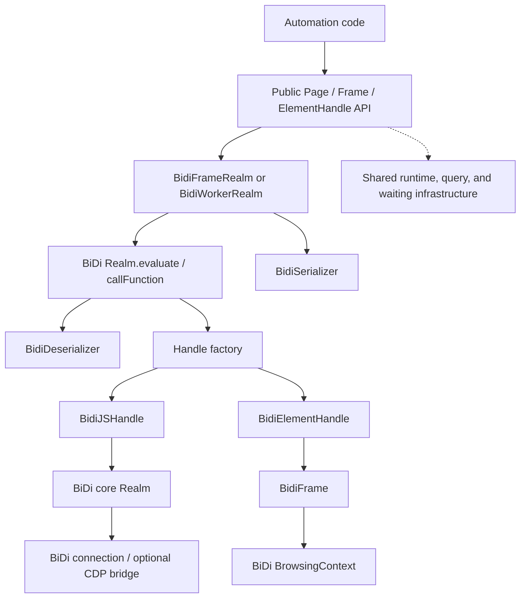
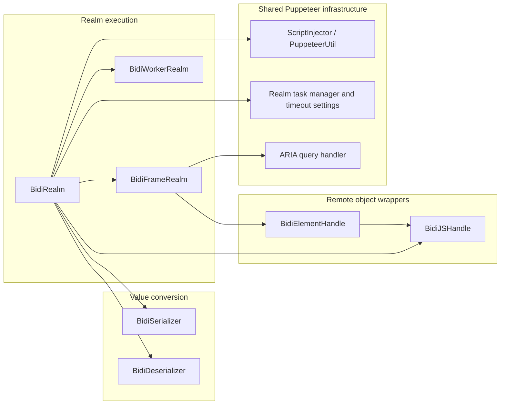
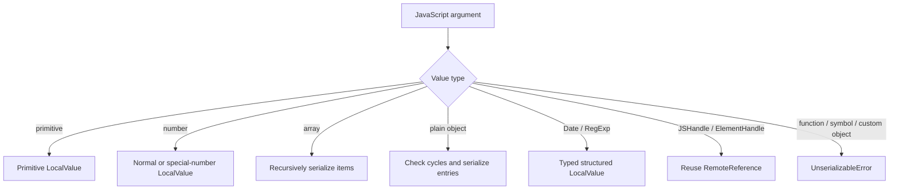
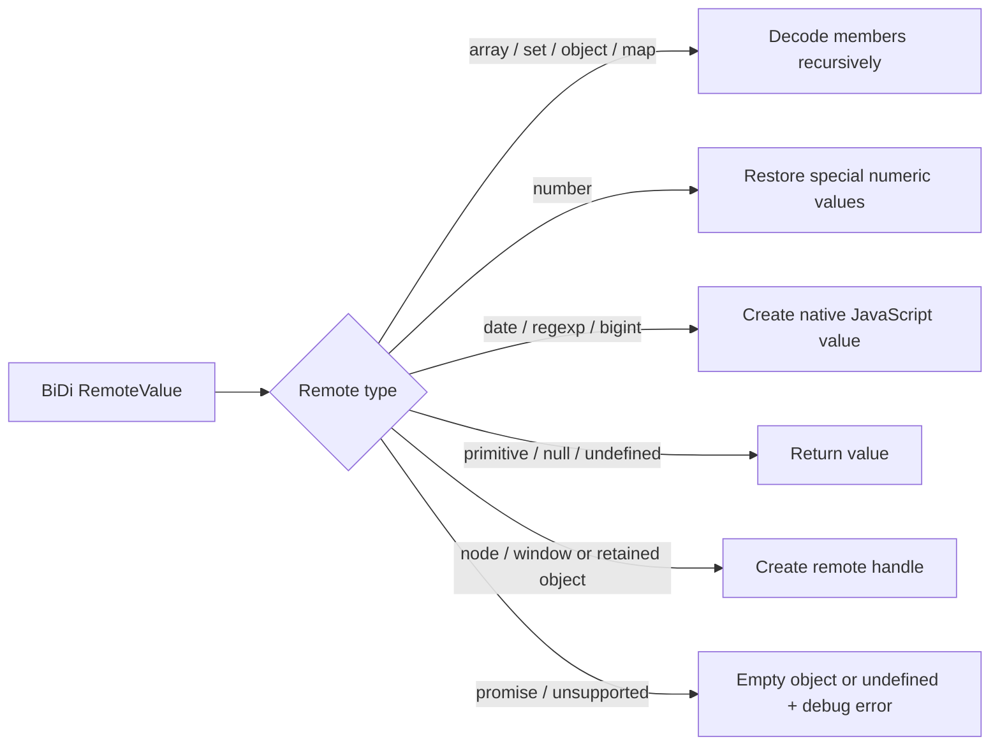
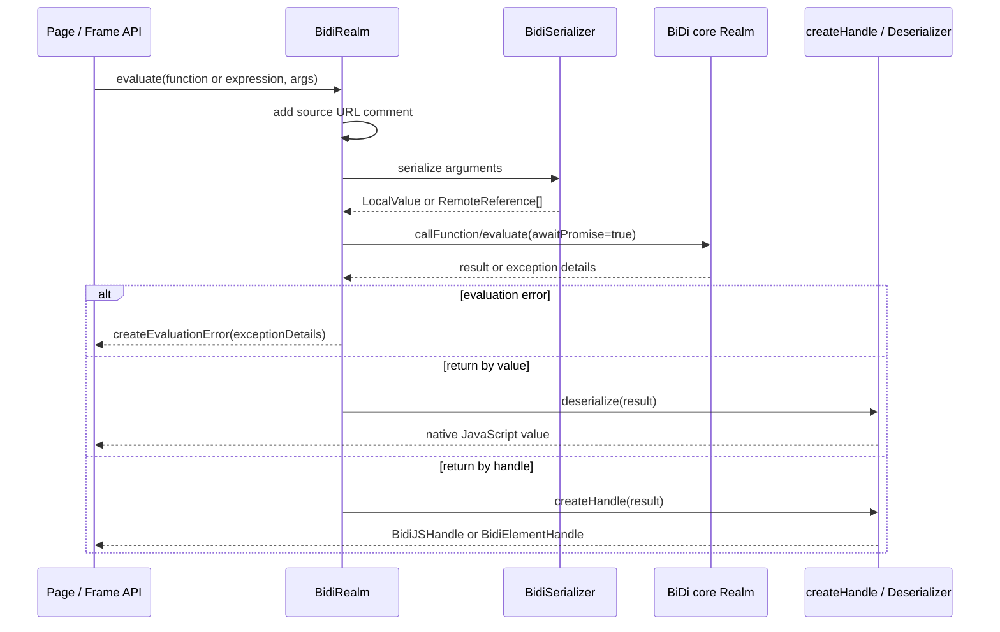
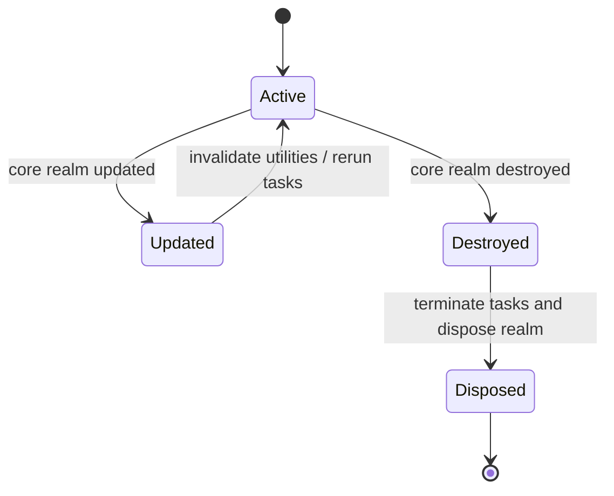
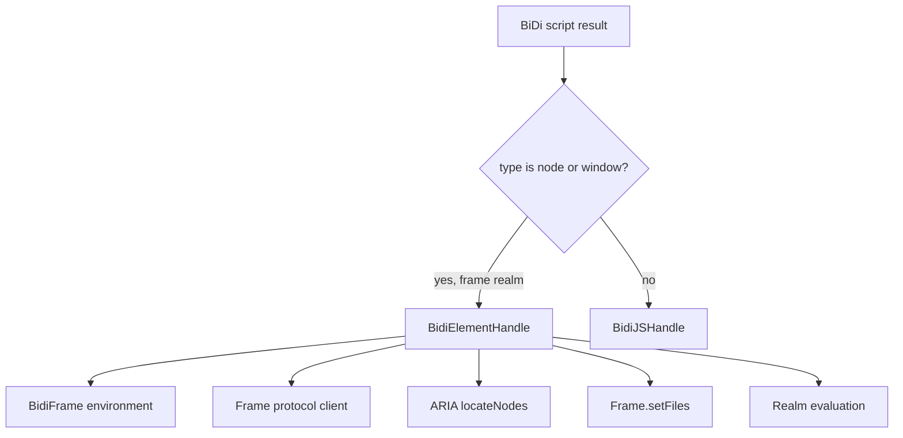
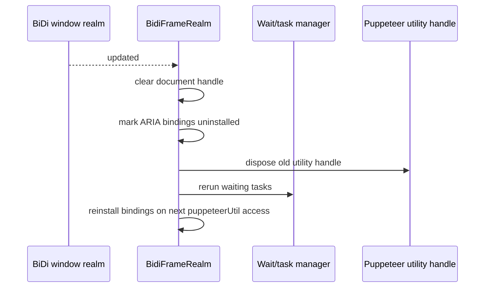
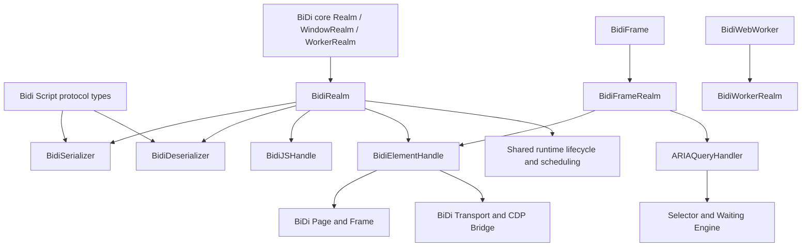

# BiDi Script and Handles

## Introduction

The `bidi_script_and_handles` module is Puppeteer’s execution and object-identity layer for WebDriver BiDi. It converts JavaScript values to and from BiDi `LocalValue` and `RemoteValue` representations, evaluates functions and expressions inside browser realms, and exposes remote objects through Puppeteer-compatible `JSHandle` and `ElementHandle` abstractions.

The module is internal infrastructure rather than a public entry point. Public `Page`, `Frame`, and element APIs delegate evaluation, locator support, accessibility queries, and file operations to the classes described here. Browser and browsing-context lifecycle remain the responsibility of [BiDi Browser and Context](bidi_browser_and_context.md) and [BiDi Page and Frame](bidi_page_and_frame.md).

## Position in the system



The central boundary is `BidiRealm`:

- input arguments cross the boundary through `BidiSerializer` or as existing remote references;
- the browser evaluates the expression or function in a specific realm;
- results either cross back by value through `BidiDeserializer` or remain remotely owned as a handle;
- handles retain their originating realm so later operations can be routed to the correct execution context.

## Architecture



### Responsibilities

| Component | Responsibility | Related documentation |
| --- | --- | --- |
| `BidiSerializer` | Encodes supported JavaScript values as BiDi `LocalValue` objects and rejects unsupported values. | [Protocol transport and sessions](protocol_transport_and_sessions.md) |
| `BidiDeserializer` | Reconstructs JavaScript values from BiDi `RemoteValue` objects, including special numeric values and collections. | [Protocol transport and sessions](protocol_transport_and_sessions.md) |
| `BidiRealm` | Shared evaluation, argument handling, handle creation, handle adoption/transfer, and remote-handle cleanup. | [Handles, Realms and Locators](handles_realms_and_locators_api_realms_and_js_handles.md) |
| `BidiFrameRealm` | Adds frame ownership, sandbox awareness, accessibility bindings, and CDP-assisted backend-node adoption. | [BiDi Frame](bidi_page_and_frame_frame.md) |
| `BidiWorkerRealm` | Adapts dedicated/shared worker realms and explicitly prevents DOM-node adoption. | [Targets and Workers API](targets_and_workers_api.md) |
| `BidiJSHandle` | Represents a remote JavaScript value and controls its disposal. | [Handles, Realms and Locators](handles_realms_and_locators_api_realms_and_js_handles.md) |
| `BidiElementHandle` | Specializes a remote node/window value with frame, accessibility, upload, autofill, and backend-node operations. | [Element handles API](handles_realms_and_locators_api_element_handles.md) |

## Value serialization

`BidiSerializer.serialize()` accepts the values that can safely be represented by the BiDi script protocol:

| JavaScript input | BiDi representation | Notes |
| --- | --- | --- |
| `undefined` | `{type: 'undefined'}` | Preserves an explicit undefined result. |
| `null` | `{type: 'null'}` | Distinguished from an object. |
| string / boolean | Matching primitive type | Value is copied. |
| number | `number` with numeric value or special string | Preserves `-0`, `NaN`, `Infinity`, and `-Infinity`. |
| bigint | `bigint` | Serialized using decimal text. |
| array | `array` of recursively serialized values | Nested supported values are preserved. |
| plain object | `object` mapping entries | Keys are serialized strings; circular structures are rejected. |
| `RegExp` | `regexp` with `pattern` and `flags` | Reconstructible by the BiDi endpoint. |
| `Date` | `date` containing ISO text | Uses `toISOString()`. |

Functions and symbols are rejected immediately. Other custom objects are also rejected; callers should convert them to plain objects first. Plain objects are checked with `JSON.stringify()` to detect circular references, then each enumerable property is serialized recursively.



When an argument is already a `BidiJSHandle` or `BidiElementHandle`, `BidiRealm.serialize()` does not copy its value. It passes the underlying remote reference. Before doing so it verifies that the source and destination are compatible:

- handles from different global types (page versus worker) are rejected;
- handles from different frames are rejected;
- disposed handles are rejected.

This prevents a remote object ID from being sent to a realm where it has no meaning.

## Value deserialization

`BidiDeserializer.deserialize()` converts returned `RemoteValue` values back to JavaScript values. Arrays, sets, objects, and maps recurse through their members. Object and map tuples are decoded by `#deserializeTuple`, which accepts either a literal string key or a serialized remote key.

Special cases are intentional:

- `number` values restore `-0`, `NaN`, and infinities;
- `bigint`, `date`, and `regexp` are reconstructed as native objects;
- `promise` becomes an empty object because evaluation requests awaited promises;
- a missing result is logged with `debugError` and returns `undefined`;
- unknown protocol types are logged and return `undefined` rather than silently being treated as a primitive.



## Realm execution

`BidiRealm` extends Puppeteer’s protocol-neutral `Realm` contract. It owns the relationship between a BiDi core realm and Puppeteer’s timeout/task infrastructure.

### Evaluation flow

`evaluate()` requests a value result, while `evaluateHandle()` requests a remotely owned result. Both route through the private `#evaluate()` method.



The result ownership and serialization options differ by API:

| API | Result ownership | Serialization options | Returned value |
| --- | --- | --- | --- |
| `evaluate()` | `ResultOwnership.None` | Default options | Deserialized value |
| `evaluateHandle()` | `ResultOwnership.Root` | `maxObjectDepth: 0`, `maxDomDepth: 0` | Remote handle |

Functions are converted with `stringifyFunction`; strings are sent as expressions. Puppeteer source URL comments are appended unless the supplied source already contains one, which keeps browser-side stack traces attributable to the originating Puppeteer call. Evaluation awaits returned promises and enables user activation.

`LazyArg` values are resolved asynchronously before serialization. This preserves the normal ordering of public evaluation arguments while allowing internal helpers to compute arguments from the current realm.

### Realm subclasses

`BidiFrameRealm` is tied to a `BidiFrame`. It exposes the frame as `environment`, carries the frame’s sandbox and timeout settings, and installs ARIA query bindings into the page. `BidiWorkerRealm` is tied to a `BidiWebWorker`; it shares the base evaluation behavior but cannot adopt DOM nodes.

Both realms react to core realm lifecycle events:

- `destroyed` terminates all pending tasks, then disposes the realm;
- `updated` invalidates injected Puppeteer utilities and reruns waiting tasks;
- frame realm updates additionally clear the document handle and mark ARIA bindings for reinstallation.



## Puppeteer utility injection and queries

`BidiRealm.puppeteerUtil` lazily injects Puppeteer’s internal utility script through `ScriptInjector`. If the underlying realm is updated, the previous utility handle is disposed and a new one is created.

`BidiFrameRealm` extends this initialization with two exposed functions backed by `ARIAQueryHandler`: `__ariaQuerySelector` and `__ariaQuerySelectorAll`. These functions are installed once per frame-realm generation and are reinstalled after an update. The bindings allow the shared selector/query infrastructure to implement accessibility selectors over BiDi.

This module therefore works with [Selector and Waiting Engine](selector_and_waiting_engine.md), especially its [query handlers](selector_and_waiting_engine_query_handlers.md), without duplicating selector parsing or waiting behavior.

## Handle model and ownership

`BidiJSHandle` wraps one BiDi `RemoteValue` and retains the `BidiRealm` that can use it. The handle stores a disposed flag locally. Its `id` is the protocol `handle` field when present; primitive remote values have no handle ID and consequently require no `disown` operation.

| Operation | Behavior |
| --- | --- |
| `jsonValue()` | Evaluates the remote value and returns its by-value representation. |
| `asElement()` | Returns `null` in the current BiDi implementation; node values are created as `BidiElementHandle` by the realm factory. |
| `toString()` | Uses `JSHandle:<value>` for primitives and `JSHandle@<type>` for remote objects. |
| `dispose()` | Idempotently marks the handle disposed and asks its realm to disown the remote ID. |
| `remoteObject()` | Throws `UnsupportedOperation`; CDP remote-object format is not available in native BiDi. |

`BidiRealm.destroyHandles()` filters handles without IDs and calls the core realm’s `disown()` for the remainder. Disown failures caused by navigation or closed pages are logged and swallowed because the browser has already invalidated those objects.

```mermaid
sequenceDiagram
    participant User as Caller
    participant Handle as BidiJSHandle
    participant Realm as BidiRealm
    participant Core as BiDi core Realm

    User->>Handle: dispose()
    Handle->>Handle: if already disposed, return
    Handle->>Handle: mark disposed
    Handle->>Realm: destroyHandles([handle])
    Realm->>Realm: collect remote handle IDs
    Realm->>Core: disown(handle IDs)
    Core-->>Realm: completion or navigation/close error
    Realm-->>Handle: resolve; harmless disown errors are logged
```

`adoptHandle()` evaluates an identity function in the destination realm. `transferHandle()` returns the original handle when it is already in the destination; otherwise it adopts the value, disposes the source, and returns the new handle. Adoption is therefore a realm-local copy of remote identity, not a mutable object move.

## Element handles

`BidiElementHandle` extends the protocol-neutral `ElementHandle` and is created for BiDi `node` and `window` results in a frame realm. It delegates generic evaluation and disposal to `BidiJSHandle` while adding DOM-specific operations.



### Frame and document relationships

- `realm` returns the owning `BidiFrameRealm`.
- `frame` returns that realm’s `BidiFrame` environment.
- `contentFrame()` evaluates an iframe/frame’s `contentWindow`, then resolves the returned context ID against the page’s frame list.
- `backendNodeId()` describes the remote node through CDP and caches the resulting backend ID. It throws when the browser does not support CDP.
- `BidiFrameRealm.adoptBackendNode()` performs the inverse bridge: it resolves a backend node into a CDP object, wraps it temporarily, and evaluates identity to obtain a BiDi-compatible shared handle.

### Browser-integrated operations

- `autofill()` uses CDP `DOM.describeNode` and `Autofill.trigger`; it is available only through the frame’s CDP-capable client.
- `uploadFile()` normalizes relative paths with the configured Node path implementation and delegates file selection to `BidiFrame.setFiles()`.
- `queryAXTree()` uses the frame’s BiDi accessibility locator, then maps returned remote nodes into new `BidiElementHandle` instances.
- `BidiWorkerRealm.adoptBackendNode()` always fails because workers do not own DOM nodes.

The public element contract and generic locator behavior are documented in [Element handles API](handles_realms_and_locators_api_element_handles.md) and [Page and Frame API](page_and_frame_api.md).

## End-to-end process flows

### Evaluating a function with a handle argument

```mermaid
flowchart TD
    Start[Caller invokes frame.evaluate(fn, handle)] --> Check{Handle belongs to same frame/global type?}
    Check -->|no| Reject[Throw realm compatibility error]
    Check -->|yes| Disposed{Handle disposed?}
    Disposed -->|yes| Reject2[Throw disposed-handle error]
    Disposed -->|no| Ref[Send RemoteReference]
    Ref --> Call[BiDi callFunction with awaitPromise]
    Call --> Exception{Exception result?}
    Exception -->|yes| EvalError[Create and throw evaluation error]
    Exception -->|no, evaluate| Decode[Deserialize result]
    Exception -->|no, evaluateHandle| Wrap[Create JS or Element handle]
    Decode --> Done[Return value]
    Wrap --> Done2[Return handle]
```

### Document update and waiting tasks



## Error and compatibility behavior

The module deliberately exposes protocol limitations instead of silently emulating them:

- unsupported serialization raises an internal `UnserializableError`;
- cross-frame and cross-global handle use raises an ordinary `Error` with a diagnostic message;
- use of a disposed handle is rejected;
- CDP-only `remoteObject()`, backend-node features, and autofill are unsupported without CDP;
- DOM adoption into a worker is rejected;
- unsupported result types are logged through `debugError` and produce `undefined`.

Consumers should keep handles within their originating frame or worker, dispose long-lived handles, and prefer `evaluate()` when the result does not need to remain remotely owned.

## Dependencies and integration points



Further reading:

- [BiDi Page and Frame](bidi_page_and_frame.md) — owns the frame environments used by `BidiFrameRealm` and delegates page operations.
- [BiDi Transport and CDP Bridge](bidi_transport_and_cdp_bridge.md) — explains the protocol client used by CDP-dependent element operations.
- [Protocol transport and sessions](protocol_transport_and_sessions.md) — describes command, response, and event delivery below the realm layer.
- [Handles, Realms and Locators](handles_realms_and_locators_api.md) — defines the protocol-neutral handle and realm contracts.
- [Runtime lifecycle and scheduling](runtime_lifecycle_and_scheduling.md) — covers task termination, disposal, deferred work, and timeout behavior used by realms.
- [Targets and Workers API](targets_and_workers_api.md) — describes worker targets that own `BidiWorkerRealm` instances.

## Summary

`bidi_script_and_handles` provides the type-safe bridge between Puppeteer’s JavaScript-facing automation APIs and BiDi’s realm/script model. `BidiRealm` coordinates evaluation and ownership; `BidiSerializer` and `BidiDeserializer` preserve JavaScript value semantics; `BidiJSHandle` manages remote identity and disposal; and `BidiElementHandle` adds DOM-specific behavior while respecting optional CDP capabilities. Frame and worker subclasses enforce the boundaries that make handles safe to use across documents and execution contexts.
