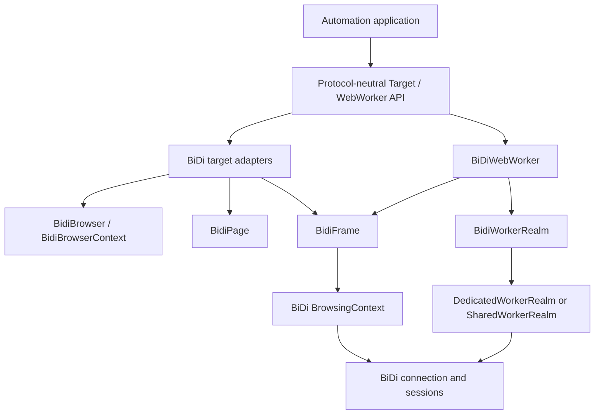
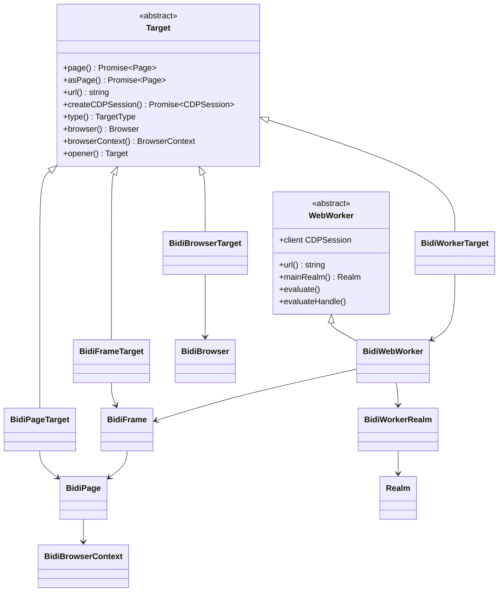
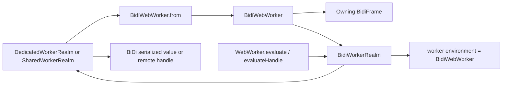
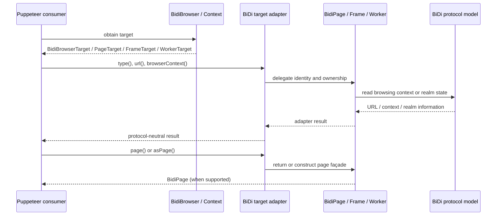
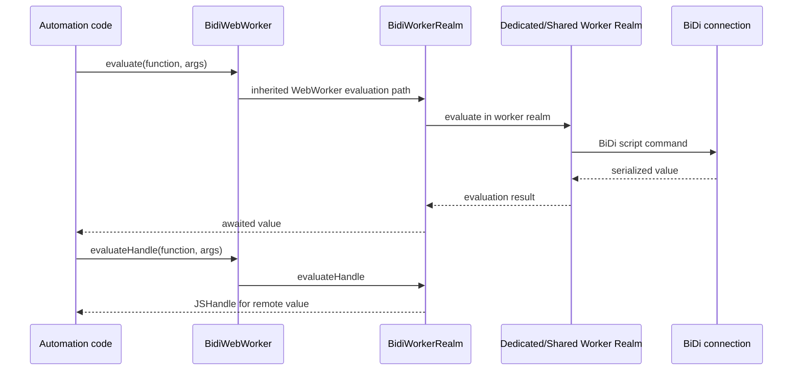
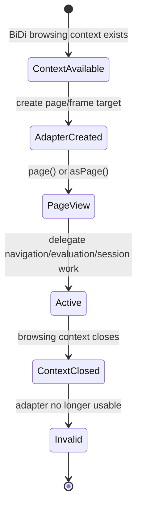
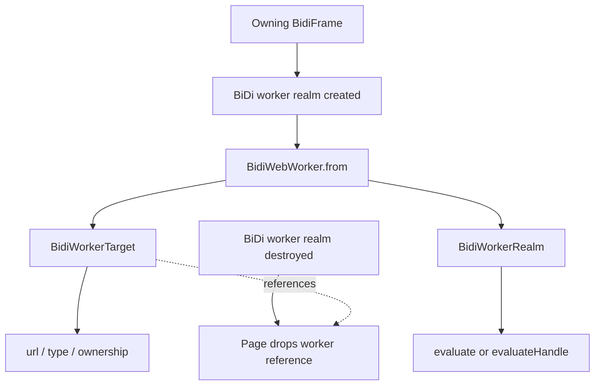

# BiDi Targets and Workers

## Introduction

The `bidi_targets_and_workers` module adapts WebDriver BiDi browsing contexts and worker realms to Puppeteer’s protocol-neutral `Target` and `WebWorker` APIs. It provides target objects for the browser, pages, frames, and workers, and connects worker targets to a `BidiWorkerRealm` for script evaluation.

This module is an adapter boundary rather than an owner of browser lifecycle or protocol transport. Browser and context creation is covered by [BiDi Browser and Context](bidi_browser_and_context.md); page and frame behavior is covered by [BiDi Page and Frame](bidi_page_and_frame.md); and the common contracts are defined in [Targets and Workers API](targets_and_workers_api.md).

## Position in the system

The adapter objects preserve Puppeteer’s ownership model while delegating state and commands to BiDi objects. A page target points at a `BidiPage`; a frame target points at a `BidiFrame`; and a worker target points at a `BidiWebWorker`, whose execution is delegated to a worker realm.

## Architecture

### Components and responsibilities

| Component | Backing object | Target classification | Main responsibility |
| --- | --- | --- | --- |
| `BidiBrowserTarget` | `BidiBrowser` | `TargetType.BROWSER` | Represents the browser-level target and exposes browser ownership/default context. |
| `BidiPageTarget` | `BidiPage` | `TargetType.PAGE` | Represents a top-level page and delegates page URL, page conversion, and CDP-session creation. |
| `BidiFrameTarget` | `BidiFrame` | `TargetType.PAGE` | Represents a frame as a page-compatible target and lazily creates a page façade for the frame browsing context. |
| `BidiWorkerTarget` | `BidiWebWorker` | `TargetType.OTHER` | Represents a worker target, exposing its URL and ownership while rejecting page/session operations. |
| `BidiWebWorker` | `BidiFrame` + BiDi worker realm | Public `WebWorker` | Provides the worker’s frame association and main evaluation realm. |
| `BidiWorkerRealm` | `DedicatedWorkerRealm` or `SharedWorkerRealm` | Realm adapter | Supplies the execution environment used by inherited `WebWorker.evaluate()` and `evaluateHandle()`. |

### Class relationships

## Target adapters

### `BidiBrowserTarget`

`BidiBrowserTarget` stores a `BidiBrowser` and represents the browser itself:

- `type()` returns `TargetType.BROWSER`.
- `browser()` returns the stored browser.
- `browserContext()` returns the browser’s default browser context.
- `url()` returns an empty string because a browser-level target has no document URL.
- `asPage()`, `createCDPSession()`, and `opener()` throw `UnsupportedOperation`.

The target is therefore an ownership and classification object, not a page-like or session-capable target.

### `BidiPageTarget`

`BidiPageTarget` wraps a `BidiPage` and exposes the normal page-target behavior:

- `page()` resolves to the wrapped page.
- `asPage()` reconstructs a page from the page’s main-frame browsing context.
- `url()` delegates to `BidiPage.url()`.
- `createCDPSession()` delegates to `BidiPage.createCDPSession()`.
- `browserContext()` delegates to the page, and `browser()` is derived from that context.
- `type()` returns `TargetType.PAGE`.

The adapter does not implement opener tracking; `opener()` throws `UnsupportedOperation`.

### `BidiFrameTarget`

`BidiFrameTarget` wraps a `BidiFrame`, but classifies it as `TargetType.PAGE` so that frame browsing contexts can participate in Puppeteer’s page-oriented target APIs.

`page()` uses a private cache. On its first call it creates `BidiPage.from(browserContext(), frame.browsingContext)` and stores the result; later calls return the same cached page façade. `asPage()` creates a façade directly without updating that cache. Both conversions are page views over the frame’s browsing context, not a conversion of the frame into a top-level tab.

The frame target delegates `url()` and `createCDPSession()` to the frame. Its browser context is obtained from `frame.page().browserContext()`, and its browser is derived from that context. As with the page adapter, `opener()` is unsupported.

### `BidiWorkerTarget`

`BidiWorkerTarget` wraps a `BidiWebWorker` and represents a worker-only target:

- `type()` returns `TargetType.OTHER` rather than a page target type.
- `url()` delegates to the worker.
- `browserContext()` follows `worker.frame.page().browserContext()`.
- `browser()` is derived from that browser context.
- `page()`, `asPage()`, and `createCDPSession()` throw `UnsupportedOperation`.
- `opener()` is unsupported.

The explicit failures prevent callers from treating a worker execution realm as a browsing page or assuming that a direct CDP session exists for every BiDi worker.

## Worker adapter and execution realm

`BidiWebWorker.from(frame, realm)` is the factory for worker adapters. Construction performs three steps:

1. Stores the owning `BidiFrame`.
2. Initializes the base `WebWorker` with `realm.origin`, which becomes the worker URL exposed through the inherited API.
3. Wraps the supplied dedicated or shared worker realm in `BidiWorkerRealm`.

`frame` identifies the page and browser context that own the worker. `mainRealm()` returns the adapted worker realm. The realm’s environment points back to the `BidiWebWorker`, allowing inherited evaluation infrastructure to associate execution with the worker object.

The `client` getter deliberately throws `UnsupportedOperation`. Worker evaluation is realm-based and does not require the CDP-shaped client exposed by the protocol-neutral API. Worker handle and serialization behavior is shared with [BiDi Script and Handles](bidi_script_and_handles.md) and [Handles, Realms and Locators API](handles_realms_and_locators_api.md).

## Data flow: target lookup and conversion

Target adapters are intentionally thin. They do not discover targets, subscribe to protocol events, or manage browsing-context lifetimes. Those responsibilities belong to [BiDi Browser and Context](bidi_browser_and_context.md), [BiDi Page and Frame](bidi_page_and_frame.md), and the [protocol transport and sessions](protocol_transport_and_sessions.md) layer that delivers BiDi commands and events.

## Data flow: worker evaluation

Evaluation semantics, timeout handling, disposal, and remote-handle serialization are inherited from the shared realm infrastructure. This module only supplies the correct worker realm and environment association.

## Lifecycle and interaction flows

### Page/frame target lifecycle

The target adapter does not close the underlying browsing context. Closing and detachment are handled by the owning `BidiPage`, `BidiFrame`, and browser-context lifecycle components.

### Worker lifecycle

Workers are surfaced through the owning page’s worker collection and lifecycle events. See [BiDi Page](bidi_page_and_frame_page.md) and the protocol-neutral [Targets and Workers API](targets_and_workers_api.md) for event and consumer-level behavior.

## Capability matrix

| Adapter | `page()` / `asPage()` | `url()` | `createCDPSession()` | `browserContext()` | `type()` |
| --- | --- | --- | --- | --- | --- |
| `BidiBrowserTarget` | Unsupported | `''` | Unsupported | Default context | `BROWSER` |
| `BidiPageTarget` | Wrapped/recreated page | Page URL | Delegates to page | Page context | `PAGE` |
| `BidiFrameTarget` | Frame-backed page | Frame URL | Delegates to frame | Owning page context | `PAGE` |
| `BidiWorkerTarget` | Unsupported | Worker URL | Unsupported | Worker’s page context | `OTHER` |

All four adapters currently reject `opener()`. Callers should treat this as a backend capability boundary rather than infer an opener from frame or worker ownership.

## Dependencies and boundaries

| Dependency | Use here | Reference |
| --- | --- | --- |
| `api/Target.ts`, `api/WebWorker.ts` | Protocol-neutral contracts and inherited evaluation behavior | [Targets and Workers API](targets_and_workers_api.md) |
| `BidiBrowser`, `BidiBrowserContext` | Browser/context ownership and target discovery | [BiDi Browser and Context](bidi_browser_and_context.md) |
| `BidiPage`, `BidiFrame` | Page and frame views used by page/frame targets and worker ownership | [BiDi Page and Frame](bidi_page_and_frame.md) |
| `BidiWorkerRealm` and BiDi core realms | Worker script execution | [BiDi Script and Handles](bidi_script_and_handles.md), [protocol transport and sessions](protocol_transport_and_sessions.md) |
| `CDPSession`, `UnsupportedOperation` | Optional session surface and explicit unsupported-capability signaling | [BiDi Transport and CDP Bridge](bidi_transport_and_cdp_bridge.md) |

This module does not own browser startup, browser downloads, target discovery, BiDi connection management, page navigation, network interception, or handle serialization. Those concerns remain in their dedicated modules.

## Guidance for maintainers

- Keep target adapters thin and delegate state to the wrapped BiDi object.
- Preserve the distinction between a page-backed target and a worker-backed target; do not make worker targets page-convertible without a protocol model that supports it.
- When adding a target capability, implement it consistently with the protocol-neutral contract and document whether it is supported by browser, page, frame, and worker adapters.
- Retain explicit `UnsupportedOperation` failures for operations that BiDi cannot represent directly.
- Be careful when changing `BidiFrameTarget.page()`: its cached page façade and `asPage()`’s direct construction have intentionally different behavior.
- Keep worker evaluation changes in the realm/script adapter layer unless the worker’s ownership or identity contract itself changes.

## Related modules

- [Targets and Workers API](targets_and_workers_api.md) — public contracts and consumer guidance.
- [BiDi Browser and Context](bidi_browser_and_context.md) — browser/context ownership and page creation.
- [BiDi Page and Frame](bidi_page_and_frame.md) — page, frame, and worker lifecycle integration.
- [BiDi Script and Handles](bidi_script_and_handles.md) — BiDi realms, handles, serialization, and evaluation.
- [BiDi Transport and CDP Bridge](bidi_transport_and_cdp_bridge.md) — connection/session delivery and optional CDP compatibility.
