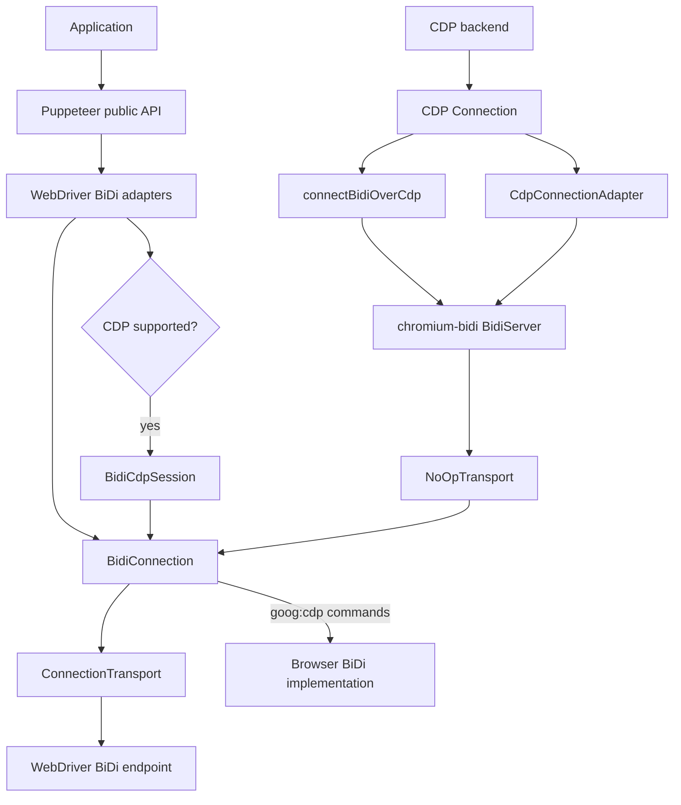
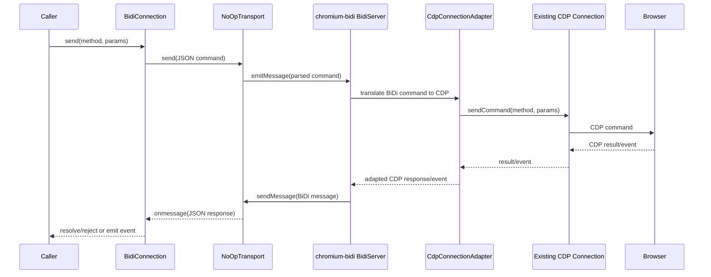
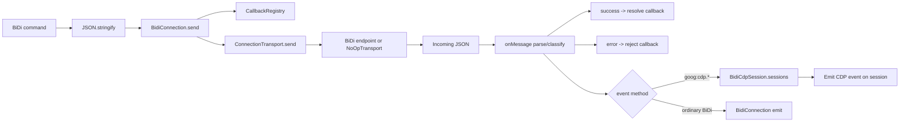
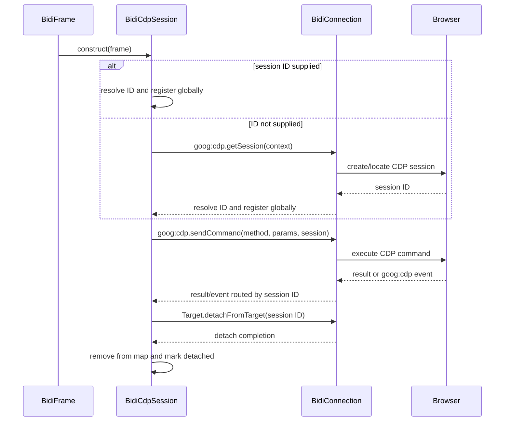
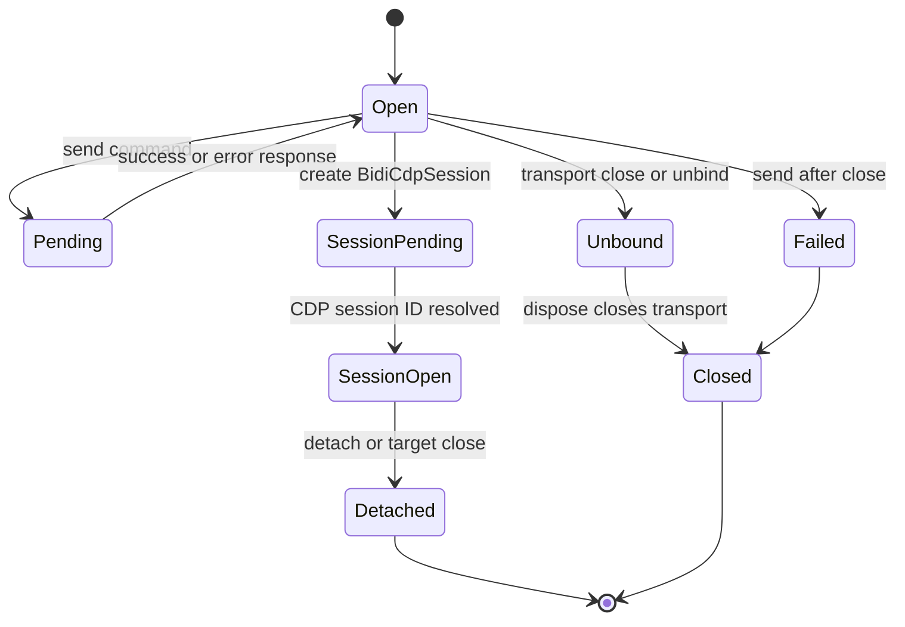

# BiDi transport and CDP bridge

## Introduction

The `bidi_transport_and_cdp_bridge` module is Puppeteer’s internal protocol boundary for WebDriver BiDi connections and BiDi-over-CDP operation. It provides a promise-based `BidiConnection`, adapts Puppeteer’s existing CDP connection and sessions to the interface expected by `chromium-bidi`, and exposes CDP commands from BiDi-backed pages through `BidiCdpSession`.

The module does not launch browsers or implement the public browser/page model. Browser startup and endpoint selection belong to [launch and connect orchestration](launch_and_connect_orchestration.md); the public protocol-neutral API is described in [protocol-neutral public automation API](protocol_neutral_public_automation_api.md); and BiDi browser/page adapters are covered by the broader `webdriver_bidi_api_adapters` module.

## Position in the system



In normal BiDi mode, `BidiConnection` sends serialized BiDi commands through a supplied transport. In BiDi-over-CDP mode, the same connection API is retained, but the transport is an in-process loop: Puppeteer commands enter `NoOpTransport`, `chromium-bidi` translates them to CDP, and `CdpConnectionAdapter` forwards those CDP operations to Puppeteer’s existing CDP connection.

## Responsibilities and boundaries

| Concern | Owner |
| --- | --- |
| Launching a browser and selecting a WebSocket/pipe endpoint | [Launch and connect orchestration](launch_and_connect_orchestration.md) |
| Physical CDP transports and CDP session routing | [Protocol transport and sessions](protocol_transport_and_sessions.md) |
| BiDi command IDs, timeout handling, response correlation, and event dispatch | `BidiConnection` |
| Translating BiDi commands to CDP in a CDP-backed browser | `chromium-bidi` `BidiServer` plus `CdpConnectionAdapter` |
| Exposing CDP commands from a BiDi frame/page | `BidiCdpSession` |
| Browser, page, frame, network, and handle behavior | `webdriver_bidi_api_adapters` and `cdp_backend_automation_implementation` |

## Architecture

```mermaid
classDiagram
    class ConnectionTransport {
        <<interface>>
        +onmessage
        +onclose
        +send(message)
        +close()
    }
    class BidiConnection {
        -url
        -transport
        -delay
        -timeout
        -closed
        -callbacks
        +send(method, params, timeout)
        +onMessage(message)
        +pipeTo(emitter)
        +unbind()
        +dispose()
    }
    class BidiCdpSession {
        -connection
        -sessionId
        -detached
        +send(method, params, options)
        +detach()
        +connection()
        +id()
    }
    class NoOpTransport {
        -onMessage
        +emitMessage(command)
        +setOnMessage(handler)
        +sendMessage(message)
        +close()
    }
    class CdpConnectionAdapter {
        -cdp
        -adapters
        +browserClient()
        +getCdpClient(id)
        +close()
    }
    class CDPClientAdapter {
        -client
        -sessionId
        -closed
        +sendCommand(method, params)
        +browserClient()
        +close()
        +isCloseError(error)
    }
    class BidiServer {
        <<chromium-bidi>>
    }
    BidiConnection --> ConnectionTransport : owns
    BidiConnection --> BidiCdpSession : routes CDP events
    BidiCdpSession --> BidiConnection : sends goog:cdp commands
    NoOpTransport --> BidiServer : BidiTransport
    BidiServer --> CdpConnectionAdapter : CDP adapter provider
    CdpConnectionAdapter o-- CDPClientAdapter : browser + sessions
    CDPClientAdapter --> CDPClientAdapter : browserClient()
```

### `BidiConnection`

`BidiConnection` implements the internal BiDi `Connection` contract over Puppeteer’s `ConnectionTransport` abstraction. Its constructor binds `transport.onmessage` to `onMessage()` and `transport.onclose` to `unbind()`.

`send()` rejects immediately when the connection is closed. Otherwise it registers a callback with `CallbackRegistry`, creates a JSON command containing `id`, `method`, and `params`, logs it, and sends it through the transport. The default timeout is 180 seconds unless an explicit connection timeout or per-command timeout is supplied. The `delay` option is applied when processing incoming messages, which is useful for testing or controlled protocol timing.

`onMessage()` parses the incoming BiDi message and classifies it as:

- a `success` response, resolved by callback ID;
- an `error` response, rejected with a formatted protocol error;
- an `event`, emitted to the connection and any emitters registered with `pipeTo()`; or
- an unexpected object, where an available `id` is rejected because the endpoint did not return BiDi-shaped data.

Events whose method starts with `goog:cdp.` are treated specially. Their session ID is used to find the corresponding `BidiCdpSession`, and the event is emitted on that session rather than on the general BiDi event stream.

`unbind()` marks the connection closed, removes active callbacks, and leaves the underlying transport open. `dispose()` additionally closes the transport. This distinction allows a transport to be reused by another protocol owner.

### `connectBidiOverCdp` and `NoOpTransport`

`connectBidiOverCdp(cdp)` builds an in-process BiDi endpoint over an existing CDP connection:

1. Create `NoOpTransport`, which implements the `chromium-bidi` transport contract without a socket.
2. Create `CdpConnectionAdapter` for the browser CDP connection.
3. Create a Puppeteer-facing transport whose `send()` parses BiDi JSON and injects the command into `NoOpTransport`.
4. Forward `NoOpTransport` responses as JSON to `BidiConnection.onMessage()`.
5. Start `BidiMapper.BidiServer` with the no-op transport and CDP adapter.

Closing this composite connection closes the BiDi server transport, adapter, and original CDP connection. `bidiServerLogger` routes mapper diagnostics through Puppeteer’s `bidi:` debug namespace.



### `CdpConnectionAdapter` and `CDPClientAdapter`

`CdpConnectionAdapter` presents a browser-level CDP client and lazily creates one `CDPClientAdapter` per CDP session. `getCdpClient(id)` looks up the session in the underlying `CdpConnection` and throws for unknown IDs. Adapters are cached so event listeners and client identity remain stable for the lifetime of a session.

`CDPClientAdapter` wraps either a browser-level `CdpConnection` or a target-level `CDPSession`. It forwards wildcard CDP events into the `chromium-bidi` event emitter and implements `sendCommand()` by delegating to the wrapped client. Once closed, sends return without dispatching; errors caused by a concurrent close are similarly suppressed. `isCloseError()` identifies Puppeteer `TargetCloseError` instances for the mapper.

The adapter hierarchy preserves the browser/session relationship required by the mapper: session adapters retain a `sessionId` and point back to the browser adapter through `browserClient()`.

### `BidiCdpSession`

`BidiCdpSession` is Puppeteer’s `CDPSession` implementation for a BiDi-backed frame. It is available only when `browser().cdpSupported` is true. The static `sessions` map lets `BidiConnection.onMessage()` route `goog:cdp.*` events to the right session.

The session ID is either supplied by the caller or obtained asynchronously through `goog:cdp.getSession` for the frame’s browsing context. `send()` waits for that ID and invokes `goog:cdp.sendCommand`, returning the nested CDP result. A detached session rejects commands with `TargetCloseError`; a browser without CDP support rejects with `UnsupportedOperation`.

`detach()` sends `Target.detachFromTarget` through the frame client, then always marks the session closed. `onClose()` removes the session from the global map and sets `detached`. `connection()` deliberately returns `undefined` because the session is not backed by a native Puppeteer CDP connection object.

## Command, response, and event flow



The callback registry is the authority for command completion. A response with an unknown or already-cleared ID is ignored by the registry. During shutdown, `unbind()` clears pending callbacks so callers do not wait indefinitely for a transport that is no longer owned by the connection.

## CDP session acquisition and detachment



The asynchronous session-ID `Deferred` prevents commands from racing session creation. The constructor also registers the instance by its eventual ID; callers should treat `id()` as empty until the ID has resolved.

## Lifecycle and failure behavior



Important failure paths are:

- `BidiConnection.send()` rejects with `ConnectionClosedError` after unbinding.
- BiDi error responses become formatted protocol errors containing the error code, message, and optional stack trace.
- Non-BiDi responses with an ID are rejected, protecting callers from accidentally using a CDP endpoint as a BiDi endpoint.
- `BidiCdpSession.send()` rejects when CDP is unsupported or the session has detached.
- Adapter sends during close are suppressed, allowing browser target shutdown to race safely with mapper cleanup.
- `connectBidiOverCdp` close cascades through the no-op transport, mapper-side adapter, and underlying CDP connection.

## Integration with neighboring modules

- [Protocol transport and sessions](protocol_transport_and_sessions.md) documents the native CDP transport implementations and CDP session routing that this bridge adapts.
- The `webdriver_bidi_api_adapters` module consumes `BidiConnection`, `BidiCdpSession`, and the BiDi protocol model to implement browser, context, page, frame, network, input, and target objects.
- The `webdriver_bidi_core_protocol_model` module defines the protocol-facing browser, session, browsing-context, request, realm, and prompt objects used by the adapters and mapper.
- The `cdp_backend_automation_implementation` module owns the native CDP browser/page implementation and is the source of the CDP connection that can be bridged.
- [Runtime lifecycle and scheduling](runtime_lifecycle_and_scheduling.md) supplies event emitters, deferred values, callback cleanup, and disposal utilities used by this module.
- [Targets and workers API](targets_and_workers_api.md) exposes target-derived objects without requiring callers to know which protocol transport is underneath.

## Source map

| Source | Role |
| --- | --- |
| `packages/puppeteer-core/src/bidi/Connection.ts` | BiDi command transport, callback correlation, event routing, timeout, and lifecycle |
| `packages/puppeteer-core/src/bidi/BidiOverCdp.ts` | In-process BiDi server bridge, CDP client adapters, and no-op transport |
| `packages/puppeteer-core/src/bidi/CDPSession.ts` | CDP session facade for BiDi-backed frames, including session acquisition and detachment |
| `chromium-bidi/lib/cjs/bidiMapper/BidiMapper.js` | Protocol translation and BiDi server implementation used by the bridge |
| `packages/puppeteer-core/src/common/ConnectionTransport.ts` | Transport contract consumed by `BidiConnection` |
| `packages/puppeteer-core/src/common/CallbackRegistry.ts` | Request IDs, promises, timeout, response resolution, rejection, and cleanup |
