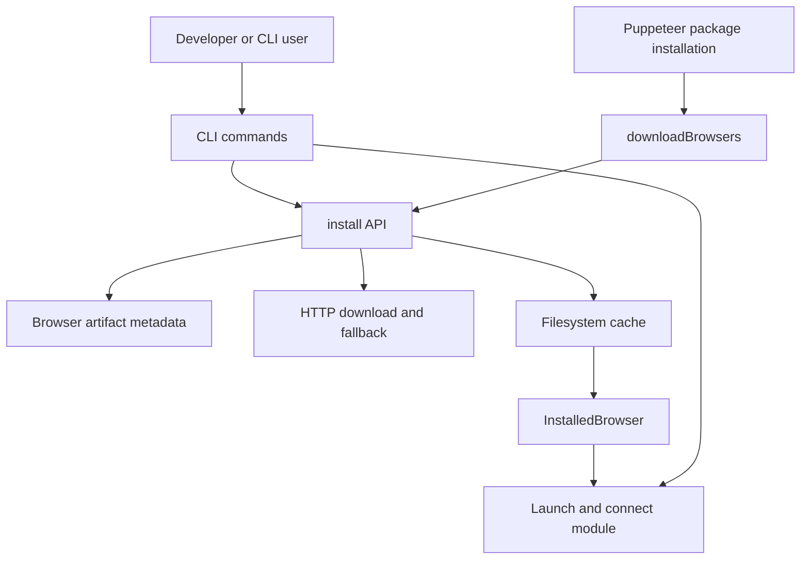
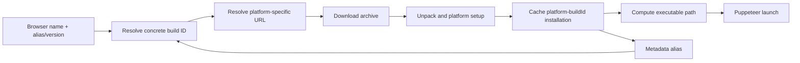

# Browser acquisition and cache

## Purpose

The `browser_acquisition_and_cache` module provisions browser binaries for Puppeteer, stores them in a deterministic cache, and exposes the operations needed to install, inspect, launch, or remove those binaries. It is the boundary between browser distribution services and Puppeteer’s runtime launch code.

## Architecture overview

The module has two cohesive areas:

| Area | Main files | Documentation |
| --- | --- | --- |
| Command and cache management | `packages/browsers/src/CLI.ts`, `packages/browsers/src/Cache.ts` | [browser_acquisition_and_cache_cli_and_cache.md](browser_acquisition_and_cache_cli_and_cache.md) |
| Download and installation orchestration | `packages/browsers/src/install.ts`, `packages/puppeteer/src/node/install.ts` | [browser_acquisition_and_cache_installation.md](browser_acquisition_and_cache_installation.md) |

## End-to-end data flow

## Component relationships

`CLI` is the interactive and scripting façade. It validates arguments, resolves pinned versions, and delegates installation to `install` or executable lookup to launch logic. `downloadBrowsers` is the package lifecycle façade; it translates Puppeteer configuration into parallel browser installation jobs. `install` owns archive retrieval and extraction. `Cache` owns durable layout, metadata, enumeration, alias resolution, and cleanup. Browser-specific artifact modules supply URL, build-ID, version, and relative executable rules.

The module does not implement browser process lifecycle or automation protocols. After an executable path is produced, process launching belongs to [browser_process_lifecycle.md](browser_process_lifecycle.md) and browser launch/connect behavior belongs to [launch_and_connect.md](launch_and_connect.md). Browser-specific artifact rules belong to [browser_artifact_metadata.md](browser_artifact_metadata.md).

## Operational characteristics

- Platforms are detected automatically unless explicitly supplied.
- Concrete build IDs are used as cache keys; aliases are persisted separately in `.metadata`.
- Existing installations are reused only after the expected executable is verified.
- Temporary archives are removed after extraction, including failure paths.
- Chrome-family downloads have a dashboard-based fallback unless a custom base URL is supplied.
- Package installation can skip individual browsers or all downloads through configuration.
- Clearing the cache is intentionally interactive in the CLI because it is recursive and permanent.

## Main entry points

| Entry point | Role |
| --- | --- |
| `CLI.run(argv)` | Parse and execute install, launch, list, and clear commands |
| `Cache.computeExecutablePath(options)` | Resolve an alias and return the browser executable path |
| `install(options)` | Download, unpack, prepare, and cache a browser |
| `canDownload(options)` | Check archive availability without downloading |
| `downloadBrowsers()` | Install configured Puppeteer-managed browsers during package setup |

