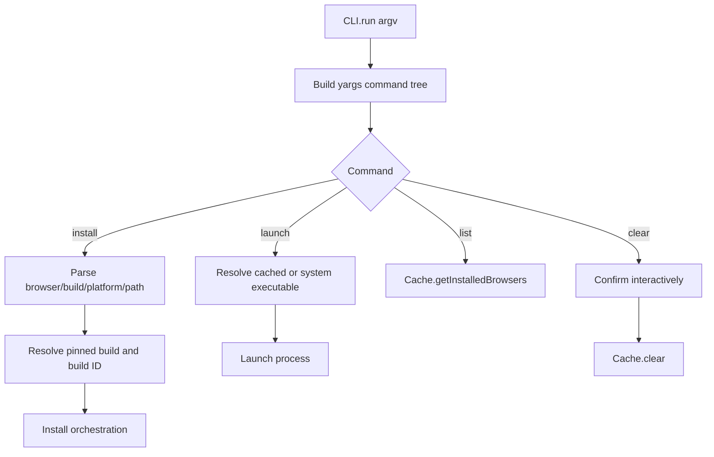
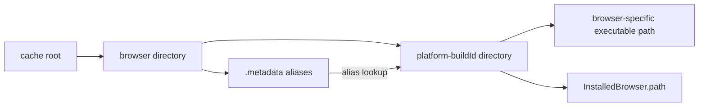

# Browser acquisition CLI and cache

This sub-module provides the user-facing command-line workflow and the filesystem model used to retain installed browser binaries. It is implemented by `packages/browsers/src/CLI.ts` and `packages/browsers/src/Cache.ts`.

## Responsibilities

- Parse and validate browser, build, platform, cache-path, and launch options.
- Resolve aliases such as `latest`, `stable`, or pinned builds before installation or launch.
- Expose `install`, `launch`, `list`, and destructive `clear` commands.
- Map a browser/build/platform tuple to an installation directory and executable.
- Persist aliases in a per-browser `.metadata` file.
- Enumerate and uninstall cached browser installations.

## CLI lifecycle



`CLI` defaults the cache root to the current working directory unless configured otherwise. A pinned-browser configuration makes the browser positional argument optional for `install`; all pinned installations are then attempted with `Promise.allSettled`, so one failure does not prevent the other jobs from being attempted.

## Cache layout and resolution



The layout is:

```text
<root>/<browser>/<platform>-<buildId>/<browser archive contents>
<root>/<browser>/.metadata
```

`Cache.computeExecutablePath` first detects the platform when omitted, resolves an alias through metadata, computes the installation directory, and appends the browser-specific relative executable path supplied by the browser-data layer. `InstalledBrowser.path` returns the installation directory; `InstalledBrowser.executablePath` returns the executable itself.

## Metadata and cleanup behavior

`Cache.writeMetadata` creates the browser directory and writes JSON containing an `aliases` map. `Cache.uninstall` removes aliases pointing to the deleted build before recursively deleting the corresponding platform/build directory. `Cache.clear` recursively removes the entire configured root. The CLI asks for an explicit `yes` confirmation before invoking it.

## Related module

The browser-specific URL, build-ID, version-comparison, and executable-layout rules are documented in [browser_artifact_metadata.md](browser_artifact_metadata.md).

