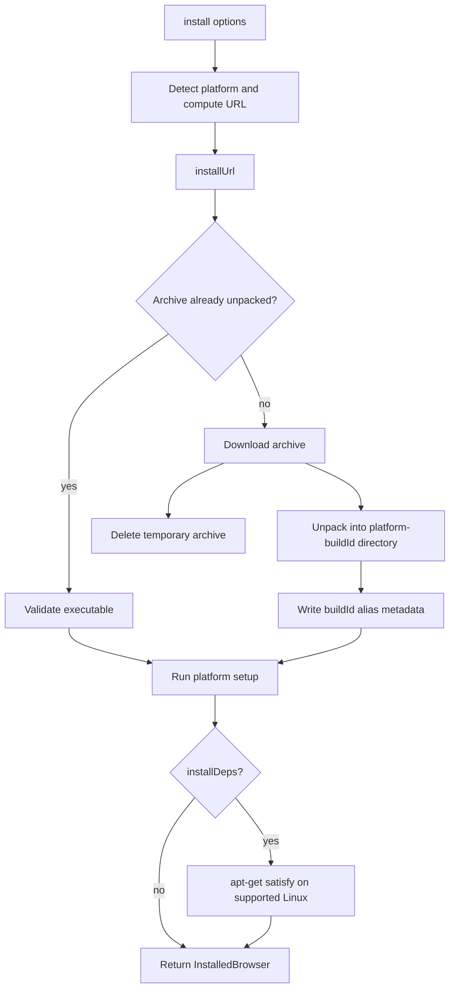
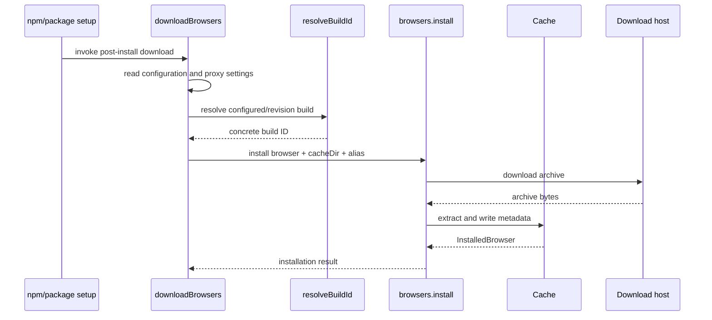
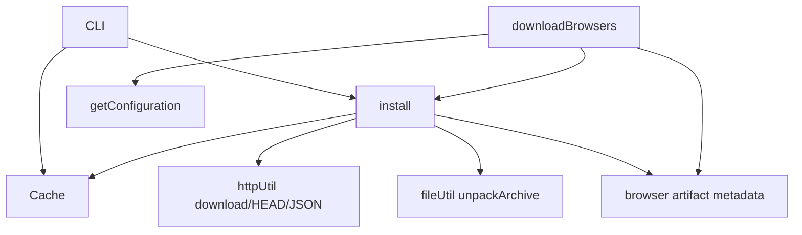

# Browser installation orchestration

This sub-module downloads, unpacks, validates, and prepares browser archives. It is implemented primarily by `packages/browsers/src/install.ts`, with package-install integration in `packages/puppeteer/src/node/install.ts`.

## Public installation operations

`install(options)` accepts a browser, build ID, platform, cache directory, optional alias, download base URL, progress callback, unpack mode, and dependency-install flag. It returns an `InstalledBrowser` when unpacking is enabled, or the downloaded archive path when `unpack: false`.

The companion operations are:

- `canDownload`: sends a HEAD request to the computed archive URL.
- `getDownloadUrl`: delegates browser/platform URL construction to browser-data metadata.
- `uninstall`: removes one cached browser installation.
- `getInstalledBrowsers`: enumerates installations through `Cache`.
- `makeProgressCallback`: creates the default progress-bar callback.

## Install flow

The archive is stored temporarily under the browser cache root as `<buildId>-<archive filename>`. After successful extraction, the temporary archive is removed in a `finally` block. If the target installation directory already exists, the implementation verifies that the expected executable is present and re-runs setup rather than downloading again.

## Download fallback

When the primary URL fails, the installer retries Chrome-family downloads using the Chrome for Testing dashboard’s build metadata to locate a platform-specific URL. A caller-supplied `baseUrl` disables this fallback, preserving the caller’s explicit distribution source.

## Platform preparation

On native Windows Chrome installations, `runSetup` optionally invokes `setup.exe --configure-browser-in-directory=...` to configure sandbox permissions. With `installDeps`, Linux installations can read a generated `deb.deps` file and invoke `apt-get satisfy`; this requires root privileges and is limited to Debian-like environments.

## Puppeteer package integration

`downloadBrowsers` is the package-install entry point. It:

1. Applies npm proxy configuration to `HTTP_PROXY`, `HTTPS_PROXY`, and `NO_PROXY`.
2. Reads Puppeteer configuration and honors global or per-browser skip flags.
3. Detects the current platform and resolves configured versions or `PUPPETEER_REVISIONS`.
4. Starts independent downloads for Chrome, Chrome Headless Shell, and Firefox.
5. Waits for all jobs and exits with an error if any installation fails.

## Dependencies

## Related modules

- [browser_acquisition_and_cache_cli_and_cache.md](browser_acquisition_and_cache_cli_and_cache.md) describes command dispatch and cache semantics.
- [browser_artifact_metadata.md](browser_artifact_metadata.md) describes browser-specific build resolution and archive/executable paths.
- [browser_provisioning_and_launch_orchestration.md](browser_provisioning_and_launch_orchestration.md) describes the larger provisioning and launch boundary that consumes these installed artifacts.

