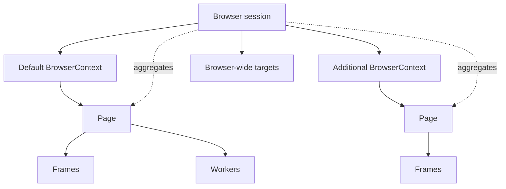
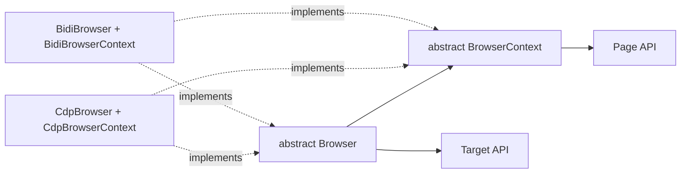
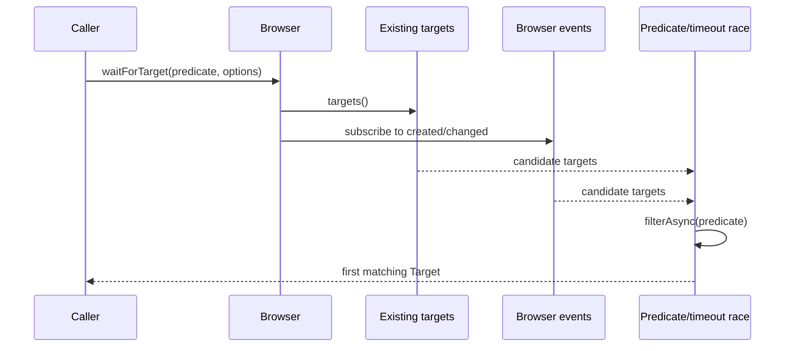
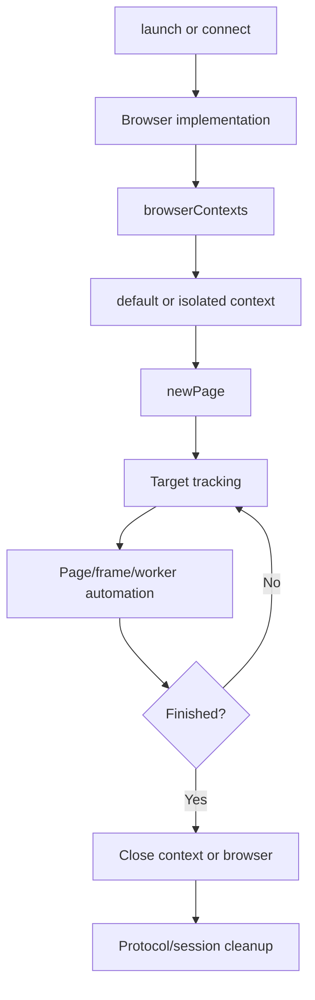
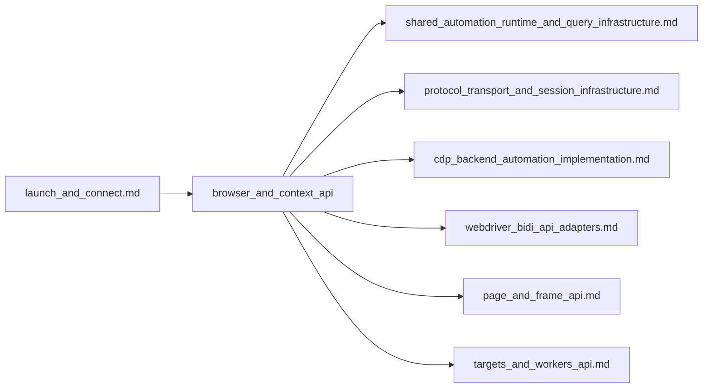

# Browser and context API

## Introduction

The `browser_and_context_api` module defines Puppeteer’s protocol-neutral ownership and isolation model after a browser has been launched or connected. `Browser` represents the whole browser session; `BrowserContext` represents an isolated user profile within that session. Together they provide the lifecycle boundary for pages, targets, cookies, permissions, and browser-level events.

This module contains abstract public contracts in `packages/puppeteer-core/src/api/`. Concrete implementations are supplied by the [CDP backend automation implementation](cdp_backend_automation_implementation.md) and [WebDriver BiDi API adapters](webdriver_bidi_api_adapters.md). Browser startup and connection are covered by [launch and connect](launch_and_connect.md), while lower-level protocol messaging is covered by [protocol transport and session infrastructure](protocol_transport_and_session_infrastructure.md).

## Position in the system

```mermaid
flowchart TD
    App[Node application] --> Entry[launch() or connect()]
    Entry --> Impl{Protocol implementation}
    Impl --> CDP[CdpBrowser / CdpBrowserContext]
    Impl --> BiDi[BidiBrowser / BidiBrowserContext]
    CDP --> Contract[Browser and BrowserContext contracts]
    BiDi --> Contract
    Contract --> Pages[Page and Frame APIs]
    Contract --> Targets[Target and worker APIs]
    Contract --> Runtime[Common events, waits, disposal, cookies]
    Pages --> Protocol[CDP or WebDriver BiDi sessions]
    Targets --> Protocol
```

The contract deliberately hides whether the browser is controlled through Chrome DevTools Protocol (CDP), native WebDriver BiDi, or a BiDi-over-CDP adapter. Callers work with the same browser/context concepts and then obtain pages, frames, targets, and workers from them.

## Architecture

### Ownership hierarchy



* A newly launched browser has at least one default context.
* `Browser.createBrowserContext()` creates an additional isolated context. Cookies, local storage, and related profile state are not shared between contexts.
* `Browser.newPage()` creates a page in the default context; `BrowserContext.newPage()` creates one in that specific context.
* A popup opened by a page belongs to the page’s context.
* `Browser.targets()` and `Browser.pages()` aggregate across every context. Context-level methods restrict the view to one context.
* The default context cannot be closed. Other contexts close together with their pages.

### Public contract versus implementation



`Browser.ts` and `BrowserContext.ts` define behavior that can be shared by both protocol families, including aggregation, target waiting, cookie shortcuts, state checks, and disposal. Protocol-specific operations such as target discovery, context creation, permission commands, and page construction remain abstract and are implemented below the contract.

## `Browser` API

`Browser` extends the common typed `EventEmitter` and is the top-level handle returned by `Puppeteer.launch()` or `Puppeteer.connect()`.

### Session and lifecycle

| Member | Behavior |
| --- | --- |
| `process()` | Returns the associated Node `ChildProcess` for a browser launched by Puppeteer; returns `null` for an externally connected browser. |
| `wsEndpoint()` | Returns the browser WebSocket debugger endpoint used for reconnecting. |
| `connected` | Indicates whether Puppeteer remains connected. `isConnected()` is a deprecated compatibility alias. |
| `close()` | Closes the browser and all associated pages. |
| `disconnect()` | Detaches Puppeteer while leaving the browser process running. |
| `version()` / `userAgent()` | Returns browser identity and its original user agent. |
| `protocol` | Internal protocol-family indicator used by implementations. |
| `debugInfo` | Experimental diagnostic information, currently including pending protocol errors. |

Disposal chooses ownership-aware behavior: if `process()` is non-null, synchronous or asynchronous disposal closes the browser; otherwise it disconnects. Synchronous disposal catches and reports cleanup failures through the common debug-error path, while async disposal propagates them.

### Context and page management

* `defaultBrowserContext()` returns the non-closable default context.
* `browserContexts()` lists all active contexts.
* `createBrowserContext(options)` creates an isolated context. Options can specify a proxy server, proxy bypass list, and download behavior.
* `newPage()` delegates page creation to the default context.
* `pages()` calls `pages()` on every context concurrently and flattens the results. Non-visible pages, such as background pages, are excluded by the context/page implementations.

### Targets and events

The browser emits `disconnected`, `targetcreated`, `targetchanged`, and `targetdestroyed` events. These events include targets from all contexts. `targetdiscovered` is an internal protocol-facing event.

`waitForTarget(predicate, options)` combines three sources:

1. already-existing targets from `targets()`;
2. future `targetcreated` events;
3. future `targetchanged` events.

The first target satisfying the synchronous or asynchronous predicate wins. The default timeout is 30 seconds; `timeout: 0` disables timeout handling, and an `AbortSignal` can cancel the wait.



### Cookie shortcuts

`cookies()`, `setCookie()`, and `deleteCookie()` are convenience methods for the default context. They delegate directly to `defaultBrowserContext()`; context-specific cookie isolation is therefore preserved. For context-level cookie details, see the [browser context and target lifecycle](browser_context_and_target_lifecycle.md) documentation.

Extension installation and removal are also exposed at browser level, but availability depends on the concrete browser and launch mode. Chrome requires pipe transport and the unsafe extension debugging flag.

## `BrowserContext` API

`BrowserContext` is an isolated user environment and also a typed event emitter. Its public operations are scoped to targets and pages in that context.

| Member | Behavior |
| --- | --- |
| `browser()` | Returns the owning `Browser`. |
| `id` | Returns an implementation-defined context identifier; the base contract returns `undefined`. |
| `closed` | Computes whether this context is absent from the owning browser’s active context list. |
| `targets()` | Lists active targets in this context. |
| `pages()` | Lists visible pages in this context. |
| `newPage()` | Creates a page in this context. |
| `close()` | Closes the context and its pages; the default context cannot be closed. |
| `cookies()` / `setCookie()` | Reads or writes cookies belonging to this context. |
| `deleteCookie()` | Converts each cookie into an expired cookie (`expires: 1`) and delegates to `setCookie()`. |
| `overridePermissions()` | Grants selected web permissions for an origin. Unlisted permissions are denied by the implementation. |
| `clearPermissionOverrides()` | Removes context permission overrides. |

Context events are `targetcreated`, `targetchanged`, and `targetdestroyed`; unlike browser events, they are limited to this context.

### Target waiting

`BrowserContext.waitForTarget()` has the same existing-target plus event-stream model as `Browser.waitForTarget()`, but filters only `this.targets()`. Its default timeout is 30 seconds. The implementation shown in `BrowserContext.ts` applies the timeout race; protocol implementations and shared utilities determine the resulting timeout error.

### Screenshot serialization

The context owns an internal mutex for screenshot coordination. `startScreenshot()` acquires a guard and clears the mutex after the final queued operation finishes. `waitForScreenshotOperations()` allows another operation to wait for the current screenshot work. These members are internal because screenshot serialization is a context-wide implementation concern rather than a public automation primitive.

## Cookie and permission data flow

```mermaid
flowchart LR
    Caller -->|Browser.setCookie| B[Browser]
    Caller -->|Context.setCookie| C[BrowserContext]
    B --> D[defaultBrowserContext()]
    D --> Store[Protocol cookie store]
    C --> Store
    Caller -->|Browser.deleteCookie| BD[Browser delegate]
    Caller -->|Context.deleteCookie| CD[Context helper]
    BD --> D
    CD -->|setCookie(expires: 1)| Store
    Permission[Origin + Permission[]] --> Override[overridePermissions]
    Override --> ProtocolPermission[Protocol-specific permission mapping]
```

The public API uses web permission names. CDP implementations map these to protocol permission types where necessary; the mapping and backend behavior belong to the [CDP backend](cdp_backend_automation_implementation.md). BiDi permission support is handled by the [BiDi adapter](webdriver_bidi_api_adapters.md).

## Lifecycle flows

### Launch/connect to browser use



### Close versus disconnect

```mermaid
flowchart TD
    Dispose[close/disconnect/dispose] --> Owned{Browser process owned?}
    Owned -->|process() != null| Close[close browser and pages]
    Owned -->|process() == null| Disconnect[disconnect only]
    Close --> Disconnected[disconnected event / cleanup]
    Disconnect --> Running[external browser remains running]
```

Use `close()` when Puppeteer launched the browser and the process should end. Use `disconnect()` when the browser is shared or externally managed and should remain available for another client.

## Dependencies and related modules



* [shared automation runtime and query infrastructure](shared_automation_runtime_and_query_infrastructure.md) supplies `EventEmitter`, asynchronous filtering, timeout helpers, disposal utilities, and mutex/task primitives used by these contracts.
* [page and frame API](page_and_frame_api.md) documents the pages returned by `Browser.newPage()` and `BrowserContext.newPage()`.
* [targets and workers API](targets_and_workers_api.md) documents the target objects surfaced by target enumeration and wait operations.
* [CDP backend automation implementation](cdp_backend_automation_implementation.md) maps browser/context operations to CDP commands and target management.
* [WebDriver BiDi API adapters](webdriver_bidi_api_adapters.md) provides the corresponding BiDi browser/context implementations.
* [launch and connect](launch_and_connect.md) explains how these objects are created and how ownership of the browser process is established.

## Maintenance guidance

When changing this module, preserve the separation between aggregate browser behavior and context-scoped behavior. New browser implementations must provide the abstract lifecycle, context, target, page, permission, cookie, and protocol members. Changes to event names or target aggregation affect both CDP and BiDi adapters and should be checked against the related page/target documentation. Changes to disposal must retain the distinction between a Puppeteer-owned child process and an externally managed connection.
