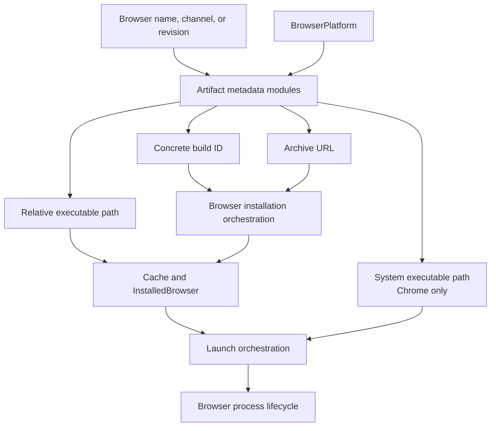
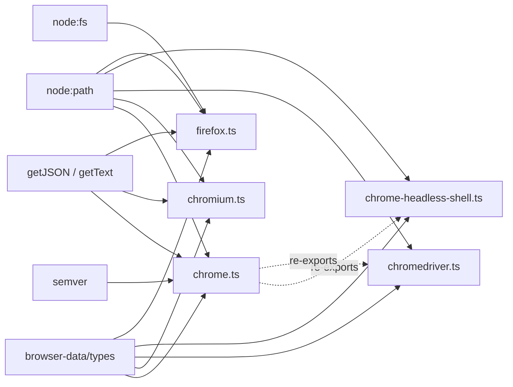
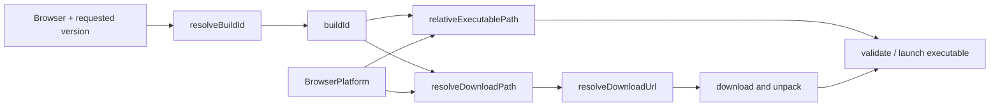
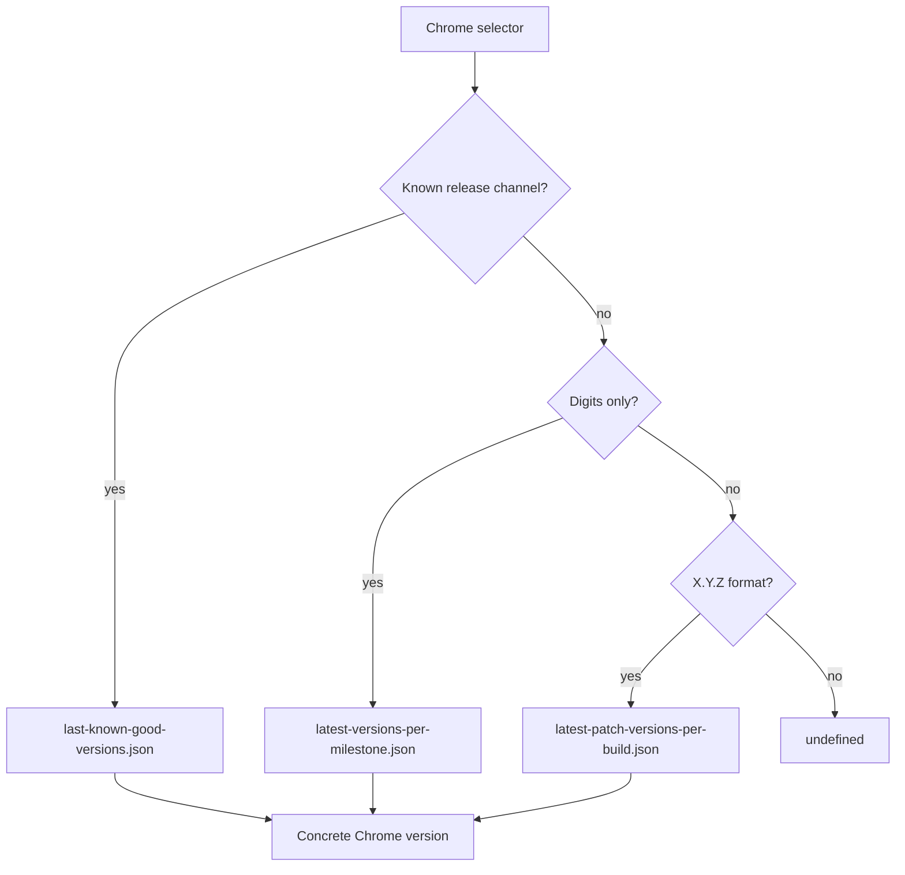
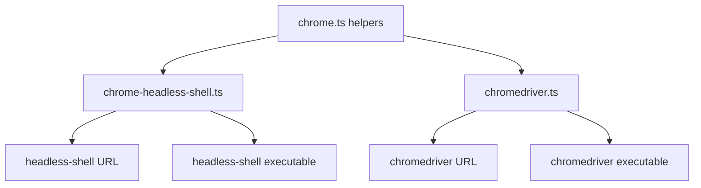
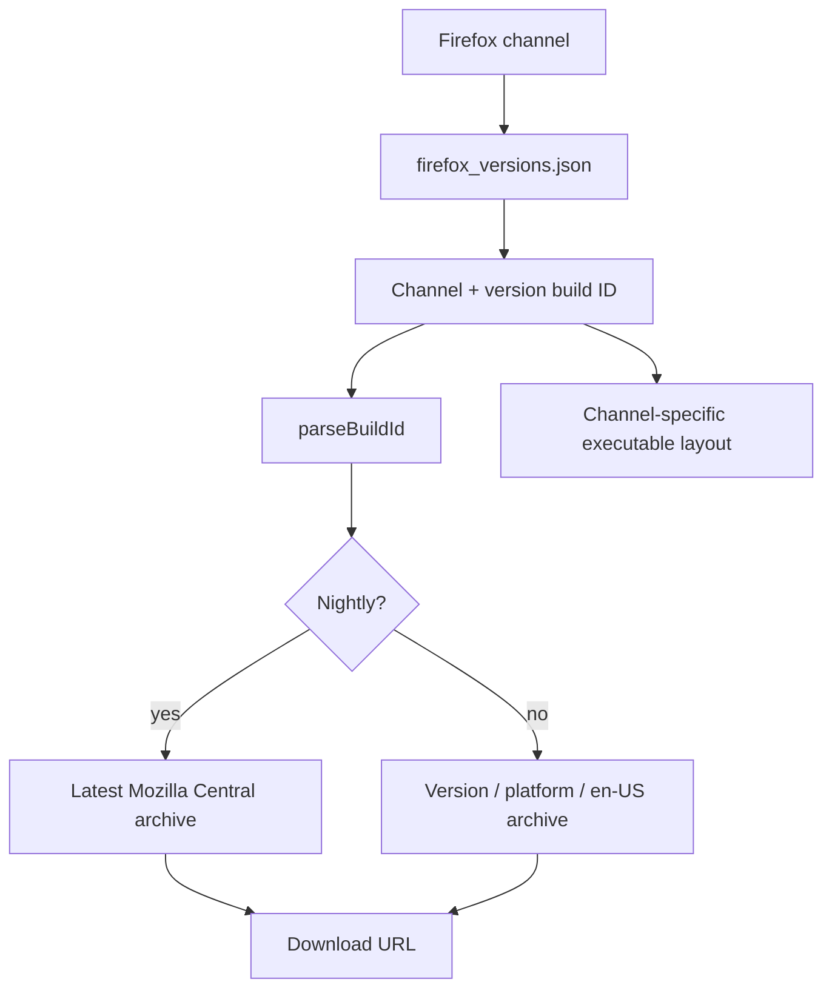
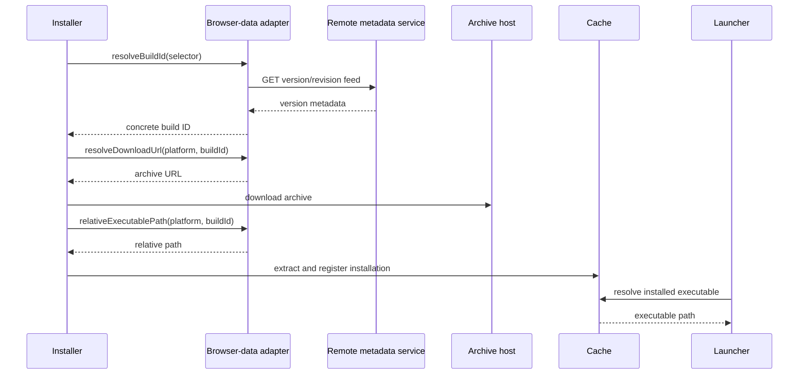
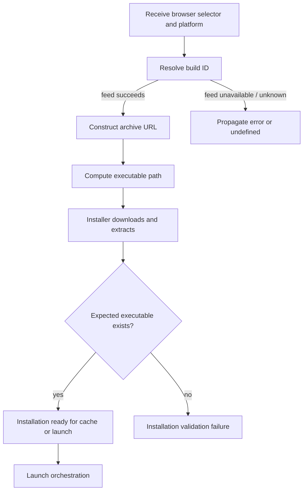
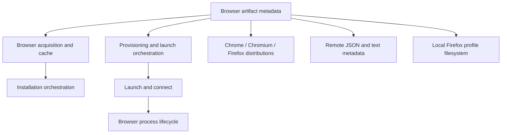

# Browser artifact metadata

## Purpose

The `browser_artifact_metadata` module is Puppeteer’s browser-distribution knowledge base. It converts a logical browser selection—such as Chrome stable, Chromium, Firefox beta, or a pinned build—into the concrete information required by installation and launch code:

- a resolved build ID;
- a platform-specific download path and URL;
- the executable path relative to an extracted installation;
- optional system-browser executable paths;
- browser-version comparison behavior; and
- Firefox test-profile initialization.

The module is deliberately independent of downloading, cache management, and process creation. Those responsibilities are described in [browser_acquisition_and_cache.md](browser_acquisition_and_cache.md), [browser_provisioning_and_launch_orchestration.md](browser_provisioning_and_launch_orchestration.md), and [browser_process_lifecycle.md](browser_process_lifecycle.md).

## Position in the system



Artifact metadata is consumed in two phases:

1. During acquisition, installers resolve a build and download archive, unpack it, and validate the expected executable.
2. During launch, Puppeteer resolves the executable inside the cache or uses a system Chrome path.

The metadata layer does not own either phase. See [browser_acquisition_and_cache_installation.md](browser_acquisition_and_cache_installation.md) for installation sequencing and [launch_and_connect.md](launch_and_connect.md) for launch and connection behavior.

## Architecture



Each browser-data file implements the same conceptual adapter contract, even though the functions are not expressed through a shared interface:

| Artifact adapter | Build resolution | Download layout | Executable layout | Extra behavior |
| --- | --- | --- | --- | --- |
| `chrome.ts` | Chrome channel, milestone, or build prefix | Chrome for Testing | Chrome for Testing executable | Semver comparison and installed-system paths |
| `chrome-headless-shell.ts` | Reuses Chrome build resolution | Chrome for Testing headless-shell archive | Headless-shell executable | Reuses Chrome comparison helpers |
| `chromedriver.ts` | Reuses Chrome build resolution | Chrome for Testing chromedriver archive | Chromedriver executable | Reuses Chrome comparison helpers |
| `chromium.ts` | `LAST_CHANGE` snapshot | Chromium snapshots | Chromium executable | Numeric revision comparison |
| `firefox.ts` | Mozilla channel version feed | Mozilla archive/release layout | Firefox executable | Channel parsing and profile setup |

## Common metadata contract

The installer supplies a `BrowserPlatform` and a build ID to the browser-specific functions. The adapter returns a URL assembled from a platform folder, build identifier, and archive name. The installer later combines the extracted installation directory with `relativeExecutablePath`.



`resolveDownloadUrl` accepts an optional `baseUrl` for mirrors, tests, or private distribution endpoints. The default host is browser-specific. The path functions are also exported, allowing callers to inspect or compose URLs without repeating layout rules.

## Chrome family

### Chrome for Testing

`chrome.ts` targets Chrome for Testing archives hosted under `chrome-for-testing-public`. Platform folders are normalized as follows:

| Platform | Distribution folder | Executable |
| --- | --- | --- |
| Linux / Linux ARM | `linux64` | `chrome-linux64/chrome` |
| macOS Intel | `mac-x64` | `chrome-mac-x64/Google Chrome for Testing.app/Contents/MacOS/Google Chrome for Testing` |
| macOS ARM | `mac-arm64` | `chrome-mac-arm64/Google Chrome for Testing.app/Contents/MacOS/Google Chrome for Testing` |
| Windows 32-bit / 64-bit | `win32` / `win64` | `chrome-win32/chrome.exe` or `chrome-win64/chrome.exe` |

The archive path is:

```text
<buildId>/<platform-folder>/chrome-<platform-folder>.zip
```

### Build resolution

`resolveBuildId` accepts three forms:

- a `ChromeReleaseChannel` such as stable, beta, dev, or canary;
- a numeric milestone such as `120`; or
- a three-part build prefix such as `112.0.23`.

It queries the Chrome for Testing JSON feeds and returns the concrete version. Channel resolution uses the last-known-good channel feed; milestones and build prefixes use their corresponding lookup feeds. Unknown or malformed strings return `undefined` through the permissive overload.



`compareVersions` validates both inputs with `semver`; invalid versions throw rather than being silently ordered. It returns `1`, `0`, or `-1`.

### System Chrome paths

`resolveSystemExecutablePath` maps a Chrome release channel to conventional installed locations. Windows paths use `PROGRAMFILES`; macOS uses `/Applications`; Linux uses `/opt/google`. This function is only for Chrome-family system installations and does not validate that the file exists.

### Headless shell and chromedriver

`chrome-headless-shell.ts` and `chromedriver.ts` reuse Chrome’s build resolution and version comparison. They change only the archive name and executable layout:



This keeps Chrome for Testing version semantics consistent across the browser, headless shell, and driver artifacts.

## Chromium snapshots

`chromium.ts` targets the Chromium snapshot service. Its archive path is:

```text
<platform-folder>/<buildId>/<archive>.zip
```

Platform folder names differ from Chrome for Testing (`Linux_x64`, `Mac`, `Mac_Arm`, `Win`, and `Win_x64`). Windows archive naming is revision-sensitive: revisions after `591479` use `chrome-win.zip`; older revisions use `chrome-win32.zip`.

`resolveBuildId` reads the platform’s `LAST_CHANGE` text file and returns the current snapshot revision. `compareVersions` performs numeric revision comparison, unlike Chrome’s semantic version comparison.

## Firefox artifacts

`firefox.ts` supports stable, ESR, beta, developer edition, and nightly channels. A Firefox build ID is represented as `<channel>_<version>` when resolved by this module; older unprefixed IDs are treated as nightly by `parseBuildId`.



### Download layout and executable layout

Nightly archives are direct files under the latest Mozilla Central endpoint. Release-like channels use `<version>/<platform>/<locale>/<archive>`. Archive compression changes at Firefox major version 135: older builds use `bz2`, newer builds use `xz` on Linux.

Executable locations vary by channel and platform. Nightly macOS packages use `Firefox Nightly.app`; release-like macOS packages use `Firefox.app`. Windows nightly uses `firefox/firefox.exe`, while release-like packages use `core/firefox.exe`. Linux uses `firefox/firefox` for both.

`compareVersions` is a legacy hexadecimal-style numeric comparison and is explicitly less reliable than a full version parser. Callers should treat it as Firefox-specific ordering logic rather than a general semantic-version utility.

### Test profile creation

`createProfile` creates the requested directory and writes a `user.js` containing deterministic preferences. It backs up existing `user.js` and `prefs.js` files with a `.puppeteer` suffix, then writes preferences using `Promise.allSettled`; any failed operation is rethrown. Defaults disable background updates, telemetry, first-run UI, unwanted network activity, and other behavior that could make automation tests nondeterministic. Caller preferences are merged over defaults.

## Component interaction



The remote metadata calls occur only for build resolution. URL and executable-path calculation are deterministic local transformations once the build ID is known. Firefox profile creation is likewise local and is invoked when Firefox launch preparation requires a Puppeteer-compatible profile.

## Process flows and failure behavior



Important boundaries:

- Metadata services can fail during build resolution; adapters do not provide cache or retry policy.
- A malformed Chrome version throws from `compareVersions`.
- Unsupported platform branches have no meaningful path result and are constrained by the `BrowserPlatform` type.
- URL construction does not perform network availability checks; `canDownload` belongs to the acquisition module.
- Executable paths are relative or conventional locations; existence checks belong to cache and launch consumers.

## Dependencies and related modules



Read the adjacent documents for responsibilities outside this module:

- [browser_acquisition_and_cache.md](browser_acquisition_and_cache.md) — cache layout, aliases, installation, and CLI behavior.
- [browser_acquisition_and_cache_installation.md](browser_acquisition_and_cache_installation.md) — download, unpack, validation, and package-install flows.
- [browser_acquisition_and_cache_cli_and_cache.md](browser_acquisition_and_cache_cli_and_cache.md) — command dispatch and cache operations.
- [browser_provisioning_and_launch_orchestration.md](browser_provisioning_and_launch_orchestration.md) — end-to-end provisioning and launch relationship.
- [launch_and_connect.md](launch_and_connect.md) — Puppeteer launch, executable selection, and connection behavior.
- [browser_process_lifecycle.md](browser_process_lifecycle.md) — child-process ownership and shutdown.

## Maintenance guidance

When a browser vendor changes distribution behavior, update the corresponding adapter together:

1. build-ID lookup endpoint and response shape;
2. platform folder and archive naming;
3. archive URL construction;
4. extracted executable path; and
5. version comparison rules.

Changes to archive or executable naming should be validated against every supported platform and channel because acquisition uses the same metadata to download and later validate the installation. Changes to Firefox defaults should preserve caller overrides and the backup behavior for existing profile files.
