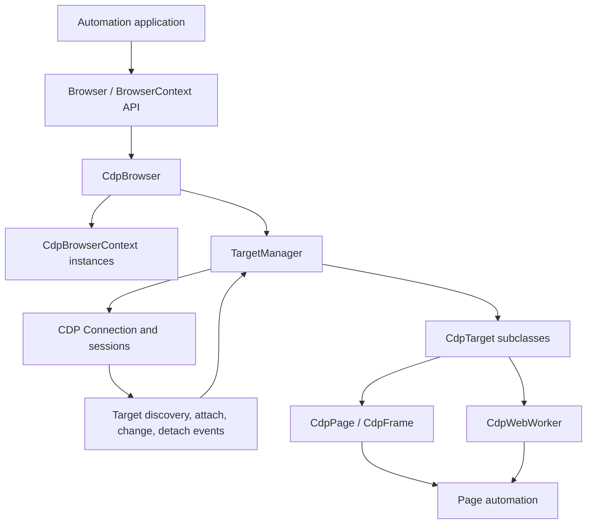
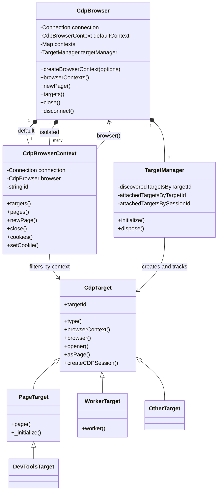
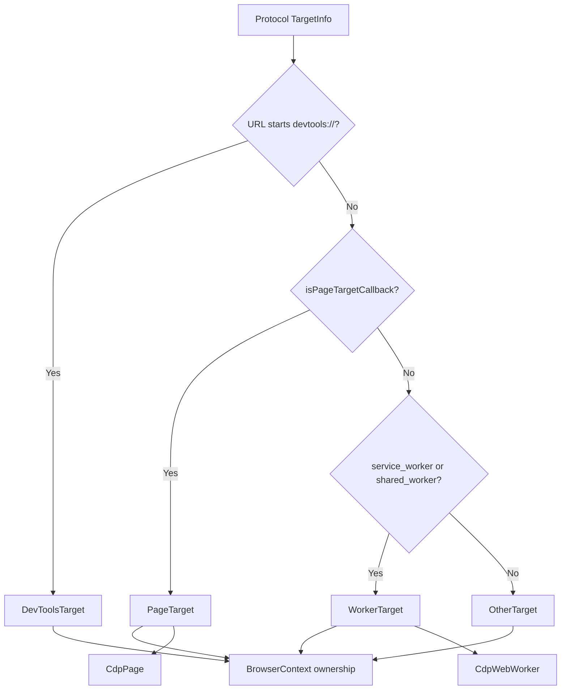
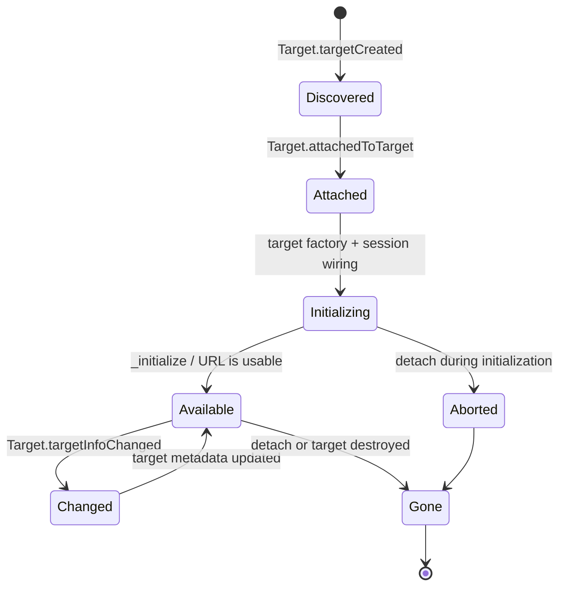
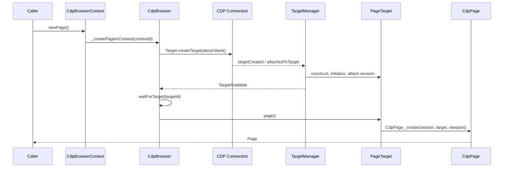
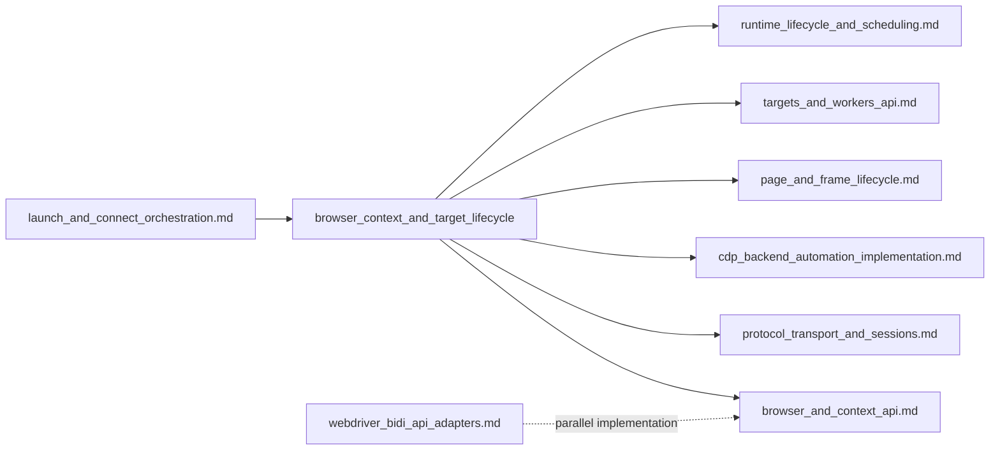

# Browser context and target lifecycle

## Introduction

The `browser_context_and_target_lifecycle` module is the CDP backend’s ownership and event-coordination layer for browsers, isolated browser contexts, and protocol targets. It turns Chrome DevTools Protocol target discovery and auto-attachment events into stable Puppeteer objects (`CdpBrowserContext`, `CdpTarget`, `PageTarget`, `WorkerTarget`, and `OtherTarget`) and publishes lifecycle events to the protocol-neutral browser and context APIs.

The module sits below the public [browser and context API](browser_and_context_api.md) and above [protocol transport and sessions](protocol_transport_and_sessions.md). It does not launch a browser or implement page automation. Launch/connect orchestration creates the CDP connection; this module initializes target discovery, maps targets to contexts, creates page/worker adapters, and tears the graph down safely. Page and frame behavior is documented separately in [page and frame lifecycle](page_and_frame_lifecycle.md).

## Position in the system



The ownership direction is important: a browser owns contexts, contexts select targets, and targets create pages or workers. Protocol sessions are resources used by targets; they are not the public lifecycle boundary. See [protocol transport and session infrastructure](protocol_transport_and_session_infrastructure.md) for session creation, routing, and disposal.

## Architecture



### `CdpBrowser`: the root lifecycle coordinator

`CdpBrowser` is created around an existing `Connection`. It constructs the default context, reconstructs any context IDs supplied by CDP, and creates a `TargetManager` with the browser’s target factory and filtering callbacks.

Its `_attach()` method subscribes to target-manager events and initializes discovery. It also applies download behavior to the default context when requested. `createBrowserContext()` sends `Target.createBrowserContext`, optionally configures download behavior, and stores the resulting context. `browserContexts()` always returns the default context followed by the currently active isolated contexts.

`newPage()` delegates to the default context. `_createPageInContext()` creates an `about:blank` target, waits for that exact target to become visible through `waitForTarget()`, waits for successful initialization, and converts it to a `Page`. This prevents callers from receiving a page before the target manager has attached and configured its session.

The browser translates target-manager events into both browser-wide and context-scoped events:

| Target-manager event | Browser event | Context event | Meaning |
| --- | --- | --- | --- |
| `TargetAvailable` | `targetcreated` | `targetcreated` | Target is attached and successfully initialized. |
| `TargetGone` | `targetdestroyed` | `targetdestroyed` | Target/session is no longer available. |
| `TargetChanged` | `targetchanged` | `targetchanged` | An initialized target changed URL or identity state. |
| `TargetDiscovered` | internal `targetdiscovered` | none | CDP reported a target before it is necessarily attached or exposed. |

`targets()` exposes only targets that pass the target filter, are publicly exposable, and completed initialization. `target()` selects the browser target from that set. `connected` reflects the underlying connection state. `close()` invokes the launch-owned close callback and then disconnects; `disconnect()` disposes the target manager and connection while leaving an externally managed browser running.

### `CdpBrowserContext`: isolation and scoped queries

The default context has no CDP context ID. Additional contexts store the ID returned by `Target.createBrowserContext`. `targets()` filters the browser’s exposed targets by object identity, so a target cannot accidentally appear in two contexts. `pages()` further restricts targets to page-like types and resolves each target’s `page()` adapter.

Context operations map directly to CDP with the context ID when applicable:

* `newPage()` asks the browser to create a page in this context and waits for screenshot operations to finish before doing so.
* `overridePermissions()` maps public web permission names to CDP permission names, then calls `Browser.grantPermissions`.
* `clearPermissionOverrides()` calls `Browser.resetPermissions`.
* `cookies()` and `setCookie()` use `Storage.getCookies` and `Storage.setCookies`, including conversion of partition keys between Puppeteer and CDP shapes.
* `close()` rejects attempts to close the default context and otherwise calls `Target.disposeBrowserContext`; the browser removes the context from its map.

Context closure is therefore a graph operation: CDP destroys the context’s pages and targets, `TargetManager` observes the detach/destroy events, and `CdpBrowser` emits the corresponding target-destroyed notifications before the context disappears from `browserContexts()`.

## Target classification and relationships

`CdpBrowser.#createTarget()` uses `TargetInfo` to select the concrete target class. `devtools://` targets become `DevToolsTarget`; page-like targets are decided by the configurable `isPageTargetCallback`; service and shared workers become `WorkerTarget`; all remaining targets become `OtherTarget`. The browser context is selected from `targetInfo.browserContextId`, falling back to the default context.



Every target retains its target ID, latest `TargetInfo`, owning context, optional CDP session, and child-target set. `opener()` resolves `openerId` through the browser’s exposed target list. Parent sessions register child targets, allowing nested target relationships to be removed when a session detaches.

`CdpTarget.asPage()` creates a `CdpPage` using an existing session or a newly created target session. `PageTarget.page()` memoizes this adapter, so repeated calls reuse the same page object. `WorkerTarget.worker()` similarly memoizes a `CdpWebWorker`. `_isTargetExposed()` hides tab targets and targets with a subtype; initialization status additionally prevents partially configured targets from reaching callers.

## Discovery, auto-attach, and initialization

`TargetManager` is the only component that subscribes directly to CDP target events. It maintains separate maps for discovered protocol information and attached Puppeteer targets:

```mermaid
flowchart LR
    Created[Target.targetCreated] --> Discovered[discoveredTargetsByTargetId]
    Discovered --> DiscoverEvent[TargetDiscovered]
    Init[initialize()] --> DiscoverCmd[Target.setDiscoverTargets]
    Init --> AttachCmd[Target.setAutoAttach]
    AttachCmd --> Attached[Target.attachedToTarget]
    Attached --> Filter{targetFilterCallback}
    Filter -->|Rejected| Ignored[ignoredTargets + silent detach]
    Filter -->|Accepted| Factory[Target factory]
    Factory --> AttachedMap[attachedTargetsByTargetId]
    AttachedMap --> Available[TargetAvailable]
    Available --> BrowserEvent[Browser targetcreated]
```

Initialization enables target discovery, records existing page/iframe targets that must be auto-attached, and enables flattened auto-attach with `waitForDebuggerOnStart`. Attached targets are kept paused while Puppeteer creates the target object, installs session listeners, links parent/child targets, and emits the session-ready signal. Only then does it run `Runtime.runIfWaitingForDebugger`.

The manager waits for initially discovered page and frame targets to attach. A destroyed target removes itself from that wait set, so startup cannot remain blocked on a target that disappeared during initialization. Filtered targets are still tracked internally because CDP continues to emit events for them, but they are silently detached and never forwarded to the public API.

Service workers are special: auto-attaching can keep them alive indefinitely. The manager therefore silently detaches auto-attached service workers, while still creating a lightweight `WorkerTarget` for lifecycle visibility. Explicitly requested worker sessions follow the normal session path.

## Target lifecycle state



`CdpTarget` uses two deferred values: `_initializedDeferred` resolves to `SUCCESS` or `ABORTED`, and `_isClosedDeferred` resolves when the target disappears. `PageTarget` considers a target initialized once it has a non-empty URL, while the base target can be initialized explicitly for browser and worker cases. A target is emitted as created only after successful initialization and only if it is exposed.

When a target detaches, `CdpBrowser` resolves the initialization and closed deferreds, then emits destruction only for targets that had previously reached successful initialization. URL changes on initialized targets produce `targetchanged`; a transition from a subtype to a primary page also emits the relevant CDP session swap event before metadata is updated.

## Page creation and popup flow



For a popup, the opener is resolved from `openerId`. During `PageTarget._initialize()`, if the opener is another `PageTarget`, that opener has a page promise, and it has a `popup` listener, the new page is created and emitted through `PageEvent.Popup`. This preserves the event ordering expected by the public page API while still allowing targets to be discovered before their page adapter exists.

## Disposal and shutdown

```mermaid
flowchart TD
    Close[Browser.close()] --> Callback[Launch close callback]
    Callback --> Disconnect[Browser.disconnect()]
    Disconnect --> ManagerDispose[TargetManager.dispose()]
    ManagerDispose --> RemoveListeners[Remove CDP target listeners]
    Disconnect --> ConnectionDispose[Connection.dispose()]
    ConnectionDispose --> SessionCleanup[Close sessions and reject pending commands]
    SessionCleanup --> Disconnected[Browser disconnected event]
    ContextClose[BrowserContext.close()] --> DisposeContext[Target.disposeBrowserContext]
    DisposeContext --> TargetGone[TargetGone events]
```

`TargetManager.dispose()` removes target and session-detachment listeners. `CdpBrowser._detach()` removes its subscriptions to manager events, and connection disposal handles the lower-level session cleanup. The separation prevents stale target events from being emitted after the browser has disconnected.

## Dependencies and neighboring modules



* [Browser and context API](browser_and_context_api.md) defines the protocol-neutral contracts, browser/context events, cookie helpers, and target waiting semantics consumed by this module.
* [Protocol transport and sessions](protocol_transport_and_sessions.md) owns `Connection`, `CdpCDPSession`, transports, command correlation, and connection teardown.
* [CDP backend automation implementation](cdp_backend_automation_implementation.md) contains the broader CDP implementation, including page, frame, network, input, emulation, and diagnostics components.
* [Page and frame lifecycle](page_and_frame_lifecycle.md) documents the `CdpPage`, `CdpFrame`, frame tree, and page-level lifecycle built from `PageTarget`.
* [Targets and workers API](targets_and_workers_api.md) documents the public target/worker abstractions exposed by these concrete targets.
* [Runtime lifecycle and scheduling](runtime_lifecycle_and_scheduling.md) supplies events, deferreds, timeout behavior, and disposal utilities used by target initialization and shutdown.
* [Launch and connect orchestration](launch_and_connect_orchestration.md) supplies the connection and optional child process that become the browser’s protocol and ownership inputs.

The WebDriver BiDi implementation follows the same public ownership model but has separate target and browsing-context machinery; it should be consulted for BiDi-specific behavior rather than treated as an implementation detail of this CDP module.

## Operational invariants

1. A public target belongs to exactly one browser context and is visible only after successful initialization.
2. `TargetManager` is the sole owner of direct CDP target-event subscriptions.
3. Browser events aggregate target events; context events are emitted only for the target’s owning context.
4. Page and worker adapters are lazy and memoized, while target sessions may be created explicitly through `createCDPSession()`.
5. Filtered or hidden targets can exist in internal CDP state without being exposed through `Browser.targets()`.
6. Browser disconnect disposes target tracking and protocol sessions; context disposal requests CDP context destruction and relies on target lifecycle events for cleanup.
