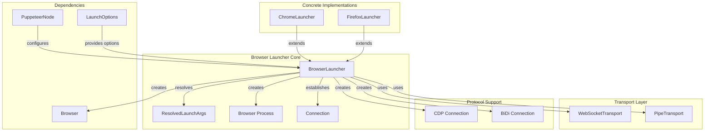
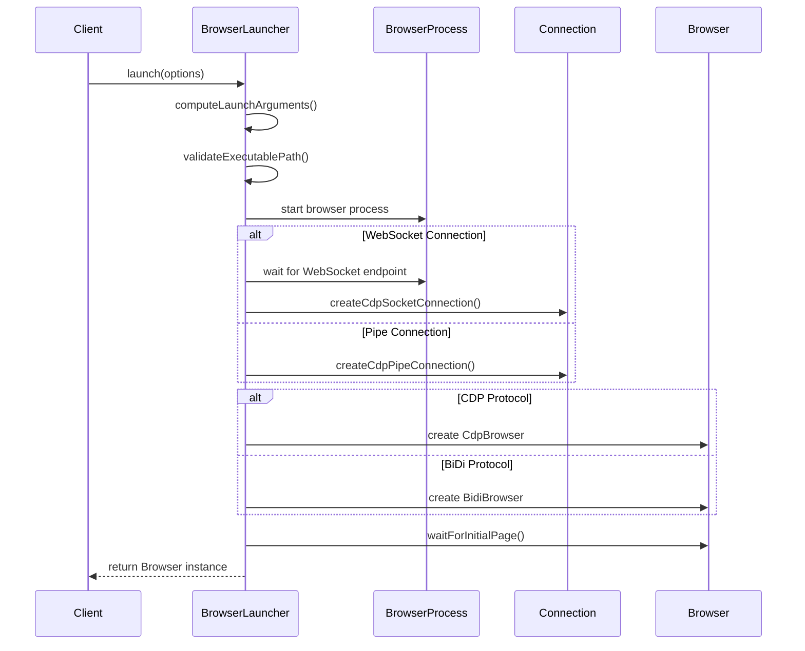
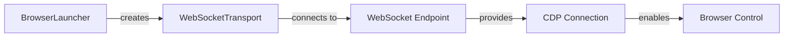
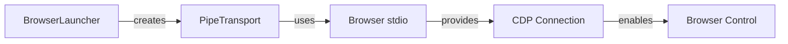
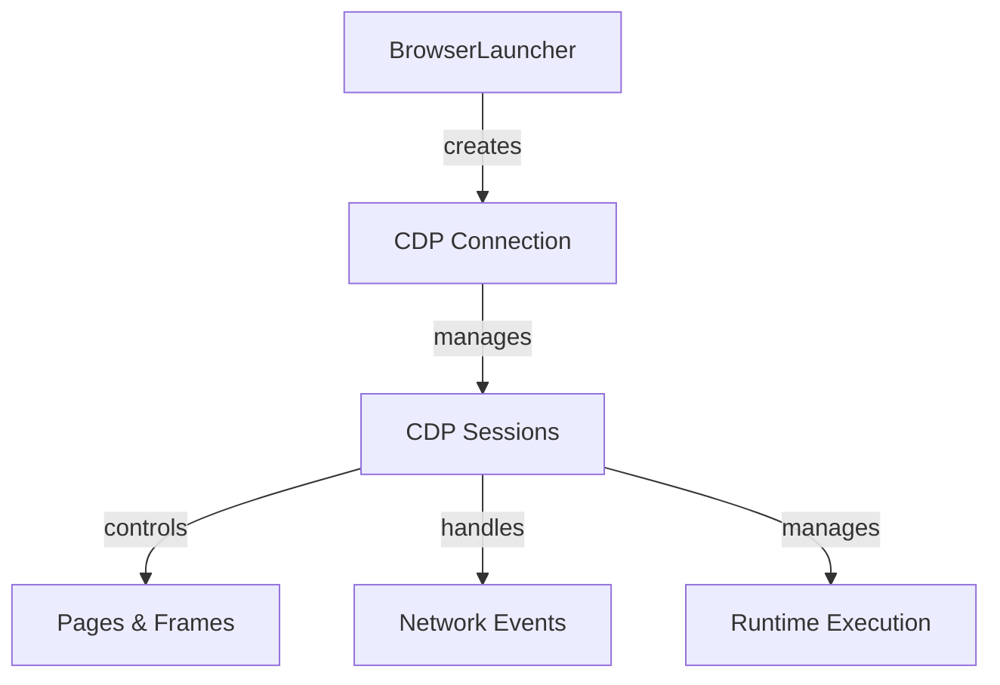
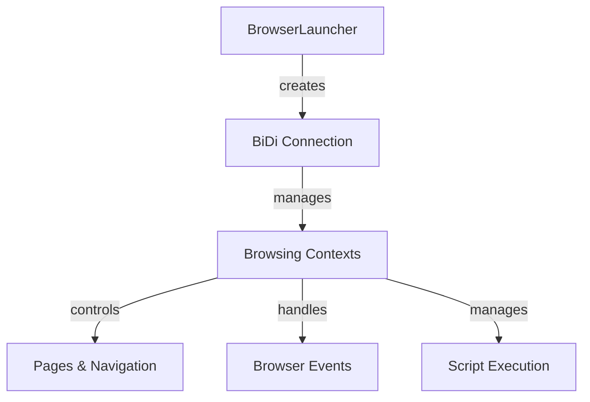
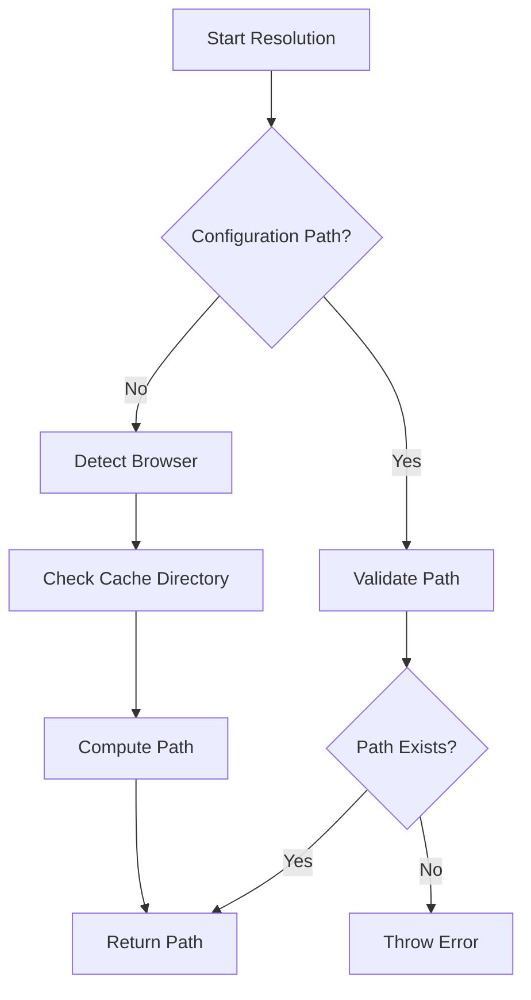
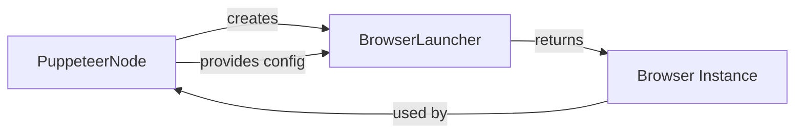

# Browser Launcher Core Module

The `browser_launcher_core` module provides the foundational browser launching infrastructure for Puppeteer. It defines the abstract `BrowserLauncher` class that serves as the base for all browser-specific launchers, handling the complex process of starting, configuring, and connecting to browser instances.

## Overview

The Browser Launcher Core module is responsible for:
- **Browser Process Management**: Starting and stopping browser processes with proper lifecycle management
- **Connection Establishment**: Creating WebSocket or pipe connections to browser instances
- **Protocol Negotiation**: Supporting both Chrome DevTools Protocol (CDP) and WebDriver BiDi protocols
- **Configuration Resolution**: Handling executable paths, user data directories, and launch arguments
- **Error Handling**: Providing robust error handling and timeout management

## Architecture



## Core Components

### BrowserLauncher Class

The abstract `BrowserLauncher` class provides the foundation for all browser launching operations:

```typescript
abstract class BrowserLauncher {
  #browser: SupportedBrowser;
  puppeteer: PuppeteerNode;
  
  // Core launching functionality
  async launch(options: LaunchOptions = {}): Promise<Browser>
  
  // Abstract methods for browser-specific implementations
  abstract executablePath(channel?: ChromeReleaseChannel, validatePath?: boolean): string
  abstract defaultArgs(object: LaunchOptions): string[]
  abstract computeLaunchArguments(options: LaunchOptions): Promise<ResolvedLaunchArgs>
  abstract cleanUserDataDir(path: string, opts: {isTemp: boolean}): Promise<void>
}
```

### Key Responsibilities

1. **Launch Process Orchestration**
   - Validates executable paths and launch arguments
   - Manages browser process lifecycle
   - Handles graceful shutdown and cleanup

2. **Connection Management**
   - Creates WebSocket connections for remote debugging
   - Establishes pipe connections for local communication
   - Manages connection timeouts and error handling

3. **Protocol Support**
   - Supports Chrome DevTools Protocol (CDP)
   - Supports WebDriver BiDi protocol
   - Handles protocol-specific connection establishment

## Launch Process Flow



## Connection Types

### WebSocket Connection
Used for remote debugging and standard browser automation:



### Pipe Connection
Used for local communication with enhanced security:



## Protocol Support

### Chrome DevTools Protocol (CDP)
The primary protocol for Chrome and Chromium-based browsers:



### WebDriver BiDi Protocol
Modern protocol supporting both Chrome and Firefox:



## Configuration and Options

### Launch Options
The launcher accepts comprehensive configuration through `LaunchOptions`:

- **Browser Selection**: Chrome, Firefox, or specific channels
- **Execution Mode**: Headless, headed, or shell mode
- **Network Configuration**: Proxy settings, network interception
- **Security Settings**: Certificate handling, extension management
- **Performance Tuning**: Timeout values, slow motion settings

### Executable Path Resolution
The launcher resolves browser executables through multiple strategies:



## Error Handling

The launcher provides comprehensive error handling for common failure scenarios:

- **Executable Not Found**: Clear error messages with resolution suggestions
- **Connection Timeouts**: Configurable timeout values with graceful fallbacks
- **Process Failures**: Automatic cleanup and resource management
- **Protocol Errors**: Protocol-specific error handling and recovery

## Integration Points

### With PuppeteerNode
The launcher integrates closely with the main Puppeteer Node interface:



### With Browser Management
The launcher coordinates with the broader browser management system:

- **Cache Management**: Integrates with [cache_management](cache_management.md) for browser binaries
- **Installation System**: Works with [installation_system](installation_system.md) for browser setup
- **Launch System**: Coordinates with [launch_system](launch_system.md) for process management

### With Transport Layer
The launcher utilizes various transport mechanisms:

- **WebSocket Transport**: For remote debugging connections
- **Pipe Transport**: For local process communication
- **Connection Management**: Handles connection lifecycle and error recovery

## Browser-Specific Implementations

The abstract launcher is extended by browser-specific implementations:

### Chrome Launcher
- Handles Chrome-specific arguments and features
- Manages Chrome extension loading
- Supports Chrome DevTools Protocol optimizations

### Firefox Launcher
- Manages Firefox-specific configuration
- Handles Firefox profile management
- Supports WebDriver BiDi protocol requirements

For detailed information about specific implementations, see:
- [chrome_launcher](chrome_launcher.md)
- [firefox_launcher](firefox_launcher.md)

## Usage Patterns

### Basic Browser Launch
```typescript
const launcher = new ChromeLauncher(puppeteerNode);
const browser = await launcher.launch({
  headless: true,
  args: ['--no-sandbox']
});
```

### Advanced Configuration
```typescript
const browser = await launcher.launch({
  executablePath: '/path/to/chrome',
  userDataDir: '/path/to/profile',
  protocol: 'webDriverBiDi',
  timeout: 60000,
  pipe: true
});
```

## Performance Considerations

- **Startup Time**: Optimized argument resolution and process startup
- **Memory Usage**: Efficient resource management and cleanup
- **Connection Overhead**: Minimal protocol overhead for communication
- **Concurrent Launches**: Support for multiple browser instances

## Security Features

- **Sandboxing**: Proper browser sandboxing configuration
- **Certificate Handling**: Configurable certificate validation
- **Extension Security**: Safe extension loading and management
- **Process Isolation**: Proper process separation and cleanup

## Related Modules

- **Core API**: [core_api](core_api.md) - Browser control interfaces
- **CDP Implementation**: [cdp_implementation](cdp_implementation.md) - Chrome DevTools Protocol support
- **BiDi Implementation**: [bidi_implementation](bidi_implementation.md) - WebDriver BiDi protocol support
- **Transport Layer**: [transport_layer](transport_layer.md) - Communication mechanisms
- **Browser Management**: [browser_management](browser_management.md) - Browser lifecycle management

The Browser Launcher Core module serves as the critical foundation for all browser automation in Puppeteer, providing a robust, extensible, and secure platform for launching and connecting to browser instances across different browsers and protocols.