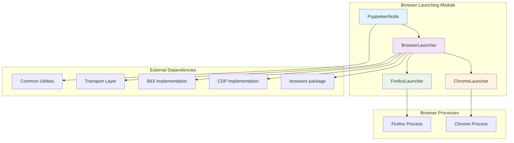
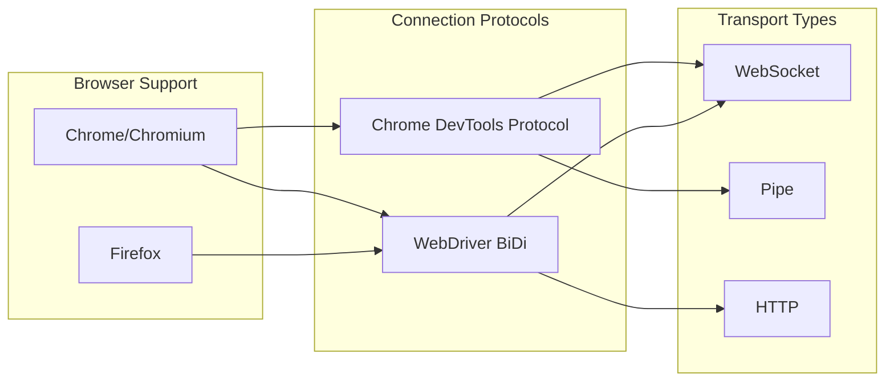
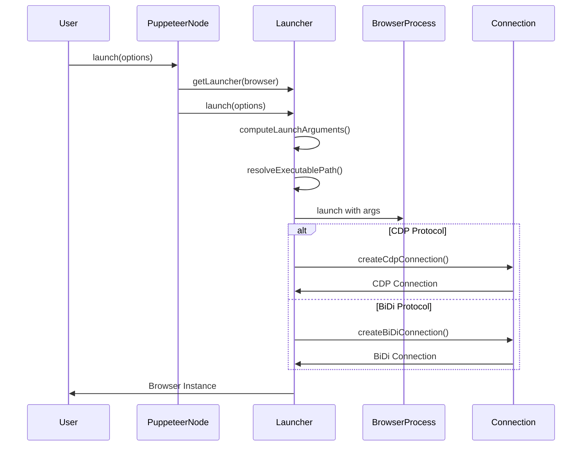

# Browser Launching Module

## Overview

The Browser Launching module is a core component of Puppeteer that provides comprehensive browser lifecycle management capabilities. It serves as the primary interface for launching, configuring, and managing browser instances across different browser types (Chrome and Firefox) and connection protocols (CDP and WebDriver BiDi).

## Purpose

This module abstracts the complexity of browser process management, providing:

- **Multi-browser Support**: Unified interface for launching Chrome and Firefox browsers
- **Protocol Flexibility**: Support for both Chrome DevTools Protocol (CDP) and WebDriver BiDi
- **Configuration Management**: Comprehensive launch options and argument handling
- **Process Lifecycle**: Complete browser process management from launch to cleanup
- **Connection Establishment**: Multiple connection types (WebSocket, Pipe, BiDi)

## Architecture Overview



## Core Components

### 1. PuppeteerNode
The main entry point that extends the base Puppeteer class with Node.js-specific functionality. This component serves as the primary interface for browser launching operations and configuration management.

**Key Responsibilities:**
- Browser selection and launcher instantiation
- Configuration management and browser-specific settings
- Launch orchestration and process coordination
- Cache management for browser binaries

For detailed implementation details, see [PuppeteerNode Documentation](puppeteer_node.md).

### 2. BrowserLauncher (Abstract Base)
The foundational abstract class that defines the browser launching contract and provides common functionality for all browser types.

**Key Responsibilities:**
- Launch process orchestration and workflow management
- Connection establishment and management (CDP/BiDi)
- Browser process lifecycle handling
- Protocol support and transport mechanism management

For comprehensive details, see [Browser Launcher Core Documentation](browser_launcher_core.md).

### 3. ChromeLauncher
Chrome-specific implementation that extends BrowserLauncher with Chrome/Chromium-specific functionality and optimizations.

**Key Responsibilities:**
- Chrome command-line argument management
- Feature flag handling and optimization
- User data directory and profile management
- Chrome release channel support

For detailed Chrome-specific implementation, see [Chrome Launcher Documentation](chrome_launcher.md).

### 4. FirefoxLauncher
Firefox-specific implementation that provides Firefox browser launching capabilities with WebDriver BiDi protocol support.

**Key Responsibilities:**
- Firefox preferences and profile management
- Native WebDriver BiDi protocol support
- Automated profile creation and configuration
- Cross-platform Firefox argument handling

For detailed Firefox-specific implementation, see [Firefox Launcher Documentation](firefox_launcher.md).

## Key Features

### Multi-Protocol Support



### Launch Process Flow



## Integration Points

### Dependencies on Other Modules

- **[CDP Implementation](cdp_implementation.md)**: For Chrome DevTools Protocol connections and browser control
- **[BiDi Implementation](bidi_implementation.md)**: For WebDriver BiDi protocol support
- **[Transport Layer](transport_layer.md)**: For WebSocket and pipe communication
- **[Common Utilities](common_utilities.md)**: For configuration, event handling, and shared utilities
- **[Browser Management](browser_management.md)**: For browser binary installation and cache management

### External Package Dependencies

- **@puppeteer/browsers**: Browser binary management, installation, and executable path resolution
- **Node.js APIs**: File system operations, process management, and OS utilities

## Configuration and Options

The module supports extensive configuration through `LaunchOptions`:

```typescript
interface LaunchOptions {
  browser?: 'chrome' | 'firefox';
  protocol?: 'cdp' | 'webDriverBiDi';
  executablePath?: string;
  channel?: ChromeReleaseChannel;
  headless?: boolean | 'shell';
  args?: string[];
  userDataDir?: string;
  timeout?: number;
  // ... many more options
}
```

## Error Handling and Resilience

The module implements comprehensive error handling:

- **Executable Validation**: Ensures browser executables exist before launch
- **Connection Timeouts**: Configurable timeouts for connection establishment
- **Graceful Shutdown**: Proper cleanup of browser processes and temporary directories
- **Protocol Fallbacks**: Intelligent protocol selection based on browser capabilities

## Performance Considerations

- **Lazy Launcher Creation**: Launchers are created only when needed
- **Temporary Directory Management**: Automatic cleanup of temporary user data directories
- **Process Monitoring**: Efficient browser process lifecycle management
- **Connection Pooling**: Reuse of launcher instances for the same browser type

## Usage Examples

### Basic Browser Launch
```typescript
const puppeteer = new PuppeteerNode();
const browser = await puppeteer.launch({
  browser: 'chrome',
  headless: true
});
```

### Advanced Configuration
```typescript
const browser = await puppeteer.launch({
  browser: 'firefox',
  protocol: 'webDriverBiDi',
  args: ['--no-sandbox'],
  timeout: 60000
});
```

## Future Considerations

- **Additional Browser Support**: Potential support for Safari and Edge
- **Enhanced BiDi Features**: Expanded WebDriver BiDi protocol capabilities
- **Performance Optimizations**: Further improvements in launch time and resource usage
- **Cloud Integration**: Enhanced support for cloud-based browser instances

This module serves as the foundation for all browser automation activities in Puppeteer, providing a robust, flexible, and extensible platform for browser lifecycle management across different browsers and protocols.