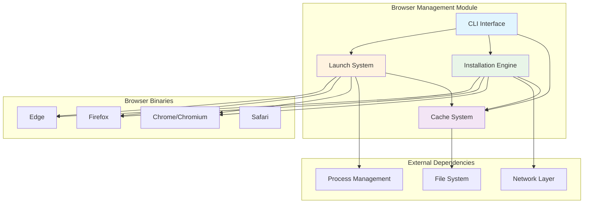
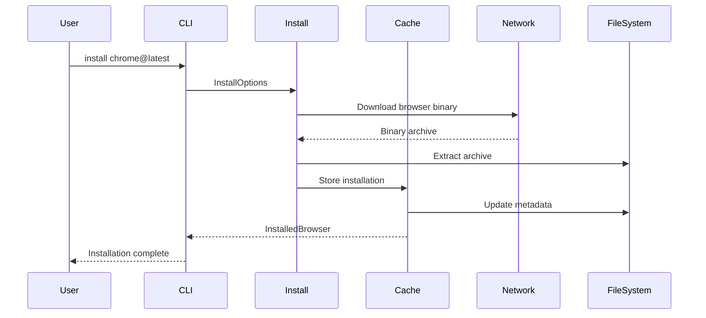
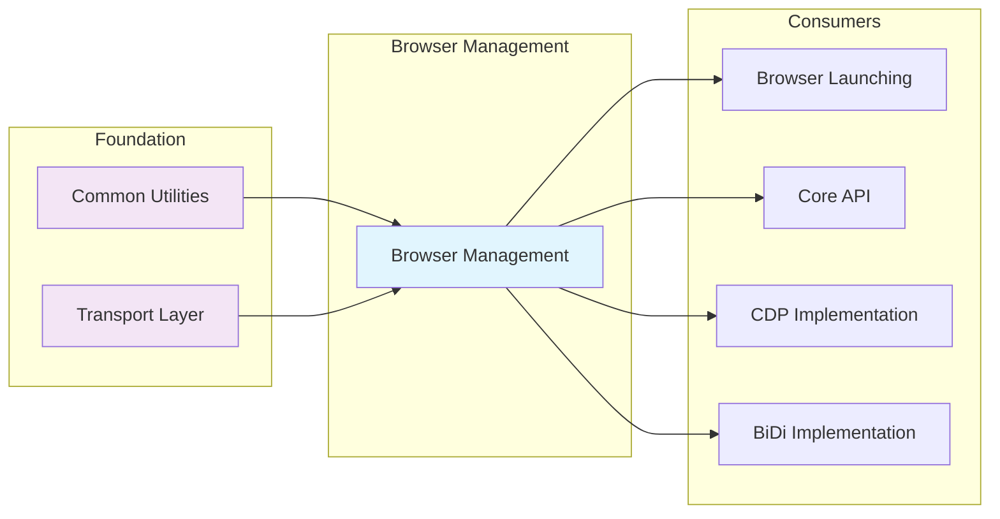

# Browser Management Module

## Overview

The Browser Management module is a comprehensive system for downloading, installing, caching, and launching browser binaries across different platforms. It serves as the foundation for browser automation by providing reliable browser lifecycle management capabilities.

## Purpose

This module enables:
- **Browser Installation**: Download and install browser binaries from official sources
- **Cache Management**: Efficient storage and retrieval of browser installations
- **Cross-Platform Support**: Unified interface for different operating systems and architectures
- **Version Management**: Handle multiple browser versions and build IDs
- **Launch Operations**: Start browser processes with configurable options
- **Command Line Interface**: User-friendly CLI for browser management tasks

## Architecture Overview



## Sub-Modules

### 1. Cache Management System
Manages local storage and metadata for browser installations with hierarchical organization and efficient retrieval mechanisms.

**[📖 Detailed Documentation](cache_management.md)**

### 2. Installation System  
Handles downloading, extracting, and installing browser binaries from official sources with progress tracking and fallback mechanisms.

**[📖 Detailed Documentation](installation_system.md)**

### 3. Launch System
Manages browser process lifecycle including startup, configuration, monitoring, and cleanup operations across different platforms.

**[📖 Detailed Documentation](launch_system.md)**

### 4. CLI Interface
Provides comprehensive command-line interface for browser management operations with user-friendly commands and interactive features.

**[📖 Detailed Documentation](cli_interface.md)**

## Data Flow



## Integration Points

This module serves as the foundation for browser management and integrates with several other system modules:

### Upstream Dependencies
- **[Common Utilities](common_utilities.md)**: Leverages configuration management and utility functions
- **[Transport Layer](transport_layer.md)**: Uses connection transport mechanisms for browser communication

### Downstream Consumers  
- **[Browser Launching](browser_launching.md)**: Extends this module's launch capabilities with Puppeteer-specific features
- **[Core API](core_api.md)**: Consumes browser instances and management services for automation workflows
- **[CDP Implementation](cdp_implementation.md)**: Uses managed browser instances for Chrome DevTools Protocol communication
- **[BiDi Implementation](bidi_implementation.md)**: Leverages browser management for WebDriver BiDi protocol support

### Integration Flow


## Key Features

### Multi-Platform Support
- Windows (32-bit and 64-bit)
- macOS (Intel and Apple Silicon)
- Linux (various distributions)

### Browser Support
- Google Chrome (stable, beta, dev, canary)
- Chromium
- Mozilla Firefox (stable, beta, nightly, ESR)
- Chrome for Testing
- ChromeDriver
- Chrome Headless Shell

### Cache Management
- Efficient storage with deduplication
- Version aliasing and resolution
- Automatic cleanup and maintenance
- Metadata tracking for installed browsers

### Installation Features
- Progress tracking with visual feedback
- Retry mechanisms for failed downloads
- System dependency installation (Linux)
- Fallback download sources

## Usage Examples

### Basic Installation
```bash
# Install latest Chrome
npx @puppeteer/browsers install chrome

# Install specific version
npx @puppeteer/browsers install chrome@115.0.5790.170

# Install with custom cache directory
npx @puppeteer/browsers install chrome --path /custom/cache
```

### Launch Operations
```bash
# Launch installed browser
npx @puppeteer/browsers launch chrome@115.0.5790.170

# Launch with custom arguments
npx @puppeteer/browsers launch chrome@latest -- --no-sandbox --disable-dev-shm-usage
```

### Cache Management
```bash
# List installed browsers
npx @puppeteer/browsers list

# Clear cache
npx @puppeteer/browsers clear
```

## Configuration

The module supports various configuration options:

- **Cache Directory**: Customizable storage location
- **Download Sources**: Configurable base URLs for downloads
- **Platform Detection**: Automatic or manual platform specification
- **Progress Callbacks**: Customizable download progress reporting
- **System Dependencies**: Optional automatic dependency installation

## Error Handling

The module implements comprehensive error handling:

- Network failures with retry mechanisms
- Invalid browser versions or platforms
- Insufficient permissions for system operations
- Corrupted downloads or installations
- Process launch failures

## Performance Considerations

- **Parallel Downloads**: Support for concurrent browser installations
- **Incremental Updates**: Efficient handling of browser updates
- **Cache Optimization**: Minimal disk space usage with shared resources
- **Process Management**: Efficient browser process lifecycle handling

## Security Features

- **Checksum Validation**: Verification of downloaded binaries
- **Secure Downloads**: HTTPS-only download sources
- **Permission Management**: Proper file system permissions
- **Process Isolation**: Secure browser process launching

## Future Enhancements

- Enhanced browser version management
- Improved cross-platform compatibility
- Advanced caching strategies
- Extended browser support
- Performance optimizations