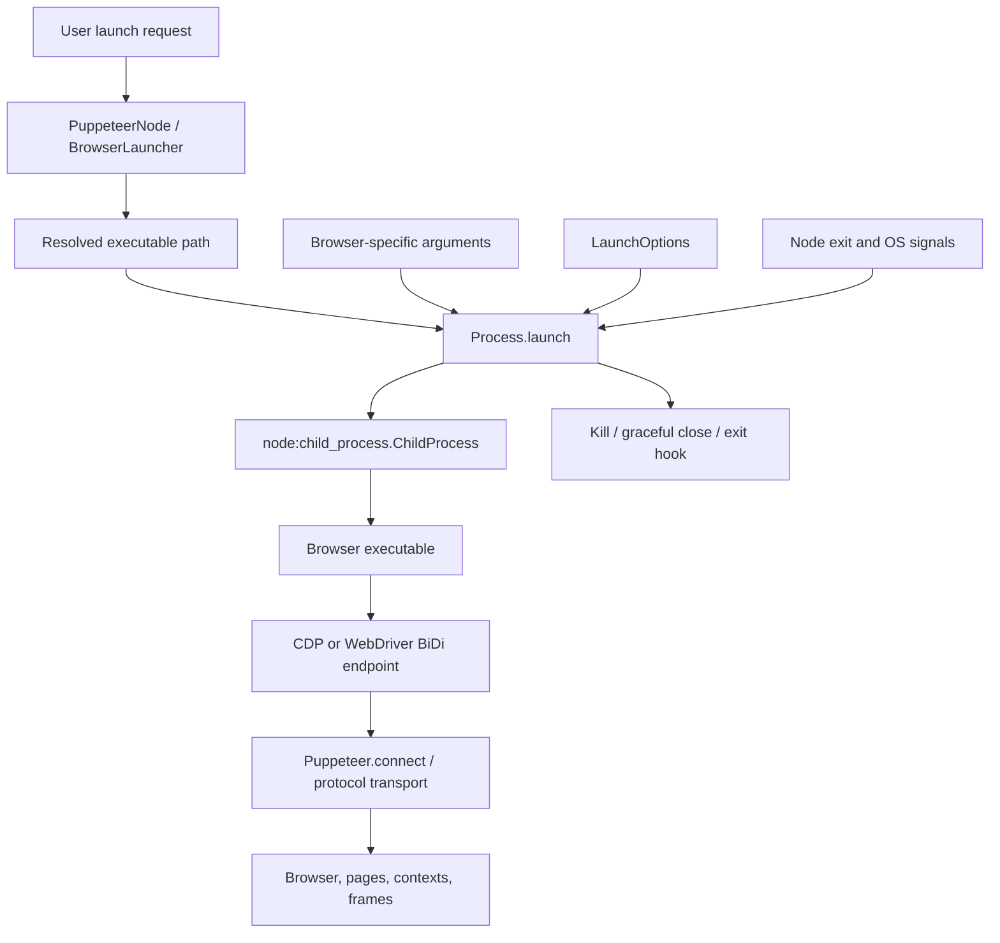
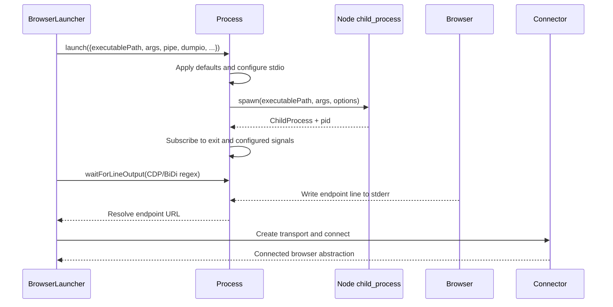
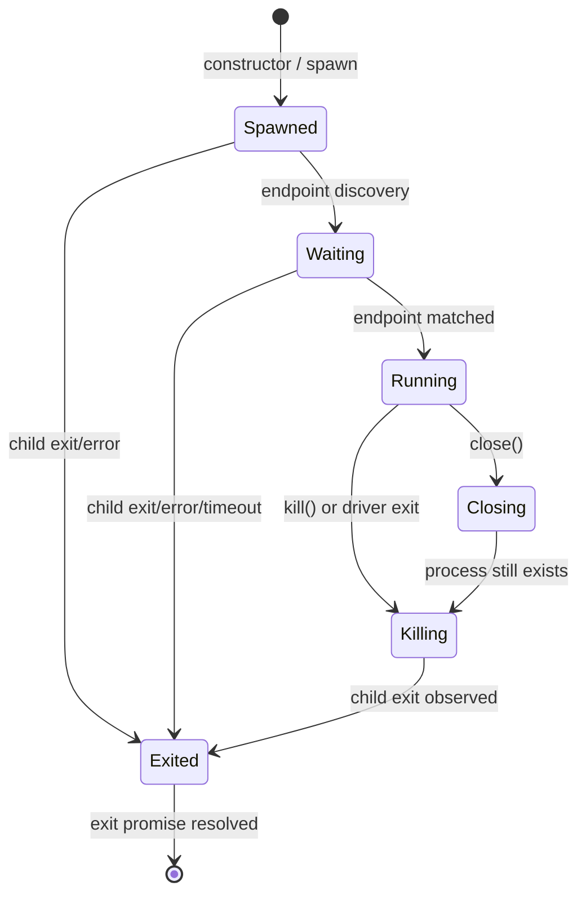
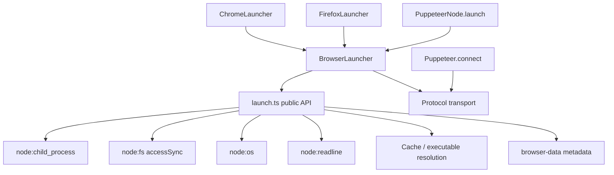

# Browser process lifecycle

## Purpose

The `browser_process_lifecycle` module owns the operating-system process that runs a Puppeteer-managed browser. Its public implementation is `Process` in `packages/browsers/src/launch.ts`. The class starts a browser executable, configures its streams, discovers the browser’s automation endpoint, responds to driver-process signals, and guarantees that exit hooks and event listeners are cleaned up exactly once.

This module is deliberately below browser selection and automation protocol layers. Executable discovery and browser-specific launch arguments are described in [launch_and_connect.md](launch_and_connect.md); browser installation and cache resolution are described in [browser_acquisition_and_cache.md](browser_acquisition_and_cache.md) and [browser_artifact_metadata.md](browser_artifact_metadata.md). Once a process is connected, CDP and WebDriver BiDi transport/session behavior belongs to the protocol infrastructure documented by those modules.

## Position in the system



`launch()` is a small public factory that returns a `Process`. The constructor performs the actual spawn and installs lifecycle handlers. Higher-level launchers retain the returned object to expose the underlying Node child process, wait for endpoint output, and close the browser when the automation session ends.

## Architecture

```mermaid
flowchart LR
    API[launch(opts)] --> P[Process]
    P --> Defaults[Apply defaults]
    P --> Stdio[Configure stdio]
    P --> Spawn[childProcess.spawn]
    Spawn --> Streams[stdout / stderr / pipe streams]
    P --> Events[Shared process event dispatchers]
    P --> ExitPromise[browserProcessExiting]
    Streams --> Endpoint[waitForLineOutput(regex)]
    Events --> Signals[exit, SIGINT, SIGTERM, SIGHUP]
    Signals --> Close[close or kill]
    ExitPromise --> Hooks[onExit once]
```

### Main responsibilities

| Component | Responsibility |
| --- | --- |
| `launch(opts)` | Public factory for a managed browser process. |
| `Process` | Spawn, stream setup, endpoint detection, signal handling, termination, and exit synchronization. |
| `Process.nodeProcess` | Exposes the underlying `ChildProcess` for higher-level launchers and diagnostics. |
| `waitForLineOutput(regex, timeout)` | Reads browser stderr until a protocol endpoint regex matches, or reports launch failure/timeout. |
| `close()` | Runs the exit hook, terminates a still-running browser, and waits for the exit promise. |
| `kill()` | Forcefully terminates the process or process group and removes driver-process listeners. |
| `TimeoutError` | Identifies endpoint-discovery timeouts separately from ordinary launch failures. |

## Launch sequence



The two exported endpoint patterns are:

```text
^DevTools listening on (ws://.*)$
^WebDriver BiDi listening on (ws://.*)$
```

`waitForLineOutput` consumes stderr with a readline interface. Non-matching lines are accumulated so a failed launch can include browser diagnostics. On a match it removes all temporary listeners and resolves the captured WebSocket URL. On browser `exit`, `error`, or timeout it performs the same cleanup and rejects with either a troubleshooting launch error or `TimeoutError`.

## Launch options and stdio

`LaunchOptions` separates process concerns from browser-specific arguments:

- `executablePath` is the absolute executable to run.
- `args` supplies browser command-line arguments.
- `env` supplies the child environment.
- `pipe` selects automation over extra file-descriptor streams instead of a WebSocket.
- `dumpio` forwards browser stdout and stderr to the driver’s stdout and stderr.
- `handleSIGINT`, `handleSIGTERM`, and `handleSIGHUP` control driver-process signal handling.
- `detached` defaults to `true` on non-Windows platforms, creating a killable process group.
- `onExit` is an asynchronous callback invoked once during browser shutdown.

The stdio layout is derived from `pipe` and `dumpio`:

| Mode | Configured stdio | Effect |
| --- | --- | --- |
| WebSocket, no dump | `['pipe', 'ignore', 'pipe']` | Keeps browser stdin/stdout internal and reads stderr for endpoint/errors. |
| WebSocket, dump | `['pipe', 'pipe', 'pipe']` | Makes stdout and stderr available; both are forwarded when `dumpio` is enabled. |
| Pipe, no dump | `['ignore', 'ignore', 'ignore', 'pipe', 'pipe']` | Opens the two additional automation channels. |
| Pipe, dump | `['ignore', 'pipe', 'pipe', 'pipe', 'pipe']` | Opens automation channels and exposes browser output. |

The constructor forwards only environment keys beginning with `puppeteer_` to debug logging, reducing accidental exposure of unrelated environment values while retaining useful diagnostics.

## Runtime state and invariants



Important invariants:

1. `#exited` is set only when the child’s `exit` event is observed.
2. `#hooksRan` prevents `onExit` from running more than once, even if shutdown is requested both externally and by a signal.
3. `#clearListeners()` unregisters the instance’s handlers from the shared dispatchers after exit or forced termination.
4. `hasClosed()` exposes the same completion promise used by `close()`, allowing callers to await the actual OS exit.
5. `kill()` first checks that a PID exists. This handles failed spawns where no PID was assigned.

## Signal and shutdown behavior

```mermaid
flowchart TD
    Event{Driver process event} --> Exit[exit]
    Event --> Int[SIGINT]
    Event --> Term[SIGTERM]
    Event --> Hup[SIGHUP]
    Exit --> Kill[Force kill browser]
    Int --> KillInt[kill browser]
    KillInt --> Exit130[driver exits with code 130]
    Term --> Graceful[close browser asynchronously]
    Hup --> Graceful
    CloseCall[Process.close()] --> Hook[Run onExit once]
    Hook --> Alive{Browser still alive?}
    Alive -->|yes| Kill
    Alive -->|no| Await[Await browserProcessExiting]
    Kill --> Await
    Graceful --> Await
```

Signal behavior is intentionally asymmetric:

- Driver `exit` force-kills the browser so child processes are not orphaned.
- `SIGINT` kills the browser and exits the driver with status `130`.
- `SIGTERM` and `SIGHUP` invoke asynchronous `close()`, allowing the exit hook to run before termination.
- Explicit `close()` runs the hook before killing a live browser and then waits for the browser exit event.

On Windows, `kill()` prefers `taskkill /pid <pid> /T /F` to terminate the process tree. On non-Windows platforms it kills the detached process group with a negative PID and `SIGKILL`. If either strategy fails, it falls back to `ChildProcess.kill('SIGKILL')`. Failure of both paths produces an error explaining that manually launched browser processes may need cleanup.

## Endpoint discovery and errors

Endpoint discovery is line-oriented and depends on the browser writing a matching announcement to stderr. It can fail in three principal ways:

| Failure | Result |
| --- | --- |
| Browser emits `error` or exits before a match | Rejected error containing captured stderr and the Puppeteer troubleshooting URL. |
| Configured timeout expires | `TimeoutError` with the elapsed timeout. |
| Browser never emits the selected protocol line | The caller remains pending until timeout or process termination. |

The caller chooses the regular expression, so the lifecycle layer remains protocol-neutral while supporting both CDP and WebDriver BiDi. The actual transport is created by the [protocol transport and session infrastructure](protocol_transport_and_session_infrastructure.md), and the resulting browser object is implemented by the CDP and BiDi backend modules.

## Dependencies and consumers



The imports of `Cache`, platform detection, and browser-data resolution support the executable-path APIs in the same file; `Process` itself only needs Node process primitives. This separation lets acquisition decide which binary is available and lets launch orchestration decide which arguments and protocol endpoint to use, while `Process` remains responsible for OS lifecycle correctness.

See also:

- [browser_acquisition_and_cache.md](browser_acquisition_and_cache.md) for installation, cache layout, and executable resolution.
- [browser_artifact_metadata.md](browser_artifact_metadata.md) for browser/platform URL and executable-path rules.
- [launch_and_connect.md](launch_and_connect.md) for `PuppeteerNode`, `BrowserLauncher`, Chrome/Firefox launch arguments, and connection setup.
- [protocol_transport_and_session_infrastructure.md](protocol_transport_and_session_infrastructure.md) for WebSocket, pipe, CDP, and BiDi transport behavior.

## Operational guidance

- Prefer `close()` when the caller controls normal shutdown; it preserves the one-time exit-hook contract and waits for completion.
- Use `kill()` for emergency cleanup or when the driver is exiting unexpectedly.
- Supply a timeout to `waitForLineOutput` when launch failure must not leave a pending operation.
- Use `dumpio` during diagnosis to forward browser output, but avoid enabling it by default in applications that do not want browser logs mixed with application logs.
- Be aware that detached process-group behavior differs by platform; process-tree cleanup is strongest on non-Windows systems and through `taskkill` on Windows.
