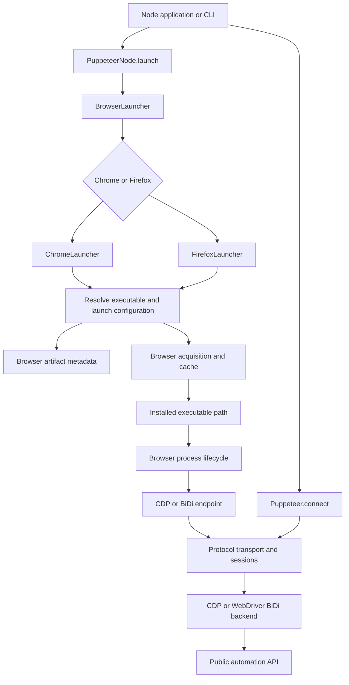
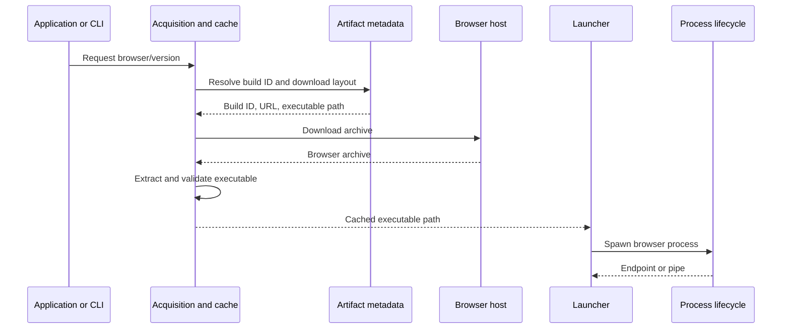
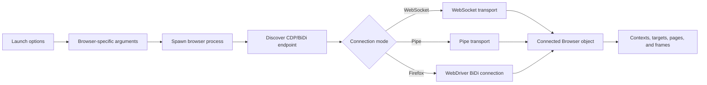

# Browser provisioning and launch orchestration

## Purpose

The `browser_provisioning_and_launch_orchestration` module manages Puppeteer’s path from browser acquisition to a connected automation session. It:

- Resolves browser artifacts, versions, platforms, and executable paths.
- Downloads and caches managed browser binaries.
- Builds Chrome and Firefox launch configurations.
- Starts and monitors browser processes.
- Connects through CDP, WebDriver BiDi, WebSocket, or pipe transports.
- Handles startup failures, temporary profiles, cleanup, and shutdown.

## Architecture

### Provisioning flow

### Launch and connection flow

## Repository structure

| Component | Source path | Documentation |
| --- | --- | --- |
| Browser acquisition and cache | `packages/browsers/src` | [browser_acquisition_and_cache.md](/home/anhnh/CodeWiki-journal/results/generation/puppeteer/browser_acquisition_and_cache.md) |
| Browser artifact metadata | `packages/browsers/src/browser-data` | [browser_artifact_metadata.md](/home/anhnh/CodeWiki-journal/results/generation/puppeteer/browser_artifact_metadata.md) |
| Browser process lifecycle | `packages/browsers/src/launch.ts` | [browser_process_lifecycle.md](/home/anhnh/CodeWiki-journal/results/generation/puppeteer/browser_process_lifecycle.md) |
| Launch and connect | `packages/puppeteer-core/src` | [launch_and_connect.md](/home/anhnh/CodeWiki-journal/results/generation/puppeteer/launch_and_connect.md) |

The `launch_and_connect` component further covers:

- Launch orchestration: `PuppeteerNode`, `BrowserLauncher`, and shared connection behavior.
- Chrome launch: `ChromeLauncher`.
- Firefox launch: `FirefoxLauncher`.

## Core component references

- [Browser acquisition and cache](/home/anhnh/CodeWiki-journal/results/generation/puppeteer/browser_acquisition_and_cache.md): installation, cache layout, executable lookup, and cleanup.
- [Browser artifact metadata](/home/anhnh/CodeWiki-journal/results/generation/puppeteer/browser_artifact_metadata.md): browser versions, build IDs, download URLs, platform mappings, and executable layouts.
- [Browser process lifecycle](/home/anhnh/CodeWiki-journal/results/generation/puppeteer/browser_process_lifecycle.md): process spawning, endpoint discovery, signals, exit hooks, and termination.
- [Launch and connect](/home/anhnh/CodeWiki-journal/results/generation/puppeteer/launch_and_connect.md): Chrome/Firefox launchers, connection setup, protocol selection, and browser cleanup.
- Protocol transport and session infrastructure: WebSocket, pipe, CDP, and BiDi transport mechanics.
- CDP backend automation implementation and WebDriver BiDi API adapters: protocol-specific browser, context, page, and target objects.
- Protocol-neutral public automation API: the `Browser`, `Page`, `Frame`, target, worker, and context interfaces exposed to applications.