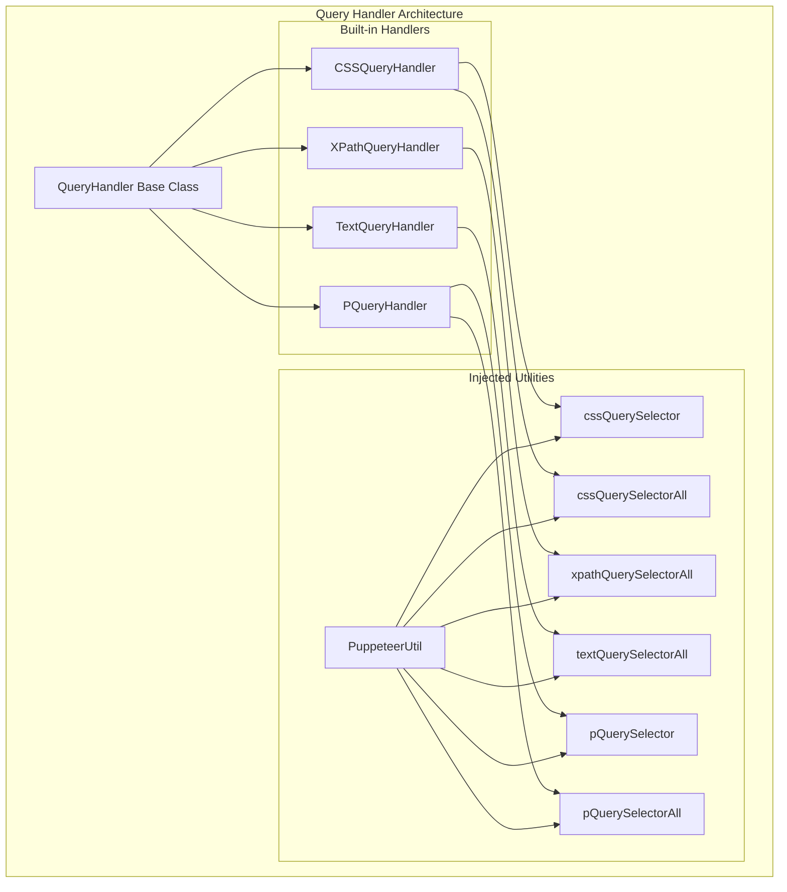
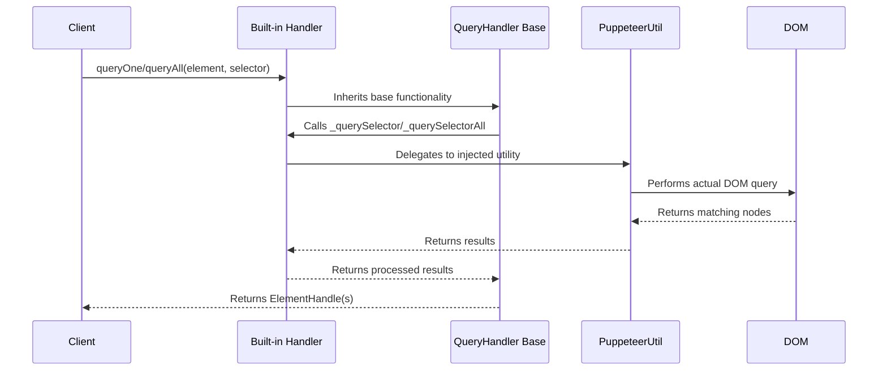
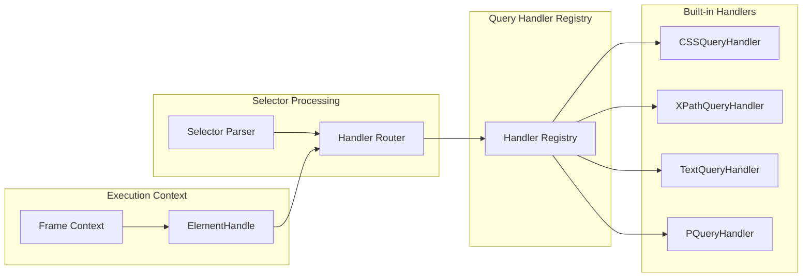
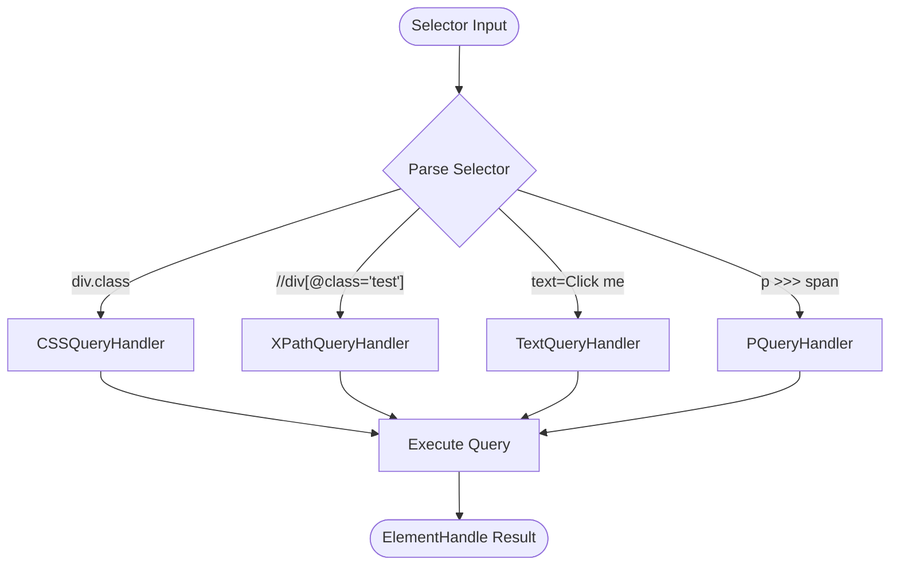
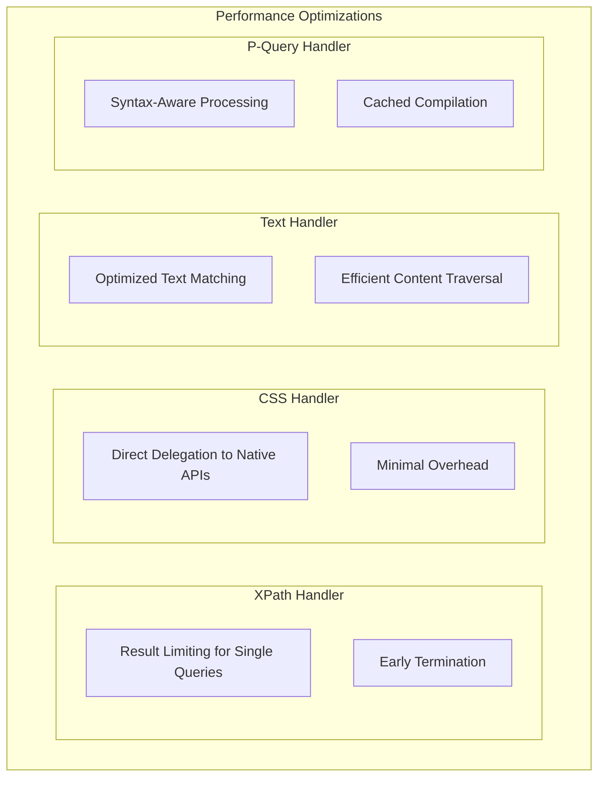
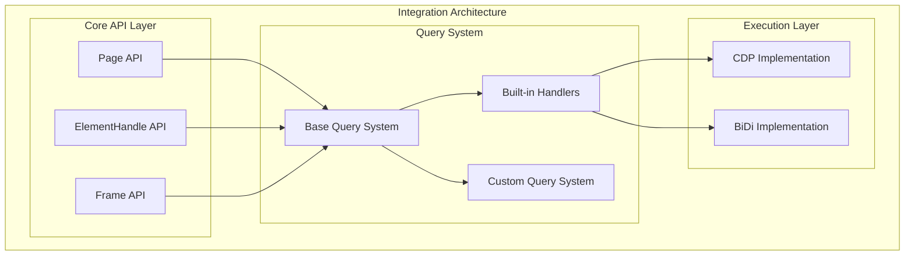

# Built-in Query Handlers Module

The built_in_handlers module provides concrete implementations of query handlers for different selector types in Puppeteer. This module contains specialized query handlers that extend the base QueryHandler class to support CSS selectors, XPath expressions, text-based queries, and P-queries (Puppeteer's enhanced selector syntax).

## Module Overview

The built_in_handlers module is part of Puppeteer's query system architecture, providing four essential query handler implementations:

- **CSSQueryHandler**: Handles standard CSS selectors
- **XPathQueryHandler**: Processes XPath expressions for DOM traversal
- **TextQueryHandler**: Enables text-based element selection
- **PQueryHandler**: Supports Puppeteer's enhanced P-query syntax

These handlers work together to provide comprehensive element selection capabilities across different selector paradigms, enabling developers to choose the most appropriate selection method for their use case.

## Architecture Overview



## Component Details

### CSSQueryHandler

The CSSQueryHandler provides support for standard CSS selectors, the most commonly used selection method in web automation.

**Key Features:**
- Implements both `querySelector` and `querySelectorAll` methods
- Delegates to injected CSS query utilities for actual DOM traversal
- Supports all standard CSS selector syntax

**Implementation Pattern:**
```typescript
static override querySelector = (
  element: Node,
  selector: string,
  {cssQuerySelector}: PuppeteerUtil,
): Node | null => {
  return cssQuerySelector(element, selector);
};
```

### XPathQueryHandler

The XPathQueryHandler enables XPath-based element selection, providing powerful DOM traversal capabilities.

**Key Features:**
- Implements XPath expression evaluation
- Provides both single and multiple element selection
- Optimized single element selection using result limiting

**Implementation Pattern:**
```typescript
static override querySelector: QuerySelector = (
  element: Node,
  selector: string,
  {xpathQuerySelectorAll},
) => {
  for (const result of xpathQuerySelectorAll(element, selector, 1)) {
    return result;
  }
  return null;
};
```

### TextQueryHandler

The TextQueryHandler allows element selection based on text content, enabling intuitive text-based automation.

**Key Features:**
- Selects elements based on their text content
- Implements only `querySelectorAll` (single selection derived automatically)
- Useful for finding elements by visible text

### PQueryHandler

The PQueryHandler supports Puppeteer's enhanced P-query syntax, providing advanced selection capabilities.

**Key Features:**
- Implements both `querySelector` and `querySelectorAll` methods
- Supports Puppeteer's extended selector syntax
- Enables complex element selection patterns

## Data Flow Architecture



## Integration with Query System



## Handler Selection Logic



## Performance Characteristics

### Handler Efficiency Comparison

| Handler Type | Single Query | Multiple Query | Use Case |
|-------------|-------------|----------------|----------|
| CSS | Fast | Fast | Standard DOM selection |
| XPath | Moderate | Moderate | Complex traversal patterns |
| Text | Slow | Slow | Content-based selection |
| P-Query | Variable | Variable | Advanced Puppeteer features |

### Optimization Strategies



## Error Handling Patterns

All built-in handlers inherit error handling from the base QueryHandler class:

- **Timeout Handling**: Automatic timeout management for wait operations
- **Selector Validation**: Invalid selector detection and reporting
- **Context Errors**: Proper handling of detached or invalid contexts
- **Abort Signal Support**: Cancellation support for long-running queries

## Usage Examples

### CSS Selector Usage
```typescript
// Standard CSS selection
const element = await page.$('div.container > p.text');
const elements = await page.$$('button[type="submit"]');
```

### XPath Usage
```typescript
// XPath-based selection
const element = await page.$('xpath=//div[@class="content"]//p[1]');
const elements = await page.$$('xpath=//button[contains(text(), "Click")]');
```

### Text-based Selection
```typescript
// Text content selection
const element = await page.$('text=Submit Form');
const elements = await page.$$('text=Click me');
```

### P-Query Usage
```typescript
// Puppeteer enhanced syntax
const element = await page.$('p >>> span.highlight');
const elements = await page.$$('div >> text=Important');
```

## Dependencies and Relationships

The built_in_handlers module has the following key dependencies:

- **[base_query_system](base_query_system.md)**: Extends QueryHandler base class
- **[common_utilities](common_utilities.md)**: Uses PuppeteerUtil for injected functionality
- **[core_api](core_api.md)**: Integrates with ElementHandle and Frame APIs

## Integration Points



## Future Considerations

The built_in_handlers module is designed for extensibility and performance:

1. **New Selector Types**: Additional handlers can be added following the same pattern
2. **Performance Optimization**: Individual handlers can be optimized independently
3. **Protocol Support**: Handlers work with both CDP and BiDi protocols
4. **Custom Extensions**: The architecture supports custom handler registration

## Related Documentation

- [base_query_system](base_query_system.md) - Base QueryHandler implementation
- [custom_query_system](custom_query_system.md) - Custom query handler registration
- [core_api](core_api.md) - Core API integration points
- [common_utilities](common_utilities.md) - Shared utility functions