# Cache Management Module

The cache_management module provides a robust caching system for managing browser installations in Puppeteer. It handles the storage, retrieval, and lifecycle management of browser binaries across different platforms and versions, ensuring efficient reuse of downloaded browser installations.

## Overview

The cache management system is built around a hierarchical directory structure that organizes browser installations by browser type, platform, and build ID. This module serves as the foundation for the browser installation and management system, providing persistent storage and metadata management for browser binaries.

## Architecture


## Core Components

### Cache Class

The `Cache` class is the central component that manages the entire browser cache system:


### InstalledBrowser Class

The `InstalledBrowser` class represents a specific browser installation with its associated metadata and provides access to the executable path and installation directory.

## Directory Structure

The cache follows a well-defined hierarchical structure:

```mermaid
graph TD
    subgraph "Cache Directory Structure"
        Root[rootDir/] --> Chrome[chrome/]
        Root --> Firefox[firefox/]
        Root --> Edge[edge/]
        
        Chrome --> ChromeMeta[.metadata]
        Chrome --> ChromeWin[win64-123456/]
        Chrome --> ChromeMac[mac-123456/]
        Chrome --> ChromeLinux[linux-123456/]
        
        Firefox --> FirefoxMeta[.metadata]
        Firefox --> FirefoxWin[win64-789012/]
        Firefox --> FirefoxMac[mac-789012/]
        
        ChromeWin --> ChromeExe[chrome.exe]
        ChromeMac --> ChromeApp[Chrome.app/]
        ChromeLinux --> ChromeBin[chrome]
        
        FirefoxWin --> FirefoxExe[firefox.exe]
        FirefoxMac --> FirefoxApp[Firefox.app/]
    end
```



## Data Flow


## Key Operations

### Browser Installation Management


### Alias Resolution


## Integration Points

### Browser Management Integration

The cache_management module integrates closely with other browser management components:

- **[installation_system](installation_system.md)**: Provides storage for downloaded browser installations
- **[launch_system](launch_system.md)**: Supplies executable paths for browser launching
- **[cli_interface](cli_interface.md)**: Exposes cache operations through command-line interface

### Platform Detection


## Metadata Management

The cache system maintains metadata for each browser type:


## Error Handling and Resilience

The cache system implements robust error handling:


## Performance Considerations

### Caching Strategy

- **Lazy Loading**: Metadata is read only when needed
- **Directory Scanning**: Efficient traversal of cache directories
- **Version Sorting**: Optimized version comparison for alias resolution

### File System Operations

- **Atomic Operations**: Metadata writes are atomic to prevent corruption
- **Retry Logic**: Built-in retry mechanism for file system operations
- **Cleanup**: Efficient removal of unused installations

## Usage Examples

### Basic Cache Operations

```typescript
// Create cache instance
const cache = new Cache('/path/to/cache');

// Get installed browsers
const browsers = cache.getInstalledBrowsers();

// Compute executable path
const executablePath = cache.computeExecutablePath({
  browser: Browser.CHROME,
  buildId: 'latest',
  platform: BrowserPlatform.LINUX
});

// Manage metadata
const metadata = cache.readMetadata(Browser.CHROME);
metadata.aliases['stable'] = '123456';
cache.writeMetadata(Browser.CHROME, metadata);
```

### Installation Management

```typescript
// Install browser
const installedBrowser = new InstalledBrowser(
  cache,
  Browser.CHROME,
  '123456',
  BrowserPlatform.LINUX
);

// Access installation details
console.log(installedBrowser.path);
console.log(installedBrowser.executablePath);

// Uninstall browser
cache.uninstall(Browser.CHROME, BrowserPlatform.LINUX, '123456');
```

## Dependencies

The cache_management module depends on:

- **Node.js File System APIs**: For directory and file operations
- **Platform Detection**: For determining the appropriate browser platform
- **Browser Data**: For browser-specific executable path resolution
- **Debug Logging**: For troubleshooting and monitoring

## Security Considerations

- **Path Validation**: All paths are validated to prevent directory traversal
- **Metadata Integrity**: JSON parsing includes error handling for malformed data
- **File Permissions**: Proper file system permissions are maintained
- **Cleanup Safety**: Safe removal operations with retry logic

## Future Enhancements

- **Compression**: Support for compressed browser installations
- **Checksums**: Integrity verification for cached binaries
- **Distributed Caching**: Support for shared cache across multiple systems
- **Cache Policies**: Configurable retention and cleanup policies