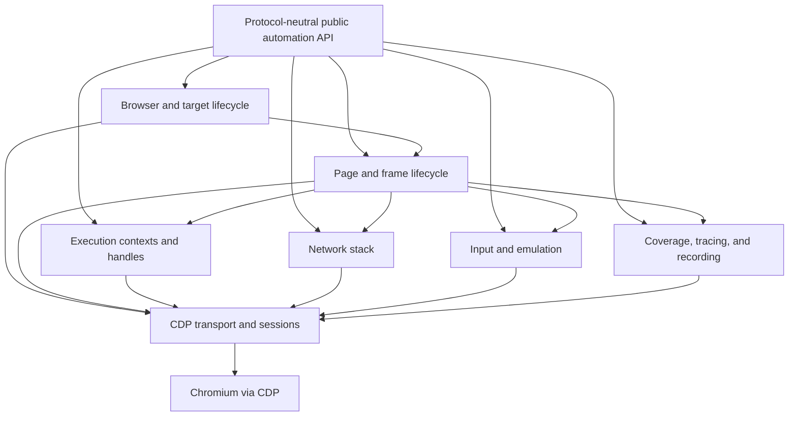
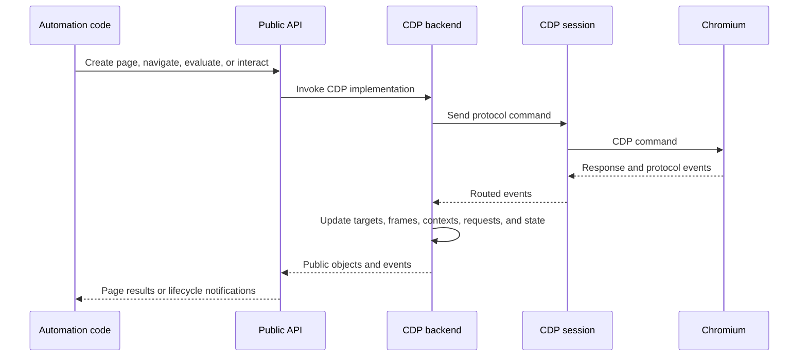
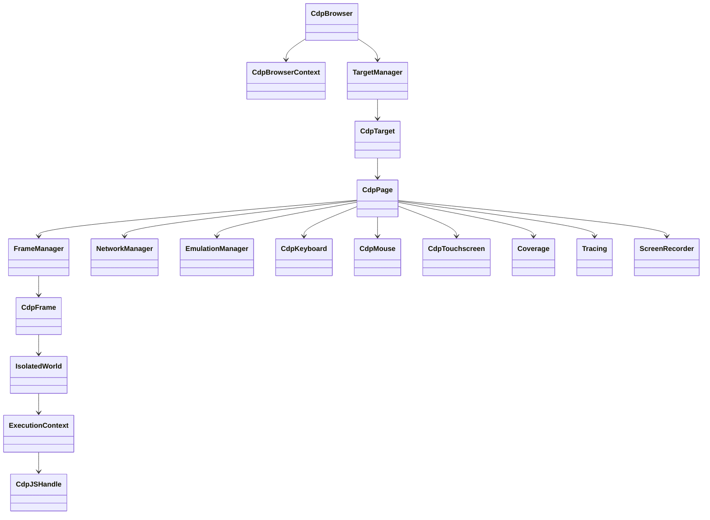

# CDP Backend Automation Implementation

## Purpose

The `cdp_backend_automation_implementation` module is Puppeteer’s Chromium/CDP-specific automation backend. It implements the protocol-neutral browser automation API by translating public operations into Chrome DevTools Protocol commands and events.

The module manages:

- Browser contexts, targets, pages, frames, and workers.
- Frame trees, navigation, execution worlds, and JavaScript handles.
- Network requests, responses, interception, authentication, and emulation.
- Keyboard, mouse, touchscreen, viewport, and browser-environment controls.
- Coverage collection, tracing, screencast recording, and console diagnostics.

It depends on the CDP transport/session layer for communication with Chromium and is consumed by the protocol-neutral public API.

## Architecture

### Lifecycle and event flow

### Component relationships

## Core components

- [Browser context and target lifecycle](browser_context_and_target_lifecycle.md) — Browser ownership, context isolation, target discovery, auto-attachment, target classification, and shutdown.
- [Page and frame lifecycle](page_and_frame_lifecycle.md) — `CdpPage`, `CdpFrame`, frame trees, navigation, page events, dialogs, screenshots, PDFs, and workers.
- [Execution contexts and handles](execution_contexts_and_handles.md) — CDP realms, execution contexts, JavaScript evaluation, bindings, `JSHandle`, and `ElementHandle` lifetimes.
- [Network stack](network_stack.md) — Request/response correlation, redirects, interception, authentication, headers, caching, and network-condition emulation.
- [Input and emulation](input_and_emulation.md) — Keyboard, mouse, touchscreen, viewport, device metrics, geolocation, media, timezone, and other emulation controls.
- [Coverage, tracing, and recording](coverage_tracing_and_recording.md) — JavaScript/CSS coverage, performance tracing, screencast recording, and console diagnostics.

## Related infrastructure

The module integrates with:

- [Protocol-neutral public automation API](protocol_neutral_public_automation_api.md)
- [Protocol transport and session infrastructure](protocol_transport_and_session_infrastructure.md)
- [Shared automation runtime and query infrastructure](shared_automation_runtime_and_query_infrastructure.md)
- [Browser provisioning and launch orchestration](browser_provisioning_and_launch_orchestration.md)