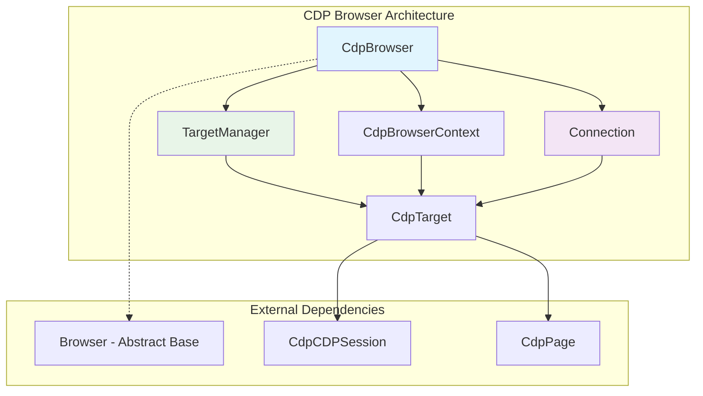
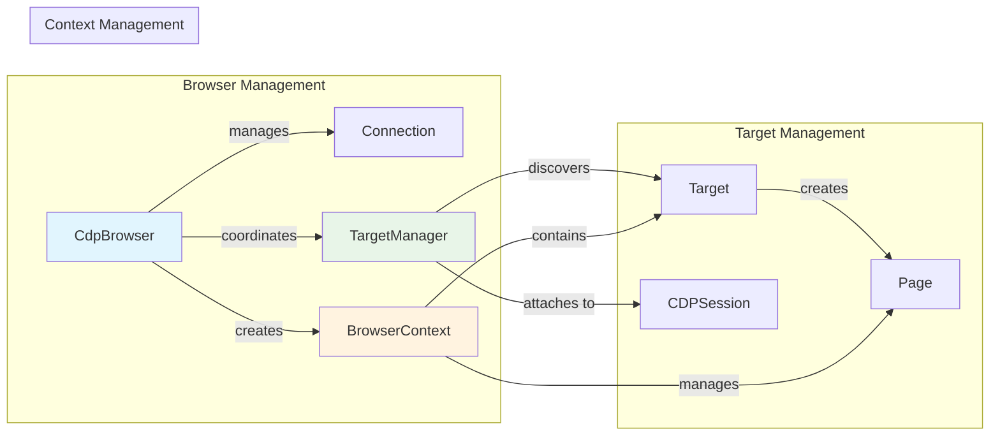
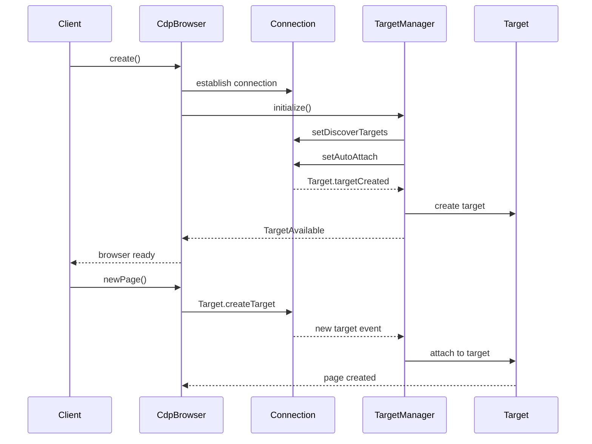
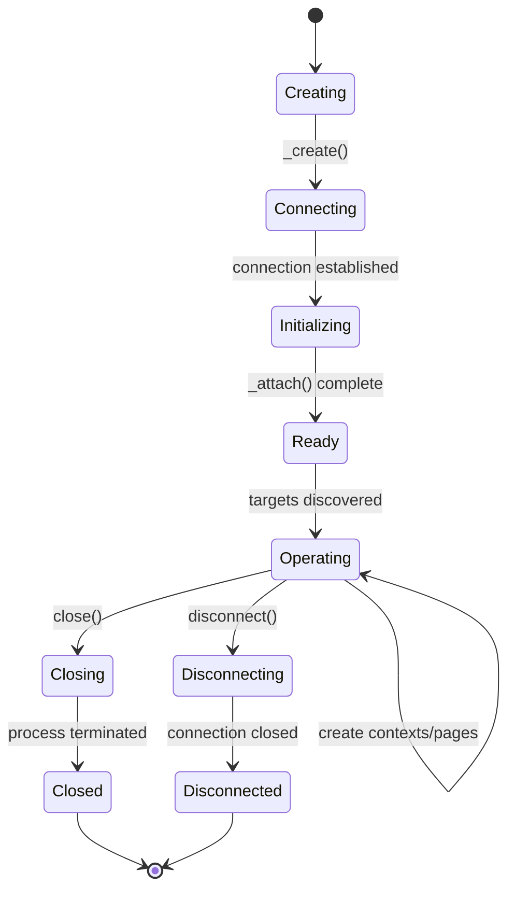

# CDP Browser Module

The CDP Browser module provides the Chrome DevTools Protocol (CDP) implementation of the browser interface in Puppeteer. It serves as the primary entry point for managing browser instances, contexts, and targets through the CDP protocol.

## Overview

The `CdpBrowser` class is the concrete implementation of the abstract `Browser` class, specifically designed to work with Chrome/Chromium browsers through the Chrome DevTools Protocol. It manages the browser lifecycle, coordinates target discovery and attachment, and provides the foundation for all browser automation operations.

## Architecture



## Core Components

### CdpBrowser Class

The main browser implementation that extends the abstract `Browser` class and provides CDP-specific functionality.

**Key Responsibilities:**
- Browser lifecycle management (creation, connection, disconnection)
- Target discovery and management through TargetManager
- Browser context creation and management
- Extension installation/uninstallation
- Network configuration and security settings

**Core Properties:**
- `#connection`: The CDP connection instance
- `#targetManager`: Manages target discovery and attachment
- `#defaultContext`: The default browser context
- `#contexts`: Map of additional browser contexts
- `#process`: Optional child process reference

## Component Relationships



## Data Flow



## Browser Lifecycle



## Key Features

### Target Management
- **Automatic Discovery**: Automatically discovers new targets (pages, workers, etc.)
- **Filtering**: Supports custom target filtering through callbacks
- **Lifecycle Tracking**: Monitors target creation, changes, and destruction
- **Hierarchical Structure**: Maintains parent-child relationships between targets

### Context Management
- **Isolation**: Each context provides isolated cookie/cache storage
- **Proxy Support**: Configurable proxy settings per context
- **Permission Management**: Override browser permissions per context
- **Download Behavior**: Configurable download policies

### Security Features
- **Certificate Handling**: Option to ignore certificate errors
- **Permission Overrides**: Granular permission control
- **Secure Contexts**: Isolated execution environments

## Integration Points

### Connection Layer
The browser relies on the [cdp_connection](cdp_connection.md) module for:
- Protocol message handling
- Session management
- Transport layer abstraction

### Context Management
Integrates with [cdp_browser_context](cdp_browser_context.md) for:
- Isolated browsing environments
- Context-specific configurations
- Resource management

### Target System
Works with [cdp_target](cdp_target.md) for:
- Page and worker management
- Target lifecycle coordination
- Session attachment

### Page Management
Coordinates with [cdp_page](cdp_page.md) for:
- Page creation and initialization
- Navigation management
- Resource handling

## Usage Patterns

### Browser Creation
```typescript
const browser = await CdpBrowser._create(
  connection,
  contextIds,
  acceptInsecureCerts,
  defaultViewport,
  downloadBehavior,
  process,
  closeCallback
);
```

### Context Management
```typescript
// Create isolated context
const context = await browser.createBrowserContext({
  proxyServer: 'http://proxy:8080',
  downloadBehavior: { policy: 'allow', downloadPath: '/downloads' }
});

// Use default context
const defaultContext = browser.defaultBrowserContext();
```

### Target Operations
```typescript
// Get all targets
const targets = browser.targets();

// Wait for specific target
const target = await browser.waitForTarget(t => t.url().includes('example.com'));

// Create new page
const page = await browser.newPage();
```

## Error Handling

The browser implements comprehensive error handling for:
- **Connection Failures**: Automatic cleanup on connection loss
- **Target Initialization**: Graceful handling of failed target creation
- **Protocol Errors**: Proper error propagation and recovery
- **Resource Cleanup**: Ensures proper disposal of resources

## Performance Considerations

### Resource Management
- **Lazy Initialization**: Targets are initialized only when needed
- **Connection Pooling**: Efficient reuse of CDP sessions
- **Memory Management**: Proper cleanup of event listeners and references

### Optimization Features
- **Target Filtering**: Reduces overhead by filtering unwanted targets
- **Batch Operations**: Groups related protocol calls for efficiency
- **Event Debouncing**: Prevents excessive event handling

## Dependencies

### Core Dependencies
- **Abstract Browser**: Extends the base browser interface from [core_api](core_api.md)
- **Connection**: Uses CDP connection from [cdp_connection](cdp_connection.md)
- **Target Manager**: Integrates target management from [cdp_implementation](cdp_implementation.md)

### Related Modules
- **Browser Context**: [cdp_browser_context](cdp_browser_context.md)
- **Target System**: [cdp_target](cdp_target.md)
- **Session Management**: [cdp_session](cdp_session.md)
- **Page Management**: [cdp_page](cdp_page.md)

## Events and Monitoring

### Browser Events
- `targetcreated`: New target discovered
- `targetdestroyed`: Target removed
- `targetchanged`: Target information updated
- `disconnected`: Connection lost

### Debug Information
The browser provides debug information including:
- Pending protocol errors
- Connection status
- Target states
- Performance metrics

## Best Practices

### Initialization
1. Always wait for the browser to be fully initialized
2. Configure security settings before creating contexts
3. Set up error handlers for connection events

### Resource Management
1. Properly dispose of contexts when no longer needed
2. Monitor target lifecycle for memory leaks
3. Use target filtering to reduce overhead

### Error Handling
1. Implement connection loss recovery
2. Handle target initialization failures gracefully
3. Monitor debug information for protocol errors

The CDP Browser module serves as the foundation for all browser automation in Puppeteer's CDP implementation, providing robust target management, context isolation, and comprehensive error handling while maintaining high performance and reliability.