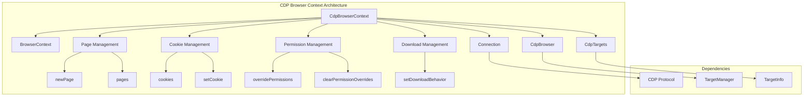
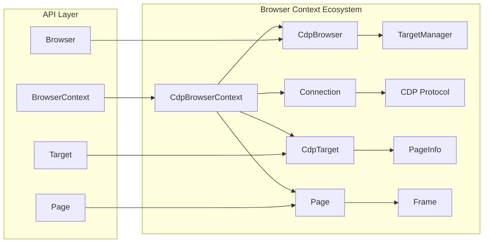
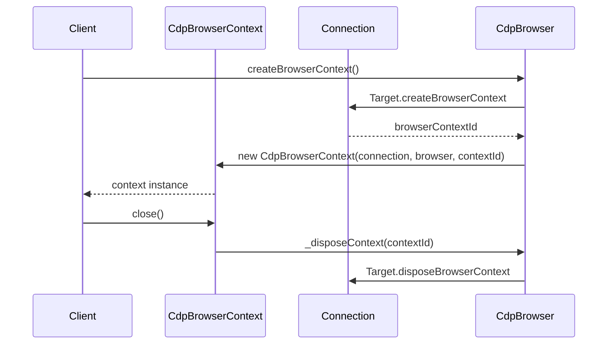
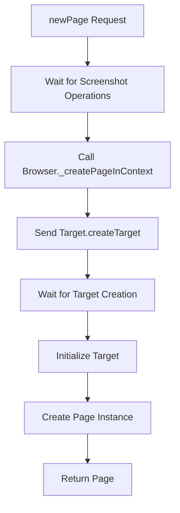
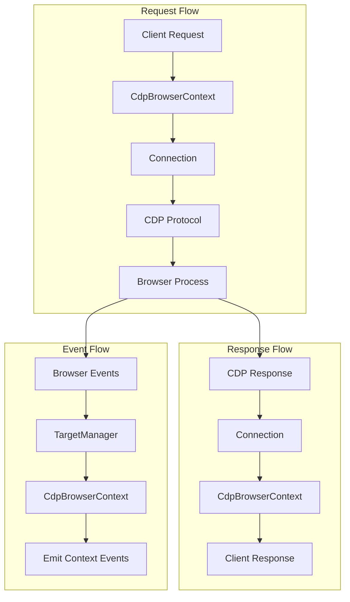

# CDP Browser Context Module

The CDP Browser Context module provides the Chrome DevTools Protocol (CDP) implementation of browser contexts, enabling isolated browsing environments with independent cookies, permissions, and page management within a single browser instance.

## Overview

The `CdpBrowserContext` class extends the abstract `BrowserContext` API to provide CDP-specific functionality for managing isolated browsing sessions. Each browser context maintains its own set of pages, cookies, permissions, and download behaviors, allowing for complete isolation between different browsing sessions within the same browser instance.

## Architecture



## Core Components

### CdpBrowserContext Class

The main implementation class that provides CDP-specific browser context functionality:

```typescript
export class CdpBrowserContext extends BrowserContext {
  #connection: Connection;
  #browser: CdpBrowser;
  #id?: string;
}
```

**Key Responsibilities:**
- Managing isolated browsing sessions
- Handling page creation and lifecycle
- Managing cookies and permissions
- Controlling download behavior
- Interfacing with CDP protocol commands

## Component Relationships



## Core Functionality

### Context Management



### Page Management

The browser context manages page creation and retrieval:

- **Page Creation**: Creates new pages within the context's isolated environment
- **Page Enumeration**: Lists all active pages in the context
- **Target Filtering**: Identifies page-type targets belonging to the context



### Permission Management

Handles web API permission overrides:

- **Permission Granting**: Maps web permissions to CDP protocol permissions
- **Permission Clearing**: Resets all permission overrides
- **Origin-based Control**: Manages permissions per origin

### Cookie Management

Provides isolated cookie storage:

- **Cookie Retrieval**: Gets all cookies for the context
- **Cookie Setting**: Sets cookies with partition key support
- **Cookie Deletion**: Removes cookies by setting expiration

### Download Management

Controls download behavior within the context:

- **Download Policy**: Sets allow/deny/default policies
- **Download Path**: Configures download destination
- **Context Isolation**: Maintains separate download settings per context

## Data Flow



## Integration Points

### With CDP Browser
- **Context Creation**: Browser creates and manages context instances
- **Target Management**: Shares target management infrastructure
- **Event Propagation**: Forwards browser-level events to context level

### With Connection
- **Protocol Communication**: Sends CDP commands through the connection
- **Session Management**: Manages CDP sessions for context operations
- **Event Handling**: Receives protocol events via connection

### With Targets
- **Target Filtering**: Identifies targets belonging to the context
- **Page Creation**: Creates page targets within the context
- **Target Lifecycle**: Manages target creation and destruction

## API Methods

### Core Methods

| Method | Description | CDP Command |
|--------|-------------|-------------|
| `newPage()` | Creates a new page in the context | `Target.createTarget` |
| `pages()` | Returns all pages in the context | N/A (filters targets) |
| `close()` | Closes the context and all pages | `Target.disposeBrowserContext` |
| `targets()` | Returns all targets in the context | N/A (filters browser targets) |

### Permission Methods

| Method | Description | CDP Command |
|--------|-------------|-------------|
| `overridePermissions()` | Grants permissions for an origin | `Browser.grantPermissions` |
| `clearPermissionOverrides()` | Clears all permission overrides | `Browser.resetPermissions` |

### Cookie Methods

| Method | Description | CDP Command |
|--------|-------------|-------------|
| `cookies()` | Gets all cookies in the context | `Storage.getCookies` |
| `setCookie()` | Sets cookies in the context | `Storage.setCookies` |

### Download Methods

| Method | Description | CDP Command |
|--------|-------------|-------------|
| `setDownloadBehavior()` | Sets download behavior | `Browser.setDownloadBehavior` |

## Error Handling

The module implements comprehensive error handling:

- **Context Validation**: Ensures context ID exists for operations requiring it
- **Permission Mapping**: Validates and maps web permissions to protocol permissions
- **Target Validation**: Verifies target existence and initialization
- **Connection State**: Handles connection failures and disconnections

## Thread Safety

Browser contexts implement screenshot operation synchronization:

- **Screenshot Mutex**: Prevents concurrent screenshot operations
- **Operation Counting**: Tracks active screenshot operations
- **Guard Pattern**: Uses mutex guards for safe resource access

## Performance Considerations

- **Lazy Loading**: Pages are created on-demand
- **Target Filtering**: Efficient filtering of targets by context
- **Event Batching**: Batches related events for better performance
- **Resource Cleanup**: Proper disposal of resources on context close

## Related Modules

- **[cdp_browser](cdp_browser.md)**: Parent browser that manages contexts
- **[cdp_connection](cdp_connection.md)**: CDP protocol communication layer
- **[cdp_target](cdp_target.md)**: Target management within contexts
- **[cdp_page](cdp_page.md)**: Page instances created by contexts
- **[core_api](core_api.md)**: Abstract browser context API definition

## Usage Examples

### Creating and Using a Browser Context

```typescript
// Create a new browser context
const context = await browser.createBrowserContext({
  proxyServer: 'http://proxy:8080'
});

// Create a page in the context
const page = await context.newPage();

// Set permissions for the context
await context.overridePermissions('https://example.com', ['geolocation']);

// Manage cookies
await context.setCookie({
  name: 'session',
  value: 'abc123',
  domain: 'example.com'
});

// Close the context
await context.close();
```

### Download Management

```typescript
// Configure download behavior
await context.setDownloadBehavior({
  policy: 'allow',
  downloadPath: '/downloads'
});
```

This module is essential for providing isolated browsing environments in CDP-based browser automation, enabling secure and independent operation of multiple browsing sessions within a single browser instance.