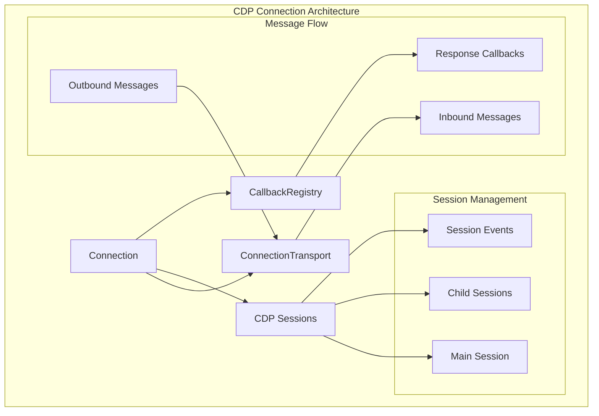
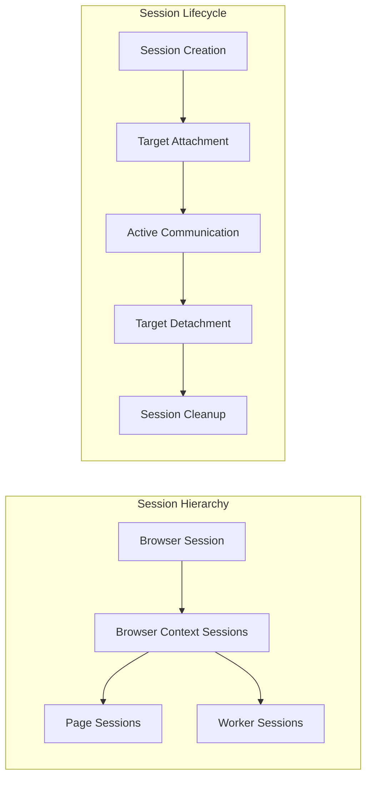
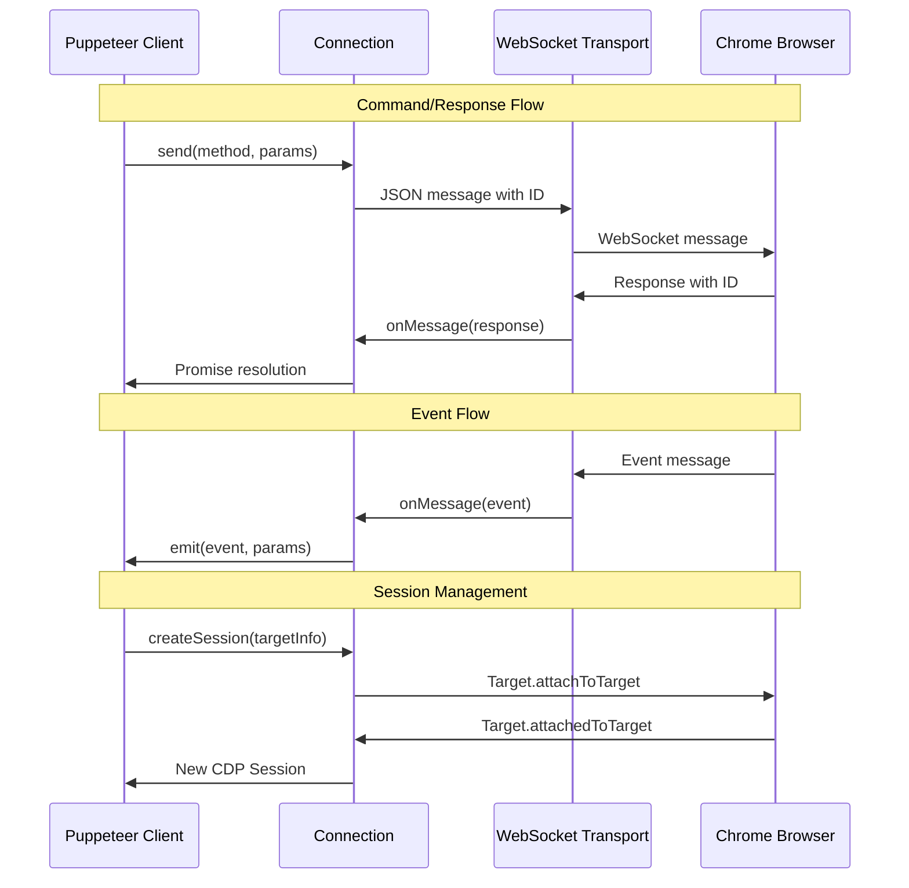
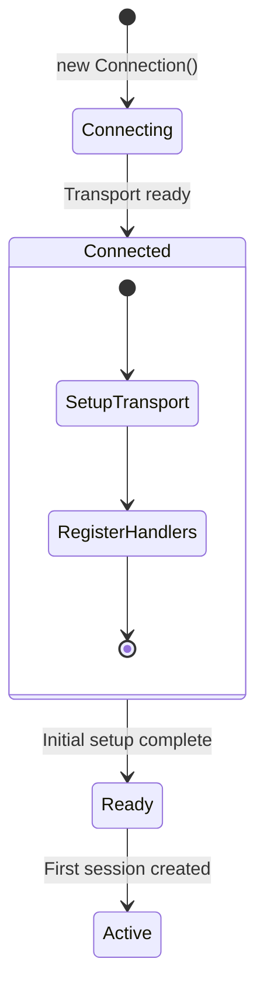
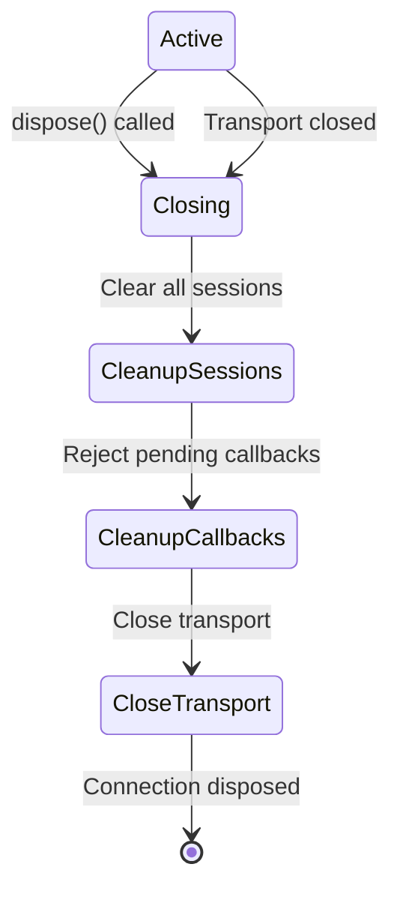
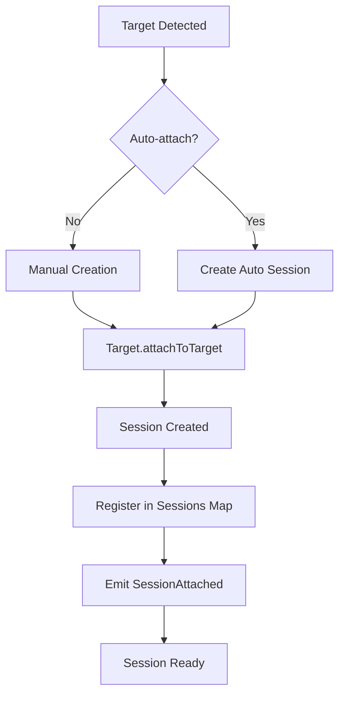
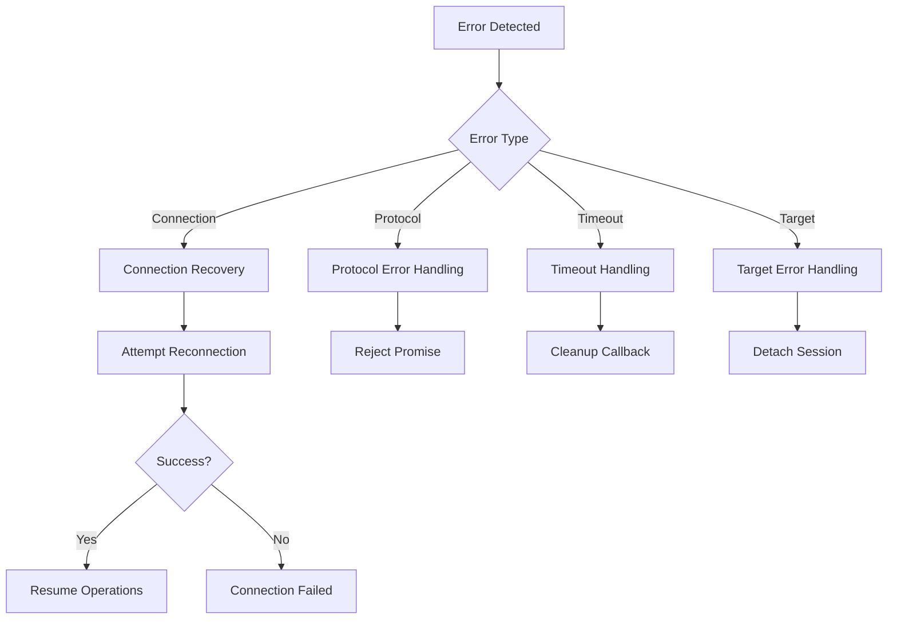

# CDP Connection Module

The CDP Connection module provides the core communication infrastructure for Chrome DevTools Protocol (CDP) interactions in Puppeteer. It manages WebSocket connections, protocol message routing, session lifecycle, and error handling for all CDP-based browser automation operations.

## Architecture Overview

The CDP Connection module serves as the foundational communication layer between Puppeteer and Chrome/Chromium browsers through the Chrome DevTools Protocol. It handles low-level protocol messaging, session management, and connection lifecycle operations.



## Core Components

### Connection Class

The `Connection` class is the central component that orchestrates all CDP communication:

**Key Responsibilities:**
- Manages WebSocket transport layer
- Routes protocol messages between sessions
- Handles session attachment/detachment
- Provides timeout and error management
- Maintains connection state and lifecycle

**Core Features:**
- **Protocol Communication**: Sends CDP commands and receives responses
- **Session Management**: Creates and manages CDP sessions for different targets
- **Event Handling**: Processes protocol events and routes them appropriately
- **Error Recovery**: Handles connection failures and protocol errors
- **Timeout Management**: Configurable timeouts for protocol operations

### Session Architecture



## Protocol Message Flow

The connection handles three types of protocol interactions:



## Connection Lifecycle

### Initialization Phase



### Active Communication Phase

During active communication, the connection manages:

1. **Message Routing**: Directs messages to appropriate sessions
2. **Callback Management**: Tracks pending requests and responses
3. **Event Distribution**: Broadcasts events to relevant listeners
4. **Session Lifecycle**: Handles session creation and destruction

### Cleanup and Disposal



## Session Management

### Session Creation Process

The connection supports both automatic and manual session creation:



### Session Hierarchy

Sessions form a hierarchical structure reflecting browser target relationships:

- **Browser Session**: Root session for browser-level operations
- **Context Sessions**: Sessions for browser contexts
- **Page Sessions**: Sessions for individual pages/tabs
- **Worker Sessions**: Sessions for service workers and web workers

## Error Handling and Recovery

### Error Types

The connection handles various error scenarios:

1. **Connection Errors**: Transport failures, network issues
2. **Protocol Errors**: Invalid commands, parameter errors
3. **Timeout Errors**: Commands exceeding timeout limits
4. **Target Errors**: Target closure, session detachment

### Error Recovery Strategies



## Integration with Other Modules

### Core API Integration

The CDP Connection module integrates closely with core API components:

- **[Browser](core_api.md)**: Uses connection for browser-level operations
- **[BrowserContext](core_api.md)**: Manages context-specific sessions
- **[Page](core_api.md)**: Handles page-level protocol communication
- **[Target](core_api.md)**: Manages target lifecycle through sessions

### CDP Implementation Integration

Works with other CDP implementation modules:

- **[CDP Session](cdp_session.md)**: Provides session implementation
- **[CDP Browser](cdp_browser.md)**: Browser-level CDP operations
- **[CDP Page](cdp_page.md)**: Page-level CDP operations
- **[CDP Target](cdp_target.md)**: Target management

### Transport Layer Integration

Utilizes transport layer components:

- **[Transport Layer](transport_layer.md)**: WebSocket and pipe transports
- **[Common Utilities](common_utilities.md)**: Event emitters and configuration

## Performance Considerations

### Message Throughput

The connection optimizes for high-throughput scenarios:

- **Batching**: Groups related messages when possible
- **Pipelining**: Sends multiple commands without waiting for responses
- **Efficient Routing**: Minimal overhead for message distribution

### Memory Management

- **Session Cleanup**: Automatic cleanup of detached sessions
- **Callback Management**: Efficient callback registry with automatic cleanup
- **Event Handling**: Optimized event emission and listener management

### Connection Pooling

For multiple browser instances:

- **Connection Reuse**: Shares connections when appropriate
- **Resource Management**: Efficient allocation and deallocation
- **Concurrent Operations**: Supports multiple simultaneous operations

## Configuration Options

### Connection Parameters

- **URL**: WebSocket endpoint URL
- **Delay**: Artificial delay for message processing (debugging)
- **Timeout**: Default timeout for protocol operations
- **Raw Errors**: Whether to expose raw protocol errors

### Transport Configuration

- **Transport Type**: WebSocket, pipe, or custom transport
- **Buffer Sizes**: Message buffer configuration
- **Compression**: WebSocket compression settings

## Debugging and Monitoring

### Debug Logging

The connection provides comprehensive debug logging:

```typescript
// Protocol message logging
const debugProtocolSend = debug('puppeteer:protocol:SEND ►');
const debugProtocolReceive = debug('puppeteer:protocol:RECV ◀');
```

### Connection Monitoring

- **Session Count**: Track active session count
- **Message Metrics**: Monitor message throughput and latency
- **Error Rates**: Track error frequencies and types
- **Connection Health**: Monitor connection stability

## Best Practices

### Connection Management

1. **Proper Disposal**: Always dispose connections when done
2. **Error Handling**: Implement robust error handling for all operations
3. **Timeout Configuration**: Set appropriate timeouts for different operations
4. **Session Lifecycle**: Properly manage session creation and cleanup

### Performance Optimization

1. **Minimize Sessions**: Create only necessary sessions
2. **Batch Operations**: Group related operations when possible
3. **Efficient Event Handling**: Use specific event listeners
4. **Resource Cleanup**: Clean up resources promptly

### Error Recovery

1. **Graceful Degradation**: Handle connection failures gracefully
2. **Retry Logic**: Implement appropriate retry mechanisms
3. **State Validation**: Validate connection state before operations
4. **User Feedback**: Provide meaningful error messages

## Security Considerations

### Protocol Security

- **Message Validation**: Validate all incoming protocol messages
- **Session Isolation**: Ensure proper session isolation
- **Error Information**: Limit sensitive information in error messages

### Transport Security

- **Secure Connections**: Use secure WebSocket connections when possible
- **Authentication**: Implement proper authentication mechanisms
- **Access Control**: Control access to sensitive protocol operations

The CDP Connection module forms the backbone of Puppeteer's browser automation capabilities, providing reliable, efficient, and secure communication with Chrome DevTools Protocol. Its robust architecture ensures stable operation across various browser automation scenarios while maintaining high performance and comprehensive error handling.