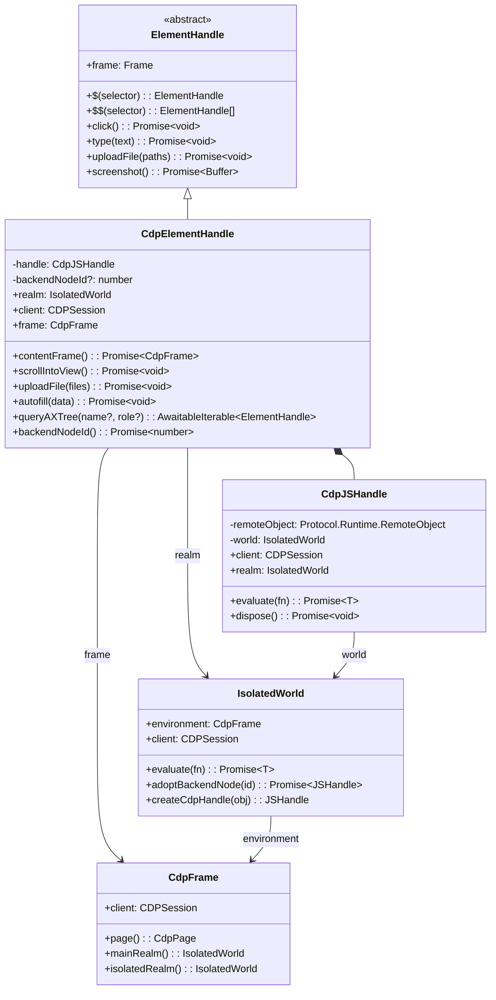
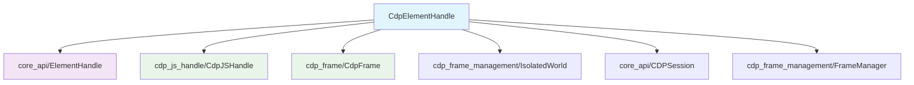
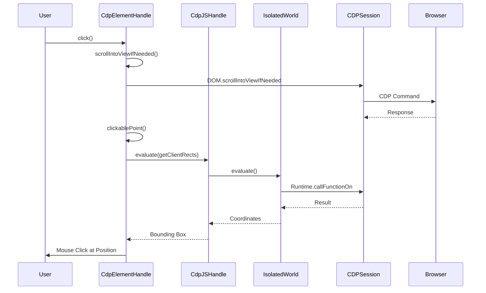
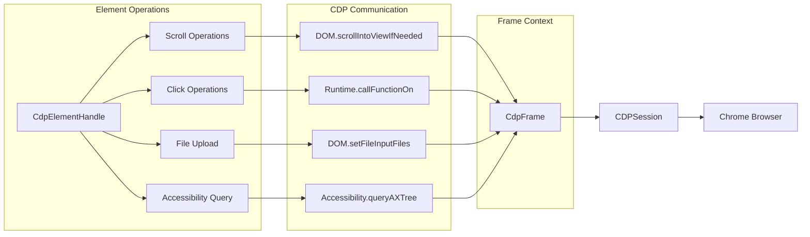
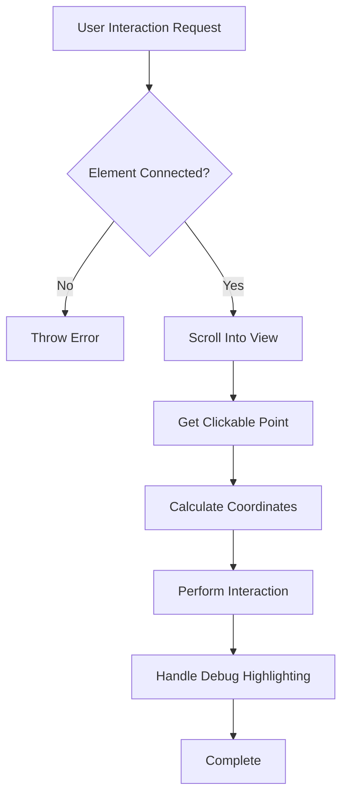
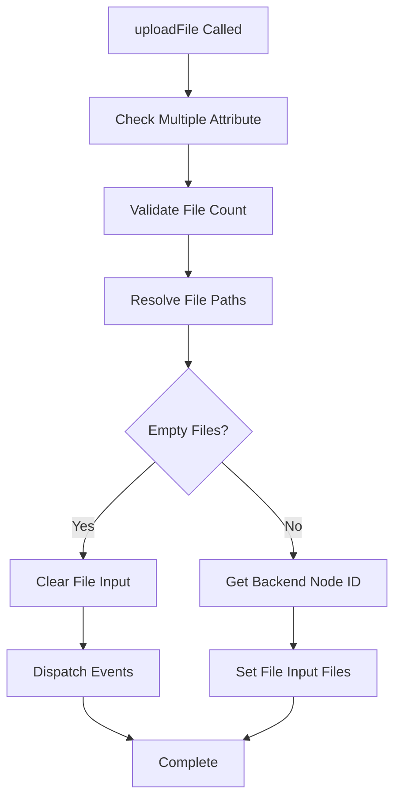
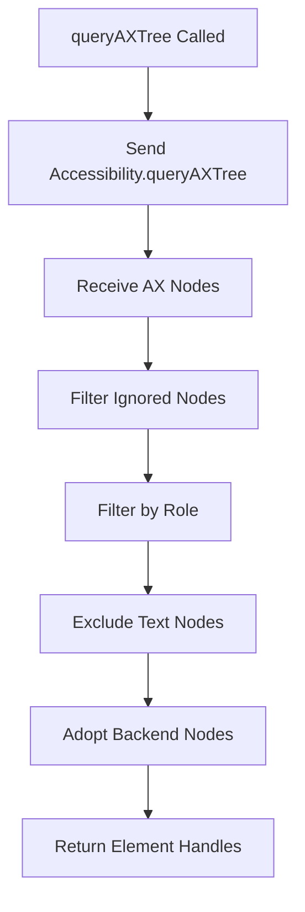

# CDP Element Handle Module

## Overview

The CDP Element Handle module provides the Chrome DevTools Protocol (CDP) implementation of element handling functionality in Puppeteer. It extends the abstract `ElementHandle` class to provide concrete CDP-specific implementations for DOM element manipulation, interaction, and querying operations.

The `CdpElementHandle` class serves as the primary interface for interacting with DOM elements through the Chrome DevTools Protocol, offering enhanced capabilities such as accessibility tree querying, autofill support, and optimized scrolling operations.

## Architecture



## Core Components

### CdpElementHandle

The main class that implements CDP-specific element handling functionality:

```typescript
export class CdpElementHandle<ElementType extends Node = Element> 
  extends ElementHandle<ElementType>
```

**Key Features:**
- **CDP Integration**: Direct integration with Chrome DevTools Protocol
- **Enhanced Scrolling**: Optimized scrolling using `DOM.scrollIntoViewIfNeeded`
- **File Upload**: Advanced file input handling with path resolution
- **Accessibility**: Built-in accessibility tree querying capabilities
- **Autofill Support**: Credit card autofill functionality
- **Frame Navigation**: Content frame resolution for iframe elements

## Dependencies



## Data Flow



## Component Interactions



## Key Functionalities

### 1. Enhanced Scrolling
- **CDP Optimization**: Uses `DOM.scrollIntoViewIfNeeded` for efficient scrolling
- **Fallback Support**: Falls back to standard `scrollIntoView` if CDP method fails
- **Viewport Awareness**: Checks element visibility before scrolling

### 2. File Upload Handling
- **Path Resolution**: Automatically resolves relative file paths
- **Multiple File Support**: Handles single and multiple file uploads
- **Empty File Handling**: Special handling for clearing file inputs
- **Event Dispatch**: Properly dispatches input and change events

### 3. Accessibility Integration
- **AX Tree Querying**: Direct access to accessibility tree through CDP
- **Role-based Filtering**: Filter elements by accessibility role
- **Name-based Search**: Search elements by accessible name
- **Non-element Filtering**: Excludes text nodes and inline text boxes

### 4. Autofill Support
- **Credit Card Data**: Supports credit card autofill functionality
- **Backend Node Integration**: Uses DOM backend node IDs for targeting
- **Frame Context**: Maintains proper frame context for autofill operations

### 5. Content Frame Resolution
- **IFrame Support**: Resolves content frames for iframe elements
- **Frame Manager Integration**: Leverages frame manager for frame lookup
- **Type Safety**: Provides type-safe iframe element handling

## Process Flows

### Element Interaction Flow


### File Upload Flow


### Accessibility Query Flow


## Integration Points

### With Core API
- **ElementHandle Extension**: Extends the abstract `ElementHandle` class from [core_api](core_api.md)
- **JSHandle Composition**: Composes `CdpJSHandle` for JavaScript object handling
- **CDPSession Usage**: Utilizes `CDPSession` for protocol communication

### With CDP Implementation
- **Frame Integration**: Works with [cdp_frame](cdp_frame.md) for frame context
- **JS Handle Integration**: Leverages [cdp_js_handle](cdp_js_handle.md) for object management
- **Session Management**: Integrates with [cdp_session](cdp_session.md) for protocol sessions

### With Frame Management
- **Isolated World**: Operates within [cdp_frame_management](cdp_frame_management.md) isolated worlds
- **Execution Context**: Uses execution contexts for JavaScript evaluation
- **Frame Tree**: Navigates frame hierarchies for content frame resolution

## Error Handling

### Connection Validation
- **Element Connectivity**: Validates element is still connected to DOM
- **Disposal Checks**: Prevents operations on disposed handles
- **Frame Detachment**: Handles detached frame scenarios

### Protocol Error Management
- **CDP Failures**: Graceful fallback for unsupported CDP operations
- **Timeout Handling**: Proper timeout management for long-running operations
- **Network Issues**: Resilient handling of network connectivity problems

## Performance Considerations

### Optimization Strategies
- **Backend Node Caching**: Caches backend node IDs to reduce CDP calls
- **Efficient Scrolling**: Uses CDP's optimized scrolling when available
- **Batch Operations**: Minimizes round-trips for multiple element operations

### Resource Management
- **Handle Disposal**: Proper cleanup of remote object references
- **Memory Management**: Efficient handling of large accessibility trees
- **Connection Pooling**: Reuses CDP sessions where possible

## Usage Examples

### Basic Element Interaction
```typescript
const element = await page.$('#button');
await element.click();
await element.type('Hello World');
```

### File Upload
```typescript
const fileInput = await page.$('input[type="file"]');
await fileInput.uploadFile('./document.pdf', './image.jpg');
```

### Accessibility Querying
```typescript
const element = await page.$('#form');
for await (const button of element.queryAXTree(undefined, 'button')) {
  console.log('Found button:', await button.evaluate(el => el.textContent));
}
```

### Autofill Operations
```typescript
const nameField = await page.$('#name');
await nameField.autofill({
  creditCard: {
    number: '4444444444444444',
    name: 'John Smith',
    expiryMonth: '01',
    expiryYear: '2030',
    cvc: '123'
  }
});
```

## Related Documentation

- [Core API](core_api.md) - Base ElementHandle interface and contracts
- [CDP JS Handle](cdp_js_handle.md) - JavaScript object handling in CDP
- [CDP Frame](cdp_frame.md) - Frame management and navigation
- [CDP Frame Management](cdp_frame_management.md) - Isolated worlds and execution contexts
- [Input and Interaction](input_and_interaction.md) - User input simulation
- [Locators](locators.md) - Element location and selection strategies