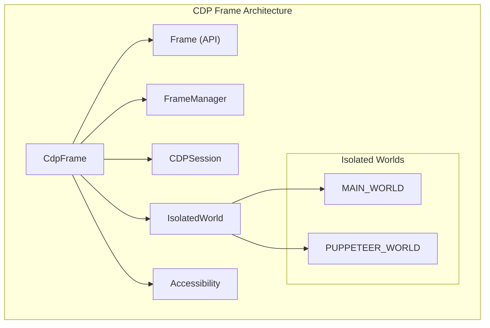
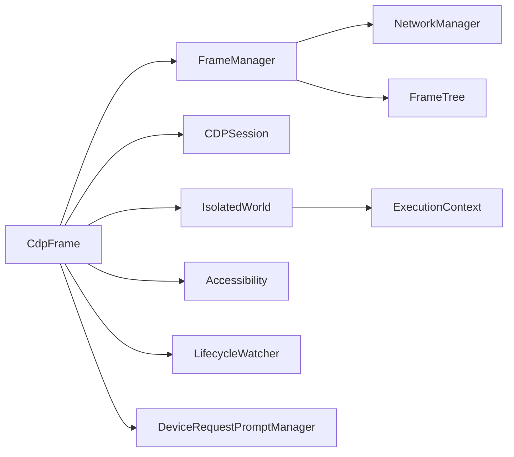
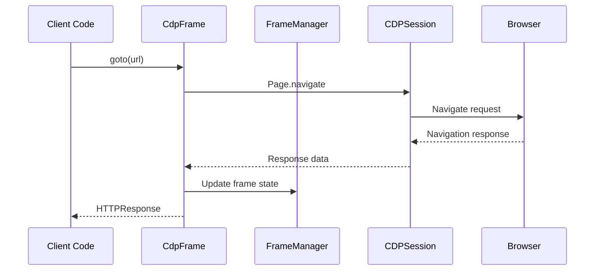
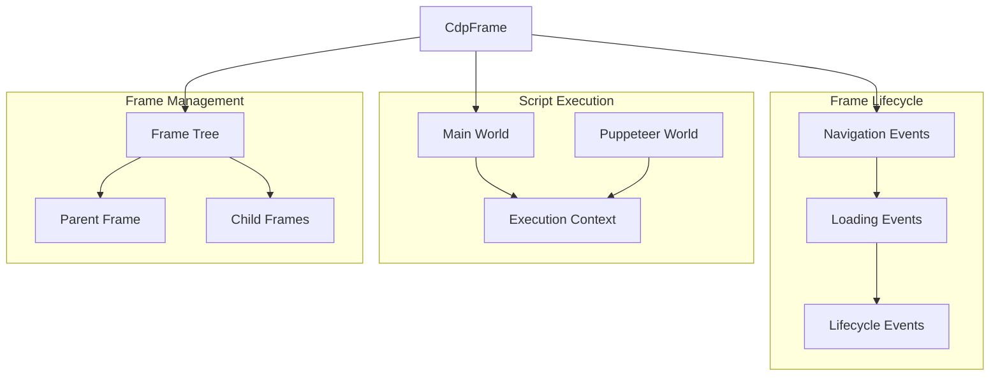
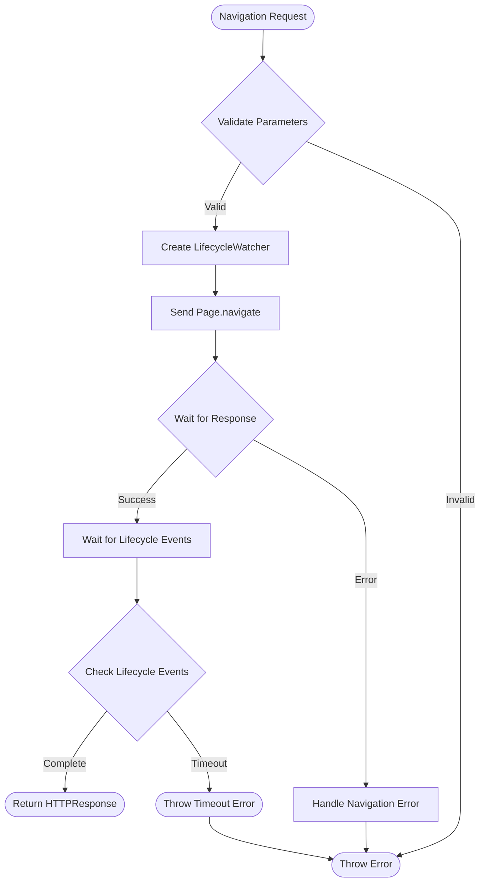

# CDP Frame Module

## Overview

The CDP Frame module provides the Chrome DevTools Protocol (CDP) implementation of frame management in Puppeteer. The `CdpFrame` class extends the base `Frame` API to provide concrete CDP-specific functionality for interacting with browser frames, including navigation, content manipulation, script execution, and lifecycle management.

This module serves as the primary interface for frame operations in CDP-based browser automation, handling everything from basic navigation to complex isolated world management and device request prompts.

## Architecture



## Core Components

### CdpFrame Class

The main class that implements CDP-specific frame functionality:

```typescript
export class CdpFrame extends Frame {
  #url: string
  #detached: boolean
  #client: CDPSession
  _frameManager: FrameManager
  _loaderId: string
  _lifecycleEvents: Set<string>
  worlds: IsolatedWorldChart
  accessibility: Accessibility
}
```

**Key Responsibilities:**
- Frame navigation and lifecycle management
- Script execution in isolated worlds
- Content manipulation and DOM access
- Device request prompt handling
- Accessibility features integration

## Dependencies



## Data Flow



## Component Interactions



## Key Features

### 1. Navigation Management

The frame provides comprehensive navigation capabilities:

- **URL Navigation**: Direct navigation to URLs with referrer policy support
- **Lifecycle Waiting**: Wait for specific lifecycle events (load, DOMContentLoaded, etc.)
- **Same-document Navigation**: Handle hash changes and history API navigation
- **Navigation Response**: Access to HTTP response data

### 2. Isolated World Management

Frames maintain two isolated JavaScript execution contexts:

- **Main World**: The page's natural JavaScript context
- **Puppeteer World**: Isolated context for Puppeteer operations

### 3. Content Manipulation

- **HTML Content Setting**: Set frame content with lifecycle waiting
- **Script Injection**: Add preload scripts and exposed functions
- **DOM Access**: Query and manipulate DOM elements

### 4. Device Integration

- **Device Request Prompts**: Handle device permission requests
- **Accessibility**: Integrated accessibility tree access

## Process Flows

### Frame Navigation Process



### Script Execution Process

```mtml
flowchart TD
    Start([Script Execution Request]) --> SelectWorld{Select Execution World}
    
    SelectWorld -->|Main World| MainContext[Get Main World Context]
    SelectWorld -->|Puppeteer World| PuppeteerContext[Get Puppeteer World Context]
    
    MainContext --> CheckContext{Context Available?}
    PuppeteerContext --> CheckContext
    
    CheckContext -->|Yes| Execute[Execute Script]
    CheckContext -->|No| WaitContext[Wait for Context]
    
    WaitContext --> Execute
    Execute --> HandleResult{Handle Result}
    
    HandleResult -->|Success| Return([Return Result])
    HandleResult -->|Error| Error([Throw Error])
```

## Integration Points

### With Frame Manager
- **Frame Tree Management**: Maintains parent-child relationships
- **Event Coordination**: Coordinates frame lifecycle events
- **Network Integration**: Integrates with network request handling

### With CDP Session
- **Protocol Communication**: Direct CDP command execution
- **Event Handling**: Processes CDP events for frame updates
- **Session Management**: Handles session disconnection and reconnection

### With Page Context
- **Page Integration**: Provides frame access within page context
- **Resource Management**: Coordinates with page-level resource management
- **Event Propagation**: Propagates frame events to page level

## Error Handling

The module implements comprehensive error handling:

- **Detachment Protection**: Prevents operations on detached frames
- **Navigation Errors**: Handles network and protocol-level navigation failures
- **Context Errors**: Manages execution context creation and disposal errors
- **Timeout Management**: Implements configurable timeouts for operations

## Performance Considerations

- **Lazy Loading**: Contexts and resources are created on-demand
- **Event Batching**: Lifecycle events are batched to reduce overhead
- **Memory Management**: Proper disposal of resources and event listeners
- **Concurrent Operations**: Supports concurrent frame operations safely

## Related Modules

- **[CDP Implementation](cdp_implementation.md)**: Parent module containing all CDP implementations
- **[CDP Frame Management](cdp_frame_management.md)**: Frame tree and lifecycle management
- **[Core API](core_api.md)**: Base frame API definitions
- **[CDP Page](cdp_page.md)**: Page-level frame coordination
- **[CDP Session](cdp_session.md)**: Protocol session management

## Usage Examples

### Basic Frame Navigation
```typescript
const frame = page.mainFrame();
const response = await frame.goto('https://example.com', {
  waitUntil: 'networkidle0',
  timeout: 30000
});
```

### Content Manipulation
```typescript
await frame.setContent('<html><body>Hello World</body></html>', {
  waitUntil: 'domcontentloaded'
});
```

### Script Execution
```typescript
const result = await frame.evaluate(() => {
  return document.title;
});
```

### Device Request Handling
```typescript
const devicePrompt = await frame.waitForDevicePrompt();
await devicePrompt.select(device);
```

This module is essential for CDP-based browser automation, providing the concrete implementation of frame operations that enable comprehensive web page interaction and manipulation.