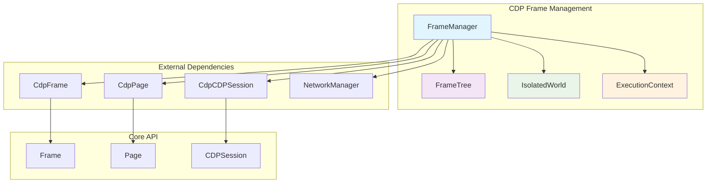
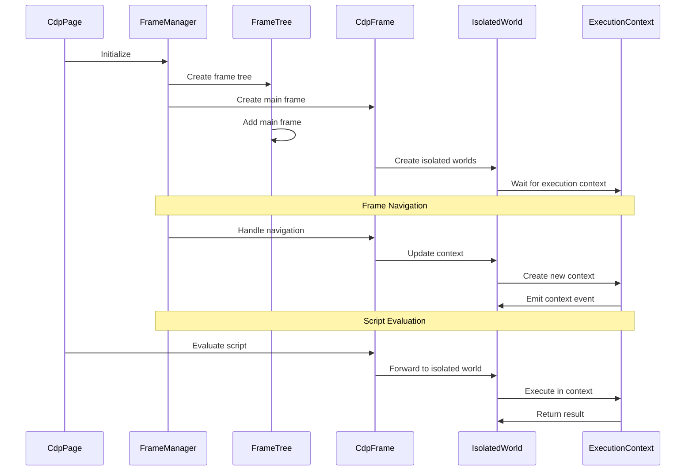
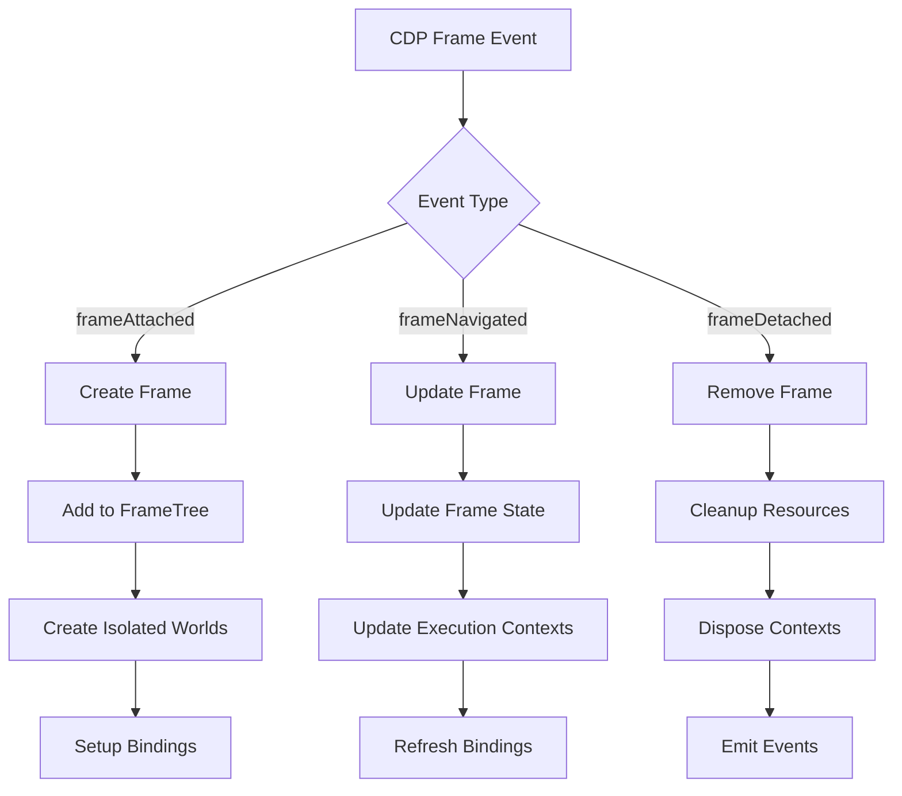
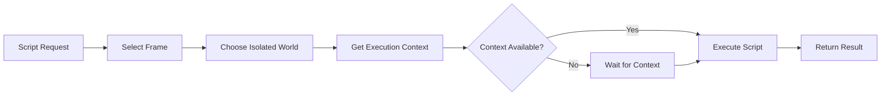

# CDP Frame Management Module

## Overview

The `cdp_frame_management` module is a critical component of Puppeteer's Chrome DevTools Protocol (CDP) implementation that manages the hierarchical structure of frames within web pages. This module provides comprehensive frame lifecycle management, execution context handling, and isolated world management for secure script execution.

## Purpose

This module serves as the backbone for frame-related operations in Puppeteer, enabling:

- **Frame Tree Management**: Maintains the hierarchical structure of frames and iframes
- **Execution Context Management**: Handles JavaScript execution contexts within frames
- **Isolated World Management**: Provides secure environments for script execution
- **Frame Lifecycle Tracking**: Monitors frame navigation, loading, and disposal events

## Architecture Overview

The module follows a layered architecture with clear separation of concerns:



## Core Components

### 1. FrameManager
**File**: `packages/puppeteer-core/src/cdp/FrameManager.ts`

The central orchestrator that manages all frame-related operations:

- **Frame Tree Coordination**: Maintains the frame hierarchy using FrameTree
- **Event Management**: Handles CDP events for frame lifecycle
- **Script Management**: Manages scripts to evaluate on new documents
- **Binding Management**: Handles exposed function bindings across frames
- **Network Integration**: Coordinates with NetworkManager for frame navigation

**Key Responsibilities**:
- Frame attachment/detachment handling
- Navigation event processing
- Execution context creation and management
- Isolated world setup and maintenance

### 2. FrameTree
**File**: `packages/puppeteer-core/src/cdp/FrameTree.ts`

A specialized data structure for managing frame hierarchies:

- **Hierarchical Storage**: Maintains parent-child relationships between frames
- **Efficient Lookup**: Provides fast frame retrieval by ID
- **Async Frame Resolution**: Supports waiting for frames to be added to the tree
- **Consistency Management**: Handles eventually consistent frame tree updates

### 3. IsolatedWorld
**File**: `packages/puppeteer-core/src/cdp/IsolatedWorld.ts`

Provides secure execution environments within frames:

- **Context Isolation**: Creates isolated JavaScript execution contexts
- **Script Evaluation**: Handles secure script execution
- **Handle Management**: Manages JSHandle and ElementHandle objects
- **Event Propagation**: Forwards console and binding events

### 4. ExecutionContext
**File**: `packages/puppeteer-core/src/cdp/ExecutionContext.ts`

Manages JavaScript execution within specific contexts:

- **Script Execution**: Evaluates JavaScript code and functions
- **Handle Creation**: Creates and manages object handles
- **Binding Management**: Handles function bindings and calls
- **Error Handling**: Processes execution errors and exceptions

## Component Interactions



## Data Flow

The module processes frame-related data through several key flows:

### Frame Lifecycle Flow


### Script Execution Flow


## Integration with Other Modules

### Dependencies
- **[core_api](core_api.md)**: Implements Frame, Page, and CDPSession interfaces
- **[cdp_implementation](cdp_implementation.md)**: Uses CdpFrame, CdpPage, and CdpCDPSession
- **[cdp_network_management](cdp_network_management.md)**: Coordinates with NetworkManager for navigation
- **[common_utilities](common_utilities.md)**: Uses EventEmitter and TimeoutSettings

### Dependents
- **[cdp_page](cdp_page.md)**: Uses FrameManager for page frame management
- **[locators](locators.md)**: Relies on frame context for element location
- **[query_handlers](query_handlers.md)**: Uses execution contexts for DOM queries

## Key Features

### Frame Tree Management
- Maintains hierarchical frame structure
- Handles cross-origin frame isolation
- Supports frame swapping during navigation
- Provides efficient frame lookup and traversal

### Execution Context Isolation
- Creates separate execution environments
- Manages main world and Puppeteer world contexts
- Handles context lifecycle and cleanup
- Provides secure script execution

### Event-Driven Architecture
- Responds to CDP frame events
- Emits frame lifecycle events
- Coordinates with network events
- Supports asynchronous frame operations

### Script and Binding Management
- Manages scripts to evaluate on new documents
- Handles function bindings across frames
- Supports preload script injection
- Provides binding cleanup on frame disposal

## Error Handling

The module implements comprehensive error handling:

- **Target Closure**: Handles browser target disconnection gracefully
- **Context Destruction**: Manages execution context disposal
- **Navigation Errors**: Processes frame navigation failures
- **Script Errors**: Captures and reports script execution errors

## Performance Considerations

- **Lazy Context Creation**: Creates execution contexts only when needed
- **Efficient Tree Operations**: Optimizes frame tree traversal and updates
- **Resource Cleanup**: Properly disposes of contexts and handles
- **Event Batching**: Minimizes event processing overhead

## Usage Examples

### Basic Frame Navigation
```typescript
const frameManager = new FrameManager(client, page, timeoutSettings);
await frameManager.initialize(client);

// Navigate main frame
const mainFrame = frameManager.mainFrame();
await mainFrame.goto('https://example.com');

// Access child frames
const childFrames = mainFrame.childFrames();
```

### Script Evaluation in Isolated World
```typescript
// Evaluate in main world
const result = await frame.evaluate(() => document.title);

// Evaluate in isolated world
const isolatedResult = await frame.isolatedRealm().evaluate(() => {
  return window.location.href;
});
```

### Frame Tree Traversal
```typescript
// Get all frames
const allFrames = frameManager.frames();

// Find specific frame
const targetFrame = frameManager.frame('frameId');

// Wait for frame to be available
const futureFrame = await frameManager._frameTree.waitForFrame('newFrameId');
```

This module is essential for any web automation task that involves frame manipulation, script execution, or complex page navigation scenarios.