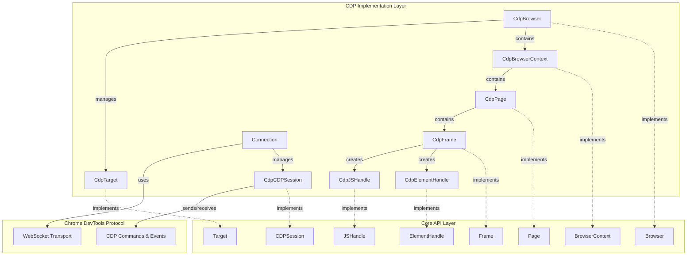
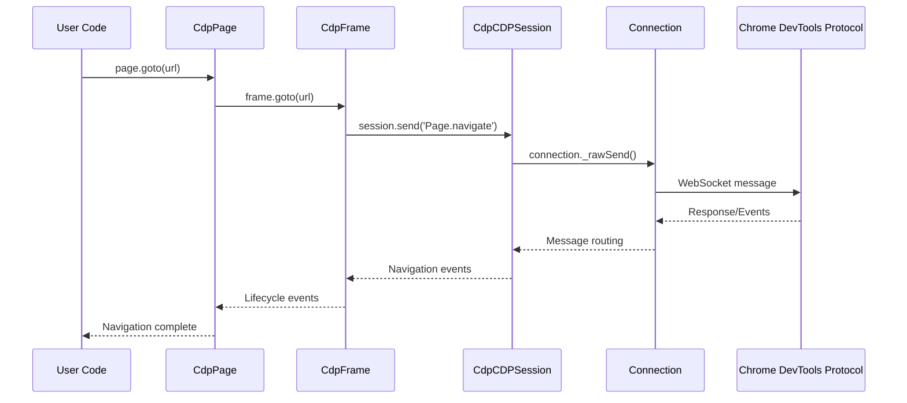

# CDP Implementation Module

## Overview

The CDP (Chrome DevTools Protocol) Implementation module provides concrete implementations of Puppeteer's core API abstractions for Chrome DevTools Protocol-based browser automation. This module serves as the primary implementation layer that translates high-level Puppeteer operations into CDP commands and manages the underlying protocol communication.

## Purpose

The CDP implementation module bridges the gap between Puppeteer's abstract API layer and the Chrome DevTools Protocol, providing:

- **Protocol Translation**: Converts high-level Puppeteer operations into CDP commands
- **State Management**: Maintains browser, context, page, and frame state across CDP sessions
- **Event Handling**: Processes CDP events and translates them into Puppeteer events
- **Resource Management**: Manages connections, sessions, and handles lifecycle operations
- **Error Handling**: Provides robust error handling and recovery mechanisms

## Architecture Overview



## Core Components

### Browser Management
- **[CdpBrowser](cdp_browser.md)**: Main browser instance managing contexts and targets
- **[CdpBrowserContext](cdp_browser_context.md)**: Isolated browsing context with independent state
- **[CdpTarget](cdp_target.md)**: Represents browser targets (pages, workers, etc.)

### Page and Frame Management
- **[CdpPage](cdp_page.md)**: Page instance with navigation, interaction, and lifecycle management
- **[CdpFrame](cdp_frame.md)**: Frame instance handling DOM operations and script execution

### Handle Management
- **[CdpElementHandle](cdp_element_handle.md)**: DOM element manipulation and interaction
- **[CdpJSHandle](cdp_js_handle.md)**: JavaScript object references and evaluation

### Protocol Communication
- **[Connection](cdp_connection.md)**: WebSocket connection management and message routing
- **[CdpCDPSession](cdp_session.md)**: CDP session management for target communication

## Key Features

### 1. Protocol Abstraction
The module provides a clean abstraction over the Chrome DevTools Protocol, hiding the complexity of CDP commands and events behind intuitive APIs.

### 2. State Synchronization
Maintains consistent state between the browser and Puppeteer by:
- Tracking target lifecycle events
- Managing frame navigation and attachment
- Synchronizing DOM changes and script execution contexts

### 3. Event Management
Comprehensive event handling system that:
- Processes CDP events in real-time
- Translates protocol events to Puppeteer events
- Manages event propagation across the component hierarchy

### 4. Error Handling
Robust error handling mechanisms including:
- Protocol error translation
- Connection failure recovery
- Target closure detection
- Session management errors

### 5. Resource Management
Efficient resource management through:
- Automatic cleanup of handles and sessions
- Memory leak prevention
- Connection pooling and reuse

## Data Flow



## Integration Points

### With Core API
The CDP implementation seamlessly integrates with Puppeteer's core API layer, providing concrete implementations for all abstract classes and interfaces.

### With Network Management
Integrates with the [CDP Network Management](cdp_network_management.md) module for:
- Request/response interception
- Network condition emulation
- Cookie and header management

### With Frame Management
Works closely with [CDP Frame Management](cdp_frame_management.md) for:
- Frame tree maintenance
- Execution context management
- Isolated world handling

### With Transport Layer
Utilizes the [Transport Layer](transport_layer.md) for:
- WebSocket communication
- Message serialization/deserialization
- Connection lifecycle management

## Usage Patterns

### Basic Browser Automation
```typescript
// Create browser instance
const browser = await CdpBrowser._create(connection, contextIds, options);

// Create new page
const page = await browser.newPage();

// Navigate and interact
await page.goto('https://example.com');
const element = await page.$('button');
await element.click();
```

### Advanced Session Management
```typescript
// Create dedicated CDP session
const session = await page.createCDPSession();

// Send custom CDP commands
await session.send('Runtime.evaluate', {
  expression: 'console.log("Hello from CDP")'
});

// Handle CDP events
session.on('Runtime.consoleAPICalled', event => {
  console.log('Console message:', event.args);
});
```

## Performance Considerations

### Connection Management
- Reuses connections across sessions when possible
- Implements connection pooling for multiple targets
- Handles connection failures gracefully with automatic retry

### Memory Management
- Automatic disposal of handles and sessions
- Weak references to prevent circular dependencies
- Garbage collection of unused protocol objects

### Event Processing
- Efficient event routing and filtering
- Batched event processing for high-frequency events
- Asynchronous event handling to prevent blocking

## Error Handling Strategies

### Protocol Errors
- Translates CDP error codes to meaningful messages
- Provides context-specific error information
- Implements retry logic for transient failures

### Connection Errors
- Detects connection drops and target closures
- Provides graceful degradation when possible
- Maintains error state for debugging

### Session Errors
- Handles session detachment and cleanup
- Manages orphaned sessions and resources
- Provides error recovery mechanisms

## Best Practices

### Resource Management
- Always dispose of handles when no longer needed
- Use `using` declarations for automatic cleanup
- Monitor connection and session lifecycle

### Error Handling
- Implement proper try-catch blocks around CDP operations
- Check for target closure before performing operations
- Handle protocol errors gracefully

### Performance Optimization
- Batch multiple operations when possible
- Use appropriate timeout values
- Minimize unnecessary protocol round-trips

## Related Documentation

- [CDP Network Management](cdp_network_management.md) - Network-specific CDP operations
- [CDP Frame Management](cdp_frame_management.md) - Frame and execution context management
- [Core API](core_api.md) - Abstract API definitions
- [Transport Layer](transport_layer.md) - Low-level communication protocols

## Future Enhancements

### Protocol Evolution
- Support for new CDP domains and commands
- Enhanced debugging and profiling capabilities
- Improved performance monitoring

### API Improvements
- Better TypeScript support for CDP commands
- Enhanced error reporting and diagnostics
- Streamlined session management APIs

### Performance Optimizations
- Connection multiplexing improvements
- Reduced protocol overhead
- Enhanced caching strategies