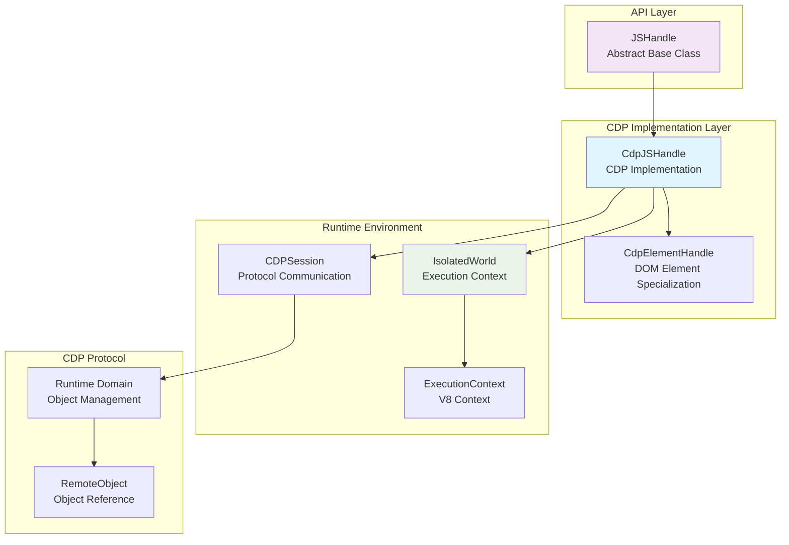
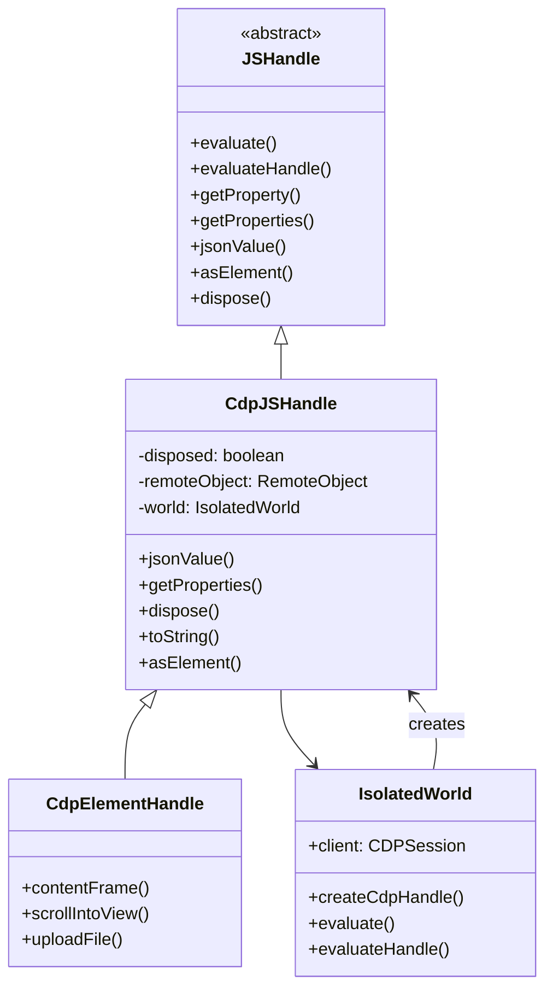
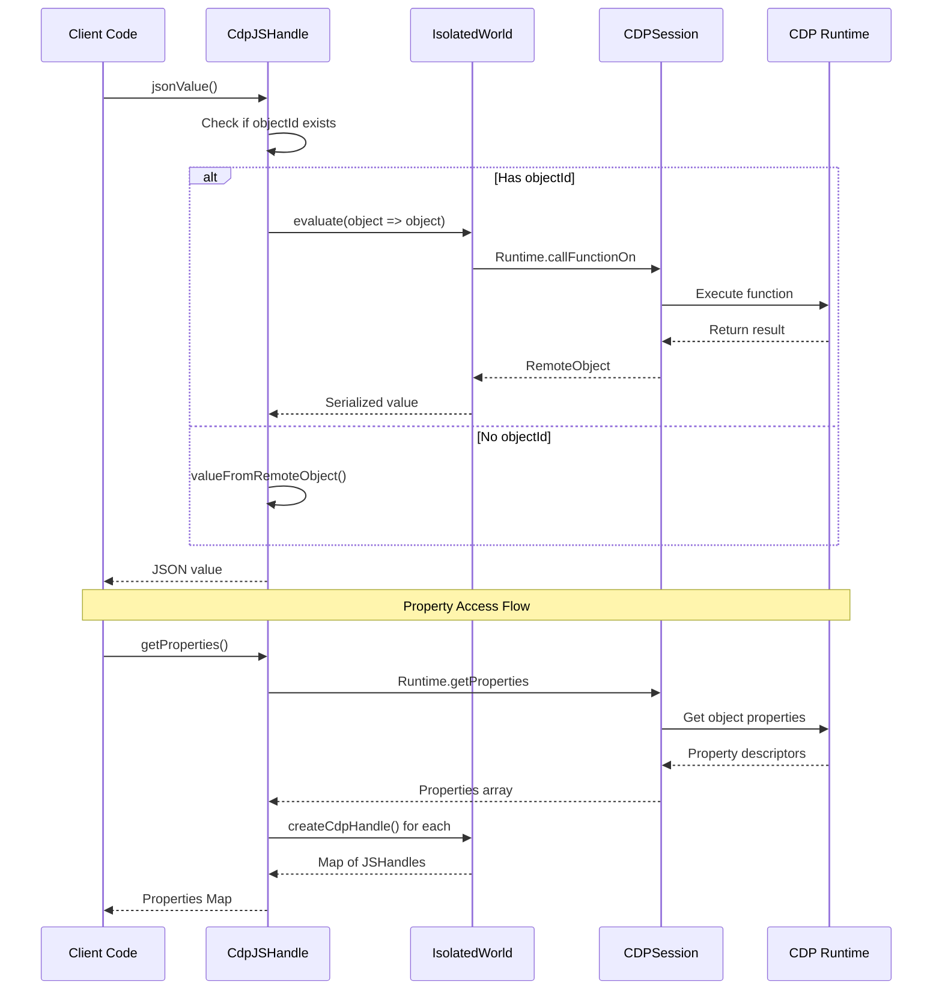
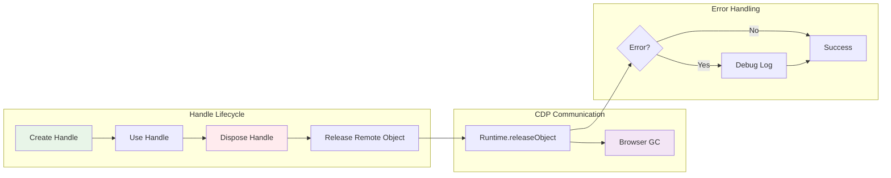

# CDP JS Handle Module

## Overview

The `cdp_js_handle` module provides the Chrome DevTools Protocol (CDP) implementation of JavaScript object handles within Puppeteer. This module serves as the concrete implementation of the abstract `JSHandle` API, enabling interaction with JavaScript objects in the browser's runtime environment through CDP commands.

The module's core component, `CdpJSHandle`, acts as a bridge between Puppeteer's high-level JavaScript object manipulation API and the low-level CDP Runtime domain, managing object references, property access, serialization, and memory cleanup in browser contexts.

## Architecture Overview



## Core Components

### CdpJSHandle Class

The `CdpJSHandle` class is the primary component that implements the abstract `JSHandle` interface for CDP-based browser automation.

#### Key Responsibilities

1. **Object Reference Management**: Maintains references to JavaScript objects in the browser runtime
2. **Property Access**: Provides methods to access and enumerate object properties
3. **Serialization**: Handles conversion of JavaScript objects to JSON-serializable values
4. **Memory Management**: Ensures proper cleanup of remote object references
5. **Type Conversion**: Supports conversion to specialized handle types (ElementHandle)

#### Core Properties

- `#disposed`: Tracks whether the handle has been disposed
- `#remoteObject`: CDP RemoteObject representing the JavaScript object
- `#world`: Reference to the IsolatedWorld execution context

#### Key Methods

- `jsonValue()`: Serializes the object to a JSON-compatible value
- `getProperties()`: Retrieves all enumerable properties as a Map of handles
- `dispose()`: Releases the remote object reference for garbage collection
- `asElement()`: Returns null (overridden in CdpElementHandle for DOM elements)

## Component Relationships



## Data Flow Architecture



## Integration Points

### With Core API Layer
- **JSHandle Interface**: Implements the abstract base class providing the public API
- **ElementHandle Specialization**: Serves as base for [cdp_element_handle](cdp_element_handle.md) for DOM-specific functionality

### With CDP Implementation Layer
- **IsolatedWorld**: Operates within execution contexts managed by [cdp_frame_management](cdp_frame_management.md)
- **CDPSession**: Communicates with browser through [cdp_session](cdp_session.md)
- **CdpElementHandle**: Extended by [cdp_element_handle](cdp_element_handle.md) for DOM element handling

### With Runtime Environment
- **ExecutionContext**: Executes JavaScript code within V8 contexts
- **RemoteObject Protocol**: Uses CDP Runtime domain for object manipulation

## Memory Management



The module implements careful memory management through:

1. **Automatic Disposal**: Handles are automatically disposed when no longer needed
2. **Reference Tracking**: Maintains disposal state to prevent double-disposal
3. **Error Resilience**: Gracefully handles disposal errors (e.g., during navigation)
4. **Garbage Collection**: Coordinates with browser's garbage collector via CDP

## Usage Patterns

### Basic Object Interaction
```typescript
// Handle creation (typically internal)
const handle = new CdpJSHandle(world, remoteObject);

// Property access
const properties = await handle.getProperties();
const specificProperty = await handle.getProperty('propertyName');

// Serialization
const jsonValue = await handle.jsonValue();

// Cleanup
await handle.dispose();
```

### Integration with Evaluation
```typescript
// Evaluation returns handles
const windowHandle = await page.evaluateHandle(() => window);
const documentHandle = await windowHandle.getProperty('document');

// Type checking
const elementHandle = documentHandle.asElement(); // null for non-elements
```

## Error Handling

The module implements robust error handling for:

- **Disposed Handles**: Prevents operations on disposed handles
- **Network Errors**: Gracefully handles CDP communication failures
- **Serialization Errors**: Manages objects that cannot be serialized
- **Context Destruction**: Handles page navigation and context disposal

## Performance Considerations

1. **Batch Property Access**: Uses `Runtime.getProperties` for efficient bulk property retrieval
2. **Lazy Evaluation**: Defers expensive operations until needed
3. **Memory Efficiency**: Promptly releases unused object references
4. **Error Suppression**: Avoids throwing on disposal errors to prevent memory leaks

## Dependencies

### Internal Dependencies
- **[core_api](core_api.md)**: Implements JSHandle abstract interface
- **[cdp_frame_management](cdp_frame_management.md)**: Provides IsolatedWorld execution contexts
- **[cdp_session](cdp_session.md)**: Enables CDP protocol communication
- **[common_utilities](common_utilities.md)**: Uses utility functions and error handling

### External Dependencies
- **devtools-protocol**: TypeScript definitions for CDP RemoteObject
- **Chrome DevTools Protocol**: Runtime domain for object management

## Related Modules

- **[cdp_element_handle](cdp_element_handle.md)**: Specialized implementation for DOM elements
- **[cdp_frame](cdp_frame.md)**: Frame context where handles operate
- **[cdp_page](cdp_page.md)**: Page-level handle management
- **[core_api](core_api.md)**: Abstract JSHandle interface definition

The `cdp_js_handle` module serves as a fundamental building block for JavaScript object interaction in Puppeteer's CDP implementation, providing the essential bridge between high-level automation APIs and low-level browser runtime management.