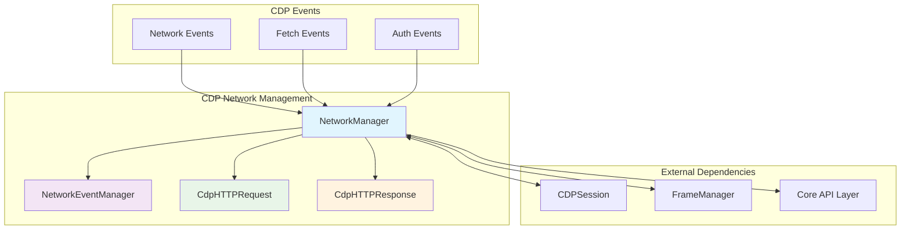
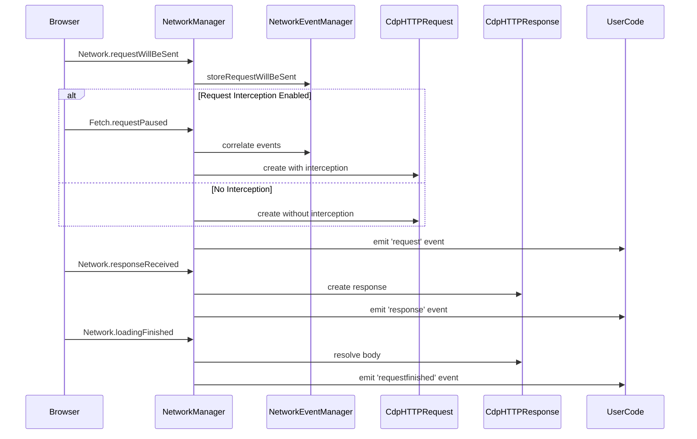
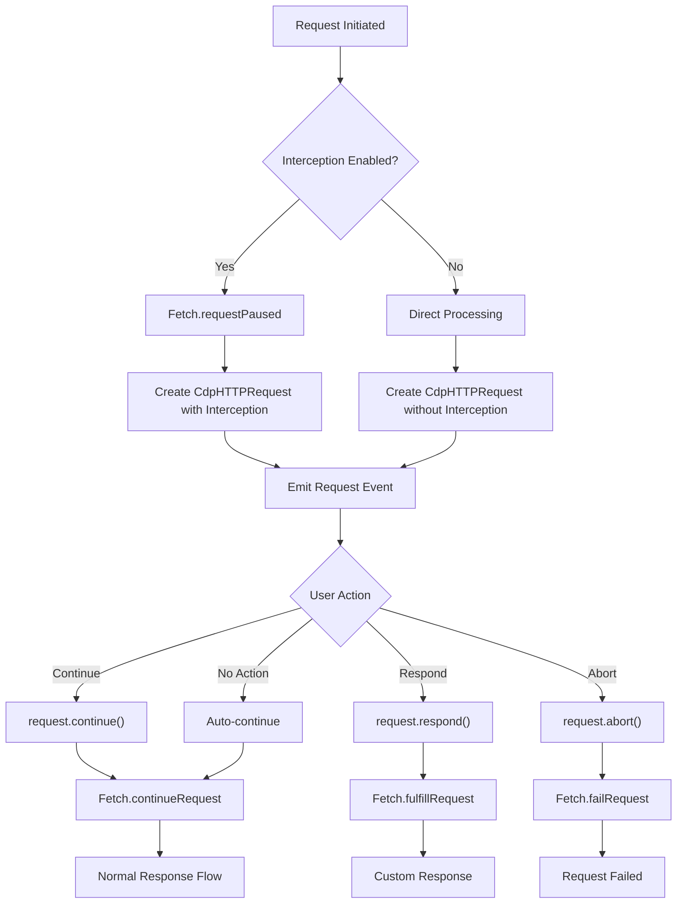
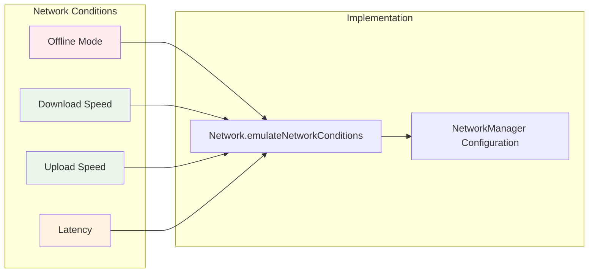

# CDP Network Management Module

## Overview

The CDP Network Management module is a critical component of Puppeteer's Chrome DevTools Protocol (CDP) implementation that handles all network-related operations, including HTTP request/response management, network event coordination, and request interception. This module serves as the bridge between Puppeteer's high-level API and the underlying CDP network protocols.

## Purpose

This module provides:
- **Network Event Management**: Coordinates complex network event sequences from CDP
- **HTTP Request/Response Handling**: Manages the lifecycle of HTTP requests and responses
- **Request Interception**: Enables modification, blocking, or mocking of network requests
- **Network Condition Emulation**: Simulates various network conditions (offline, throttling)
- **Authentication Management**: Handles HTTP authentication challenges

## Architecture Overview



## Core Components

### 1. NetworkManager
**File**: `packages/puppeteer-core/src/cdp/NetworkManager.ts`

The central orchestrator that manages all network operations and coordinates between CDP sessions and network events.

**Key Responsibilities**:
- Manages multiple CDP sessions and their network configurations
- Handles request interception and authentication
- Emulates network conditions and manages cache settings
- Coordinates complex event sequences for redirects and responses

**Key Features**:
- Multi-client CDP session management
- Network condition emulation (offline, throttling)
- HTTP header manipulation
- Request interception with authentication support
- Cache control and user agent override

### 2. NetworkEventManager
**File**: `packages/puppeteer-core/src/cdp/NetworkEventManager.ts`

A sophisticated event coordination system that manages the complex timing and ordering of CDP network events.

**Key Responsibilities**:
- Tracks and correlates network events across request lifecycles
- Manages event queuing for proper sequencing
- Handles redirect chains and response extra info coordination
- Maintains request state throughout the network lifecycle

**Event Coordination Patterns**:
- Request will be sent → Request paused correlation
- Response received → Response extra info synchronization
- Redirect chain management with proper event ordering
- Loading finished/failed event coordination

### 3. CdpHTTPRequest
**File**: `packages/puppeteer-core/src/cdp/HTTPRequest.ts`

CDP-specific implementation of HTTP requests with full interception capabilities.

**Key Responsibilities**:
- Represents individual HTTP requests in the CDP context
- Provides request modification capabilities (continue, respond, abort)
- Manages request metadata and headers
- Handles post data and request body management

**Interception Capabilities**:
- Request continuation with modifications
- Custom response generation
- Request abortion with error reasons
- Header and payload manipulation

### 4. CdpHTTPResponse
**File**: `packages/puppeteer-core/src/cdp/HTTPResponse.ts`

CDP-specific implementation of HTTP responses with content retrieval and metadata access.

**Key Responsibilities**:
- Represents HTTP responses with full metadata
- Provides response content access and caching
- Manages security details and timing information
- Handles response body retrieval from CDP

**Response Features**:
- Lazy content loading with caching
- Security details and certificate information
- Network timing and performance metrics
- Cache status and service worker detection

## Network Event Flow



## Request Interception Flow



## Network Condition Emulation

The module supports comprehensive network condition emulation:



## Integration with Other Modules

### Dependencies
- **[core_api](core_api.md)**: Implements the high-level network API interfaces
- **[cdp_implementation](cdp_implementation.md)**: Integrates with CDP session management
- **[cdp_frame_management](cdp_frame_management.md)**: Coordinates with frame lifecycle for request context

### Related Modules
- **[network_handling](network_handling.md)**: Provides the abstract API layer
- **[common_utilities](common_utilities.md)**: Uses event emitters and configuration
- **[transport_layer](transport_layer.md)**: Relies on CDP transport for communication

## Key Features

### 1. Multi-Session Management
- Supports multiple CDP sessions simultaneously
- Automatic session cleanup and resource management
- Per-session configuration and state isolation

### 2. Advanced Event Coordination
- Handles complex CDP event timing issues
- Manages redirect chains with proper event sequencing
- Coordinates response extra info with main response events

### 3. Request Interception
- Full request modification capabilities
- Authentication challenge handling
- Custom response generation
- Request blocking and error simulation

### 4. Network Emulation
- Offline mode simulation
- Bandwidth throttling (upload/download)
- Latency simulation
- Cache control and management

### 5. Performance Optimization
- Lazy content loading for responses
- Efficient event queuing and correlation
- Memory management for large request volumes
- Automatic cleanup of completed requests

## Error Handling

The module implements robust error handling for:
- Target disconnection scenarios
- Protocol version incompatibilities
- Network timeout situations
- Authentication failures
- Resource not found errors

## Usage Patterns

### Basic Network Monitoring
```typescript
// Enable network tracking
await page.setRequestInterception(false);
page.on('request', request => {
  console.log('Request:', request.url());
});
page.on('response', response => {
  console.log('Response:', response.status());
});
```

### Request Interception
```typescript
// Enable request interception
await page.setRequestInterception(true);
page.on('request', request => {
  if (request.url().includes('analytics')) {
    request.abort();
  } else {
    request.continue();
  }
});
```

### Network Condition Emulation
```typescript
// Emulate slow 3G connection
await page.emulateNetworkConditions({
  offline: false,
  downloadThroughput: 500 * 1024 / 8, // 500kb/s
  uploadThroughput: 500 * 1024 / 8,
  latency: 400 // 400ms
});
```

## Performance Considerations

- **Event Correlation**: Efficient mapping and cleanup of network events
- **Memory Management**: Automatic cleanup of completed requests and responses
- **Concurrent Requests**: Optimized handling of multiple simultaneous requests
- **Large Payloads**: Streaming support for large request/response bodies

## Security Features

- **Authentication Handling**: Secure credential management for HTTP auth
- **Certificate Validation**: Access to SSL/TLS security details
- **Header Sanitization**: Proper handling of sensitive headers
- **Request Validation**: Protection against malformed requests

This module is essential for any web automation scenario involving network interaction, providing the foundation for request monitoring, modification, and network condition testing in Puppeteer applications.