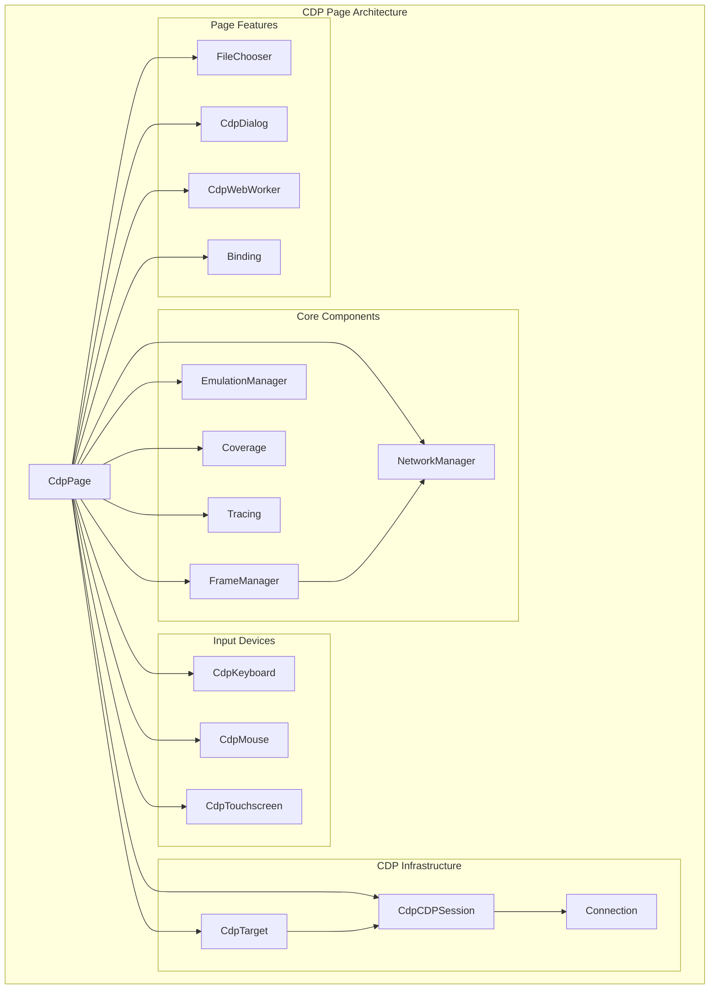
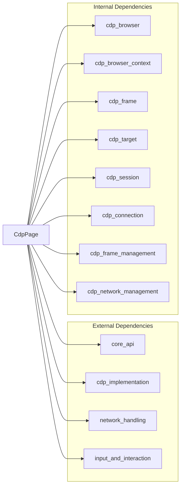
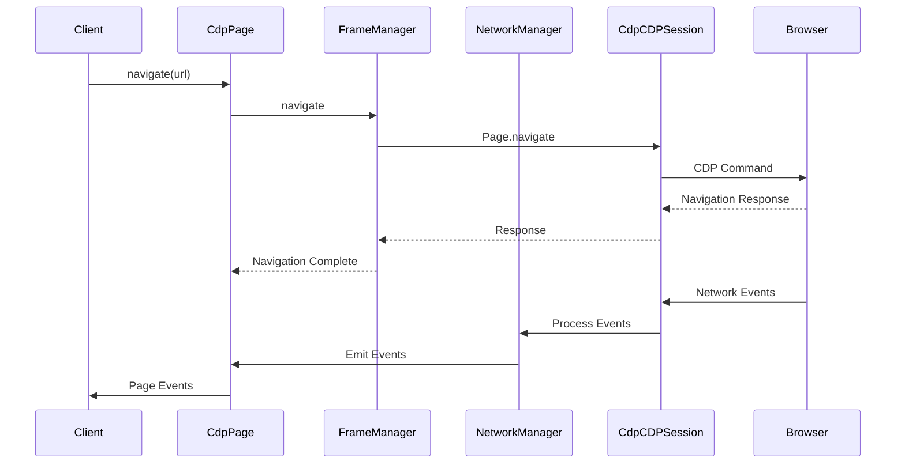
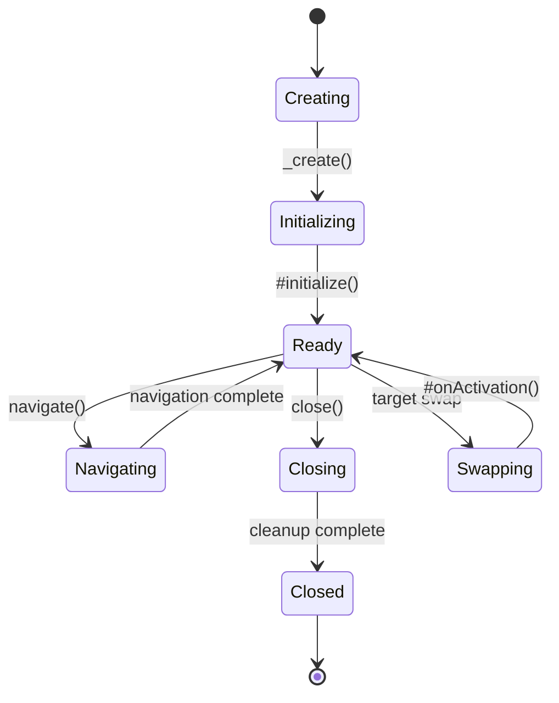
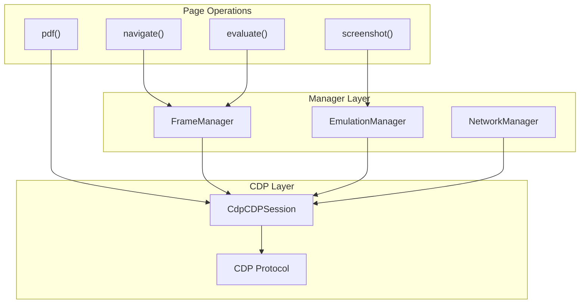
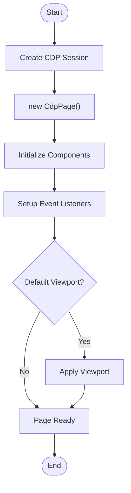
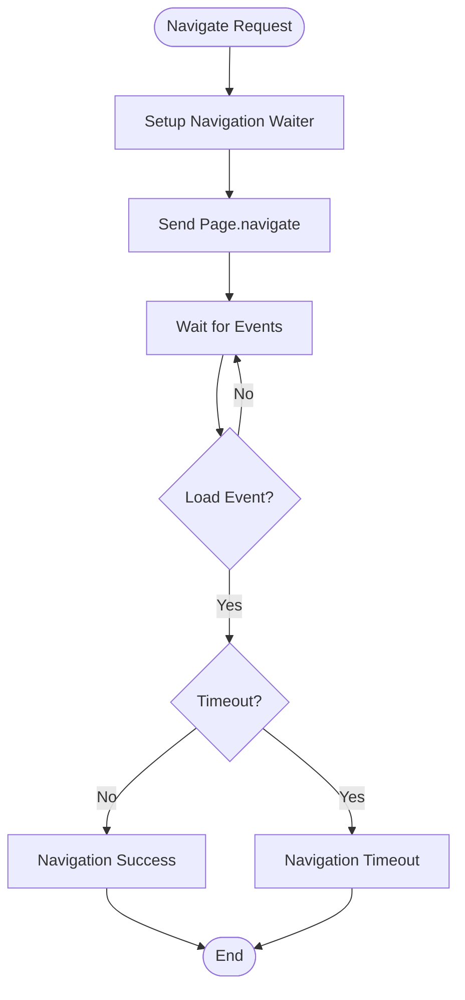
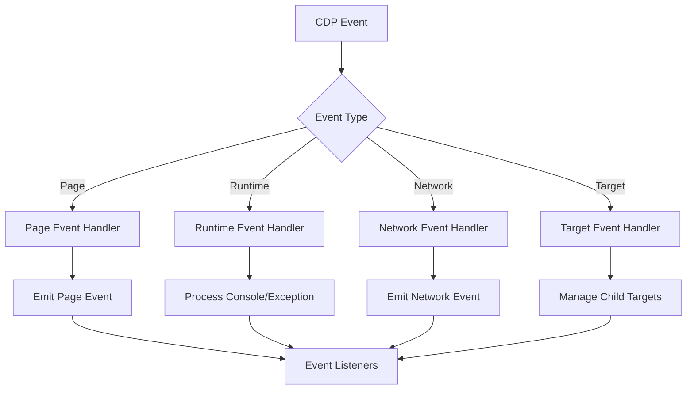
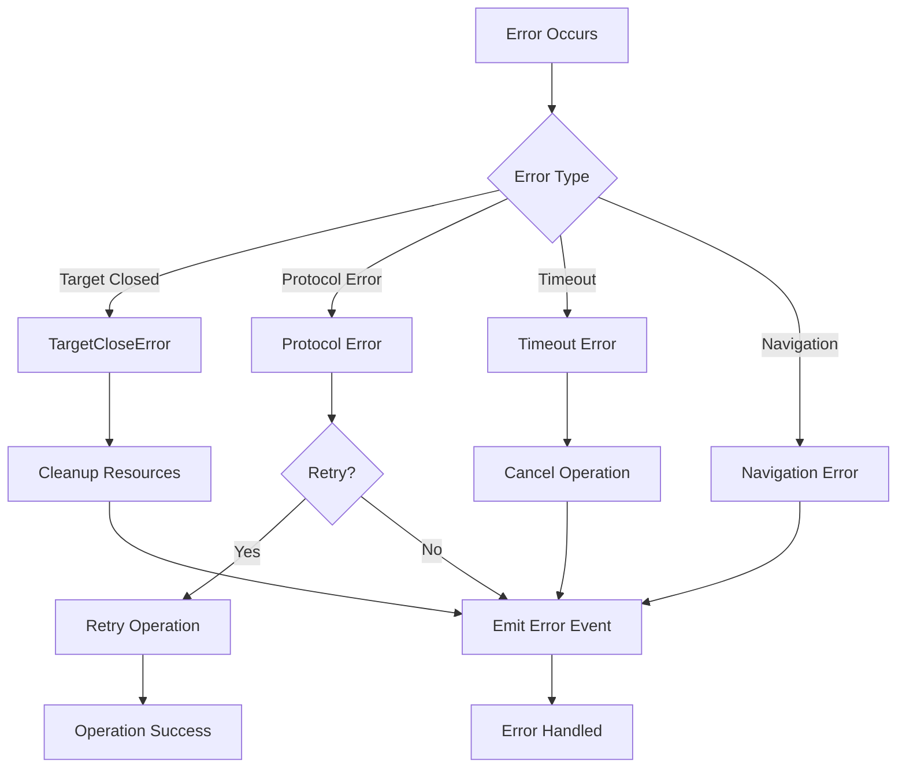

# CDP Page Module

## Overview

The CDP Page module provides the Chrome DevTools Protocol (CDP) implementation of the Page API in Puppeteer. The `CdpPage` class serves as the primary interface for interacting with web pages through the CDP, offering comprehensive page manipulation, navigation, and monitoring capabilities.

This module acts as a concrete implementation of the abstract `Page` class from the [core_api](core_api.md) module, specifically designed to work with Chrome/Chromium browsers through the CDP protocol.

## Architecture



## Core Components

### CdpPage Class

The main class that implements the CDP-specific page functionality:

```typescript
export class CdpPage extends Page {
  static async _create(
    client: CdpCDPSession,
    target: CdpTarget,
    defaultViewport: Viewport | null,
  ): Promise<CdpPage>
}
```

**Key Responsibilities:**
- Page lifecycle management (creation, navigation, closing)
- Event handling and emission
- Resource management (frames, workers, sessions)
- Input device coordination
- Network and emulation management

## Dependencies



## Data Flow



## Key Features

### 1. Page Lifecycle Management



### 2. Event System

The page implements a comprehensive event system:

- **Page Events**: Load, DOMContentLoaded, Close, Error
- **Frame Events**: FrameAttached, FrameDetached, FrameNavigated
- **Network Events**: Request, Response, RequestFailed, RequestFinished
- **Console Events**: Console messages and API calls
- **Worker Events**: WorkerCreated, WorkerDestroyed
- **Dialog Events**: JavaScript dialogs

### 3. Input Device Management

Coordinates multiple input devices:
- **Keyboard**: Text input and key combinations
- **Mouse**: Clicks, movements, and drag operations
- **Touchscreen**: Touch gestures and multi-touch

### 4. Network Management

Provides network control through the NetworkManager:
- Request/response interception
- Network condition emulation
- Cache management
- Service worker bypass

### 5. Emulation Capabilities

Supports various emulation features:
- Viewport and device emulation
- Media type and feature emulation
- Geolocation simulation
- CPU throttling
- Vision deficiency simulation

## Component Interactions



## Process Flows

### Page Creation Flow



### Navigation Flow



### Event Processing Flow



## Integration Points

### With Core API
- Extends the abstract `Page` class from [core_api](core_api.md)
- Implements all required page methods
- Provides CDP-specific functionality

### With CDP Implementation
- Uses [cdp_browser](cdp_browser.md) for browser context
- Integrates with [cdp_frame](cdp_frame.md) for frame management
- Leverages [cdp_target](cdp_target.md) for target operations
- Utilizes [cdp_session](cdp_session.md) for protocol communication

### With Network Management
- Integrates [cdp_network_management](cdp_network_management.md) for request handling
- Provides network interception capabilities
- Manages network conditions and caching

### With Frame Management
- Uses [cdp_frame_management](cdp_frame_management.md) for frame operations
- Coordinates frame navigation and lifecycle
- Manages isolated worlds and execution contexts

## Error Handling

The module implements comprehensive error handling:



## Performance Considerations

1. **Resource Management**: Proper disposal of handles and sessions
2. **Event Listener Cleanup**: Automatic cleanup on page close
3. **Memory Optimization**: Efficient handling of large responses (PDF, screenshots)
4. **Connection Pooling**: Reuse of CDP sessions where possible
5. **Lazy Loading**: Components initialized only when needed

## Usage Examples

### Basic Page Operations
```typescript
// Create and navigate
const page = await CdpPage._create(session, target, viewport);
await page.goto('https://example.com');

// Take screenshot
const screenshot = await page.screenshot({ type: 'png' });

// Generate PDF
const pdf = await page.pdf({ format: 'A4' });
```

### Event Handling
```typescript
page.on('console', msg => console.log('PAGE LOG:', msg.text()));
page.on('request', request => console.log('REQUEST:', request.url()));
page.on('response', response => console.log('RESPONSE:', response.url()));
```

### Network Interception
```typescript
await page.setRequestInterception(true);
page.on('request', request => {
  if (request.url().includes('analytics')) {
    request.abort();
  } else {
    request.continue();
  }
});
```

## Related Modules

- [core_api](core_api.md) - Base Page interface and events
- [cdp_implementation](cdp_implementation.md) - CDP-specific implementations
- [cdp_frame_management](cdp_frame_management.md) - Frame lifecycle management
- [cdp_network_management](cdp_network_management.md) - Network request handling
- [input_and_interaction](input_and_interaction.md) - Input device abstractions
- [cdp_browser](cdp_browser.md) - Browser context management
- [cdp_target](cdp_target.md) - Target lifecycle management