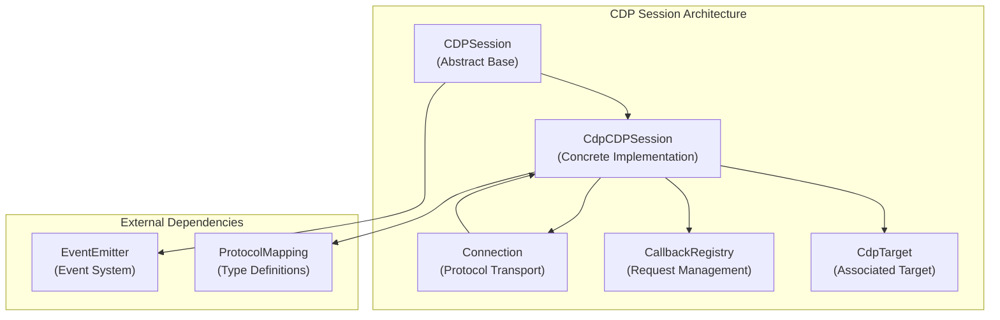
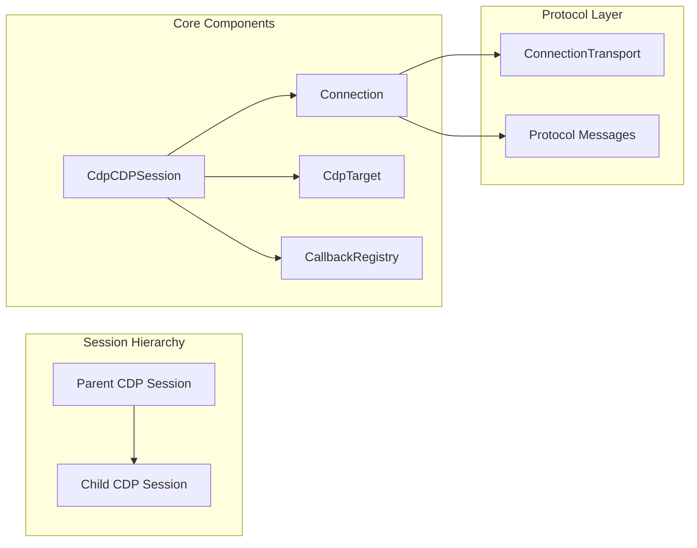
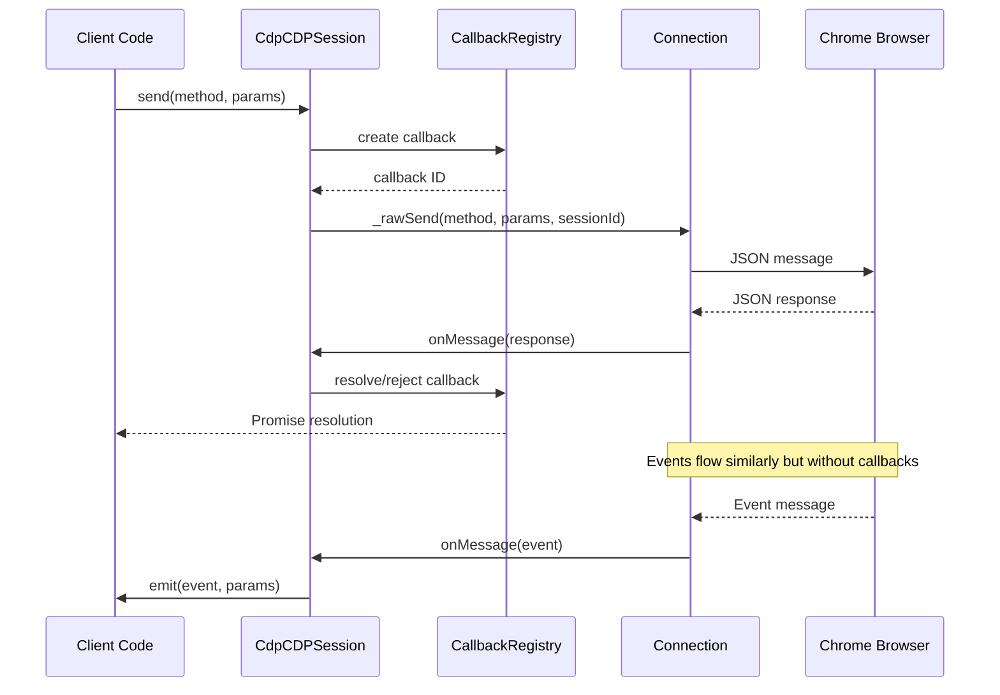
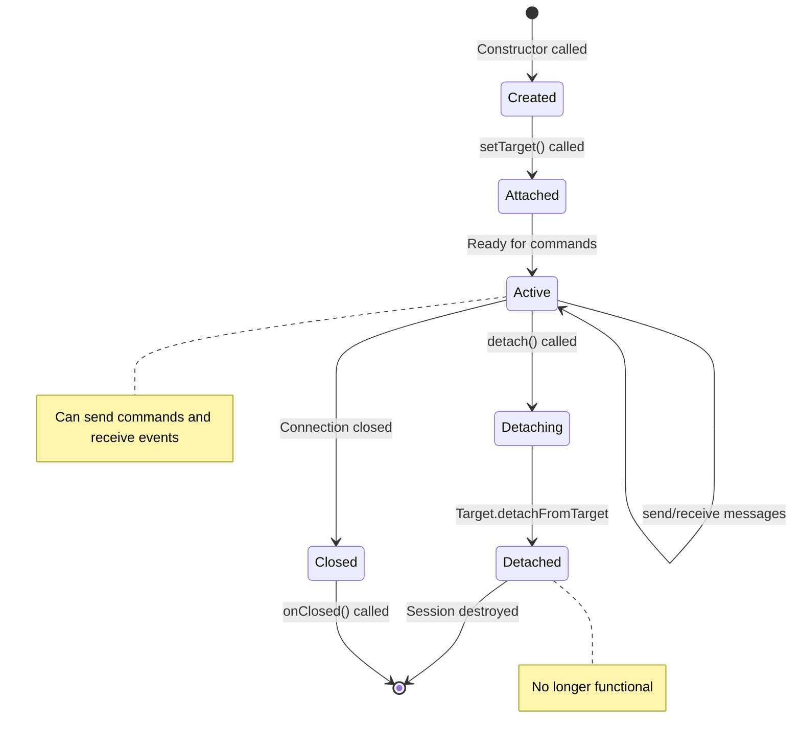
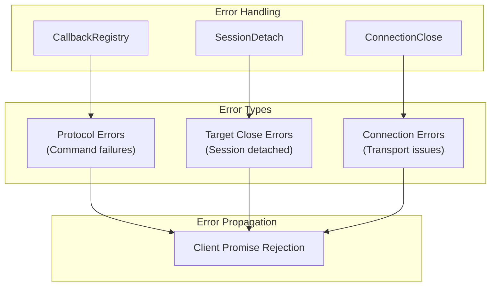

# CDP Session Module

The CDP Session module provides the concrete implementation of Chrome DevTools Protocol (CDP) sessions within Puppeteer's CDP-based architecture. It serves as the primary communication channel between Puppeteer and Chrome/Chromium browsers, handling protocol message exchange, session lifecycle management, and error handling.

## Overview

The `CdpCDPSession` class is the core implementation of the abstract `CDPSession` interface, providing a concrete CDP session that can send commands to and receive events from Chrome DevTools Protocol targets. This module is essential for all CDP-based browser automation operations in Puppeteer.

## Architecture



## Core Components

### CdpCDPSession Class

The main implementation class that extends the abstract `CDPSession` base class:

```typescript
export class CdpCDPSession extends CDPSession {
  #sessionId: string;
  #targetType: string;
  #callbacks = new CallbackRegistry();
  #connection: Connection;
  #parentSessionId?: string;
  #target?: CdpTarget;
  #rawErrors = false;
  #detached = false;
}
```

**Key Responsibilities:**
- Protocol command execution and response handling
- Event emission and management
- Session lifecycle management (attach/detach)
- Error handling and callback management
- Target association and parent session relationships

## Component Relationships



## Data Flow



## Session Lifecycle



## Key Features

### 1. Protocol Command Execution

The session provides type-safe command execution with automatic callback management:

```typescript
async send<T extends keyof ProtocolMapping.Commands>(
  method: T,
  params?: ProtocolMapping.Commands[T]['paramsType'][0],
  options?: CommandOptions,
): Promise<ProtocolMapping.Commands[T]['returnType']>
```

### 2. Event Handling

Sessions emit CDP events and session lifecycle events:
- Protocol events (e.g., `Page.loadEventFired`)
- Session events (`Disconnected`, `SessionAttached`, `SessionDetached`)

### 3. Error Management

Comprehensive error handling including:
- Protocol errors with detailed messages
- Target close errors when sessions become invalid
- Raw error mode for debugging
- Pending protocol error tracking

### 4. Session Hierarchy

Support for parent-child session relationships:
- Parent sessions can spawn child sessions
- Automatic session attachment/detachment handling
- Session inheritance for DevTools pages

## Integration Points

### With Connection Module
- Receives connection instance for protocol transport
- Uses connection's callback registry for request management
- Participates in connection's session management

### With Target Module
- Associates with specific CDP targets
- Provides target-specific session functionality
- Manages target lifecycle events

### With Core API
- Implements abstract CDPSession interface
- Provides concrete CDP functionality to higher-level APIs
- Integrates with Puppeteer's event system

## Error Handling



## Usage Patterns

### Basic Command Execution
```typescript
const session = await target.createCDPSession();
const result = await session.send('Runtime.evaluate', {
  expression: 'document.title'
});
```

### Event Listening
```typescript
session.on('Runtime.consoleAPICalled', (event) => {
  console.log('Console message:', event.args);
});
```

### Session Management
```typescript
// Create session
const session = await connection.createSession(targetInfo);

// Use session
await session.send('Page.enable');

// Clean up
await session.detach();
```

## Performance Considerations

1. **Callback Management**: Efficient callback registry prevents memory leaks
2. **Event Emission**: Direct event forwarding minimizes overhead
3. **Session Pooling**: Connection manages session lifecycle efficiently
4. **Error Handling**: Fast-path error propagation for common cases

## Dependencies

### Internal Dependencies
- **[core_api](core_api.md)**: Abstract CDPSession interface and events
- **[cdp_connection](cdp_connection.md)**: Protocol transport and connection management
- **[cdp_target](cdp_target.md)**: Target association and management
- **[common_utilities](common_utilities.md)**: CallbackRegistry, EventEmitter, error utilities

### External Dependencies
- **devtools-protocol**: TypeScript definitions for CDP
- **Node.js EventEmitter**: Event system foundation

## Related Modules

- **[cdp_connection](cdp_connection.md)**: Manages multiple CDP sessions and protocol transport
- **[cdp_target](cdp_target.md)**: Represents CDP targets that sessions connect to
- **[cdp_page](cdp_page.md)**: Uses CDP sessions for page-level operations
- **[cdp_browser](cdp_browser.md)**: Manages browser-level CDP sessions
- **[core_api](core_api.md)**: Provides abstract interfaces implemented by this module

## Security Considerations

1. **Protocol Validation**: All protocol messages are validated against CDP schema
2. **Session Isolation**: Each session is isolated to its specific target
3. **Error Sanitization**: Protocol errors are sanitized before client exposure
4. **Resource Cleanup**: Proper cleanup prevents resource leaks and security issues

The CDP Session module is fundamental to Puppeteer's CDP implementation, providing the essential communication layer between client code and Chrome DevTools Protocol. Its robust design ensures reliable protocol communication while maintaining type safety and comprehensive error handling.