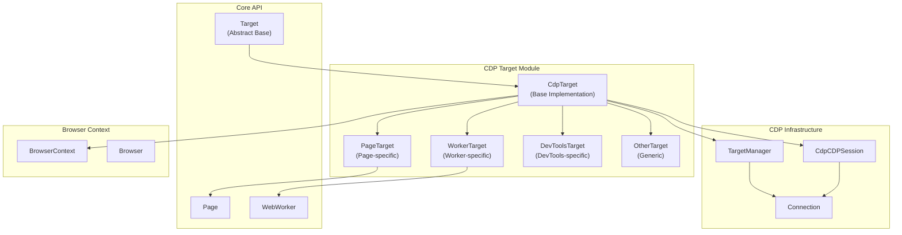
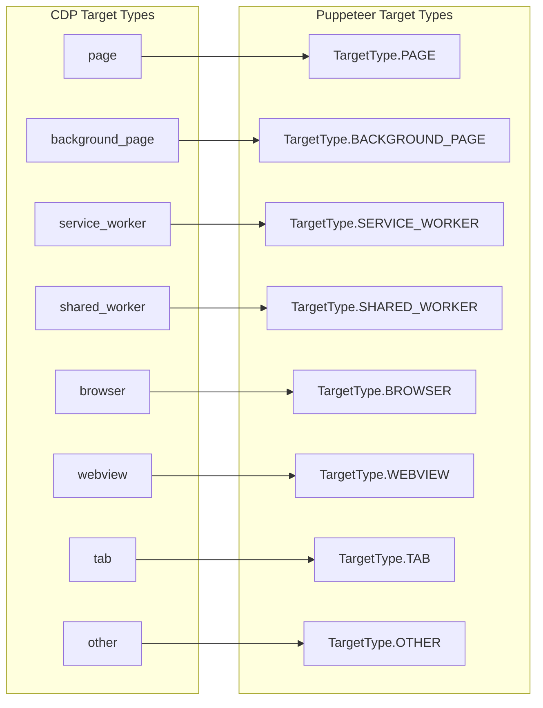
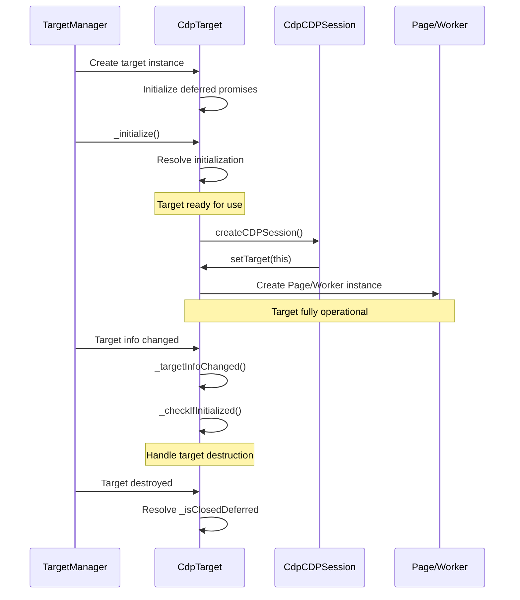
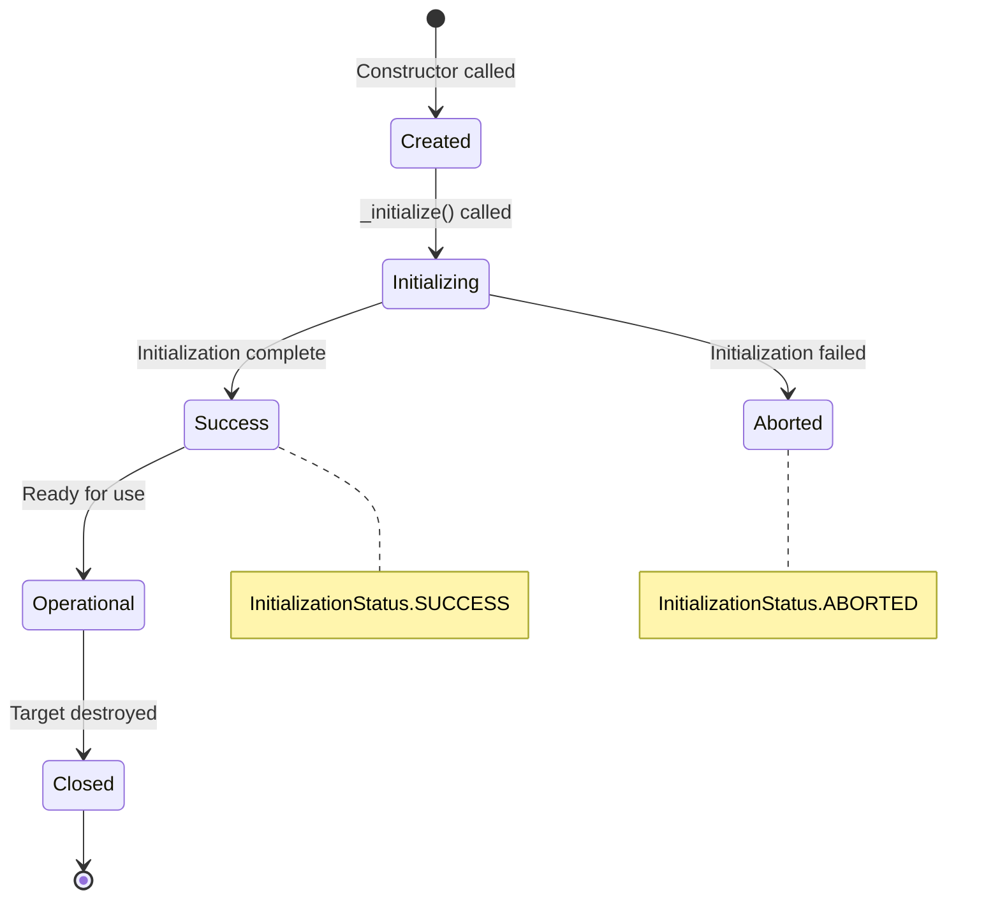
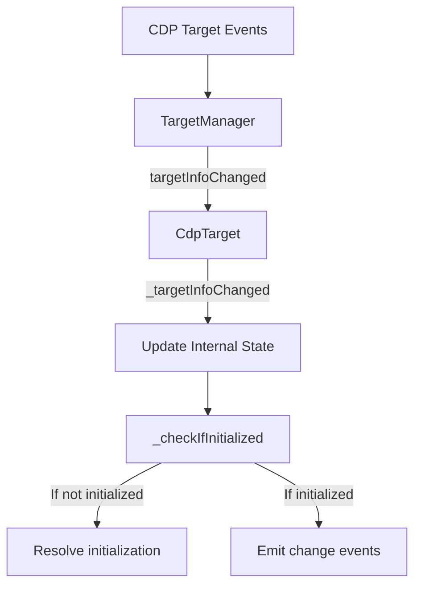
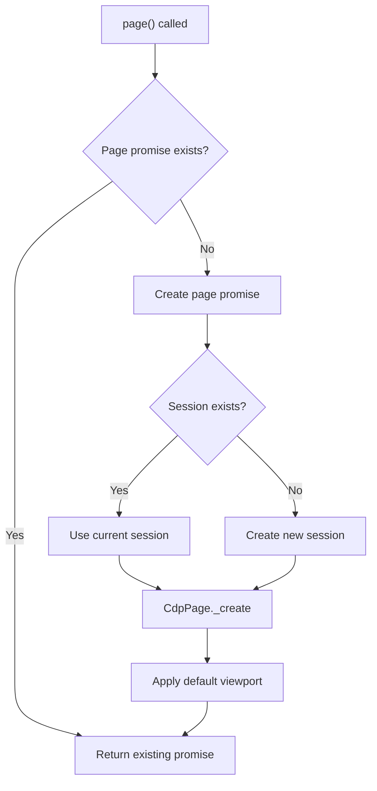

# CDP Target Module

The CDP Target module provides concrete implementations of browser targets using the Chrome DevTools Protocol (CDP). It serves as the bridge between Puppeteer's abstract target API and the underlying CDP target management system, handling different types of browser targets including pages, workers, and other browser contexts.

## Architecture Overview



## Core Components

### CdpTarget (Base Class)

The foundational implementation of the abstract `Target` class, providing CDP-specific functionality for all target types.

**Key Responsibilities:**
- Target lifecycle management and initialization
- CDP session creation and management
- Target hierarchy management (parent-child relationships)
- Target information synchronization with CDP events

**Core Features:**
- **Session Management**: Creates and manages CDP sessions for communication
- **Target Hierarchy**: Maintains parent-child relationships between targets
- **Initialization Control**: Handles asynchronous target initialization with deferred promises
- **Type Resolution**: Maps CDP target types to Puppeteer target types

### PageTarget (Page-Specific Implementation)

Specialized target implementation for page-type targets, handling page creation and popup management.

**Key Features:**
- **Page Creation**: Lazy initialization of `CdpPage` instances
- **Popup Handling**: Manages popup page relationships and events
- **Viewport Management**: Handles default viewport configuration
- **Initialization Logic**: Custom initialization for page-specific requirements

### WorkerTarget (Worker-Specific Implementation)

Handles service workers and shared workers, providing access to worker execution contexts.

**Key Features:**
- **Worker Creation**: Creates `CdpWebWorker` instances for worker targets
- **Worker Types**: Supports both service workers and shared workers
- **Execution Context**: Provides access to worker execution environments

### DevToolsTarget & OtherTarget

- **DevToolsTarget**: Specialized handling for DevTools-specific targets
- **OtherTarget**: Generic implementation for miscellaneous target types

## Target Type System



## Target Lifecycle Management



## Integration with CDP Infrastructure

### Target Manager Integration

The module integrates closely with the [CDP Implementation](cdp_implementation.md) through the `TargetManager`:

- **Target Discovery**: Responds to CDP target events
- **Session Management**: Coordinates with session creation
- **Hierarchy Management**: Maintains target relationships
- **Filtering**: Supports target filtering callbacks

### Session Management

Each target can create and manage CDP sessions:

```typescript
// Session creation with target association
const session = await target.createCDPSession();
session.setTarget(target); // Bidirectional relationship
```

### Browser Context Integration

Targets maintain references to their browser context and browser:

- **Context Access**: `target.browserContext()` provides context access
- **Browser Access**: `target.browser()` provides browser access
- **Opener Relationships**: `target.opener()` provides opener target

## Target Initialization States



## Data Flow Patterns

### Target Information Synchronization



### Page Creation Flow



## Error Handling and Edge Cases

### Initialization Failures

- **Aborted Initialization**: Handles cases where target initialization is aborted
- **Missing Dependencies**: Validates required components (session factory, target manager)
- **Session Creation Failures**: Graceful handling of CDP session creation errors

### Target State Management

- **Closed Targets**: Prevents operations on destroyed targets
- **Session Detachment**: Handles CDP session disconnection
- **Context Destruction**: Manages target cleanup when browser context is destroyed

## Performance Considerations

### Lazy Initialization

- **Deferred Page Creation**: Pages are created only when requested
- **Session Reuse**: Existing sessions are reused when possible
- **Resource Cleanup**: Proper cleanup of resources when targets are destroyed

### Memory Management

- **Weak References**: Uses appropriate reference patterns to prevent memory leaks
- **Event Listener Cleanup**: Removes event listeners when targets are destroyed
- **Child Target Management**: Maintains child target sets for hierarchy cleanup

## Integration Points

### With Core API Module

- Implements abstract `Target` class from [Core API](core_api.md)
- Provides concrete implementations for target operations
- Integrates with page and worker creation workflows

### With CDP Implementation

- Works closely with [CDP Session](cdp_session.md) for communication
- Integrates with [CDP Connection](cdp_connection.md) for protocol handling
- Coordinates with [CDP Browser](cdp_browser.md) and [CDP Browser Context](cdp_browser_context.md)

### With Target Management

- Managed by `TargetManager` for lifecycle operations
- Participates in target discovery and attachment processes
- Supports target filtering and initialization coordination

## Usage Patterns

### Basic Target Operations

```typescript
// Get target information
const url = target.url();
const type = target.type();
const browser = target.browser();
const context = target.browserContext();

// Create CDP session
const session = await target.createCDPSession();

// Access page or worker
const page = await target.page();
const worker = await target.worker();
```

### Target Hierarchy Navigation

```typescript
// Find opener target
const opener = target.opener();

// Access child targets (internal)
const children = target._childTargets();

// Navigate target relationships
const allTargets = browser.targets();
const relatedTargets = allTargets.filter(t => 
  t.opener() === target
);
```

The CDP Target module serves as a crucial bridge between Puppeteer's high-level target abstraction and the low-level CDP protocol, providing robust target management with proper lifecycle handling, error management, and integration with the broader Puppeteer ecosystem.