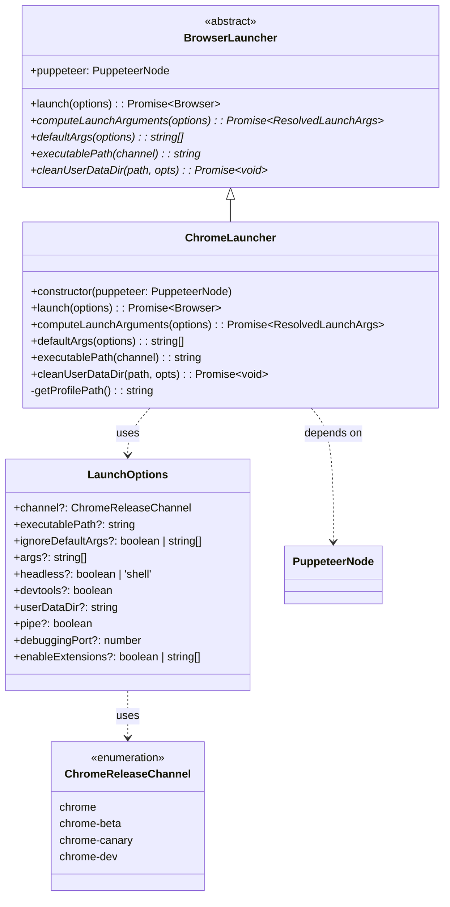
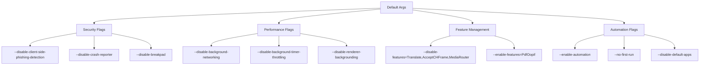
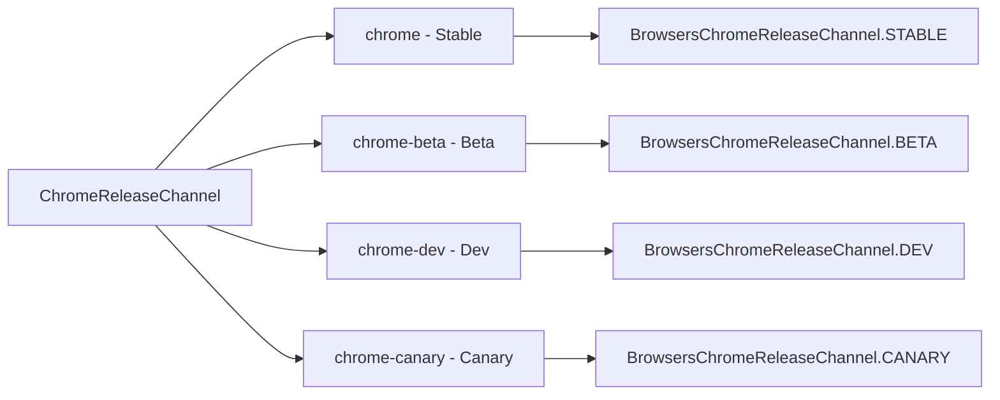
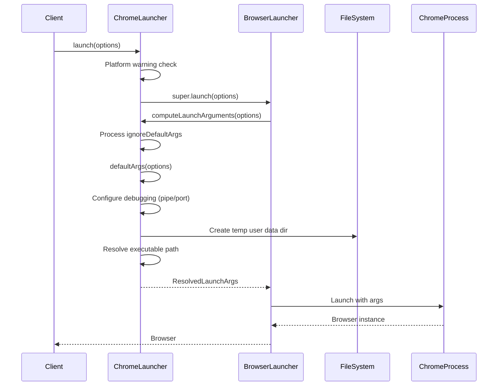

# Chrome Launcher Module

The Chrome Launcher module provides specialized functionality for launching and configuring Google Chrome browser instances within the Puppeteer ecosystem. It extends the base browser launcher capabilities with Chrome-specific optimizations, argument handling, and platform-aware configurations.

## Overview

The `ChromeLauncher` class is a concrete implementation of the abstract `BrowserLauncher` that handles the complexities of launching Chrome browsers across different platforms, channels, and configurations. It manages Chrome-specific command-line arguments, feature flags, user data directories, and provides platform-specific optimizations and warnings.

## Architecture



## Core Components

### ChromeLauncher Class

The main class that orchestrates Chrome browser launching with the following key responsibilities:

#### Launch Process
- **Platform Detection**: Detects macOS Silicon architecture and warns about performance issues when running x64 Node on ARM64 systems
- **Argument Computation**: Builds comprehensive Chrome command-line arguments based on options and defaults
- **Executable Resolution**: Locates Chrome executable through channels or explicit paths
- **User Data Management**: Handles temporary and persistent user data directories

#### Key Methods

**`launch(options: LaunchOptions): Promise<Browser>`**
- Overrides base launcher to add platform-specific warnings
- Delegates to parent class for actual browser launching

**`computeLaunchArguments(options: LaunchOptions): Promise<ResolvedLaunchArgs>`**
- Processes launch options into resolved arguments
- Handles debugging port/pipe configuration
- Manages user data directory creation
- Resolves executable path through channels or configuration

**`defaultArgs(options: LaunchOptions): string[]`**
- Generates comprehensive Chrome command-line arguments
- Manages feature flags (enabled/disabled)
- Handles headless mode configurations
- Applies security and performance optimizations

**`executablePath(channel?: ChromeReleaseChannel): string`**
- Resolves Chrome executable path for different release channels
- Integrates with `@puppeteer/browsers` for system executable detection

## Launch Configuration

### Default Chrome Arguments

The launcher applies extensive default arguments for optimal automation:



### Feature Flag Management

The launcher provides sophisticated feature flag management:

- **Disabled Features**: Translate, AcceptCHFrame, MediaRouter, OptimizationHints
- **Conditionally Disabled**: ProcessPerSiteUpToMainFrameThreshold, IsolateSandboxedIframes (unless experimental features enabled)
- **Enabled Features**: PdfOopif
- **User Override Support**: Merges user-provided feature flags with defaults

### Headless Mode Support

Supports multiple headless configurations:
- **`headless: true`**: New headless mode (`--headless=new`)
- **`headless: 'shell'`**: Legacy headless mode (`--headless`)
- **Additional headless flags**: `--hide-scrollbars`, `--mute-audio`

## Channel Support

### Chrome Release Channels



The launcher maps Puppeteer channel names to `@puppeteer/browsers` channel constants for system executable resolution.

## Data Flow



## Integration Points

### Dependencies

- **[browser_launcher_core](browser_launcher_core.md)**: Extends `BrowserLauncher` abstract class
- **[puppeteer_node](puppeteer_node.md)**: Receives `PuppeteerNode` instance for configuration access
- **[browser_management](browser_management.md)**: Uses `@puppeteer/browsers` for executable resolution
- **[core_api](core_api.md)**: Returns `Browser` instances from the core API

### File System Operations

- **Temporary Directory Management**: Creates and cleans up temporary user data directories
- **Executable Path Resolution**: Validates and resolves Chrome executable paths
- **Profile Path Generation**: Generates unique profile paths for browser instances

## Utility Functions

### Feature Flag Utilities

**`getFeatures(flag: string, options: string[]): string[]`**
- Extracts feature names from command-line flags
- Supports both `--enable-features` and `--disable-features`
- Handles multiple flag instances and comma-separated values

**`removeMatchingFlags(array: string[], flag: string): string[]`**
- Removes all instances of a specific flag from argument array
- Uses regex matching for flexible flag removal
- Modifies array in-place for performance

## Platform Considerations

### macOS Silicon Warning

The launcher detects when running on macOS with Apple Silicon processors using x64 Node.js and warns about performance degradation due to Rosetta translation. This helps developers identify suboptimal configurations.

### Cross-Platform Executable Resolution

Integrates with `@puppeteer/browsers` to locate Chrome installations across different operating systems and installation methods.

## Error Handling

- **Executable Not Found**: Throws descriptive errors when Chrome executable cannot be located
- **Invalid Arguments**: Validates debugging port/pipe configuration conflicts
- **Directory Creation**: Handles temporary directory creation failures
- **Channel Resolution**: Provides clear error messages for invalid channel specifications

## Usage Examples

### Basic Chrome Launch
```typescript
const launcher = new ChromeLauncher(puppeteerNode);
const browser = await launcher.launch({
  headless: true,
  args: ['--no-sandbox']
});
```

### Channel-Specific Launch
```typescript
const browser = await launcher.launch({
  channel: 'chrome-canary',
  devtools: true
});
```

### Custom Executable Path
```typescript
const browser = await launcher.launch({
  executablePath: '/path/to/chrome',
  userDataDir: '/path/to/profile'
});
```

The Chrome Launcher module provides a robust, platform-aware foundation for launching Chrome browsers with optimal configurations for web automation and testing scenarios.