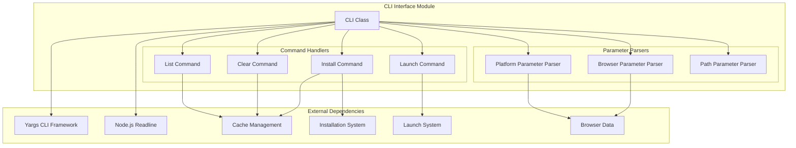
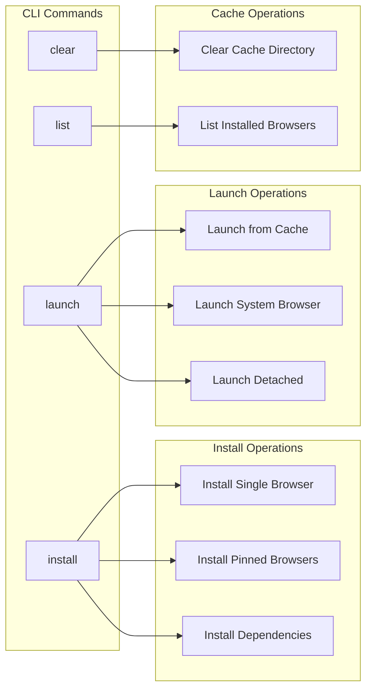
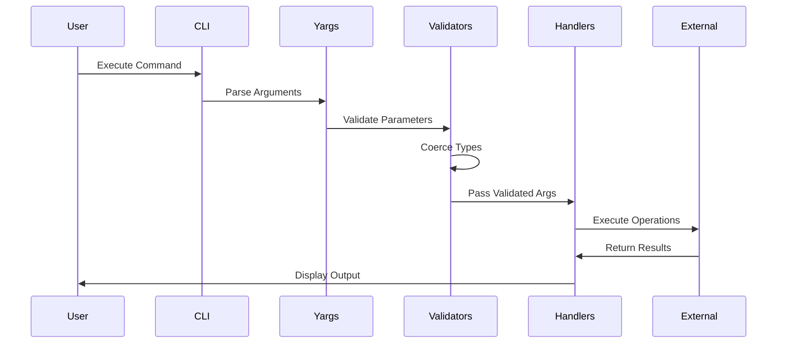
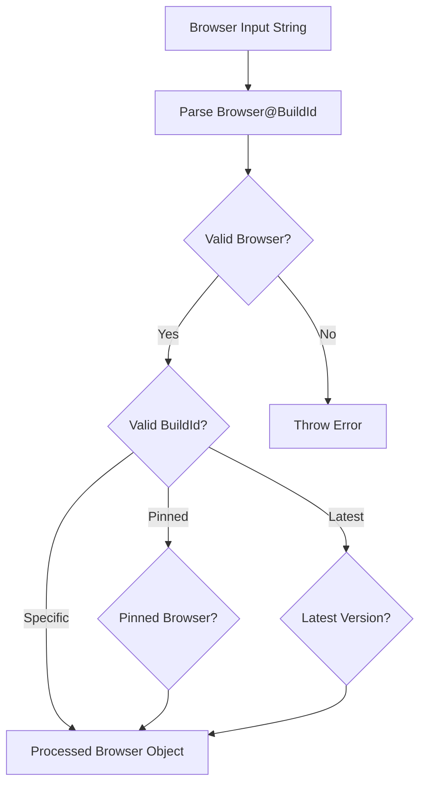
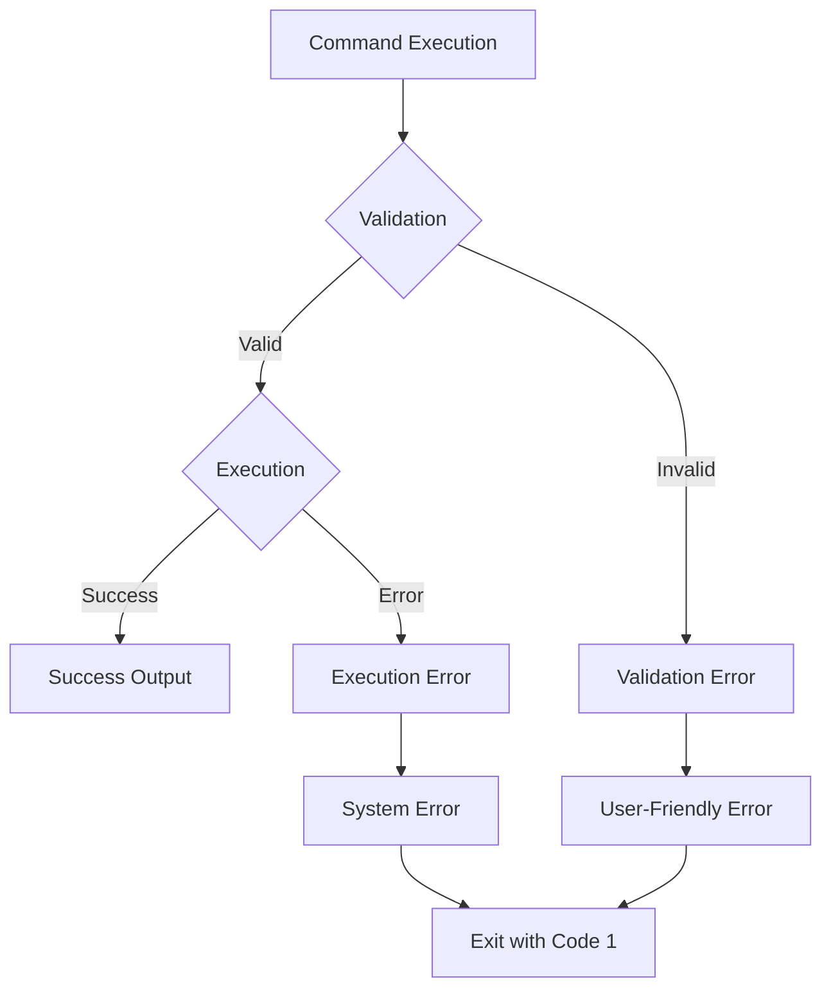

# CLI Interface Module

## Overview

The CLI Interface module provides a comprehensive command-line interface for managing browser installations, launches, and cache operations within the Puppeteer ecosystem. This module serves as the primary entry point for users to interact with the browser management system through terminal commands, offering functionality for downloading, installing, launching, and managing various browsers including Chrome, Chromium, Firefox, and their associated drivers.

## Architecture

The CLI Interface module is built around a single main class `CLI` that orchestrates all command-line operations. It integrates with multiple system components to provide a unified interface for browser management operations.



## Core Components

### CLI Class

The main `CLI` class serves as the orchestrator for all command-line operations, providing:

- **Command Registration**: Defines and registers all available CLI commands
- **Parameter Validation**: Validates and coerces command-line arguments
- **Configuration Management**: Handles CLI configuration including cache paths, pinned browsers, and script metadata
- **Interactive Operations**: Manages user interactions through readline interface

#### Key Properties

- `#cachePath`: Default cache directory for browser installations
- `#scriptName`: Name of the CLI script (default: '@puppeteer/browsers')
- `#version`: Version of the CLI tool
- `#allowCachePathOverride`: Whether users can override the cache path
- `#pinnedBrowsers`: Configuration for pinned browser versions
- `#prefixCommand`: Optional command prefix configuration

## Command Structure

The CLI provides four main commands, each with specific functionality:



### Install Command

Downloads and installs specified browsers with support for:

- **Browser Selection**: Chrome, Chromium, Firefox, ChromeDriver, Chrome Headless Shell
- **Version Specification**: Latest, stable, beta, dev, canary, or specific versions
- **Platform Targeting**: Cross-platform installation support
- **Dependency Installation**: System dependency installation on Linux
- **Pinned Browser Support**: Batch installation of pre-configured browsers

**Usage Examples:**
```bash
# Install latest Chrome
npx @puppeteer/browsers install chrome

# Install specific version
npx @puppeteer/browsers install chrome@115.0.5790.170

# Install from specific channel
npx @puppeteer/browsers install chrome@stable

# Install with dependencies
npx @puppeteer/browsers install firefox --install-deps
```

### Launch Command

Launches installed browsers with configuration options:

- **Browser Targeting**: Launch specific browser versions
- **System Integration**: Launch system-installed browsers
- **Process Management**: Detached or attached process execution
- **Argument Passing**: Custom browser arguments support
- **Output Handling**: Browser stdout/stderr forwarding

**Usage Examples:**
```bash
# Launch specific browser version
npx @puppeteer/browsers launch chrome@115.0.5790.170

# Launch with custom arguments
npx @puppeteer/browsers launch chrome@latest -- --headless

# Launch system browser
npx @puppeteer/browsers launch chrome@stable --system
```

### Clear Command

Provides cache management functionality:

- **Interactive Confirmation**: User confirmation before deletion
- **Complete Cache Clearing**: Removes all installed browsers
- **Path Flexibility**: Supports custom cache directories

### List Command

Displays installed browser information:

- **Comprehensive Listing**: Shows all installed browsers
- **Detailed Information**: Browser name, version, platform, and executable path
- **Cache Directory Support**: Lists browsers from specified cache directories

## Data Flow

The CLI module follows a structured data flow pattern for processing commands:



## Parameter Processing

The CLI implements sophisticated parameter processing with validation and coercion:

### Browser Parameter Processing



### Platform Detection and Validation

The CLI automatically detects the current platform and validates user-specified platforms against supported options:

- **Auto-detection**: Automatically detects the current platform
- **Validation**: Ensures specified platforms are supported
- **Cross-platform Support**: Supports all major platforms (Windows, macOS, Linux)

## Integration Points

The CLI Interface module integrates with several other modules in the system:

### Cache Management Integration

- **Reference**: [cache_management.md](cache_management.md)
- **Purpose**: Browser installation storage and retrieval
- **Operations**: Install, list, clear cached browsers

### Installation System Integration

- **Reference**: [installation_system.md](installation_system.md)
- **Purpose**: Browser download and installation logic
- **Operations**: Download browsers, resolve versions, install dependencies

### Launch System Integration

- **Reference**: [launch_system.md](launch_system.md)
- **Purpose**: Browser process launching and management
- **Operations**: Launch browsers, manage processes, handle arguments

## Configuration and Customization

The CLI supports extensive configuration options:

### Constructor Options

```typescript
interface CLIOptions {
  cachePath?: string;                    // Custom cache directory
  scriptName?: string;                   // CLI script name
  version?: string;                      // CLI version
  prefixCommand?: {                      // Command prefix configuration
    cmd: string;
    description: string;
  };
  allowCachePathOverride?: boolean;      // Allow cache path override
  pinnedBrowsers?: Partial<Record<       // Pinned browser configuration
    Browser,
    {
      buildId: string;
      skipDownload: boolean;
    }
  >>;
}
```

### Pinned Browsers Configuration

The CLI supports pinned browser configurations for enterprise environments:

- **Version Locking**: Lock specific browser versions
- **Batch Operations**: Install/manage multiple browsers simultaneously
- **Skip Downloads**: Skip downloads for already installed browsers

## Error Handling

The CLI implements comprehensive error handling:



### Error Categories

1. **Validation Errors**: Invalid browser names, platforms, or parameters
2. **Installation Errors**: Network issues, permission problems, disk space
3. **Launch Errors**: Missing executables, invalid arguments
4. **System Errors**: File system access, process management issues

## Usage Patterns

### Basic Browser Management

```bash
# Install and launch workflow
npx @puppeteer/browsers install chrome@latest
npx @puppeteer/browsers launch chrome@latest

# List installed browsers
npx @puppeteer/browsers list

# Clear cache when needed
npx @puppeteer/browsers clear
```

### Advanced Configuration

```bash
# Custom cache directory
npx @puppeteer/browsers install chrome --path /custom/cache

# Cross-platform installation
npx @puppeteer/browsers install chrome --platform mac

# System dependency installation
npx @puppeteer/browsers install firefox --install-deps
```

### Enterprise Usage

```bash
# Batch install pinned browsers
npx @puppeteer/browsers install

# Launch with specific configuration
npx @puppeteer/browsers launch chrome@stable --detached --dumpio
```

## Performance Considerations

The CLI is designed for optimal performance:

- **Lazy Loading**: Dynamic imports for heavy dependencies
- **Parallel Operations**: Concurrent browser installations when possible
- **Efficient Caching**: Reuse of downloaded browser archives
- **Minimal Memory Footprint**: Stream-based operations for large downloads

## Security Features

- **Input Validation**: Comprehensive validation of all user inputs
- **Path Sanitization**: Safe handling of file system paths
- **Permission Checks**: Validation of file system permissions
- **Secure Downloads**: Verification of downloaded browser packages

## Future Extensibility

The CLI architecture supports future enhancements:

- **Plugin System**: Extensible command registration
- **Custom Validators**: Pluggable parameter validation
- **Output Formatters**: Configurable output formats (JSON, XML, etc.)
- **Configuration Files**: Support for configuration file-based setups

This CLI Interface module serves as the primary user-facing component of the browser management system, providing a robust, user-friendly interface for all browser-related operations while maintaining integration with the broader Puppeteer ecosystem.