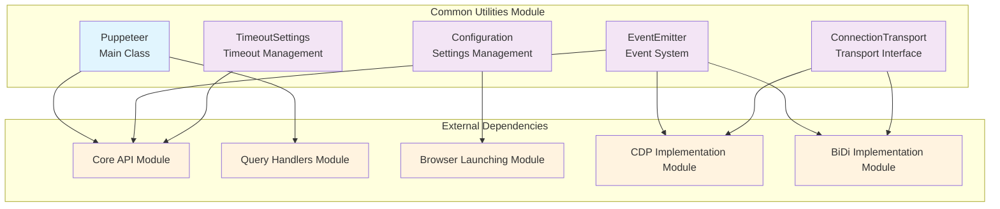
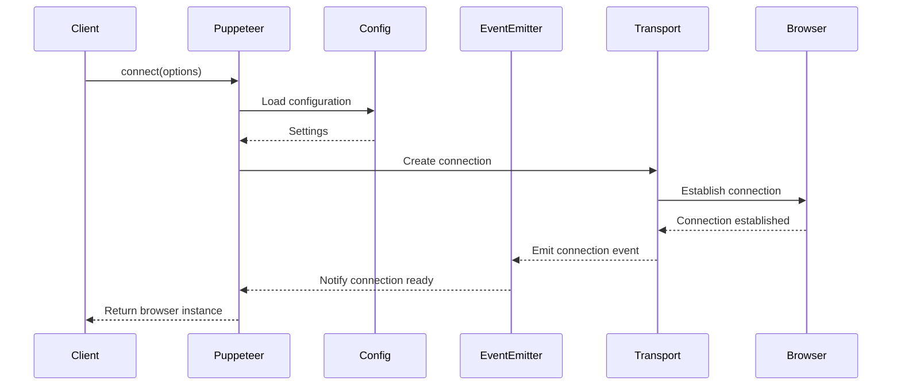

# Common Utilities Module

## Overview

The `common_utilities` module serves as the foundational layer of the Puppeteer ecosystem, providing essential utilities, configuration management, event handling, and core abstractions that are shared across all other modules. This module acts as the backbone that enables consistent behavior and communication patterns throughout the entire Puppeteer framework.

## Purpose

The common utilities module provides:

- **Core Puppeteer Class**: The main entry point and orchestrator for browser automation
- **Event System**: Robust event emission and handling capabilities
- **Configuration Management**: Centralized configuration for browser settings and runtime options
- **Transport Abstraction**: Interface for communication protocols between Puppeteer and browsers
- **Timeout Management**: Consistent timeout handling across all operations

## Architecture Overview



## Core Components

### 1. Puppeteer Class
**File**: `packages/puppeteer-core/src/common/Puppeteer.ts`

The main Puppeteer class serves as the primary entry point for browser automation operations. It provides:

- **Browser Connection Management**: Establishes connections to existing browser instances
- **Custom Query Handler Registry**: Manages custom element selection strategies
- **Core Settings**: Maintains fundamental configuration for the Puppeteer instance

**Key Responsibilities**:
- Orchestrating browser connections through the `connect()` method
- Managing custom query handlers for element selection
- Providing static methods for query handler registration and management
- Serving as the base class for environment-specific implementations (Node.js, Browser)

### 2. EventEmitter System
**File**: `packages/puppeteer-core/src/common/EventEmitter.ts`

A sophisticated event handling system that extends the standard event emitter pattern with additional features:

- **Type-Safe Events**: Strongly typed event system with TypeScript support
- **Wildcard Support**: Ability to listen to all events using the '*' wildcard
- **Handler Management**: Comprehensive listener registration, removal, and counting
- **Disposable Pattern**: Proper cleanup mechanisms for memory management

**Key Features**:
- Method chaining support for fluent API design
- Once-only event listeners with automatic cleanup
- Bulk listener removal capabilities
- Integration with Puppeteer's disposal system

### 3. Configuration Management
**File**: `packages/puppeteer-core/src/common/Configuration.ts`

Centralized configuration system that manages all aspects of Puppeteer's behavior:

- **Browser Settings**: Configuration for Chrome, Firefox, and Chrome Headless Shell
- **Runtime Options**: Cache directories, executable paths, and temporary directories
- **Download Management**: Control over browser binary downloads
- **Experimental Features**: Framework for enabling experimental functionality

**Configuration Categories**:
- **Global Settings**: Cache directory, executable path, default browser
- **Browser-Specific Settings**: Version specifications, download URLs, skip options
- **Runtime Settings**: Temporary directories, logging levels, experimental features

### 4. Connection Transport Interface
**File**: `packages/puppeteer-core/src/common/ConnectionTransport.ts`

Abstract interface defining the contract for communication between Puppeteer and browser instances:

- **Message Transmission**: Standardized message sending interface
- **Connection Management**: Connection lifecycle management
- **Event Callbacks**: Hooks for message reception and connection closure

**Transport Implementations**:
- WebSocket transports for remote browser connections
- Pipe transports for local browser process communication
- Custom transport implementations for specialized scenarios

### 5. Timeout Settings Management
**File**: `packages/puppeteer-core/src/common/TimeoutSettings.ts`

Centralized timeout management system providing consistent timeout behavior across all Puppeteer operations:

- **Default Timeout Management**: Global timeout settings for all operations
- **Navigation-Specific Timeouts**: Specialized timeouts for page navigation
- **Hierarchical Timeout Resolution**: Fallback mechanism from specific to general timeouts

**Timeout Hierarchy**:
1. Operation-specific timeout (highest priority)
2. Navigation timeout (for navigation operations)
3. Default timeout (fallback)
4. System default (30 seconds)

## Module Relationships

### Dependencies
The common utilities module has minimal external dependencies, primarily relying on:
- **Third-party Libraries**: mitt.js for event emission
- **Utility Functions**: Disposable pattern utilities
- **Type Definitions**: Browser and connection-related types

### Dependents
This module is a foundational dependency for:
- **[Core API](core_api.md)**: Uses EventEmitter and timeout settings
- **[CDP Implementation](cdp_implementation.md)**: Relies on ConnectionTransport and EventEmitter
- **[BiDi Implementation](bidi_implementation.md)**: Uses transport and event systems
- **[Browser Launching](browser_launching.md)**: Depends on Configuration management
- **[Query Handlers](query_handlers.md)**: Integrates with Puppeteer's query system

## Data Flow



## Key Design Patterns

### 1. **Singleton Configuration**
The Configuration system follows a singleton-like pattern where settings are centrally managed and accessible throughout the application.

### 2. **Observer Pattern**
The EventEmitter implements the observer pattern, allowing multiple components to react to system events without tight coupling.

### 3. **Strategy Pattern**
The ConnectionTransport interface enables different communication strategies (WebSocket, Pipe) to be used interchangeably.

### 4. **Template Method Pattern**
The Puppeteer base class provides a template for browser connection while allowing subclasses to customize specific behaviors.

## Usage Examples

### Basic Puppeteer Connection
```typescript
import { Puppeteer } from 'puppeteer-core';

const puppeteer = new Puppeteer({ isPuppeteerCore: true });
const browser = await puppeteer.connect({
  browserWSEndpoint: 'ws://localhost:9222'
});
```

### Event Handling
```typescript
import { EventEmitter } from 'puppeteer-core';

const emitter = new EventEmitter();
emitter.on('pageCreated', (page) => {
  console.log('New page created:', page.url());
});
```

### Configuration Management
```typescript
const config: Configuration = {
  defaultBrowser: 'chrome',
  cacheDirectory: '/custom/cache',
  chrome: {
    version: '119.0.6045.105',
    skipDownload: false
  }
};
```

## Performance Considerations

- **Event Handler Cleanup**: Proper disposal of event listeners prevents memory leaks
- **Configuration Caching**: Settings are loaded once and cached for performance
- **Timeout Optimization**: Hierarchical timeout resolution minimizes lookup overhead
- **Transport Efficiency**: Abstract transport interface allows for optimized implementations

## Security Considerations

- **Configuration Validation**: All configuration values should be validated before use
- **Transport Security**: Connection transports must implement appropriate security measures
- **Event Isolation**: Event handlers should not expose sensitive information
- **Timeout Bounds**: Timeout values should be bounded to prevent resource exhaustion

## Future Enhancements

- **Enhanced Configuration Validation**: More robust validation of configuration parameters
- **Advanced Event Filtering**: More sophisticated event filtering and routing capabilities
- **Performance Monitoring**: Built-in performance monitoring and metrics collection
- **Plugin Architecture**: Extensible plugin system for custom functionality

---

*This documentation covers the foundational common utilities that enable the entire Puppeteer ecosystem. For specific implementation details of browser automation features, refer to the [Core API](core_api.md) documentation.*